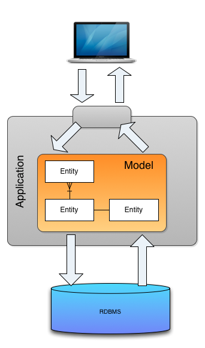
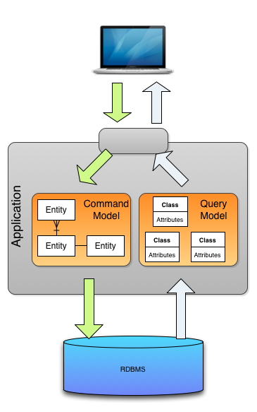
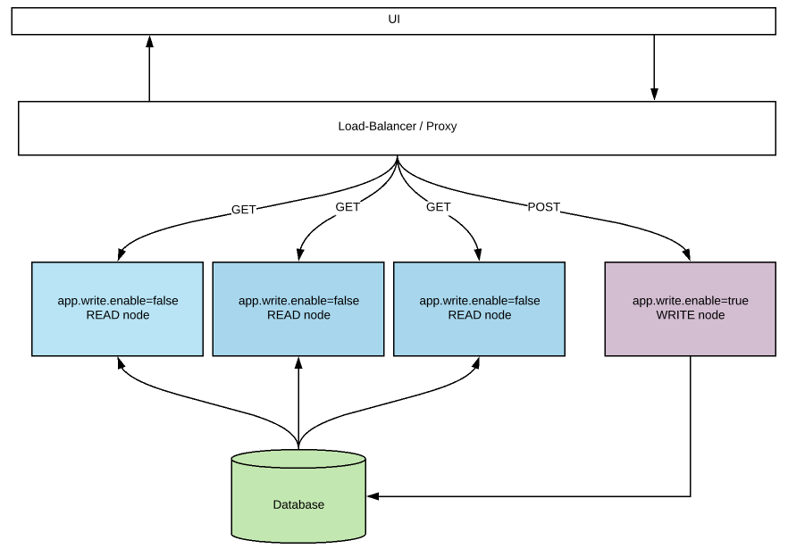
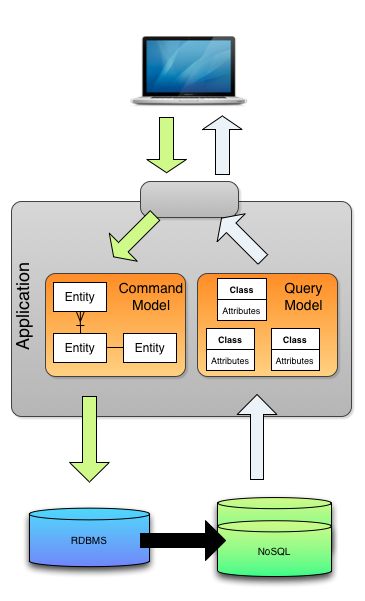

## CQRS란?

Command Query Responsibility Segregation의 약자로, **명령과 조회의 책임을 분리**하는 것이다.

하지만 왜 명령과 조회의 책임을 분리해야 할까?

## CQRS를 사용하는 이유

쓰기 모델이 시간이 갈수록 비대해지고 변질될 수 있기 때문이다.

또한, Read Replica를 사용하거나 따로 DB를 사용한다면, Read의 Traffic을 분산시킬 수 있다.

기본적으로 대부분의 Application은 Read에 훨씬 트래픽이 몰리게 되기 때문에 Traffic을 분산시키거나, 조회에 특화된 DB를 사용할 수 있다.

참고로 Event Sourcing과 함께 사용되어야 한다는 인식이 있는데 Event Sourcing은 추가적인 부분이다.

## CQRS 적용 단계

### 1. 초기 모델

Entity에서 쓰기, 읽기를 모두 수행하게 된다.

초기에는 이러한 모델로 충분할 수 있겠지만, 시간이 지날수록 Entity는 비대해진다.

### 2. 쓰기 모델과 읽기 모델 분리

이런식으로 단순히 Entity와 읽기 모델을 분리해주는 단계이다.

이렇게 함으로써 Command Entity가 너무 복잡해지는걸 조금이나마 예방할 수 있다.

### 3. Application 분리

Query용 Application과 Command용 Application을 분리할 수도 있다.

단일 DB를 사용하는 것은 같지만, Application의 설정 값으로 Read만 가능한 Application으로 만들어버릴 수도 있다.

### 4. DB 분리

마지막으로는 **아예 DB를 분리하는 것**이다.

예를 들어 RDBMS에서 변경 이벤트를 발행하고, 이것을 적절한 NoSQL에서 받아 적용하고, 조회할 때에는 복제된 곳에서 할 수 있다.

