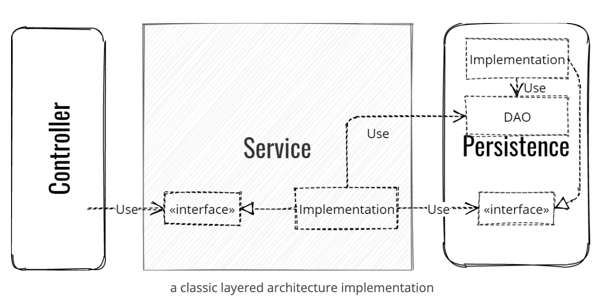
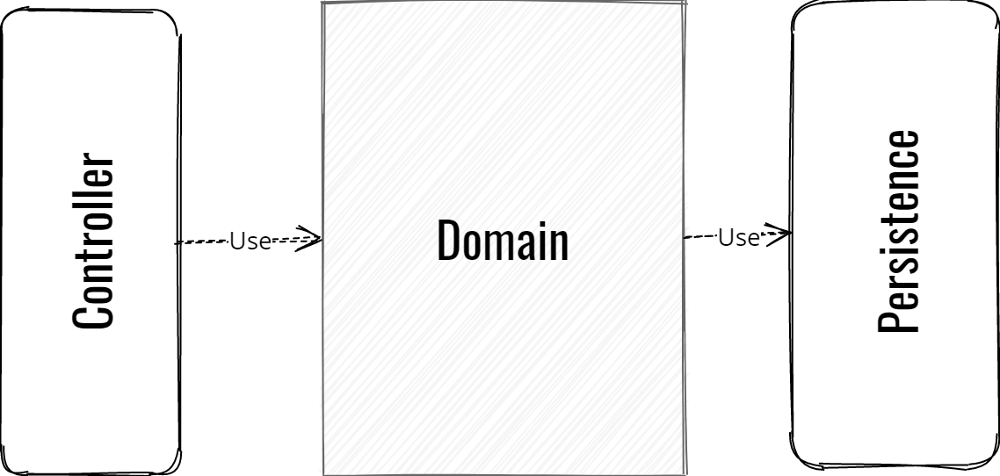
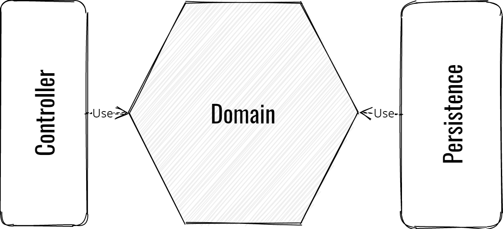
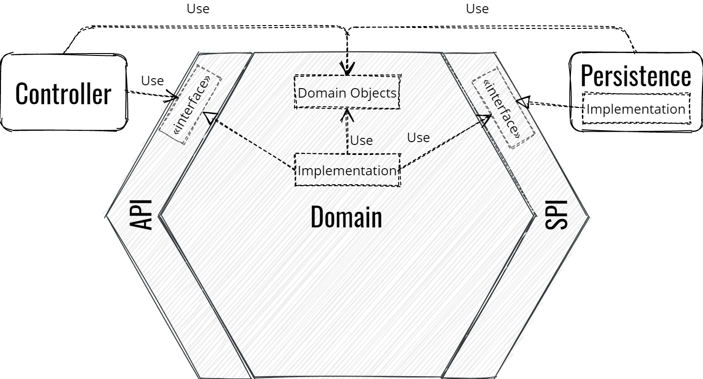
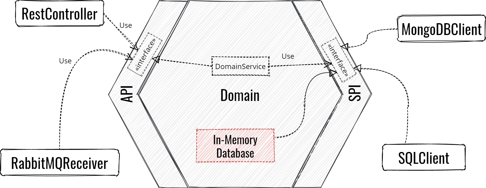

> [원글1](https://beyondxscratch.com/2017/08/19/hexagonal-architecture-the-practical-guide-for-a-clean-architecture/)
>
> [원글2](https://beyondxscratch.com/2020/08/23/hexagonal-architecture-example-digging-a-spring-boot-implementation/)

## 문제 상황

우리가 새로운 기술 스택을 적용해야 한다고 생각해 보자.

SQL을 사용한 Application에서 NoSQL을 이용하도록 바꾸면 어떻게 될까?

아마도 대부분의 서비스는 모든 infrastructure를 갈아엎어야 할 것이다.

하지만 사실, 우린 비지니스 로직을 제외하고 모두 갈아엎는게 맞다.

그렇다면 비지니스 로직이라도 다시 재활용 하는게 합리적이지 않을까?

위 아키텍쳐에서, Model은 그냥 getter와 setter가 있는 POJO였고, *서비스*계층이 있음에도 비지니스 로직은 모든 계층에서 공유됐다.

DAO를 만들고, 직렬화하는 등과 같이 많은 기술들 사이에 껴있었기 때문에 **비지니스 로직을 분리하는게 불가능했다.**

그 중 일부분은 새로운 기술을 도입하며, 이제 제거되어야 할 기술에 의존하고 있다.

## 해결 방법

> 육각형 아키텍쳐는 마법이 아니다.
>
> trade off를 가지며, 다른 문제를 야기할수도 있고, 러닝 커브가 높다고 느낄수도 있다.
>
> 다른 모든 아키텍쳐가 그렇듯 결코 하나의 정답이 있는게 아니기 때문에, 항상 자신에게 더 적합한 아키텍쳐를 고민해야 한다.
>
> 육각형 아키텍쳐도 그 선택지중 하나일 뿐이다.

이러한 문제가 발생한 이유는 **기술과 비지니스 로직 사이가 분리되지 않았기 때문이다.**

육각형 아키텍쳐는 **기술과 비지니스 로직 사이를 분리하여 비지니스 로직이 기술에 구애받지 않고 동작할 수 있도록 설게되었다.**

 

육각형 아키텍쳐의 핵심은 **모든 비지니스 로직을 *도메인*계층에 때려박는 것**이다.

우선 아까 전의 아키텍쳐를 보자.

중요한 점은 **Domain이 자기 자신 말고는 어디에도 종속되지 않는 것**이다.

이를 통해 비지니스 로직이 기술에서 분리시킬 수 있다.

 

그렇다면 이전 아키텍쳐에서, 어떻게 하면 구현할 수 있을까?

Domain은 영속성 계층에 명확히 의존하고 있다.

따라서, IoC를 이용해서 의존성을 역전 시켜주어야 한다.

IoC의 마법은 나중에 살펴보도록 하고, 우선 육각형 아키텍쳐의 특징에 대해 알아보자.

- 우리의 코드에는 육각형 안의 비지니스 로직과 밖의 infrastructure 이 두 가지밖에 없다.

- 비지니스 로직의 독립성을 지키기 위해 의존성은 항상 육각형 바깥쪽에서 안쪽으로만 흐른다.

- 비지니스 로직은 자기 자신을 제외하고 어디에도 의존하면 안된다.

  Controller나 Persistence 말고도 JPA나 Jackson의 어노테이션 등에도 의존하면 안된다.

### Domain은 어떤 프레임워크나 라이브러리에도 의존하면 안된다.

프레임워크는 과하다고 생각할 수도 있는데, Spring 프레임워크에서 Spring Boot로 프로젝트를 마이그레이션 한 글쓴이의 경험을 예로 들어 보자.

가장 힘든 작업은 함수들을 테스트하기 위해 통합테스트에 너무 많이 의존하고 있던 것이다.

또한, 이 함수들은 Spring과도 결합되어 있기 때문에 모두 바꿔줘야 했다.

 

처음에는 모든 테스트가 실패했는데 이게 비지니스 로직부터 망가진건지, 기술에서 문제가 발생한건지 알 수가 없었다.

알고보니 테스트에서의 문제였어서 모든 테스트를 하나하나 도메인에는 문제가 없길 기도하며 수정했다고 한다.

 

비지니스 도메인이 프레임워크에 종속하면 안된다고 하는 이유를 알겠는가?

비지니스 도메인은 **프레임워크, 라이브러리같은 기술스택에 상관없이 재사용 될 수 있어야 한다.**

테스트를 할 때 통합 문제도 없어지고, 순수히 함수를 테스트 할 수 있기 때문에 테스트성도 좋아진다.

> maven에서는 [bannedDependency](https://maven.apache.org/enforcer/enforcer-rules/bannedDependencies.html)라는 것을 이용해 **강제로 의존을 막을 수 있다고 한다**
>
> gradle에서는 [이 문서](https://kordamp.org/enforcer-gradle-plugin/)를 참고하면 좋을 것 같다.

### 육각형 아키텍쳐 에서의 IoC

아까 얘기했듯이, 육각형의 독립성을 보장하기 위해서는 의존성의 방향이 역전되어야 한다.

육각형 바깥쪽은 두 개의 가상 공간으로 나뉘어 진다.

- 왼쪽은 Domain에게 질의를 할 Controller, RabbitMQ Inbound Adapter 등의 계층
- 오른쪽은 Domain에게 정보나 서비스를 제공하는 Persistence, RabbitMQ Outbound Adapter 등의 계층

### Domain을 anti-corruption 계층으로 보호하기

외부에서 Domain에 상호작용을 하기 위해 육각형 아키텍쳐는 두 개의 카테고리로 나뉜 Business Interface를 제공한다.

- **API:** 도메인에 질의하기 위해 필요한 모든 인터페이스로, Domain에서 이걸 구현한다.
- **SPI:** 이건 생소할 수도 있는 약어인데 Service Provider Interface의 약자로, Third party에서 정보를 구해올 때 도메인에 필요한 인터페이스들이다.
  주로 Infrastructure의 오른쪽에서 구현되며, 상황에 따라 Domain에서 이걸 구현할 수도 있다.

두 가지 중요한 사실은 **API와 SPI는 육각형의 일부분이며, API와 SPI는 Domain 객체만을 조작할 수 있다.**

우리가 주로 사용하는 layered architecture에서는 주로 Service에서 DAO들을 생성한다.

하지만 육각형 아키텍쳐에서 Domain은 오직 Domain 객체만 건드릴 수 있다.

따라서 Persistence 계층에서 Domain 객체를 DAO로 바꿔서 영속화 하는데, 이걸 *adaptation*이라고 부른다.

### 육각형 아키텍쳐의 모듈성의 장점

Port와 Adapter 아키텍쳐는 육각형 아키텍쳐의 또 다른 이름이다.

모든 것이 Domain에서 분리되어 있기 때문에 Domain은 Controller가 Rest든, JMS와 같은 메세지 서비스든 신경을 쓰지 않아도 된다.

마찬가지로, JPA를 사용하든 NoSQL을 사용하든 Domain은 신경쓰지 않아도 된다.

단지 Module을 바꾸는 것이기 때문에 소프트웨어에는 별 영향이 없다고 할 수 있다.

참고로 API나 SPI는 Port고, 구현체가 Adapter라고 할 수 있다.

