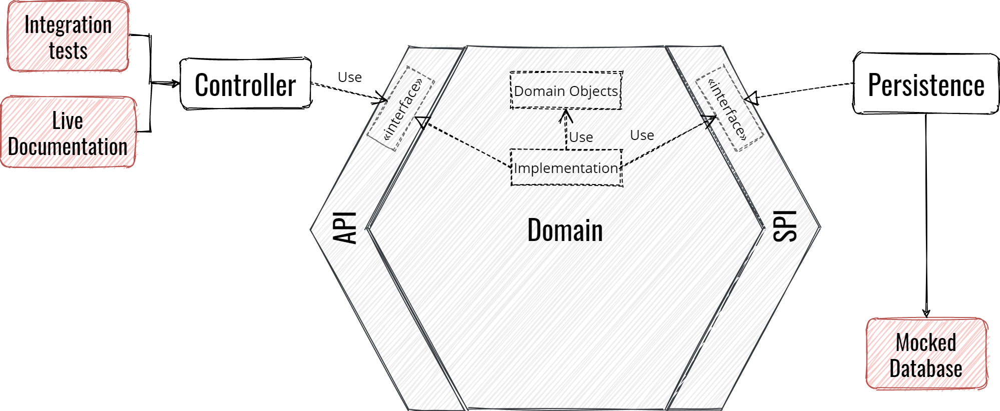

## 어떻게 구현할까?

아까 봤던 규칙 말고 규칙이 하나 더 있는데, **항상 Domain 안에서 시작해야 한다**는 규칙이다.

이 규칙은 다음과 같은 장점이 있다.

- 상세 기술보단 기능에 집중할 수 있게 해준다.
- 기술의 선택을 미룰 수 있도록 해준다. 가끔 어떤 기술이 더 적합한지 알지 못할 수도 있기 때문에 유용하다.
  심지어 가끔 비지니스 로직을 구현하고, 그 후에 필요해 보이는 기술을 추가할 수도 있다.
- 결국 육각형 아키텍쳐의 육각형은 독립성을 보장한다.
  비지니스 로직에 집중한 테스트를 진행할 수 있다.

## Domain의 기능 테스트부터 시작하기

ATDD를 추천한다.

1. 기능의 Entry Point가 될 인터페이스부터 정의한다.
2. TDD로 테스트 코드를 구현한다.
3. 마지막으로 기능들을 구현한다.

그럼 Domain을 테스트 하는데 DB 정보가 필요하면 SPI도 정의한다.

오른쪽이 구현된게 아니기 때문에 육각형 안쪽에 Stub을 만들어 준다

이 Stub은 Scope를 테스트로 제한할 수도 있고, 그냥 Domain에 넣을 수도 있다.

예를 들어, 육각형에서 첫 번째 기능을 만들고, 외부 서비스와 데이터베이스를 stub시킨다.

두 번째로 Domain을 Rest Controller로 노출시킨다.

이제 SPI쪽이 Stub된 버전을 출시했다.

이렇게 해서 Client는 우리의 데이터가 어떻게 동작할지, 데이터가 어떻게 생겼는지 알 수 있다.

비지니스 제약 조건을 실제로 거쳐서 Client가 테스트 할 수 있기 때문에 직접 예제 JSON을 만드는 것 보다 정확하다.

## Adapter 구현하기

먼저 왼쪽 부터 여는게 일반적이다.

통합 테스트를 진행할 수도 있으며, RestDocs나 SWAGGER를 제공해 줄 수 있기 때문이다.

## SPI 구현하기

마지막으로, 이제 SPI쪽에 실질적인 구현을 해 주어야 한다.

통합 테스트를 할 때에는 외부 서비스를 `Fongo`나 `Wiremock`등을 통해 Mocking해서 테스트를 stand-alone하게 유지하는게 좋다.

> 테스트에 대해 더 자세한 것은 [이 gitlab](https://gitlab.com/crafts-records/talkadvisor/talkadvisor-back/blob/master/TestingStrategy.md)을 곧 정리할 예정이다.

## 예외 상황

자신의 판단 하에, Domain에 어느정도는 기술에 의존할 수도 있다.

예를 들어 `StringUtils`를 사용할 수도 있고, Logger를 이용할 수도 있다.

**도메인에 주는 영향이 미미하다**라고 느껴질 때만 해야한다.