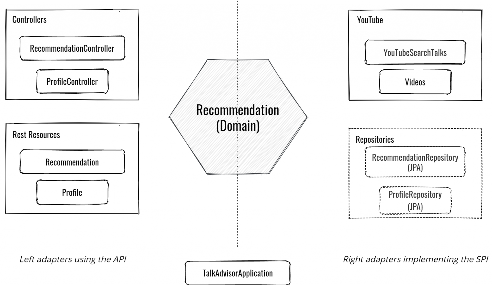
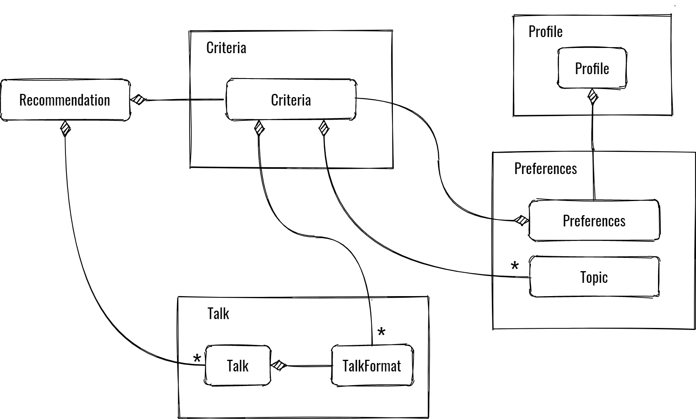
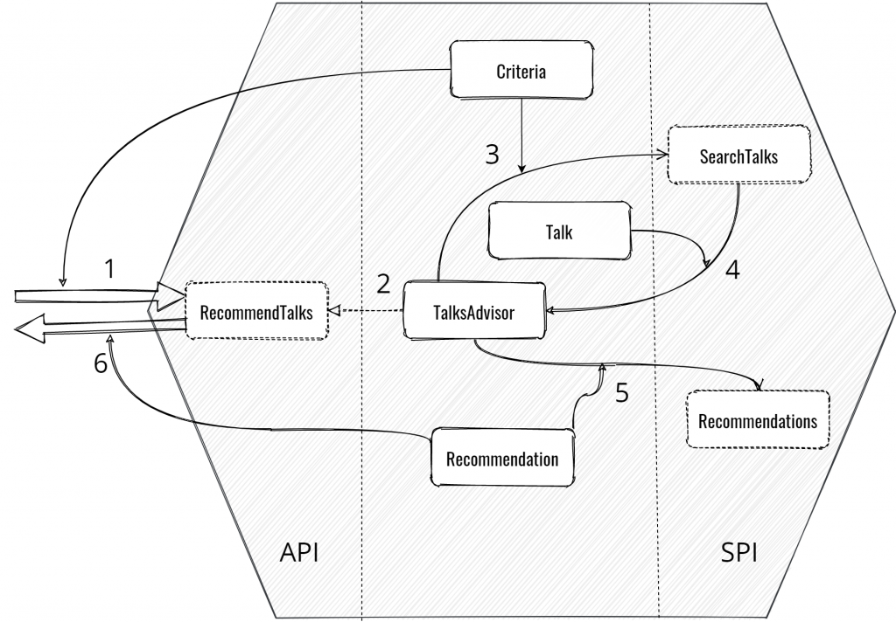
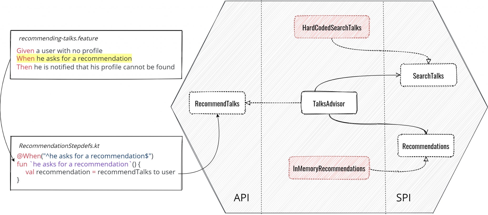
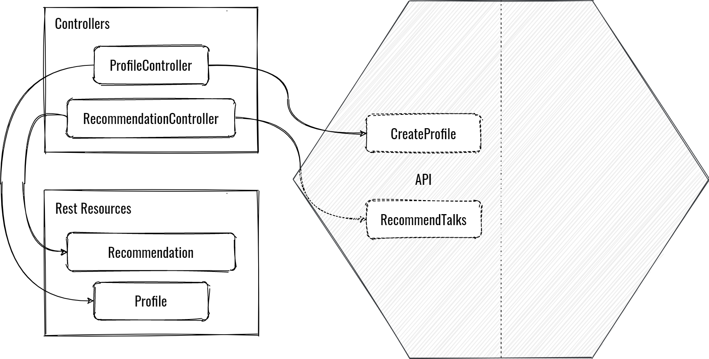
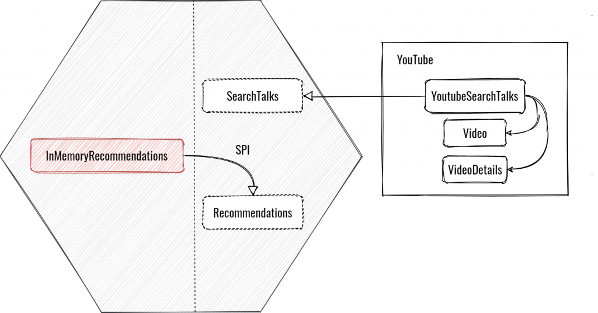

## Overview

여기서는 TalkAdvisor이란 이름의 Demo Applicataion을 구축해 볼 것이다.

Kotlin과 Spring Boot, 그리고 육각형 아키텍쳐를 통해 개발할 것이며, 다음 기능들을 가지는 간단한 Application이다.

- Profile에 자신이 선호하는 주제, 대화 시간을 저장할 수 있다.
- 프로필 또는 기준에 따라 대화를 추천한다.

우선 이 서비스는 Domain과 Infrastructure로 나눌 수 있다.

그리고 비지니스 로직은 Recommendation이라는 Bounded Context를 가지게 된다.

반대로 Infrastructure은 다음을 포함하고 있다.

- Controller
- Request(Resources)
- YoutubeClient
- SpringBootApplication

아직 Database 계층에 대한 구현은 없다.



Recommendation Domain에 대한 구조는 위와 같이 할 수 있다.

<br>

Domain과 Infrastructure는 둘 다 Module로, enforcer plugin을 이용하여 **독립성을 보장할 수 있다.**

이 plugin은 의존성이 없어야 하는 곳에 의존이 있다면 빌드 단계에서 실패시킨다.

이에 따라 pom.xml에서는 어떤 외부 종속성도 허용하지 않는다.

``` xml
<plugin>
    <artifactId>maven-enforcer-plugin</artifactId>
    <executions>
        <execution>
            <goals>
                <goal>enforce</goal>
            </goals>
            <configuration>
                <rules>
                    <bannedDependencies>
                        <excludes>
                            <exclude>*</exclude> <!-- 도메인의 의존성이 아닌 것은 모두 배제한다. -->
                        </excludes>
                        <includes>
                            <!-- Kotlin의 기본적인 의존성은 허용한다. -->
                            <include>org.jetbrains.kotlin:*</include>
                            <include>org.jetbrains:annotations</include>
                            <!-- 테스트 의존성도 필요하기 때문에 허용해 준다. -->
                            <include>*:*:*:*:test</include>
                        </includes>
                    </bannedDependencies>
                </rules>
            </configuration>
        </execution>
    </executions>
</plugin>
```

gradle에서는 build.gradle.kts에 다음과 같이 설정해 주면 된다.

``` groovy
plugins {
    id("org.kordamp.gradle.project-enforcer") version "0.9.0"
}

enforce {
    rule(enforcer.rules.BannedDependencies::class.java) {
        include("org.jetbrains.kotlin:*")
        include("org.jetbrains:annotations")
        include("*:*:*:*:test")
        exclude("*")
    }
}
```

[Maven의 enforcer plugin과 Gradle의 enforcer plugin을 비교한 글](https://andresalmiray.com/announcing-the-gradle-enforcer-plugin/)

> 사실 테스트까지 exclude해주는게 더 좋을 수도 있다.
>
> 테스트는 Production보다 더 오랫동안 유지되고, 이에 따라 기술에서 분리될 필요가 있다.

혹은 ArchUnit 프레임워크를 통해 패키지간의 의존성 테스트를 할 수도 있다.

육각형 아키텍쳐를 변형한 양파형 아키텍쳐를 검증해주는 Util 클래스가 있다.

## TalkAdvisor의 Domain

TalkAdvisor의 기능 영역은 *기술에 대한 이야기 추천*이라고 할 수 있다.

그러므로 **Main 객체인 Aggregate Root는 Recommendation이라고 할 수 있다.**

``` kotlin
@Aggregate
class Recommendation(
    val id: UUID = UUID.randomUUID(),
    val criteria: Criteria, talks: Set<Talk>
) {
    val talks: Set<Talk>

    init {
        checkCriteriaTalkFormatsCorrespondToTheTalksOne(talks)
        this.talks = talks.toSet()
    }

    private fun checkCriteriaTalkFormatsCorrespondToTheTalksOne(talks: Set<Talk>) {
        if (talks.any { !criteria.hasTalkFormat(it.format) }) {
            throw IllegalArgumentException("Criteria talk formats doesn't correspond to the format of the recommended talks")
        }
    }
}
```

Domain 패키지는 대부분 Recommendation bounded context의 Model을 나타낸다.

그렇기 때문에 Talk, Preferences, Topic 등의 클래스가 있다.



## API(Service)

일반적으로 Domain은 왼쪽에 있는 Adapter인 API를 통해 외부에 노출된다.

결과적으로 API 패키지에는 CreateProfile과 RecommendTalk라는 인터페이스를 가지게 된다.

> Service의 인터페이스 라고 생각하면 된다.

``` kotlin
@FunctionalInterface
interface CreateProfileService {
    fun forUserWithPreferences(userId: String, preferences: Preferences): Profile
}
```

``` kotlin
interface RecommendTalks {
    infix fun satisfying(guestCriteria: GuestCriteria): Recommendation
    infix fun to(userId: String): Recommendation
}
```

메소드 정의를 보면 Domain 객체들만 사용한걸 볼 수 있다.

이를 통해 왼쪽의 Adapter에서 발생할 수 있는 문제로부터 Domain을 지키게 된다.

``` kotlin
@DomainService
class TalksAdvisor(
    private val searchTalks: SearchTalks,
    private val recommendations: Recommendations,
    private val profiles: Profiles
) : RecommendTalks {

    override fun to(userId: String): Recommendation {
        val profile = profiles.fetch(userId) ?: throw ProfileNotFoundException(userId)
        return recommendTalksSatisfying(profile.preferences)
    }

    override fun satisfying(guestCriteria: GuestCriteria): Recommendation {
        return recommendTalksSatisfying(guestCriteria as Criteria)
    }

    private fun recommendTalksSatisfying(criteria: Criteria): Recommendation {
        val talks = retrieveTalksSatisfying(criteria)
        return recommendations.save(Recommendation(criteria = criteria, talks = talks))
    }

    private fun retrieveTalksSatisfying(criteria: Criteria): Set<Talk> {
        return searchTalks.forTopics(criteria.topics)
                .filter { criteria.hasTalkFormat(it.format) }
                .toSet()
    }
}
```

API의 구현체는 DB에서 Profile을 조회해와야 한다.

그 후에 프로필에서 설정해 둔 관심사 대로 Youtube에서 대화를 추천 받고, 그걸 DB에 다시 저장한다.

이러한 서비스들이 domain에 속하는건 아니지만, SPI 즉 인터페이스는 Domain에 속한다.

## SPI

SPI는 외부 서비스에 대한 인터페이스로, Profile과 Recommendation, SearchTalks를 외부에 노출한다.

``` kotlin
@Repository
interface Profiles {
    fun save(profile: Profile): Profile

    fun fetch(userId: String): Profile?
}
```

``` kotlin
@Repository
interface Recommendations {
    fun save(recommendation: Recommendation): Recommendation
}
```

``` kotlin
@FunctionalInterface
interface SearchTalks {
    val maxNumberOfTalks: Int
    fun forTopics(topics: Set<Topic>): Set<Talk>
}
```

SPI는 올바른 Adapter에서 Domain 객체를 사용하도록 강제해 준다.

또한, Domain이 SPI의 실제 구현을 알지 못하게 해줄 수 있다.

예를 들어 위에서 SearchTalks 인터페이스는 Youtube Client를 추상화 한 것인데, 이렇게 함으로써 **Adapter에 대한 확장성을 열어두게 된다.**

지금은 Youtube에 API를 요청하지만 Infrastructure에서 DailyMotion으로 바꿀 수 있고, 그렇게 한다고 해도 Domain에는 전혀 영향을 끼치지 않는다.

Repository도 마찬가지로, MongoDB에서 MySQL로 바꾼다고 해도 Domain에는 영향을 주지 않을 수 있다.



위 그림은 Recommendation 기능을 중심으로 Domain이 어떻게 구성되는지에 대한 그림이다.

1. Domain은 RecommendTalks API로 노출된다. 즉, 해당 인터페이스로 호출되게 된다.
2. TalksAdvisor는 RecommendTalks의 실제 구현체로, Domain에 대한 Request를 처리한다.
3. TalksAdvisor는 Domain인 Criteria를 SPI인 SearchTalks에게 넘기고, SPI에게 온라인 비디오 플랫폼에게 Talks를 조회하도록 요청한다.
4. SearchTalks는 요청대로 관련 Talks를 TalksAdvisor에게 전달한다. 이제 받아온 Talks를 Recommendation으로 변경해 줘야 한다.
5. TalksAdvisor는 Recommendation Domain을 Recommendations repository라는 SPI를 호출해서 저장한다.
6. 저장한 RecommendTalks는 Recommendation을 도메인 밖으로 Return한다.

보다싶이 Domain에서는 Domain을 단지 API 혹은 SPI로부터 받아서 전달하는 용도로만 사용한다.

이를 통해 infrastructure와의 독립성을 보장한다.

## Test

일반적으로 기능 테스트부터 시작한다.

아래는 아까 우리가 만들었던 TalkAdvisor에 대한 기능 테스트다.

``` feature
Feature: As a frequent user,
  In order not repeat my preferences at each request,
  I want to create my profile with my preferences

  Scenario: The user is creating his profile with his preferences

    Given a user
    And he wants to learn
      | DDD | hexagonal architecture |
    And he only wants to see
      | QUICKIE | CONFERENCE |
    When he creates his profile
    Then his preferences are stored within

  Scenario: A user is trying to create a profile which already exists
    Given a user
    And he already has a profile
    When he tries to create again his profile
    Then he is notified that his profile already exists
```

``` feature
Feature: As a user,
  In order to effectively learn a subject,
  I want to get the most relevant talks on topics I'm interested in

  Scenario: A busy guest user with no profile only wants to learn with quickies

    Given a guest user who wants to learn DDD
    And he has only time to watch QUICKIE talks
    When he asks for a recommendation given his criteria
    Then talkadvisor recommends some talks
    And the recommended talks are related to DDD
    And all the talks corresponding to the QUICKIE format have a duration between 10 and 20 minutes
    #And the talks are sorted by relevance

  Scenario: A frequent user wants to get recommendations according to his profile

    Given a user
    And he has stored his preferences in his profile
    When he asks for a recommendation
    Then the recommended talks correspond to his preferences

  Scenario: A user tries to get recommendations according to his profile but he didn't have any yet

    Given a user with no profile
    When he asks for a recommendation
    Then he is notified that his profile cannot be found
```

이 파일들이 우리들의 living document가 된다.

각각의 파일들은 기능들이 특정 상황에 처했을 때, 어떤 결과가 나와야 하는지에 대한 시나리오가 정의되어 있다.

하지만 Cucumber라는 라이브러리를 사용하면 동적으로 이 파일들을 파싱해서 기능 테스트를 만들어 준다.

Step Definition을 통해 Given, When, Then과 같은 Step마다 실행될 작업을 등록한다.

``` kotlin
class RecommendationStepdefs(private val testContext: TestContext,
                             private val recommendTalks: RecommendTalks) {

    @When("^he asks for a recommendation$")
    fun `he asks for a recommendation`() {
        try {
            val user = testContext.userId

            val recommendation = recommendTalks to user

            testContext.recommendation = recommendation
        } catch (e: Exception) {
            testContext.error = e
        }
    }

    @Then("^the recommended talks are related to (.+)")
    fun `the recommended talks are related to`(topic: String) {
        val recommendation = testContext.recommendation

        recommendation.that `has talks related to` topic
    }
}
```

하지만 이렇게 해도 우리 테스트를 실행시키기엔 아직 부족하다.

### Stub

중점은 도메인 내부에서는 SPI를 구현할 수 없다.

그렇기 때문에 테스트를 진행할 수 있도록 가짜, 즉 Stub을 구현해 주어야 한다.



SPI 인터페이스를 구현한 가짜 구현체를 만들어서 테스트에서 사용할 수 있다.

이를 통해 **테스트의 독립성을 보장한다.**

Adapter가 바뀌더라도 테스트나 Domain이 변경되지 않을 수 있도록 유지해 준다.

``` kotlin
@Stub
class HardCodedTalksSearcher : SearchTalks {
    override val maxNumberOfTalks: Int = 5 // 이 값은 그냥 무시된다.
    

    override fun forTopics(topics: Set<Topic>): Set<Talk> {
        return createTalks(topics)
    }

    private fun createTalks(topics: Set<Topic>): Set<Talk> {
        return topics.flatMap { createTalksForTopic(it.name) }.toSet()
    }

    private fun createTalksForTopic(topicName: String): Set<Talk> {
        return TalkFormat.values().map {
            Talk.with {
                id = UUID.randomUUID().toString()
                title = "${it.name} $topicName"
                duration = it.durationRange.start.plusSeconds(30)
            }.build()
        }.toSet()
    }
}
```

``` kotlin
@Stub
class InMemoryProfiles(
    private val profiles: MutableMap<String, Profile> = HashMap()
) : Profiles {
    override fun fetch(userId: String): Profile? {
        return profiles[userId]
    }

    override fun save(profile: Profile): Profile {
        profiles[profile.id] = profile
        return profile
    }
}
```

``` kotlin
@Stub
class InMemoryRecommendations(
    private val recommendations: MutableMap<UUID, Recommendation> = HashMap()
) : Recommendations {
    override fun save(recommendation: Recommendation): Recommendation {
        recommendations[recommendation.id] = recommendation
        return recommendation
    }

}
```

TalkAdvisor에는 실제 DB 구현이 없기 때문에 이 Stub들은 테스트가 아닌 Production 코드에 속한다.

실제 Youtube Client를 가지고 있음에도, 테스트 에서는 In-Memory Stub을 사용한다.

이것 만으로도 테스트에서는 충분하기 때문이다.

### Domain에서는 실제 코드만을 테스트 하라

mockito와 같은 Mocking 프레임워크는 널리 사용된다.

하지만 비지니스 로직을 테스트 할 때에는 이게 사용되면 안된다.

mock을 사용하게 되면 **잘못된 동작을 하드코딩으로 그냥 넣을수도 있다.**

### Mocking시 주의사항

대화의 기간을 계산하기 위해, TalkFormat 이라는 기간 카테고리를 위한 enum이 있다.

``` kotlin
class Talk private constructor(id: String,
                               title: String,
                               duration: Duration) {

    val id = notBlank(id, "Cannot create a Talk is a blank id")!!
    val title = notBlank(title, "Cannot create a Talk is a blank title")!!
    val duration = notNegative(duration)
    val format = TalkFormat.ofDuration(duration)
}
```

``` kotlin
enum class TalkFormat(val format: String, val durationRange: ClosedRange<Duration>) {
    IGNITE("IGNITE", ofMinutes(1).rangeTo(ofMinutes(10).minusNanos(1))),
    QUICKIE("QUICKIE", ofMinutes(10).rangeTo(ofMinutes(20).minusNanos(1))),
    TOOL_IN_ACTION("TOOL_IN_ACTION", ofMinutes(20).rangeTo(ofMinutes(40).minusNanos(1))),
    CONFERENCE("CONFERENCE", ofMinutes(40).rangeTo(ofMinutes(60).minusNanos(1))),
    UNIVERSITY("UNIVERSITY", ofHours(1).rangeTo(ofHours(4)));

    companion object Converter {
        fun ofDuration(duration: Duration): TalkFormat {
            isTrue(lessThanTheMinimumDuration(duration), "Duration is less than expected")
            return values()
                    .singleOrNull { duration.isInRange(it.durationRange) }
                    ?: UNIVERSITY
        }

        private fun lessThanTheMinimumDuration(duration: Duration): Boolean {
            val firstRange = IGNITE.durationRange
            return duration.coerceIn(firstRange) != firstRange.start
        }
    }
}
```

기본적으로 여기서 IGNITE는 1분~10분, UNIVERSITY는 1시간~4시간인걸 알 수 있다.

Talk 클래스는 TalkFormat의 ofDuration 함수를 호출하기 때문에 항상 유효하다는걸 보증한다.

하지만 mocking을 사용한 예제를 보자.

``` kotlin
@Test
fun `should retrieve talks`() {

    val mockedTalk = mock(Talk::class.java)
    given(mockedTalk.format).willReturn(IGNITE)
    given(mockedTalk.duration).willReturn(Duration.ofHours(1))
    // 이 결과 값은 유효하지 않다. Talk의 신뢰성을 보장해 주는 것은 Duration인데, mockito로 오버로드 되었기 때문에 비정상적이다.
    given(searchTalks.forTopics(anySet())).willReturn(setOf(mockedTalk))

    val recommendTalks = TalksAdvisor(searchTalks, recommendations, profiles)

    val recommendation = recommendTalks.satisfying(GuestCriteria(setOf(), setOf(IGNITE)))

    assertThat(recommendation.talks).containsExactly(mockedTalk) // 필터링 되었어야 하는 부분
    assertThat(recommendation.talks.first().format).isEqualTo(IGNITE)
    assertThat(recommendation.talks.first().duration).isEqualTo(Duration.ofHours(1))
    // 이 테스트는 실패했지만 여전히 돌아간다.
}
```

Mock을 사용하게 되었을 때, IGNITE 대화의 지속시간이 1시간 이라고 표현할 수는 있다.

하지만, 이게 기능적으로 옳은 결과는 아니다.

이로 인해서 우리의 비지니스 로직에 금이 가기 시작한다.

심지어 도메인을 Refactoring하더라도 테스트는 성공하게 된다.

비지니스 로직이 변경되었다고 해서 mock들도 다시 검증하지는 않는다.

따라서 이건 비지니스 로직에 대한 문제를 야기할 수 있다.

### SPI는 어떻게 할까

SPI에는 이미 Stub이 존재한다.

따라서 우리는 mocking을 할 필요가 없지만, Infrastructure에서는 mocking을 해도 된다.

<br>

도메인 코드에서 문제가 발생하면 복잡한 도메인 객체가 필요해 질 수도 있다.

그리고 이건 기능 테스트를 통째로 복사하지 않으면 안 되는 상황도 있다.

Domain 테스트에서는 Mock을 권장하지 않지만, Adapter과의 독립성을 보장하기 위해서는 사용해도 된다.

Controller에서는 HTTP 요청이 잘 가는지와 DTO를 도메인 객체로 변경하는 것 만을 검증하고 싶을 수도 있다.

따라서 Infrastructure 테스트에서 불필요한 것 들을 신경쓰지 않기 위해 mock을 사용할 수 있다.

## Infrastructure

Infrastructure는 **모든 기술적 코드들이 모이는 곳**으로, 정의상 비지니스 로직을 처리하면 안된다.

기본적으로 왼쪽과 오른쪽 Adapter가 위치한다.

Domain과 달리 프레임워크를 사용해도 되기 때문에 Spring Boot도 여기에만 위치할 수 있다.

### 왼쪽 Adapter

왼쪽  Adapter의 주요 목적은 Domain을 외부에 노출하는 것이다.

Controller나 MQ의 Consumer가 여기에 위치할 수 있다.

#### Rest 계층

Domain API는 기능 중심으로 만들어지지만, **Controller는 Resource 중심으로 만들어 진다.**

그러므로, **Domain에는 Resource의 개념이 존재하지 않는다.**



REST 계층은 간단하게 생겼다.

TalkAdvisor에서는 Profile과 Recommendation이 Resource가 된다.

그에 맞게 Controller는 ProfileController와 RecommendationController가 있다.

``` kotlin
@RestController
@RequestMapping(path = ["/profiles"])
class ProfileController(private val createProfile: CreateProfile) {

    /**
     * AuthenticationContext를 사용하는 대신 User-Id를 헤더로 그냥 받아온다.
     * 단순 예제에서 Security까지 구현 할 필요가 없기 때문에 이렇게 했지만, Production에서는 이런식으로 하면 안된다.
     */
    @PostMapping
    fun createProfile(@RequestHeader("User-Id") userId: String, @RequestBody preferences: Preferences): ResponseEntity<Profile> {
        val profile = createProfile.forUserWithPreferences(userId, preferences.toDomainObject()).toResource()
        val location = linkTo(this::class.java).slash(profile).toUri()
        return ResponseEntity.created(location).body(profile)
    }

    @ExceptionHandler(ProfileAlreadyExistsException::class)
    fun handleProfileAlreadyExistsException(response: HttpServletResponse, exception: ProfileAlreadyExistsException) {
        response.sendError(SC_CONFLICT, exception.message)
    }
}
```

``` kotlin
@RestController
@RequestMapping(path = ["/recommendations"])
class RecommendationController(private val recommendTalks: RecommendTalks) {

    @PostMapping
    fun createRecommendation(@RequestHeader("User-Id") user: String): ResponseEntity<Recommendation> {
        val domainRecommendation = recommendTalks to user
        val recommendation = domainRecommendation.toResource()
        val location = linkTo(this::class.java).slash(recommendation).toUri()

        return ResponseEntity.created(location).body(recommendation)
    }

    @ExceptionHandler(ProfileNotFoundException::class)
    fun handleProfileNotFoundException(response: HttpServletResponse, exception: ProfileNotFoundException) {
        response.sendError(HttpServletResponse.SC_BAD_REQUEST, exception.message)
    }
}
```

여기서 Controller는 DI를 통해 생성자로 주입된다.

Converter 패턴이든 더욱 객체 지향적인 방법으로 코드를 짜든 상관 없다.

위 코드에선 Resource가 Request Body를 통해 넘어왔고, `toDomainObject()`를 통해 그게 Domain 객체로 변환되었다.

``` kotlin
data class Preferences(val topics: List<Topic>, val talksFormats: List<String>) {
    fun toDomainObject(): DomainPreferences {
        return DomainPreferences(topics.toDomainObjects(), talksFormats.toDomainTalkFormats())
    }
}
```

``` kotlin
class Topic(val name: String) {
    fun toDomainObject(): DomainTopic {
        return DomainTopic(this.name)
    }
}

fun Iterable<Topic>.toDomainObjects(): Set<DomainTopic> {
    return this.map(Topic::toDomainObject).toSet()
}
```

Resource는 그냥 요청을 받는 것 뿐만 아니라 그걸 도메인 객체로 변환까지 해준다.

또한 Domain API로부터 반환된 Domain Object는 `toResource()` 메소드를 통해 Resource로 변환된다.

`toResource()`는 Kotlin의 Extension 함수로, Infrastructure에 위치한다.

``` kotlin
class Recommendation(private val id: UUID, val talks: List<Talk>) : Identifiable<UUID> {
    override fun getId() = id
}

fun DomainRecommendation.toResource() =
	Recommendation(id = id, talks = talks.map(DomainTalk::toResource).toList())
```

이를 통해 Domain에서는 이 함수에 접근할 수 없다.

> 만약 Extension을 지원하지 않는 언어를 사용한다면 Domain 객체를 파라미터로 받는 생성자를 만들면 된다.

### Rest Resource

Domain 객체와 Resource가 같은 경우, 왜 굳이 Resource를 사용할까?

#### Resource - Domain의 불균형

먼저, 도메인과 Resource가 1대1로 매핑되는 경우는 잘 없다.

위 예제처럼, Domain의 Recommendation만 criteria를 가진다.

criteria는 사용만 해야하기 때문에 외부에 노출되면 안된다.

<br>

더 나은 예제를 위해 다른 서비스의 코드를 둘러보자.

기본적으로, user는 몇 가지 기준에 따라 검색을 하게 된다.

Domain의 Aggregate는 Search 객체다.

``` kotlin
data class Search(
        val id: UUID = randomUUID(),
        val criteria: Criteria,
        val spaceTrains: SpaceTrains,
        val selection: Selection = Selection())

data class SpaceTrain(
        val number: String,
        val bound: Bound,
        val originId: String,
        val destinationId: String,
        val schedule: Schedule,
        val fares: Fares,
        val compatibleSpaceTrains: Set<String> = emptySet())

typealias SpaceTrains = List<SpaceTrain>
```

Search에는 Train 목록이 있다.

하지만 Rest Resource에는 이러한 Domain 객체보다 훨씬 적은 정보만을 받는다.

``` kotlin
@Resource
data class Search(
    private val id: UUID,
    val criteria: Criteria
): RepresentationModel<Search>()
```

이 API는 HATEOAS를 구현했기 때문인데, Search에 관련된 링크들은 JSON에 다음과 같이 들어가게 된다.

``` json
{
    "criteria": {
        "journeys": [
            {
                "departureSpacePortId": "http://localhost:1865/spaceports/ddf86b0b-94e3-3566-8486-fd076b9686a6",
                "departureSchedule": "2020-08-18T10:00",
                "arrivalSpacePortId": "http://localhost:1865/spaceports/4ed3116c-e359-3245-b8d0-cec742551507"
            },
            {
                "departureSpacePortId": "http://localhost:1865/spaceports/4ed3116c-e359-3245-b8d0-cec742551507",
                "departureSchedule": "2020-08-28T10:00",
                "arrivalSpacePortId": "http://localhost:1865/spaceports/ddf86b0b-94e3-3566-8486-fd076b9686a6"
            }
        ]
    },
    "_links": {
        "self": {
            "href": "http://localhost:1865/searches/4227c50c-9723-45d1-908d-c945eece273a"
        },
        "selection": {
            "href": "http://localhost:1865/searches/4227c50c-9723-45d1-908d-c945eece273a/selection"
        },
        "all-outbounds": {
            "href": "http://localhost:1865/searches/4227c50c-9723-45d1-908d-c945eece273a/spacetrains?bound=OUTBOUND&onlySelectable=false"
        },
        "all-inbounds": {
            "href": "http://localhost:1865/searches/4227c50c-9723-45d1-908d-c945eece273a/spacetrains?bound=INBOUND&onlySelectable=false"
        }
    }
}
```

#### Rest Resource와 Anti-Corruption 계층

마지막으로, Domain을 직접적으로 직렬화 하면 문제가 발생할 수 있다.

Domain 객체의 필드 이름만 바꿔도 Rest의 Consumer들도 모두 바꿔야 한다.

하지만 Resource를 두면 Resource가 Domain의 변경사항을 외부에 노출하지 않도록 막아주기 때문에 Domain을 자유롭게 수정할 수 있다.

### 오른쪽 Adapter

오른쪽에는 외부 서비스와 통신하기 위한 Adapter가 있다.

위에서 말 했듯이, 육각형 아키텍쳐 에서는 Repository가 Domain 안에서 Stub된다.

일단 Youtube Client의 예제를 보자.



YoutubeSearchTalks는 Domain의 PSI에 대한 실질적인 구현체 이다.

Domain에서 정의한 인터페이스에 따라 Youtube에 요청을 보내어 검색하는 기능을 담당한다.

``` kotlin
internal class Videos(val items: List<Video>) {
    fun toTalkBuilders(): List<Talk.Builder> {
        return items.map(Video::toTalkBuilder)
    }
}

internal class Video(val id: VideoId, private val snippet: Snippet) {
    internal fun toTalkBuilder(): Talk.Builder {
        val videoId = id.videoId
        return Talk.with {
            id = videoId
            title = snippet.title
        }
    }
}

internal class VideoId(val videoId: String)

internal class Snippet(val title: String)
```

``` kotlin
internal class VideosDetails(val items: List<VideoDetails>)

internal class VideoDetails(val id: String, val contentDetails: ContentDetails)

internal class ContentDetails(val duration: Duration)
```

``` kotlin
@Component
@Conditional(NoSearchTalksAlreadyPresent::class)
class YouTubeSearchTalks(
        restTemplateBuilder: RestTemplateBuilder,
        @Value("\${youtube.api.base-uri}") val youtubeApiBaseUri: String,
        @Value("\${youtube.api.key}") val apiKey: String,
        @Value("\${talks.max-number}") override val maxNumberOfTalks: Int) : SearchTalks {

    private val restTemplate = restTemplateBuilder.build()
    private val devoxxChannelId = "UCCBVCTuk6uJrN3iFV_3vurg"

    override fun forTopics(topics: Set<Topic>): Set<Talk> {

        val videosWithoutDuration = retrieveVideosWithoutDuration(topics)
        val videosDuration = retrieveVideosDuration(videosWithoutDuration)

        val talksWithoutDuration = videosWithoutDuration.toTalkBuilders()
        return talksWithoutDuration.buildWithDurationsFrom(videosDuration)
    }

    private fun retrieveVideosWithoutDuration(topics: Set<Topic>): Videos {
        val searchRequest = searchRequest(topics)
        return restTemplate.getForObject(searchRequest, Videos::class.java)!!
    }
        
    private fun retrieveVideosDuration(videosWithoutDuration: Videos): Map<String, Duration> {
        return videosWithoutDuration
                .extractVideoIds()
                .let { toVideosListOptions(it) }
                .let { toVideosListRequest(it) }
                .let { restTemplate.getForObject(it, VideosDetails::class.java)!! }
                .idToDurationMap()
    }

    private fun searchRequest(topics: Set<Topic>): URI {
        return UriComponentsBuilder.fromUriString(youtubeApiBaseUri)
                .path("/search")
                .queryParams(searchOptions(topics))
                .build()
                .toUri()
    }

    private fun searchOptions(topics: Set<Topic>): MultiValueMap<String, String> {
        val options: MultiValueMap<String, String> = LinkedMultiValueMap()
        options["part"] = "id,snippet"
        options["channelId"] = devoxxChannelId
        options["maxResults"] = maxNumberOfTalks.toString()
        options["q"] = topics.joinToString("|") { it.name }
        options["type"] = "video"
        options["fields"] = "items(id/kind,id/videoId,snippet/title,snippet/thumbnails/default/url)"
        options["key"] = apiKey
        return options
    }

    private fun Talk.Builder.withDurationFrom(videosDuration: Map<String, Duration>): Talk.Builder {
        return this.apply { duration = videosDuration.getValue(id) }
    }

    private fun Iterable<Talk.Builder>.buildWithDurationsFrom(videosDuration: Map<String, Duration>): Set<Talk> {
        return this.map { it.withDurationFrom(videosDuration) }
                .map(Talk.Builder::build)
                .toSet()
    }
}
```

Domain은 SPI에서 정의된 `forTopics()` 메소드를 통해 통신한다.

여기서도 Domain API처럼 Domain 객체의 사용이 강제된다.

Domain의 `Set<Topic>`은 searchOptions에서 `MultiValueMap`으로 변환해 준다.

그리고 이 `MultiValueMap`은 RestTemplate으로 외부에 RestAPI 호출을 보내게 된다.

그리고 RestTemplate는 Json을 Kotlin의 data class에 매핑되고, 당연히 이 클래스는 여기에서만 사용할 수 있고 Domain 객체를 반환해 주어야 한다.

#### Model 변환

Youtube의 API에서는 Duration을 반환해 주지 않는다.

하지만 Talk에는 Duration이 존재하는데, `retrieveVideosDuration()`를 통해 Duration까지 조회해 와 준다.

여기서 Domain 객체는 Talk 하나밖에 없지만, 여기서는 Video와 VideoDetails 두 개의 객체를 이용했다.

Youtube에서는 너무 큰 Payload를 피하기 위해 이런식으로 API를 나눴을 수도 있겠지만, 우리의 경우에는 그냥 Talk 하나면 충분하다.

마지막으로 두 객체를 하나의 Talk로 변환해 준다.

### Data Quality 문제 해결하기

동일한 데이터가 여러 번 반환되기도 하고, 어떤 데이터는 누락되기도 한다.

다행히 DDD에서는 Domain 객체의 불변성을 생성자에서 보장해 준다는 것이다.

만약 인증 코드가 필요한 작업에서 인증 코드 없이 객체를 생성하려고 하면 에러를 발생시킨다.

따라서 올바르지 않은 데이터는 객체가 생성되지 않게 된다.

<br>

객체가 생성되지 않도록 막는 방법에서는 만약 하나의 Train에서 예외가 발생하기만 하면 아무 Train도 반환하지 않았다.

하지만 Data Quality 문제는 Response 중 몇몇 Train들에서 발생하기 때문에 아예 Right Adapter에서 데이터를 받을 때, 필터링 해서 받아오기로 결정했다.

이를 통해 만약 몇몇 데이터에서 문제가 발생해도 그냥 문제가 발생한 데이터를 보여줄 수 있다.

또한, 문제가 생긴건 로깅을 통해 데이터 퀄리티를 향상시킬 수 있다.