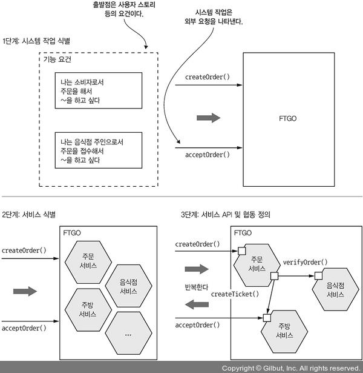
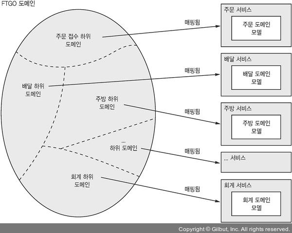
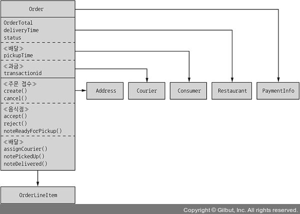

# 2.2.0 서론

MSA를 어떻게 정의해야 할까? 다른 소프트웨어도 그렇지만, 도메인 전문가가 문서화한 요건들과 기존 Application을 시작점으로 삼아야 한다.

전에 말했듯이, 아키텍쳐를 정의하는건 과학보단 예술에 가까워 정답은 없다.

<br>

이번 챕터에선 애플리케이션 아키텍쳐를 정의하는 3단계 프로세스에 대해 설명한다.

과학처럼 따라한다고 되는게 아니기 때문에 실제로 여러 차례 되풀이해야 할 수도 있고, 창의력이 필요할수도 있다.

<br>



##  1단계: 애플리케이션 요건을 핵심 요청으로 추출

애플리케이션은 사용자의 요청을 처리하기 위해 존재한다.

따라서 아키텍쳐를 정의하는 첫번째 단계는 **애플리케이션 요건을 핵심 요청으로 추출**하는 것이다.

즉, 사용자가 요구한 조건을 추출해서 요청을 만들어내는 것이다.

<br>

System Operation은 애플리케이션이 처리하는 요청을 추상화 한 것이다.

이번에는 Rest나 gRPC처럼 특정 기술에 종속된게 아니라 추상화된 개념으로 System Operation 을 볼 것이다.

데이터를 업데이트 하는 커맨드나, 데이터를 조회하는 쿼리 모두 해당된다.

> `updateOrder()`과 같은 커맨드, `getOrder()`과 같은 쿼리

각 커맨드의 동작은 추상적인 도메인 모델 관점에서 정의되고, 결국 시스템 작업은 여러 서비스가 협동하는 방식을 표현한 아키텍쳐 시나리오가 된다.

> 즉 쉽게 말해서 각각의 System Operation이란 사용자의 요청을 처리하는 비지니스 로직 정도로 생각하면 된다.
>
> 따라서 사용자가 *데이터 저장을 원한다*고 말하면 `save()` 메소드가 System Operation 이라고 할 수 있다.

<br>

## 2단계: 어떻게 여러 서비스로 분해할지 결정

여러가지 전략을 시도할 수 잇는데, 비지니스 능력에 따라 정의할 수도 있고, DDD의 하위 도메인 별로 구성할수도 있다.

어떻게 되든 결과는 **기술이 아닌 비지니스 개념 중심 서비스**이다.

<br>

## 3단계: 서비스별로 API 정의

먼저 1단계에서 구분한 System Operation을 각 서비스마다 배정해야 한다.

완전히 다른 서비스와 관계를 가지지 않는 서비스도  있을 수 있지만, 다른 서비스들과 통신해야만 하는 서비스도 있다.

이때 여러 서비스들 간의 통신 방법을 정해야 하는데, 대부분 서비스에서는 **추가적인 기술**을 두는 형태를 사용할 것이다.

<br>

## 분해 과정에서의 문제점

- **네트워크 지연:** 서비스 간의 통신이 너무 잦아 분해하기 힘든 경우도 존재한다.

- **서비스 간 동기 통신으로 인한 가용성 저하:** 동기적인 통신으로 인해 만약 자신이 클라이언트 입장인데 서버에 문제가 발생하면 내 서비스에 문제가 발생하게 된다.

- **여러 서비스에 걸친 데이터 일관성:** 데이터베이스나 서비스가 여러개이기 때문에 데이터 일관성을 지키기 어렵다.

  보통 Saga 패턴으로 해결한다.

- **만능 클래스:** 하나의 클래스가 너무 많은 책임을 지니고 있는 상황을 의미한다.

<br>

# 2.2.1 System Operation 식별

애플리케이션 아키텍쳐를 정의하는 첫 걸음은 System Operation을 정의하는 것이다.

이것을 위해서는 사용자 스토리와 사용자 시나리오 등의 애플리케이션 요구 사항들이 필요하다.

우리는 `Applying UML and Patterns` 라는 책의 객체 지향 설계 프로세스에서 영감을 받아 만들어진 2단계 프로세스로 정의할 것이다.


먼저 고수준의 도메인 모델에서 정의하고, 2단계에서 작업들을 분류해서 동작을 Domain Model 관점에서 기술한다.

**Domain Model은 주로 사용자 스토리의 명사에서 도출**된다.

> 5장에서 나오는 Event Storming 이라는 기법을 사용해도 된다.

**System Operation은 주로 동사에서 도출**하며, 각각 **하나 이상의 도메인 객체와, 그들 사이의 관계로 기술**한다.

> 여기서는 *주문을 하고싶다*라는 동사에 의해 `createOrder()`이라는 System Operation이 파생되었다.

System Operation은 도메인 모델에 관여할 수 있고, 모델간의 관계를 끊을 수 있다.

<br>

## 고수준 도메인 모델 작성

System Operation을 정의하기 전에 고수준의 애플리케이션 도메인 모델을 먼저 정의해 보아야 한다.

최종 구현보단 간단하지만, 나중에 모델을 작성할 때 도움이 된다.

> 이렇게 간단하게 구현한 모델은 단순하다.
>
> 원래 도메인 모델이 하나뿐인 서비스는 존재하지 않는다.

<br>

도메인 모델은 스토리에서 명사를 도출하고, 도메인 전문가와 상담해서 만들 수 있다.

예를 들어 *주문하기*라는 스토리는 다음과 같이 확장할 수 있다.

```
전제(Given)

소비자가 있다.

음식점이 있다.

음식점은 소비자의 주소로 제시간에 음식을 배달할 수 있다.

주문 총액이 음식점의 최소 주문량 조건에 부합한다.

 

조건(When)

소비자가 음식점에 음식을 주문한다.

 

결과(Then)

소비자 신용카드가 승인된다.

주문이 PENDING_ACCEPTANCE 상태로 생성된다.

생성된 주문이 소비자와 연관된다.

생성된 주문이 음식점과 연관된다
```

여기서 명사를 보면 Consumer, Order, Restaurant 등 다양한 클래스가 필요하다.

마찬가지로 주문 접수는 다음과 같이 확장할 수 있다.

``` 
전제(Given)

현재 주문은 PENDING_ACCEPTANCE 상태다.

주문 배달 가능한 배달원이 있다.

 

조건(When)

주문을 접수한 음식점은 언제까지 음식을 준비할 수 있다고 약속한다.

 

결과(Then)

주문 상태가 ACCEPTED로 변경된다.

주문의 promiseByTime 값을 음식점이 준비하기로 약속한 시간으로 업데이트한다.

주문을 배달할 배달원을 배정한다.
```

위 시나리오를 보면 Courier, Delivery가 필요할 것 같다.

이렇게 분석을 계속하다 보면 Address와 같이 다른 클래스들도 도출될 수 있다.


- **Consumer:** 주문을 하는 소비자

- **Order:** 소비자가 한 주문. 어떤 주문인지 나타내며 상태를 추적합니다.

- **OrderLineItem:** Order의 품목

- **DeliveryInfo:** 주문을 배달할 시간/장소

- **Restaurant:** 배달할 주문을 준비하는 음식점

- **MenuItem:** 음식점의 메뉴 항목

- **Courier:** 주문을 배달하는 배달원. 배달원의 가용성 및 현재 위치를 추적합니다.

- **Address:** 소비자 또는 음식점의 주소

- **Location:** 배달원의 위치(위도/경도)

<br>

## System Operation 정의

애플리케이션이 어떤 요청을 처리할지 구분하는 단계.

시스템 작업은 다음 두 종류로 나뉜다.

- **Command:** 데이터 생성, 수정, 삭제를 담당
- **Query:** 데이터 읽기를 담당

<br>

System Operation은 결국 Rest, RPC로 구현되겠지만, 일단 추상적으로 특정 기술에 종속되지 않도록 생각한다.

<br>

### 커맨드 식별

System Command를 식별하기 위해서는 **사용자 스토리나 시나리오에 포함된 동사를 분석**해야 한다.

예를 들어 소비자는 *주문 생성*이라는 동사를 가지고 있고, 따라서 `createOrder()`과 같은 커맨드가 발생하게 된다.

<br>

커맨드는 **매개변수, 반환 값, 동작 방식의 명세를 도메인 모델 클래스를 사용해서 정의**해야 한다.

예를 들면 다음과 같다.

| 종류      | 명세                                                         |
| --------- | ------------------------------------------------------------ |
| 작업      | createOrder(소비자 ID, 결제 수단, 배달 주소, 배달 시각, 음식점 ID, 주문 품목) |
| 반환값    | orderId, …                                                   |
| 선행 조건 | 소비자가 존재하고 주문을 할 수 있다.<br />주문 품목은 음식점의 메뉴 항목에 들어 있다.<br />배달 주소/시각은 음식점에서 서비스할 수 있다. |
| 후행 조건 | 소비자 신용카드는 주문 금액만큼 승인 처리되었다.<br />주문은 PENDING_ACCEPTANCE 상태로 생성되었다. |

선행 조건은 시나리오의 Given을, 후행 조건은 시나리오의 Then을 나타낸다.

System Operation 호출 시 **선행 조건을 확인한 후에, 후행 조건을 만족하도록 한다**

<br>

고수준의 Domain Model과 System Operation을 보면 애플리케이션이 어떤 일을 하는지 알 수 있기 때문에 아키텍쳐를 정의하는 데에 유용하다.

**각 시스템의 동작은 도메인 모델 중심으로 기술**된다.

따라서 각각의 중요한 System Operation은 아키텍쳐를 설명할 때 중요한 시나리오를 나타내 준다.

<br>

System Operation을 정의한 애플리케이션 서비스를 분류해야 한다.

여기에는 정답이 없지만, 상황에 따라 다양한 전략을 사용할 수 있다.

<br>

# 서비스 정의 - 비지니스 능력 패턴 별 분해

MSA를 구축하는 첫  전략은 비지니스 능력에 따라 분해하는 방법이다.

비지니스 아키텍쳐 모델링 개념인 Business Capability는 **비지니스가 가치를 가지게 하기 위한 일**이다.

비지니스 능력은 업종마다 다른데, 보험 회사라면 클레임 관리, 과금 등의 능력을 지니고 있을 것이다.

<br>

## 비지니스 능력은 곧 그 조직이 하는 일이다.

비지니스 능력을 보면 해당 조직의 비지니스를 알 수 있다.

조직이 비지니스를 하는 방법은 매번마다 다르고, 계속해서 바뀌기도 하지만 비지니스 능력은 웬만하면 바뀌지 않는다.

특히 비지니스 처리를 자동화 하는 요즘엔 더 그렇다.

우리가 은행에서 직접 돈을 예금하기도 했지만, 요즘은 거의 핸드폰을 많이 사용한다.

물론 현금을 사용하는 방법은 웬만해선 없어지지 않지만, 처리하는 방법은 바뀔 수 잇다.

<br>

## 비지니스 능력 구분

한 조직의 비지니스 능력은 조직의 목표, 구조, 프로세스를 분석하여 결정한다.

사실 기술보단 비지니스 위주인 서비스 라고도 할 수 있다.

비지니스 능력 명세는 다양한 컴포넌트로 구성되는데, 예를 들어 보험사의 증권 인수라는 능력의 입력은 소비자 신청서, 출력은 승인과 단가가 된다.

<br>

비지니스 능력은 보통 특정 비지니스 객체에 집중하며, 여러개의 하위 능력으로 분해할 수 있다.

예를 들면 클레임 이라는 비지니스 객체는 클레임 관리 능력을 중심으로 클레임 정보 관리, 클레임 검토, 클레임 처리 등의 하위 능력이 있다.

<br>
FTGO의 비지니스 능력은 다음과 같다.

- **공급자 관리**
  - 배달원 관리: 배달 정보 관리
  - 음식점 정보 관리: 음식점 메뉴, 위치, 영업 시간, 기타 정보 관리
- **소비자 관리**: 소비자에 관한 정보 관리
- **주문 접수 및 이행**
  - 주문 관리: 소비자가 주문을 생성/관리할 수 있게 합니다.
  - 음식점 주문 관리: 음식점의 주문 준비 상태를 관리
  - 로지스틱스(logistics, 실행 계획)
  - 배달원 가용성 관리: 배달원이 배달 가능한지 실시간 관리
  - 배달 관리: 주문을 소비자에게 배달
- **회계**
  - 소비자 회계: 소비자 과금 관리
  - 음식점 회계: 음식점 지불 관리
  - 배달원 회계: 배달원 지불 관리

이제 이 비지니스 능력으로 서비스를 정의해 보자

<br>

## 비지니스 능력을 서비스로

비지니스 능력을 구분했으니, 이제 그 능력에 따라 연관된 능력 그룹에 맞춰 서비스를 정의해 준다.


위 그림은 FTGO 서비스에서 비지니스 능력을 애플리케이션 서비스에 매핑한 것으로, 회계 능력과 같이 최상위 능력이 바로 매핑된 경우도 있다.

하지만 웬만하면 하위 능력이 서비스에 매핑되어 있는걸 알 수 있다.

<br>

분리하는 방법은 주관적이지만, 책의 저자는 다음과 같이 생각했다.

- 공급자 관리 능력의 두 하위 능력은 각각의 서비스로 매핑했다.

  음식점과 배달원은 성격이 다르기 때문이다.

- 주문 접수 및 이행 능력은 서비스마다 프로세스 단계가 다르게 때문에 3개의 서비스로 매핑시켜 줬다.

  배달원 가용성 관리와 배달 관리는 연관이 있어 하나의 서비스로 묶여줬다.

- 회계 능력은 다 비슷하기 때문에 자체 서비스에 매핑해 줬다.

비지니스 능력은 거의 변하지 않기 때문에 서비스를 비지니스 능력에 따라 구성하면 **안정적인 아키텍쳐**를 구축할 수 있다.

나중에 비지니스 요건이 달라져도, 각각의 컴포넌트들은 아키텍쳐를 그대로 둔 채로 발전시킬 수 있다.

<br>

위 서비스는 단순한 설계도에 불과하다.

우리가 애플리케이션의 도메인에 대해 이해할수록 서비스도 점점 더 발전할 것이다.

특히 아키텍쳐를 정의할 때 각 핵심 서비스와 나머지 서비스들이 어떻게 협동하는지 살피는게 중요하다.

예를 들어 특정 서비스에선 통신이 너무 많아 분해하는게 비효율적이라 서비스를 결합할 수도 있다.

반대로 어떤건 여러개로 나누는게 편할정도로 복잡한 경우도 있다.

<br>

어쨋든 이러한 문제들은 조금 이따 다시 다룰 예정이다.

<br>

# 2.2.3 서비스 정의 - 하위 도메인 패턴 별 분해

DDD는 객체 지향 도메인 모델 중심의 복잡한 소프트웨어를 구축하는 방법이다.

**도메인 내부에서 문제 해결이 가능한 형태로 도메인을 모델링**하는 기법이다.

DDD는 팀에서 **공용 언어**를 정의한다.

도메인 모델은 애플리케이션 설계나 구현에서 밀접하게 반영되어 유용하다.

따라서 DDD에는 MSA에 적용하기 적합한 **하위 도메인**과 **Bounded Context**가 있다.

<br>

기존에는 전체 비지니스를 포괄하는 하나의 통합 모델을 만들었다.

예를 들면 소비자, 주문 등 비지니스 엔티티를 각각 따로 정의했다.

이렇게 하면 하나의 모델에서 여러 부서의 합의를 이끌어내야 하는 어려움이 있다.

예를 들어 어떤 조직은 자기가 필요한것보다 모델이 복잡하다고 할수도 있다.

DDD는 **범위가 분명한 도메인 모델을 여러 개 정의**하여 기존의 문제점을 해결하는 모델링 기법이다.

<br>

DDD는 도메인을 구성하는 각 하위 도메인마다 도메인 모델을 따로 정의한다.

하위 도메인들은 비지니스 능력과 같은 방법으로 식별하기 때문에, 대부분 비지니스 능력과 비슷한 하위 도메인들이 도출된다.

도메인 모델의 범위를 DDD에선 Bounded Context라고 한다.

Bounded Context는 도메인 모델을 구현한 Code Artifact를 포함하며, MSA에서 DDD를 적용하면 **각 서비스들이 Bounded Context**라고 할 수 있다.



위 그림은 각각의 도메인 모델을 가진 서비스에 하위 도메인을 매핑한 것이다.

DDD에서의 하위 도메인 개념과 Bounded Context 개념은 MSA와 잘 맞고, MSA의 서비스마다 있는 팀은 도메인 모델을 개별 팀이 소유한다는 DDD와 잘 어울린다.

자체 도메인 모델을 가진 하위 도메인 개념 때문에 만능 클래스를 제거하기 수월하다.

<br>

# 2.2.4 분해지침

`Robert C. Martin`이 책에서 주장한 객체 지향 설계에 근거한 2가지 원칙이 있다.

**단일 책임 원칙**과 **공동 페쇄 원칙**인데, 이는 MSA에서도 적용되는 원칙이다.

<br>

## 단일 책임 원칙

소프트웨어 아키텍쳐와 설계의 주 목적은 **각 소프트웨어 Element의 책임을 할당**하는 것이다.

단일 책임 원칙은 **클래스는 오직 하나의 변경 사유를 가져야 한다**라는 원칙으로, 클래스가 맡은 책임이 많다면 그 클래스는 변경될 사유도 많아지게 된다.

따라서 변경 사유가 오직 하나밖에 없는 클래스를 정의하라는 의미이다.

<br>

이 원칙을 MSA에 적용하면 하나의 책임만 가진 작고 응집된 서비스를 정의할 수 있다.

<br>

## Open-Close 원칙

개방 폐쇄 원칙은 **패키지의 클래스들은 동일한 유형의 변경에 닫혀있어야 한다**라는 규칙으로, **패키지에 영향을 주는건 그 패키지에 속한 모든 클래스에 영향을 끼친다**

따라서 **두 클래스가 동일한 사유에 의해 변경된다면 그 두 클래스는 동일한 패키지**에 있어야 한다는 규칙이다.

이를 지키면 적은 수의 패키지만 고치면 되기 때문에 유지보수성이 향상된다.

<br>

이를 MSA에 적용하면 **동일한 사유로 변경되는 컴포넌트들을 하나의 서비스로 묶을 수 있다.**

그러면 요구사항이 바뀌어도 변경되어야 할 서비스는 줄어들게 된다.

따라서 개방 폐쇄 원칙은 **Distributed Monolithic 패턴의 안티 패턴**이라고 할 수 있다.

<br>

# 2.2.5 서비스 분해의 장애물

위에서 했던걸 토대로 MSA를 구축하는건 쉬워보이지만, 생각보다 장애물이 많다.

<br>

## 네트워크 지연

네트워크 지연 시간은 분산 시스템의 고질적 문제로, 서비스를 여러개로 나누었을 때 **서비스 간 통신 횟수가 급증**하게 된다.

그래서 **한 차례 통신으로 여러 객체**를 가져오는 **배치 API**를 사용하거나, 통신 비용이 비싼 IPC를 다른 방법으로 대체하는 방법 등으로 해결할 수 있다.

<br>

## 동기 IPC로 인한 가용성 저하

다른 서비스의 API를 Rest하게 호출하는 방법은 쉽긴 하지만, 타 서비스들중 하나라도 이용할 수 없을 때에는 전체적으로 마비되기 때문에 가용성이 낮다고 할 수 있다.

비동기 메세징으로 결합도를 낮추고 가용성을 높일 수 있다.

<br>

## 데이터 일관성 유지

여러 서비스에 걸친 데이터 일관성을 유지하는 것도 문제이다.

여러 서비스에 걸쳐서 데이터를 업데이트하는 작업이 있을 수 있는데, 이때 작업은 **원자적**으로 이루어져야 한다.

<br>

이전에는 2PC 라는 방법을 사용해서 해결했지만, 요즘은 Saga 패턴 이라는 방법을 주로 사용한다.

Saga 방법은 이후에 나오겠지만 **메세징을 이용한 로컬 트랜잭션**이다.

여러 상황에서 잘 동작하지만, 최종 일관성을 보장한다는 단점이 있다.

> 최종 일관성이란 **단기적으로 일관성을 잃더라도 결과적으론 일관성을 유지하는 모델**이다.

어떤 데이터를 원자적으로 업데이트 하려 한다면 그 데이터를 서비스 내부에 두어야 하는데, 결국 분해의 걸림돌이 되게 된다.

<br>

## 일관된 데이터 뷰

여러 DB에 걸친 일관된 View를 확보하기도 어렵다.

Monolithic Application에서는 ACID 트랜잭션에 의해 어떻게 하든 일관된 데이터 뷰가 반환된다.

하지만 MSA에선 각 서비스의 DB의 일관성이 보장된다 하더라도, **전역 범위의 일관된 데이터 뷰 확보는 불가능**하다.

어떤 데이터를 일관된 뷰로 보려면 하나의 서비스 내부에 두어야 하는데, 이는 분해의 걸림돌이 된다.

> 실제로는 크게 문제가 되진 않는다.

<br>

## 만능 클래스

Application 곳곳의 만능 클래스들은 분해의 걸림돌이 된다.

만능 클래스는 대부분 **다수의 필드가 다수의 컬럼을 가진 DB에 매핑**된 경우가 많다.

이러한 클래스는 **Application의 상태나 동작을 감싸고 있기 때문에 서비스를 분리하기 골치아프다.**

<br>

FTGO를 예로 들면 Order 클래스가 만능 클래스 라고 할 수 있는데, 애플리케이션의 목표가 `주문한 음식을 배달한다`이기 때문에 거의 모든 시스템과 연관되어 있다.

단일 도메인 모델 체제라면, Application의 여러 상태와 동작을 나타내는 큰 클래스 일 것이다.



다음과 같이 많은 필드와 메소드들이 Order에 몰려있다.

이 클래스로 인해 서비스를 분리하는게 복잡해 지게 된다.

<br>

이러한 만능 클래스를 피하기 위해 Order를 라이브러리로 뺄 수 있겠지만, MSA의 원칙에 위반하게 된다.

Order를 변경하려면 모든 서비스들을 수정해야 한다.

<br>

또 다른 방법은 주문 DB를 주문 서비스 내부로 캡슐화 해서, 다른 서비스가 주문 서비스를 통해서만 주문을 수정/조회 하는 것이다.

하지만 그러면 주문 서비스는 **비지니스 로직이 없는 데이터 클래스**로 전락하게 되버린다.

<br>

마지막으로 가장 좋은 방법은 **DDD를 적용하여 각 서비스를 자체 도메인 모델을 가지고 있는 하위 도메인으로 취급**하는 것이다.

즉 FTGO에서 주문과 연관이 있는 서비스는 모두 자신의 Order 클래스를 가진 도메인 모델로 두는 것이다.


위 도메인 모델은 배달 서비스의 도메인 모델로, 서비스는 Order보다 적절한 Delivery라는 이름을 사용하며, 구조도 단순해 진다.

배달 서비스는 다른 주문 속성에 관심이 없다.

또한 주방 서비스 또한 단순하다.


이 서비스의 Order는 Ticket 이라고 할 수 있다.

Ticket 또한 훨씬 단순한 구조를 지니고 있고, 소비자, 배달 등에는 관심이 없다.

마지막으로 주문 서비스는 다음과 같다.


여전히 복잡하긴 하지만, 원래에 비하면 훨씬 단순해진걸 알 수 있다.

<br>

이러한 각 도메인 모델의 Order는 Order라는 동일한 비지니스 엔티티의 다른 측면을 나타낸다.

다른 서비스의 다른 객체 간의 일관성을 유지하는 것은 FTGO 애플리케이션의 몫 이다.

<br>

# 2.2.6 서비스 API 정의

System Opertaion과 서비스 후보들을 목록화 했으니 이제 서비스별 API를 정의해야 한다.

서비스 API 작업은 두가지로 나뉜다.

- **외부 클라이언트나 타 서비스가 호출하는 System Operation**
- **서비스 사이의 협동을 위한 타 서비스 호출 전용 System Operation**

<br>

서비스 이벤트는 주로 다른 서비스들과 협동하기 위해 발행한다.

> 이벤트로 Saga를 구현하고 데이터 일관성을 유지하는건 4장
>
> 이벤트로 CQRS 뷰를 업데이트하고 쿼리를 효과적으로 지원하는건 7장

이벤트는 **애플리케이션이 외부 클라이언트에 알림을 보내는 용도**로 사용된다.

<br>

서비스 API를 정의하기 위해선 각각의 System Operation들을 서비스로 매핑 후, System Operation을 위해 통신해야 할 서비스를 파악해야 한다.

통신이 필요한 서비스가 있으면 어느 서비스가 어느 API를 어느 서비스에 제공할지도 정해야 한다.

<br>

## System Operation을 서비스로 매핑

제일 먼저 어느 서비스가 요청의 진입점인지 결정해야 한다.

대부분의 Sstem Opertaion은 서비스로 매핑되지만, 간혹 아닐때도 있다.

예를 들어 배달원의 위치를 업데이트하는 System Operation은 배달원과 관련이 있기에 배달원 서비스 같지만, 배달원의 위치가 필요한건 배달 서비스 이다.

아닐수도 있지만 정보가 필요한 서비스에 작업을 배정하는게 더 합리적이어 보인다.

이렇게 **각 System Operation을 서비스에 배정하고, 각 System Operation을 처리하기 위해 서비스들간의 어떤 통신이 이루어져야 하는지 정한다.**

<br>

## 서비스 간 통신 지원에 필요한 API 확장

하나의 서비스가 모두 처리 가능한 System Operation도 있을 수 있지만, 대부분 여러 서비스에 걸쳐서 처리된다.

요청을 처리하는 데 필요한 데이터가 여러 서비스에 걸쳐져 있는 경우도 있다.

가령 `createOrder()`라는 System Operation은 다음 서비스를 호출해야 한다.

- **소비자 서비스:** 소비자가 주문을 할 수 있는지 확인해야 한다. 그리고 소비자의 지불에 대한 정보도 획득해야 한다.
- **음식점 서비스:** 주문 품목이 올바른지, 소비자가 요청한 배달 주소나 시간에 맞춰 해당 음식점이 준비 가능한지, 최소 주문량 이상인지 정보를 조회한다.
- **주방 서비스:** 티켓을 생성한다.
- **회계 서비스:** 소비자 신용카드를 승인한다.

위와 같이 서비스들을 호출해야 하는 작업이 꼭 필요하기 때문에 서비스 API를 올바르게 정의하려면 각 시스템 작업을 분석해서 어떻게 통신할지 정해야 한다.

| 서비스        | 작업                                                         | 협동자                                                       |
| ------------- | ------------------------------------------------------------ | ------------------------------------------------------------ |
| 소비자 서비스 | verifyConsumerDetails()                                      | -                                                            |
| 주문 서비스   | createOrder()                                                | 소비자 서비스: verifyConsumerDetails()<br />음식점 서비스: verifyOrderDetails()<br />주방 서비스: <br />createTicket()<br />회계 서비스: authorizeCard() |
| 음식점 서비스 | findAvailableRestaurants()verifyOrderDetails()               | -                                                            |
| 주방 서비스   | createTicket()acceptOrder()noteOrderReadyForPickup()         | 배달 서비스: scheduleDelivery()                              |
| 배달 서비스   | scheduleDelivery()noteUpdatedLocation()noteDeliveryPickedUp()noteDeliveryDelivered() | -                                                            |
| 회계 서비스   | authorizeCard()                                              | -                                                            |

<br>

지금까지 서비스를 식별하고, 각 서비스가 어떤 작업을 구현해야 할지 정했다.

물론 아직 IPC 기술을 정하지 않았기 때문에 스케치에 불과하다.

또 Operation 이라는 용어가 동기적 요청/응답의 IPC를 떠올리게 되느넫 MSA에선 비동기 메세징이 중요한 역할임을 알게될 것이다.

여러 서비스가 협동하는 방식에 영향을 미치는 설계 개념은 책 전반에 걸쳐 나올 예정이다.

