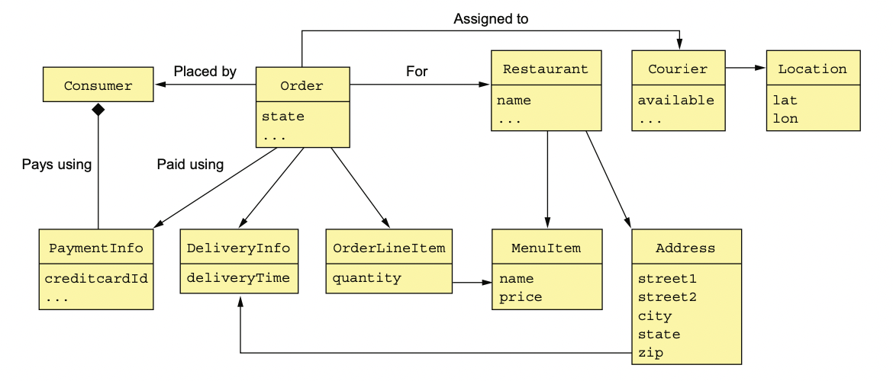
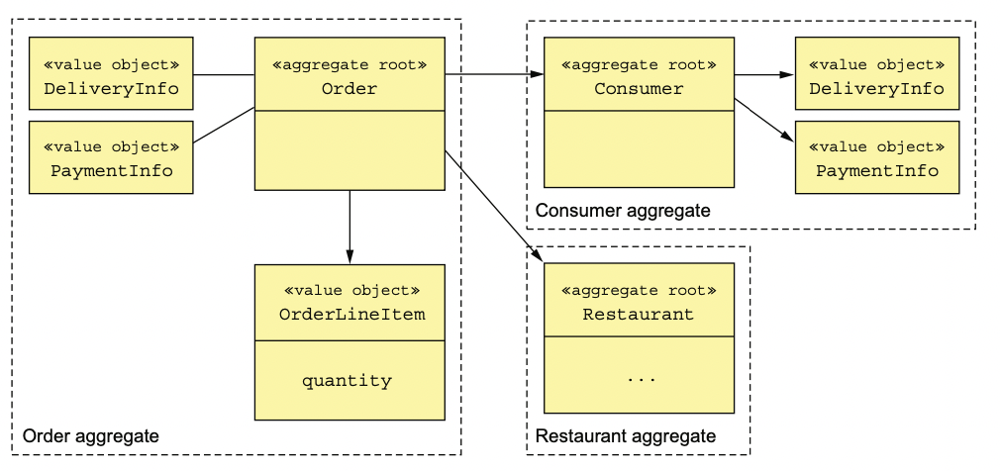
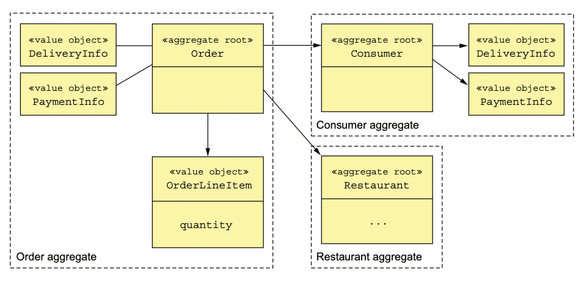
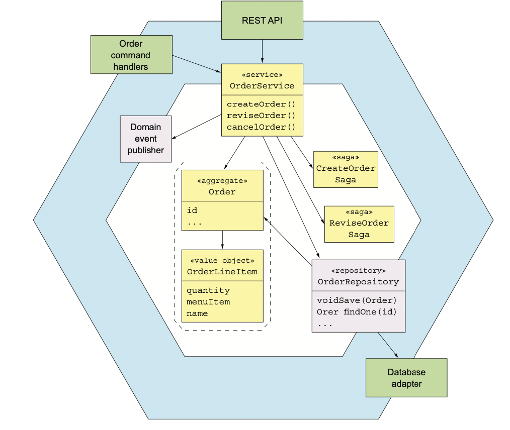

# 5.2.0 기존의 비지니스 모델

다음은 한 Application의 Domain Model 중 하나이다.

서로 연관된 클래스들끼리 그물망처럼 얽힌 전형적인 도메인 모델이다.

Customer, Order, Restaurant 등 각 비지니스 객체에 대응되는 클래스가 존재한다.

하지만 **비지니스 객체들의 경계가 불분명**하다.

예를 들어 Order이라는 비지니스 객체는 어느 클래스에 대응되는 비지니스 객체인지 알기 쉽지 않다.

이러한 불분명한 비지니스 객체는 MSA에서 문제가 생길 가능성이 높기 때문에 조심해야 한다.

# 5.2.1 불분명한 경계 문제

Order 객체가 어떤 작업을 한다고 가정했을 때, 범위가 불분명하다 라는 문제가 있다.

범위가 불분명하다면 여러가지 비지니스 규칙을 지키기 힘들어지게 된다.

예를 들어, *money가 10000을 넘길 수 없다*라는 규칙이 있는 상황에서 한 사용자의 money를 늘리는 요청이 동시에 들어왔다고 가정하자.

이렇게 된다면 money가 10000을 넘기게 되는 상황이 일어날수도 있다.

DDD Aggregate를 사용하면 이 문제를 해결할 수 있다.

# 5.2.2 Aggregate의 분명한 경계

Aggregate는 **한 경계 안에 명확히 들어있는 도메인 객체들**이다.

하나의 Root Entity와 여러개의 다른 엔티티 또는 VO로 구성될 수 있다.

비지니스 객체는 대부분 Aggregate로 모델링하게 된다.

 

위 그림과 같이 2장에서 대략적으로 설계한 도메인 모델에서 주문, 소비자, 음식점이 각각 Aggregate라고 할 수 있다.

Order를 예로 들면 Order Aggregate는 여러개의 VO로 이루어져 있다.

OrderLineItem은 Entity라고도 볼 수 있다.

 

Aggregate는 **Domain을 이해하기 쉬운 덩어리 단위로 분해**한다.

또한 작업의 범위를 분명히 해서 조회, 수정, 삭제와 같은 작업의 범위를 분명히 한다.

## Aggregate의 일관된 경계

Aggregate는 **한 Aggregate 전체만을 수정**하기 때문에 **일관성 문제가 해결**된다.

Update를 할 때 작업은 **Aggregate Root Entity의 메소드를 반드시 거치기 때문에 불변성이 강제**할 수 있다.

# 5.2.3 Aggregate 규칙

## 1. Aggregate Root만 사용하라

외부 클래스는 Aggregate Root만 참조할 수 있도록 제한해서 Client는 **Aggregate Root의 메소드만 호출할 수 있어야 한다.**

만약 외부 클래스가 Aggregate Root가 아닌 다른 클래스들을 참조할 수 있다면, 변화를 탐지하기 힘들다.

 

예를 들어 어떤 Service가 Repository를 통해 DB에 접근하여 Aggregate를 수정한다고 가정하자.

여기서 Service 클래스가 OrderLineItem 엔티티의 Setter 메소드로 직접 수정하게 된다면, 객체의 변화를 탐지하기 힘들게 된다.

따라서 Order 엔티티에서 OrderLineItem을 간접적으로 수정하는 public 메소드를 만들고, 해당 메소드를 Service에서 호출하는편이 객체의 불변성을 지키는데 좋다.

## 2. Aggregate 간의 참조는 반드시 PK를 사용하라

Aggregate간의 참조는 **객체 대신 PK로 참조**해야 한다.

위와 같은 Aggregate 구조에서, Order엔티티에서 가져야 하는 FK값들은 다음과 같다.

위에서 볼 수 있다싶이 **항상 FK 값 그대로를 가지게 된다.**

즉 기존의 JPA에서 했듯이 연관 관계 매핑을 사용하지 않고 FK 그대로를 사용하라는 의미이다.

 

원래 FK를 알아서 받는건 별로 좋지 않은 설계라고 여겨왔다.

하지만 직접 객체를 가지는것보다 FK를 가지는 편이 **결합을 느슨하게 유지**해주고, **Aggregate간 경계를 분명히**해준다.

예를 들어 Order 엔티티를 수정하던 도중 실수로 Restaurant를 수정하는 등의 실수를 하지 않도록 막아준다.

 

또한 DB 샤딩, 저장 로직도 간단해 진다.

## 3. 하나의 트랜잭션에서 하나의 Aggregate를 생성/수정하라

하나의 트랜잭션에서는 오직 하나의 Aggregate만 생성 혹은 수정할 수 있어야 한다.

트랜잭션을 하나의 Aggregate를 수정하는 것은 다소 복잡할수도 있겠지만, **하나의 트랜잭션을 하나의 서비스에 정확히 담을 수 있다**는 점에서 MSA의 아키텍쳐와 잘 들어맞는다.

여러 Aggregate를 수정하는 일은 Saga를 통해서 해결할 수 있다.

위 그림은 3개의 트랜잭션으로 이루어진 Saga이다.

ServiceA에서 AggregateX를 수정하고, ServiceB에서 Aggregate Y와 Z를 수정하는 Saga이다.

이렇게 **여러 Aggregate를 수정할 일이 있다면, 각각의 Local Transaction을 사용하고 Saga를 이용해서 엮어줌으로써 일관성을 유지**할 수 있다.

 

한 Service에서 여러 Aggregate를 수정하는 또 다른 방법은 **여러 Aggregate를 하나의 Transaction에서 처리**하는 것이다.

하나의 트랜잭션에서 Aggregate Y와 Z를 동시에 수정한다는 의미인데, 트랜잭션 처리를 잘 지원하는 RDBMS에서나 가능한 일 이다.

# 5.2.4 Aggregate granularty

Domain Model에서 Aggregate를 크기를 결정하는 일은 매우 중요하다.

Aggregate를 작게 잡았을 때 장점은 다음과 같다.

- 각 Update들이 순차적으로 동작할 수 있기 때문에 **작을수록 확장성이 좋다.**
- 한번에 처리할 수 있는 요청의 양을 늘릴 수 있다.
- Aggregate끼리 충돌할 가능성을 낮출 수 있다.

하지만 Aggregate 그 자체가 하나의 트랜잭션 범위이기 때문에 크게 설계해야 할수도 있다.

 

위와 같이 Consumer Aggregate 안에 Order Aggregate를 포함시키게 되면, **Customer와 Order을 원자적으로 수정**할 수 있다.

물론 확장성이 떨어지고 Aggregate끼리의 충돌 가능성이 있다는 단점이 있다.

# 5.2.5 Aggregate를 활용한 비지니스 로직 설계

MSA는 대부분 Aggregate로 비지니스 로직을 설계하고, 나머지는 Domain Service와 Saga에 있다.

다음과 같은 요소들로 구성된다.

- **Aggregate:** Domain 객체들을 경계 단위로 묶어놓은 단위이다.
- **Saga:** ACID를 처리하여 데이터 일관성을 유지한다.
- **Repository:** DB에 접근해서 Aggregate를 조회/삭제 해주는 Outbound Adapter이다.
- **Service:** 실제 비지니스 로직을 담고있는 클래스이다.
- **Domain Event Publisher:** 도메인의에서 발생한 사건을 다른 서비스들에게 이벤트로 전달해주는 Publisher이다.

