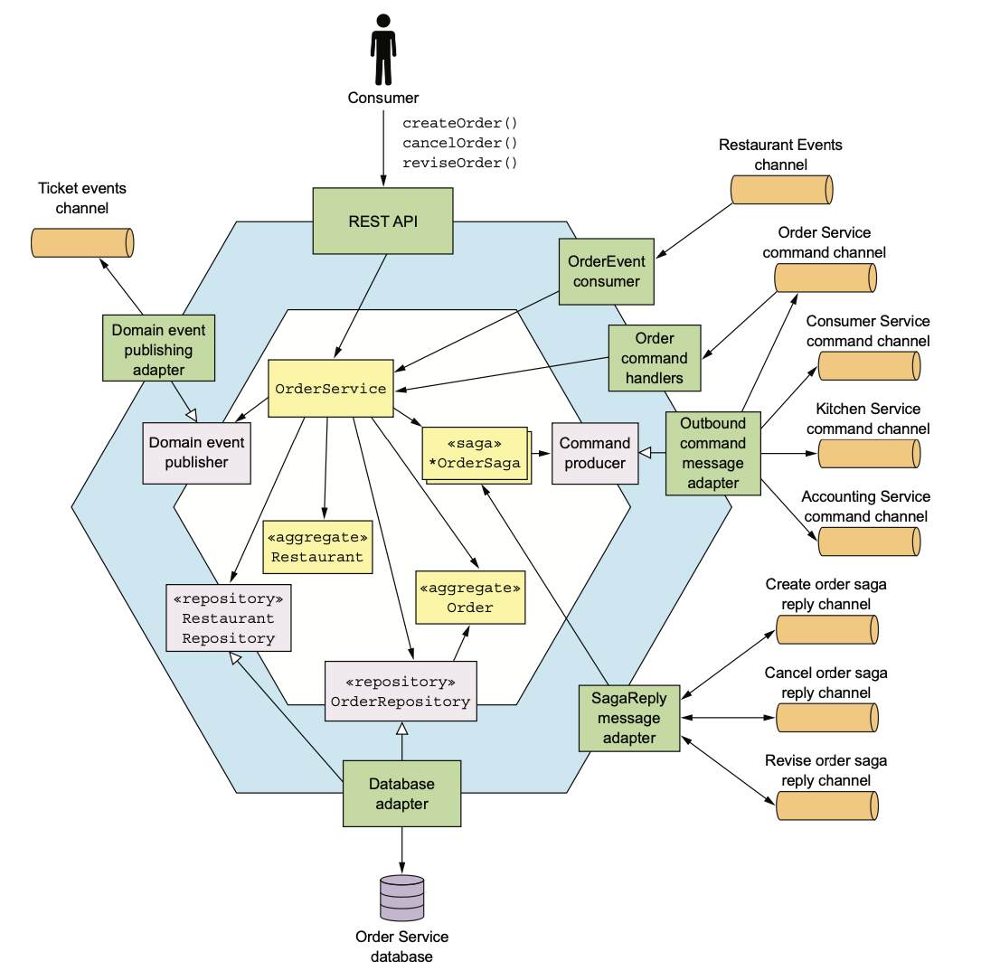
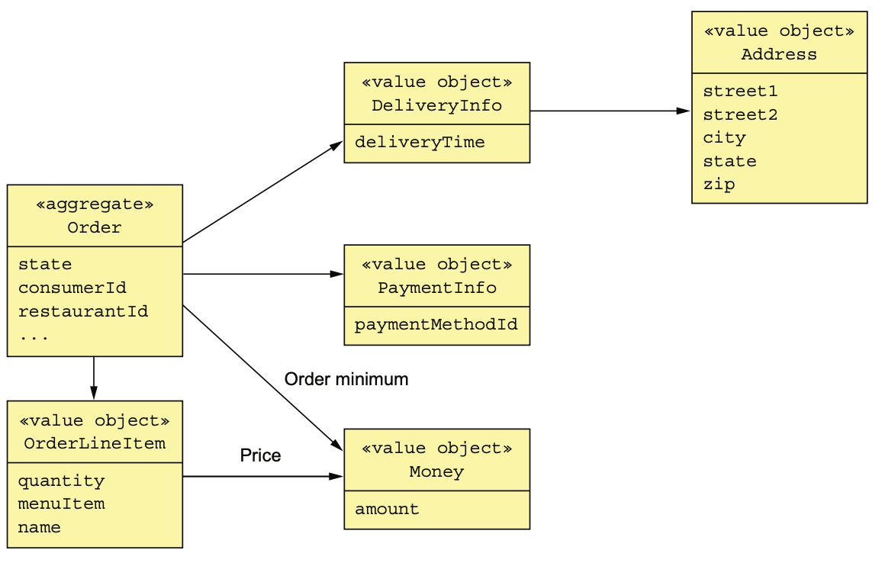
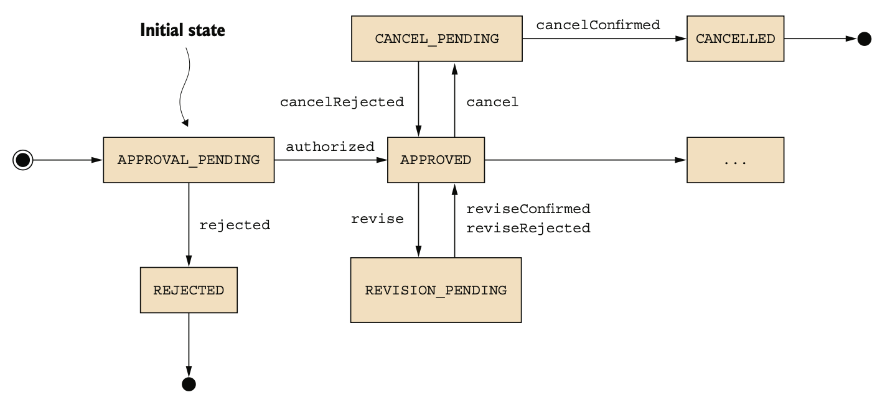

# 5.5.0 서론

주문 서비스는 주방 서비스와는 다르게 주로 Consumer에 의해 호출되는 서비스이다.

Order Aggregate를 중심으로 음식점 서비스를 부분적으로 복제해온 Restaurant라는 **Replica Aggregate**도 있다.

따라서 주문 서비스에서 주문 품목을 검증하고 단가를 책정할 수 있다.

<br>

전반적인 구조는 다음과 같다.



- **RestAPI:** Consumer의 UI에서 호출되는 RestAPI
- **OrderEventHandlers:** 음식점 서비스에서 발행한 이벤트를 구독하는 Inbound Adapter
- **OrderCommandHandler:** Saga가 호출하는 비동기 Request/Response 기반의 Inbound Adapter
- **SagaReplyAdapter:** Saga 응답 채널을 구독하고 Saga를 호출해 주는 Inbound Adapter

<br>

- **DB Adapter:** Repository로, DB에 접근하는 Outbound Adapter
- **DomainEventPublishingAdapter:** DomainEventPublisher의 구현체로, Order 도메인 이벤트를 발행해주는 Outbound Adapter
- **OutboundCommandMessageAdapter:** CommandPublisher의 구현체로, Command Message를 Saga 참여자들에게 보내주는 Outbound Adapter

# 5.5.1 Order Aggregate

Order Aggregate는 소비자가 한 주문을 나타낸다.

## Order Aggregate의 구조

다음 그림은 Order에 대한 클래스 다이어그램으로, OrderLineItem, DeliveryInfo등 여러 VO들을 포함하고 있다.



Order는 여러 OrderLineItem을 가진다.

Consumer과 Restaurant는 다른 Aggregate에 속하기 때문에 FK를 그냥 가진다.

고객이 필요로 하는 배달 주소 / 시간이 기록된 DeliveryInfo와 결제 정보가 담긴 PaymentInfo가 있다.

``` kotlin
@Entity
@Table(name="orders")
@Access(AccessType.FIELD)
public class Order {
    
    @Id
	@GeneratedValue
	private Long id;
  
    @Version
    private Long version;

    private OrderState state;

    private Long consumerId;

    private Long restaurantId;

    @Embedded
    private OrderLineItems orderLineItems;
    
    @Embedded
    private DeliveryInformation deliveryInformation;
    
    @Embedded
    private PaymentInformation paymentInformation;
    
    @Embedded
    private Money orderMinimum;
```

이 클래스는 id를 PK로 하여 orders 테이블에 매핑된다.

version 컬럼은 낙관적 Lock에 사용되며, Order의 State는 OrderState라는 Enum으로 관리된다.

다른 VO들에는 `@Embedded`라는 컬럼을 붙여 관리한다.

Order Aggregate에는 필드 뿐만 아니라 비지니스 로직도 구현되어 있다.

## Order Aggregate의 상태 기계

주문을 생성 / 수정하기 위해서 OrderService는 반드시 다른 서비스들과 통신해야 한다.

OrderService나 Saga의 첫 번째 단계는 Order의 메소드를 호출해서 가능한지 확인한 후 APPROVAL_PENDING 상태로 변경한다.

중간에 PENDING 상태를 두는 이유는 시멘틱 락을 적용하기 위함이다.

Saga가 참여자 서비스를 호출하기만 하면 결국 State는 변경되어 반영된다.



`revise()`나 `cancel()`와 같은 OrderService의 연산자들도 일단 PENDING상태로 바꾼 후 Saga를 통해 해당 작업을 수행할 수 있는지 확인한다.

문제가 없다면 state는 성공쪽으로 전이되지만, 아니라면 이전 상태로 되돌려 놓는다.

예를 들어 `cancel()`은 주문 상태를 일단 CANCEL_PENDING 상태로 바꾼 후 취소할 수 있다면 CANCELLED 상태로 변경하지만 아니라면 다시 APPROVED 상태로 되돌려 놓는다.

## Order Aggregate Method

Order 클래스는 Saga에 대응되는 여러 메소드 그룹이 있다.

각 메소드 그룹들은 Saga가 시작될 때 한 메소드가 호출되고 끝날 때 다른 메소드가 호출된다.

다음은 주문 생성에서 호출되는 메소드들이다.

``` java
public class Order {
    public static ResultWithDomainEvents<Order, OrderDomainEvent>
    
    createOrder(long consumerId, Restaurant restaurant,
                List<OrderLineItem> orderLineItems) {
        
        Order order = new Order(consumerId, restaurant.getId(), orderLineItems);
        List<OrderDomainEvent> events = singletonList(
            new OrderCreatedEvent(
                new OrderDetails(consumerId, restaurant.getId(), orderLineItems,
                                 order.getOrderTotal()),
                restaurant.getName()));
        return new ResultWithDomainEvents<>(order, events);
    }
    
    public Order(OrderDetails orderDetails) {
        this.orderLineItems = new OrderLineItems(orderDetails.getLineItems());
        this.orderMinimum = orderDetails.getOrderMinimum();
        this.state = APPROVAL_PENDING;
    }
    
    public List<DomainEvent> noteApproved() {
        switch (state) {
            case APPROVAL_PENDING:
                this.state = APPROVED;
                return singletonList(new OrderAuthorized());    
            ...
			default:
                throw new UnsupportedStateTransitionException(state);
        }
    }
    
    public List<DomainEvent> noteRejected() {
        switch (state) {
            case APPROVAL_PENDING:
                this.state = REJECTED;
                return singletonList(new OrderRejected());
			...
			default:
                throw new UnsupportedStateTransitionException(state);
        }
    }
    ...
```

`createOrder()`는 주문을 생성하고 OrderCreateEvent를 발행해 주는 정적 Factory 메소드다.

OrderCreateEvent는 주문 품목, 총액, 음식점 ID 등 주문 내역에 대한 정보들이 포함된 이벤트이다.

<br>

Order는 처음에 APPROVAL_PENDING상태로 생성된다.

CreateOrderSaga가 완료됐을 때 소비자의 신용카드 승인까지 성공했다면 `noteApproved()`, 서비스 중 하나라도 실패하면 `noteRejected()`가 호출된다.

이렇게 Order Aggregate의 상태에 따라서 동작이 결정된다.

Ticket처럼 이벤트를 만들기도 한다.

<br>

`createOrder()` 메소드 외에도 많은 update 메소드들이 있다.

예를 들어 주문 변경 Saga에서는 먼저 `revise()`를 호출하여 주문 변경이 가능한 상태일 경우에만 `confirmRevised()`를 호출하게 된다.

``` java
class Order {
    public List<OrderDomainEvent> revise(OrderRevision orderRevision) {
        switch (state) {
            case APPROVED:
            	LineItemQuantityChange change =
            		orderLineItems.lineItemQuantityChange(orderRevision);
                if (change.newOrderTotal.isGreaterThanOrEqual(orderMinimum)) {
                    throw new OrderMinimumNotMetException();
                }
                
                this.state = REVISION_PENDING;
                
                return singletonList(
                    new OrderRevisionProposed(
                        orderRevision,
                        change.currentOrderTotal, change.newOrderTotal
                    )
                );
            
            default:
                throw new UnsupportedStateTransitionException(state);
        }
    }

    public List<OrderDomainEvent> confirmRevision(OrderRevision orderRevision) {
        switch (state) {
            case REVISION_PENDING:
                LineItemQuantityChange licd =
                    orderLineItems.lineItemQuantityChange(orderRevision);
                
                orderRevision
                    .getDeliveryInformation()
                    .ifPresent(newDi -> this.deliveryInformation = newDi);
                
                if (!orderRevision.getRevisedLineItemQuantities().isEmpty()) {
                    orderLineItems.updateLineItems(orderRevision);
                }
                
                this.state = APPROVED;
                
                return singletonList(
                    new OrderRevised(
                        orderRevision,
                        licd.currentOrderTotal,
                        licd.newOrderTotal
                    )
                );
            default:
                throw new UnsupportedStateTransitionException(state);
        }
    }
}
```

`reviese()`메소드는 변경된 주문량이 최소 주문량 이상인지 확인하고 괜찮으면 주문 상태를 REVISION_PENDING으로 바꿔준다.

주방 서비스, 회계 서비스 업데이트가 성공하면 주문 변경 Saga는 `confirmRevision()`을 호출해서 주문 변경을 마무리한다.

# 5.5.2 OrderService 클래스

OrderService 클래스는 비지니스 로직의 진입점이다.

주문을 생성 / 수정하는 메소드가 모두 이 클래스에 있으며, 이 클래스를 호출하는 Inbound Adapter는 RestAPI나 RabbitMQ 등 다양하게 있을 수 있다.

이 클래스의 메소드들은 대부분 Saga를 만들어 Order Aggregate를 생성 / 수정을 Orchestration하기 때문에 아까 전의 KitchenService보다 복잡하다.

OrderService는 OrderRepository, OrderDomainEventPublisher, SagaManager등을 주입받아 사용한다.

또 `createOrder()`, `reviseOrder()`등의 메소드가 있다.

``` java
@RequiredArgsConstructor
@Transactional
public class OrderService {
    
    private final OrderRepository orderRepository;
    private final SagaManager<CreateOrderSagaState, CreateOrderSagaState> createOrderSagaManager;
    private final SagaManager<ReviseOrderSagaState, ReviseOrderSagaData> reviseOrderSagaManagement;
    private final OrderDomainEventPublisher orderAggregateEventPublisher;
    
    public Order createOrder(OrderDetails orderDetails) {
        Restaurant restaurant = restaurantRepository.findById(restaurantId)
        	.orElseThrow(() -> new RestaurantNotFoundException(restaurantId));
        
        List<OrderLineItem> orderLineItems =
        	makeOrderLineItems(lineItems, restaurant); // Order Aggregate를 생성한다.
        
        ResultWithDomainEvents<Order, OrderDomainEvent> orderAndEvents =
            Order.createOrder(consumerId, restaurant, orderLineItems);
        
        Order order = orderAndEvents.result;
        
        orderRepository.save(order); // Order를 persist한다.
        
        orderAggregateEventPublisher.publish(order, orderAndEvents.events); // Domain Event를 발행한다.
        
        OrderDetails orderDetails =
            new OrderDetails(consumerId, restaurantId, orderLineItems,
                    order.getOrderTotal());
        
        CreateOrderSagaState data = new CreateOrderSagaState(order.getId(), orderDetails);
        
        createOrderSagaManager.create(data, Order.class, order.getId()); // Order Saga를 생성한다.
        
        return order;
    }
    public Order reviseOrder(long orderId, OrderRevision orderRevision) {
        Order order = orderRepository.findById(orderId)
            .orElseThrow(() -> new OrderNotFoundException(orderId));

        ReviseOrderSagaData sagaData =
            new ReviseOrderSagaData(order.getConsumerId(), orderId,
                                    null, orderRevision);
        new ReviseOrderSagaData(order.getConsumerId(), orderId, null, orderRevision);
        return order;
    }
}
```

`createOrder()`는 Order Aggregate를 생성 / 저장한 후에 Aggregate가 Domain Event를 발행해 주고, 마지막에 CreateOrderSaga를 생성한다.

반대로 `reviseOrder()`는 Order를 조회하고 ReviseOrderSaga를 생성한다.

<br>

이렇게 보면 MSA와 Monolithic Application와 아예 다른건 아니다.

원래 하던대로 JPA 기반 엔티티, 서비스, Repository 등의 클래스로 구성된다.

물론 다양한 제약조건이 있는 DDD Aggregate로 도메인 모델을 구성하고, 서로 다른 Aggregate끼리는 FK를 그냥 가진다는 차이점이 있긴하다.

또한 하나의 트랜잭션에서는 하나의 Aggregate만을 수정할 수 있으므로 Aggregate가 상태 변경 되었다는 Domain Event를 발행할 때 좋다.

또한 Saga를 통해 여러 서비스에 걸쳐 데이터 일관성을 유지한다.

주방 서비스는 Saga의 참여자일 뿐이라서 Saga를 시작하지는 않지만 주문 서비스는 주문을 생성 / 수정할 때 Saga에 전적으로 의존한다.

OrderService의 메소드들은 대부분 Order를 직접 건드리는게 아니라 Saga를 만든다.

