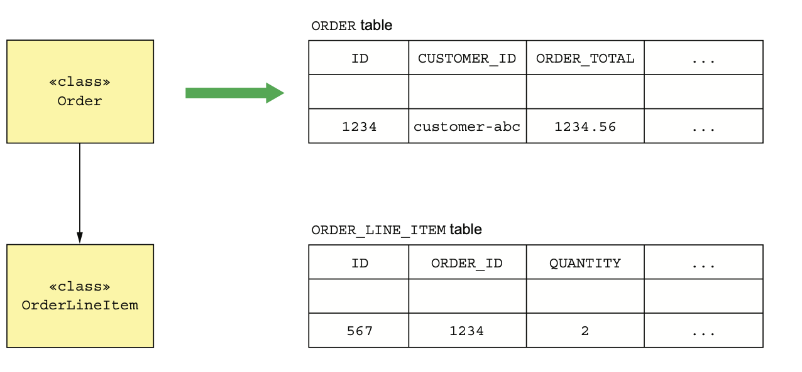
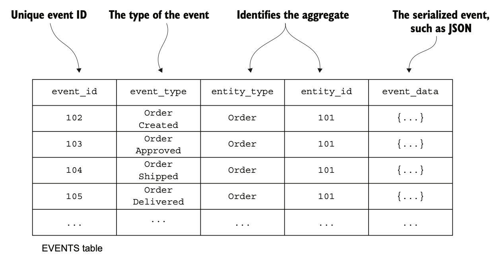
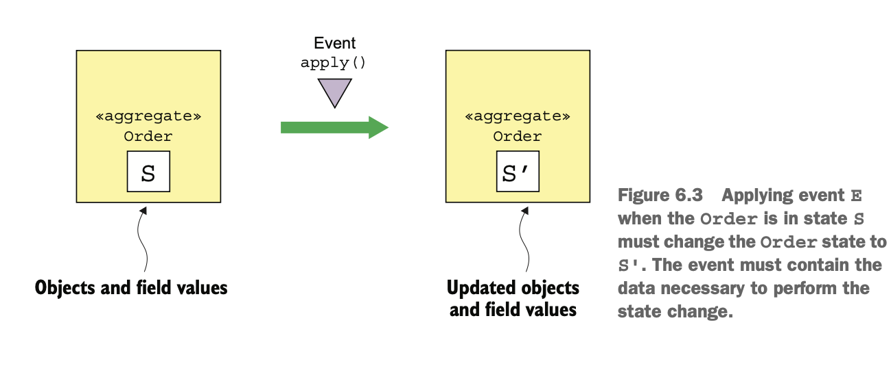
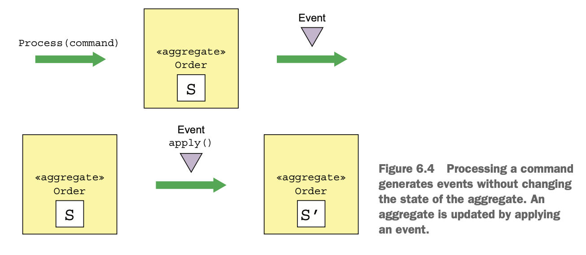
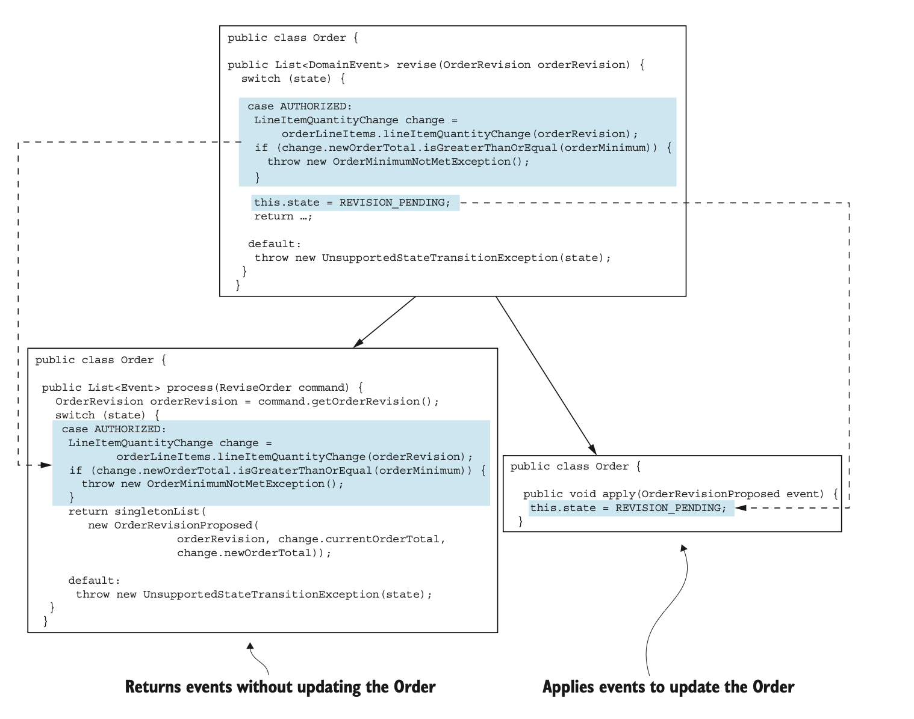
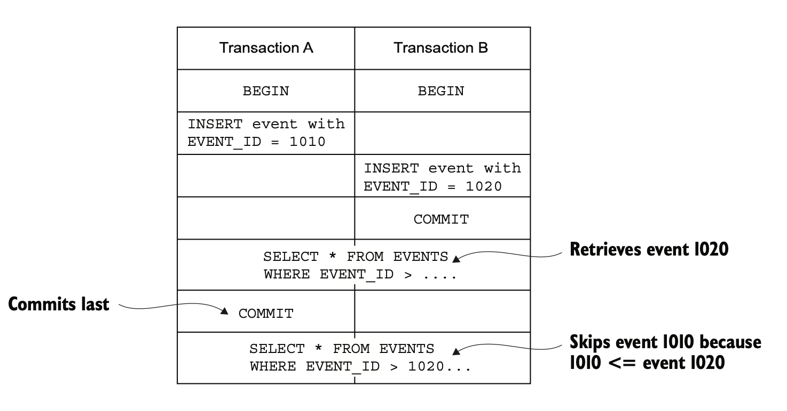
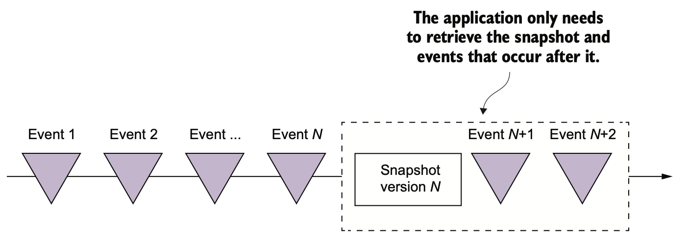
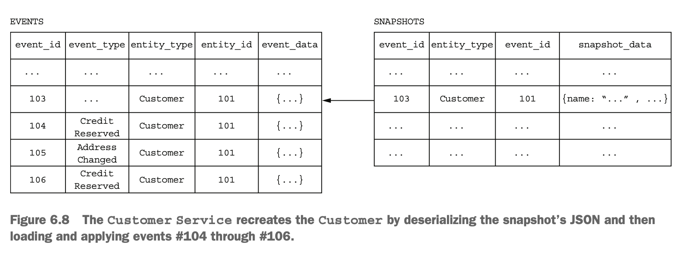

# 6.1.0 서론

Event Sourcing은 비지니스 로직을 구성하고 Aggregate를 저장하는 방법 중 하나로, Aggregate를 일련의 이벤트 형태로 저장해 둔다.

이벤트는 각 Aggregate의 상태 변화를 나타내고, Application은 Event를 replay해서 Aggregate의 현재 상태를 다시 만들 수 있다.

Aggregate의 기록이 저장되는 것이기 때문에 관리에도 이점이 많고, 도메인 이벤트의 발행을 보장해 주기 때문에 MSA에서 특히 유용하다.

하지만 특이하기 때문에 학습 시간이 필요하고 이벤트 저장소에 쿼리하기 쉽지 않기 때문에 CQRS를 적용해야 한다.

# 6.1.1 기존 영속화의 문제

엔티티 클래스는 DB에, 각 인스턴스가 테이블의 Row에 매핑되는게 기존 ORM의 영속화 방식이다.

다음 그림은 Order Aggregate를 테이블에 매핑한 그림으로, 하위 클래스는 따로 테이블에 매핑된다.



Application은 Order 인스턴스를 order 테이블과 order_line_item 테이블의 Row로 영속화 한다.

JPA와 같은 ORM을 사용할 수도 있고, MyBATIS와 같은 로우 레벨 프레임워크를 사용할 수도 있다.

하지만 이런 방식에는 문제가 있다.

## OBJECT-RELATIONAL IMPEDANCE MISMATCH

일명 `OBJECT-RELATIONAL IMPEDANCE MISMATCH`는 오래된 문제로, 관계형 스키마와 Rich Domain Model은 다를 수 밖에 없다.

> Rich Domain Model은 **비지니스 로직을 도메인 모델에 넣는 방식**으로, 반대로 VO로만 사용하는 Anemic Data Model이 있다.

Hibernate를 통해 Application을 개발해 봤다면 *해결했다*라고 생각할 수 있겠지만, 이건 ORM에 그치는 문제보단 광범위한 문제다.

## Aggregate에 대한 기록이 없다.

기존에는 Aggregate의 상태만 기록한다.

따라서 Aggregate가 수정되면 이전 상태는 더이상 볼 수 없다.

따라서 Aggregate를 기록하려면 별도의 코드가 필요하게 되고, 이는 생산성 저하와 관리포인트 증가로 다가온다.

## 변경 로깅을 구현하기 힘들고 오류가 발생하기 쉽다.

많은 Application들에서 어떤 사용자가 어떤 Aggregate를 수정했는지에 대한 로깅을 남기게 된다.

로깅은 보안이나 조정을 위해서도 필요하지만, 그냥 사용자의 동작을 로깅한 것 그 자체가 중요한 경우도 많다.

Asana 또는 Jira와 같은 Issue Tracker나 Task Management Tool은 변경 이력을 Task / Issue로 표시해 준다.

시간도 시간이지만 비지니스 로직과 로깅이 나눠져 오류가 발생할 수 있다.

## Event 발행 로직이 비지니스 로직에 들어간다.

기존의 방식에서는 Domain Event 발행을 지원하지 않는다.

MSA에서는 데이터를 동기화 하거나 동작에 대한 정보를 전송할 때 유용하게 사용된다.

하지만 ORM은 데이터가 변경될 때 Application이 설정해둔 Callback을 실행시켜 줄 수는 있지만 당연히 Transaction 안에서 데이터를 수정했다는 메세지를 발행해 주지는 않는다.

역시 개발자가 이벤트 생성 로직을 추가해야 하는데, 자칫 잘못하면 비지니스 로직과 제대로 동기화되지 않거나 실수하기도 쉽다.

# 6.1.2 Event Sourcing

Event Sourcing은 이벤트 위주로 비지니스 로직을 구현하고, Aggregate를 DB에 이벤트로 저장하는 방법이다.

각 이벤트는 Aggregate의 상태 변화를 의미하며 Aggregate의 비지니스 로직은 이벤트를 생산 / 소비 중심으로 구성된다.

## 이벤트를 이용하여 Aggregate 저장하기

기존의 영속화는 Aggregate를 테이블, 필드를 컬럼, 인스턴스를 로우에 매핑했다.

하지만 Event Sourcing은 이벤트에 기반한 완전히 새로운 방식으로, DB의 Event 테이블에 이벤트로 저장된다.

<br>

예를 들어, Order Aggregate를 Event Sourcing으로 저장하면 Order Aggregate를 events 테이블에 여러 Row로 저장하게 된다.



Aggregate를 생성 / 수정 했을 때 Application은 Event를 events 테이블에 저장한다.

그리고 Aggregate를 다시 가져올 때 이벤트를 가져와서 객체를 수정한다.

1. Aggregate의 이벤트를 조회한다.
2. 기본 생성자를 호출하여 Aggregate Instance를 생성한다.
3. 이벤트를 순회하며 `apply()`를 호출한다.

Eventuate Client에도 다음과 같이 Aggregate를 복구하는 코드가 있다.

``` kotlin
Class aggregateClass = ...;
Aggregate aggregate = aggregateClass.newInstance();

for (Event event : events) {
    aggregate = aggregate.applyEvent(event);
}
// use aggregate...
```

함수형 프로그래밍에서 `fold()`나 `reduce()`와 비슷하다.

이런게 익숙치 않겠지만 사실 JPA나 Hibernate도 이런 비슷한 방법으로 엔티티를 로드한다.

기본 생성자로 조회를 하고, Reflection으로 필드에 값을 주입해 준다.

## Event는 상태 변화를 의미한다.

Domain Event는 **Aggregate의 변경을 Subscriber에게 알리는 장치**로, AggregateId와 같은 필수 데이터만 넣거나 Consumer에게 필요한 정보까지 넣어줄 수 있다.

예를 들어 주문 생성 API에서는 orderId만 줄 수도 있고, 주문 정보를 통째로 전달해 줄 수도 있다.

기존에는 Consumer가 필요한 대로 Event를 전달해 줬다면 이벤트 소싱에서는 Aggregate에 의해 Event나 구조가 결정된다.

<br>

이벤트 소싱에서 이벤트는 필수다.

Aggregate에서 발생한 모든 상태변화는 Domain Event로 발생하게 된다.

Order Aggregate가 주문을 생성했다면 OrderCreatedEvent를, 그 후로는 OrderXXXEvent를 발행하게 된다.

원래는 Consumer가 필요할만한 Event만 발생시켰던 것과는 다른 셈이다.

<br>

또한 Event는 상태 전이를 위한 데이터를 보내주어야 한다.

Aggregate의 상태는 객체들의 필드 값으로 구성된다.

`Order.state`처럼 객체의 필드 값만 바꾸는가 하면 주문 품목 변경처럼 객체의 추가 / 삭제 작업도 포함되는 상태변화도 있다.

<br>

다음 그림을 보자.



객체의 현재 상태는 S, 새 상태는 S`라고 가정해 보자.

상태 변화를 알린 이벤트 E는 `order.apply(E)`를 통해 Order의 상태를 S`로 바꿀 수 있는 정보들이 들어있어야 한다.

<br>

OrderShippedEvent와 같은 이벤트는 데이터는 거의 없이 상태 전이만을 나타낸다.

이 이벤트에 대한 `apply()`는 Order의 상태를 SHIPPED상태로 변경할 뿐이다.

하지만 다른 이벤트들에는 데이터가 많이 들어있을 수 있는데, OrderCreatedEvent는 `apply()`가 Order 뿐만 아니라 OrderLineItem, PaymentInfo 등을 초기화하기 때문에 이를 위한 데이터는 모두 보내주어야 한다.

## Aggregate 메소드들의 관심사는 이벤트 뿐이다.

비지니스 로직은 update 요청을 받아 Aggregate Root에 있는 Command Method를 호출하여 처리한다.

기존의 Command 메소드가 매개변수를 검증하고, 하나 이상의 Aggregate 필드를 수정했지만 **Event Sourcing은 반드시 하나 이상의 이벤트를 발행**한다.

Aggregate의 커맨드 메소드의 결과는 상태 변경을 나타내는 이벤트들 이라고 할 수 있다.

이벤트는 DB에 저장되어 Aggregate에 적용되어 상태를 수정한다.



이벤트를 발생시켜서 적용하려면 비지니스 로직을 다시 구성해야 한다.

Event Sourcing 방법은 커맨드 메세지 하나를 둘 이상의 메소드로 리팩토링 해야한다.

첫 번째 메소드는 커맨드 객체를 매개변수로 받아 상태 변경을 결정하고, **상태를 바꾸지는 않고 상태 변경을 나타낸 이벤트 목록을 반환**한다.

또 다른 메소드는 각자 정해진 이벤트 타입을 매개변수로 받아 Aggregate를 수정한다.

Event마다 이러한 메소드가 하나씩 있어야 한다.

이벤트는 이미 발생한 변경 사항을 나타내기 때문에 실패할 수 없다.

Eventuate Client 라는 이벤트 소싱 프레임워크는 이런 메소드를 `process()`와 `apply()`라고 이름 지었다.

위에서 말한 첫 번째 메소드가 `process()`, 다른 메소드들이 `apply()`라고 할 수 있다.



여기서 볼 수 있다싶이 `revise()`는 `process()`와 `apply()`로 대체될 수 있다.

`process()`가 매개변수로 받은 ReviseOrder 커맨드 클래스는 `Introduce Parameter Object`패턴에 따라 리팩토링 한 것이다.

> Introduce Parameter Object 패턴은 요청의 파라미터를 객체로 묶는 것이다.

이 메소드는 별 문제 없다면 OrderRevisionProposed 이벤트를 반환하지만, 주문 변경 기간을 놓치는 등 문제가 있다면 예외를 던진다.

OrderRevisionProposed에 대응하는 `apply()`는 Order의 상태를 REVISION_PENDING 상태로 변경한다.

<br>

Aggregate는 다음 순서대로 생성된다.

1. 기본 생성자로 Aggregate Root를 생성한다.
2. `process()`를 호출하여 새 이벤트를 발행한다.
3. 새로운 이벤트들을 순회하며 `apply()`를 호출하여 Aggregate를 수정한다.
4. event 테이블에 새 이벤트들을 저장한다.

Aggregate는 다음 순서대로 update된다.

1. 이벤트 저장소에서 Aggregate 이벤트를 조회한다.
2. 기본 생성자로 Aggregate Root를 생성한다.
3. 가져온 이벤트들을 순회하며 `apply()`를 호출한다.
4. `process()`를 호출하여 새로운 이벤트를 발생시킨다.
5. 새로운 이벤트들을 호출하며 `apply()`를 호출하여 Aggregate를 수정한다.
6. event 테이블에 새 이벤트들을 저장한다.

## 이벤트 소싱 기반의 Order Aggregate

다음 코드는 Order Aggregate를 이벤트 소싱 방식으로 바꾼 것이다.

JPA 방식과 필드는 거의 같고 이벤트도 비슷하지만, 이벤트를 발생시키고 그 이벤트를 적용하여 상태를 수정하는 방식으로 비지니스 로직을 구현한다.

`createOrder()`, `revise()`처럼 JPA 기반의 Aggregate를 생성 / 수정하는 메소드가 이벤트 소싱 기반에서는 `process()`와 `apply()`로 대체된다.

``` java
public class Order {
    private OrderState state;
	private Long consumerId;
    private Long restaurantId;
    private OrderLineItems orderLineItems;
    private DeliveryInformation deliveryInformation;
    private PaymentInformation paymentInformation;
    private Money orderMinimum;
    
    public Order() {
    }
    
    public List<Event> process(CreateOrderCommand command) {
        ... command 검증 ...
        return events(new OrderCreatedEvent(command.getOrderDetails()));
    }
    
    public void apply(OrderCreatedEvent event) {
        OrderDetails orderDetails = event.getOrderDetails();
        this.orderLineItems = new OrderLineItems(orderDetails.getLineItems());
        this.orderMinimum = orderDetails.getOrderMinimum();
        this.state = APPROVAL_PENDING;
    }
    ...
```

필드 자체는 JPA와 비슷한데, Aggregate에 aggregateId를 보관하지 않도록 바꾼 것만 바뀌었다.

하지만 메소드는 `createOrder()` 대신 `process()`와 `apply()`가 그 위치를 대신한다.

`process()`는 CreateOrderCommand를 받아 OrderCreatedEvent를 발생시키고, `apply()`는 CreateEvent를 받아 Order의 필드들을 초기화 한다.

<br>

이번엔 좀 더 복잡한 주문 변경 메소드다.

`revise()`, `confirmRevision()`, `rejectRevision()` 세 메소드들이 `process()`와 `apply()`로 변경되었다.

``` java
public class Order {
    public List<Event> process(ReviseOrder command) {
        OrderRevision orderRevision = command.getOrderRevision();
        switch (state) {
            case APPROVED:
                LineItemQuantityChange change =
                    orderLineItems.lineItemQuantityChange(orderRevision);
                if (change.newOrderTotal.isGreaterThanOrEqual(orderMinimum)) {
                    throw new OrderMinimumNotMetException();
                }
                return singletonList(
                    new OrderRevisionProposed(
                        orderRevision,
                        change.currentOrderTotal,
                        change.newOrderTotal
                    )
                );
            
            default:
                throw new UnsupportedStateTransitionException(state);
        }
    }
    public void apply(OrderRevisionProposed event) {
        this.state = REVISION_PENDING;
    }
}
```

# 6.1.3 동시성 update: 낙관적 Lock

동일한 Aggregate를 동시에 수정하는 일은 많다.

기존에는 한 트랜잭션이 다른 트랜잭션의 변경을 덮어 쓰지 못하게 낙관적 Lock을 사용한다.

즉, Aggregate Root 테이블의 version 컬럼 값을 하나씩 늘려가며 증가시킨다.

``` sql
UPDATE AGGREGATE_ROOT_TABLE
SET VERSION = VERSION + 1 ...
WHERE VERSION = <원본 버전>
```

만약 수정 작업 도중 다른 트랜잭션이 해당 Aggregate를 수정해 버전이 바뀌게 되면 실패하게 된다.

<br>

event 테이블에서도 이걸 적용할 수 있다.

Event에 딸려온 버전 정보를 각 Aggregate Instance마다 두고, Application이 이벤트를 저장할 때 event 테이블에서 버전이 변경되었는지 확인하는 것이다.

> 자세한건 6.2절에서 설명한다.

# 6.1.4 Event Sourcing과 Event 발행

Event Sourcing은 여러 Event로 저장하면 이 이벤트를 가져와 Aggregate의 상태를 다시 구현한다.

Event Sourcing은 확실하게 Event 발행하기 위한 장치로 활용할 수도 있다.

Event Source에 Event를 저장하는 것은 원자적인 작업이다.

저장된 모든 Event를 Consumer에게 어떻게 전달할까?

3장에서 Polling, Transaction Log Tailing 등 여러가지 트랜잭션의 일부로 메세지를 발행하는 방법을 알아봤다.

이벤트 소싱 방법도 이 중 하나로 구현할 수 있지만, **event 테이블에 영구 저장된다**는 차이점이 있다.

## Event 발행: Polling

Event를 event 테이블에 저장한다고 했을 때, Event Publisher는 select문으로 새 이벤트를 계속해서 Polling하면서 Message Broker에 발행한다.

하지만 **어떤게 새로운 메세지인지 분간하기 힘들다.**

만약 EVENT_ID가 AUTO_INCREMENT처럼 1씩 늘어난다면 Event Publisher는 자기가 처리한 마지막 event_id를 기록하면 될 것 같다.

``` sql
SELECT * FROM EVENTS where event_id > ? ORDER BY event_id ASC
```

하지만 트랜잭션이 이벤트를 발행한 순서와 다르게 커밋될 수 있다는게 문제다.



1. Transaction A와 Transaction B가 시작된다.
2. Transaction A가 event 테이블에 id가 1010인 Event를 저장한다.
3. Transaction B가 event 테이블에 id가 1020인 Event를 저장한다.
4. Transaction B가 커밋된다.
5. event 테이블에서 조회했을 때 마지막이 1020으로 조회된다.
6. Transaction A가 커밋된다.
7. 그 다음 Event를 조회하기 위해 id가 1020 초과인 Event만 조회하게 되면 id가 1010인 Event는 무시된다.

<br>

이 문제를 해결하기 위해는 event 테이블에 발행 여부를 위한 컬럼을 추가하면 된다.

``` sql
SELECT * FROM EVENTS where PUBLISHED = 0 ORDER BY event_id ASC
```

## Event 발행: Transaction Log Tailing

3장에서 배웠지만 Transaction Log Tailing이 더 정교한 방법이다.

Event 발행을 보장하면서 성능이나 확장성도 좋다.

오픈소스 이벤트 저장소인 Eventuate Local도 이 방식을 통해 event 테이블에 저장된 DB 트랜잭션 로그를 읽어 MessageBroker에 발행한다.

# 6.1.5 Snapshot으로 성능 개선하기

Order Aggregate는 상태 전이가 잘 일어나지 않아 이벤트가 많지는 않다.

이런 경우에는 event 테이블에서 조회하는게 낫다.

하지만 account aggregate처럼 수명이 긴 Aggregate는 이벤트가 많아서 그냥 사용하기 힘들다.

<br>

그러므로 **주기적으로 Aggregate의 상태를 Snapshot에 저장**한다.



가장 최근에 뜬 snapshot 이후의 Event들만 가져오는 방법이다.

Snapshot 이전의 Event들은 가져올 필요가 없다.

Snapshot에서 Aggregate를 복원하려면 이벤트 두 개만 가져오면 된다.

<br>

Snapshot으로 Aggregate를 생성한 후에 event를 하나씩 적용하면 된다.

Eventuate Client에서도 다음과 같이 구현했다.

``` java
Class aggregateClass = ...;
Snapshot snapshot = ...;
Aggregate aggregate = recreateFromSnapshot(aggregateClass, snapshot);

for (Event event : events) {
  aggregate = aggregate.applyEvent(event);
}

// use aggregate...
```

만약 복잡한 Aggregate라면 메멘토 패턴으로 Snapshot을 만들 수도 있지만, 간단하면 그냥 Json으로 만들어도 된다.

> 메멘토 패턴이란 객체의 상태를 저장해뒀다 원하는 시점에 복원하는 디자인 패턴 중 하나이다.

다음 그림은 Customer Aggregate을 JSON으로 직렬화 하고, 그걸 토대로 다시 Aggregate를 생성한 것이다.



위 예제에서는 snapshot에서 조회한 후에 103번 이후에 발생한 Event들만 조회하면 된다.

# 6.1.6 메세지 처리의 멱등성

서비스는 대부분 다른 Application이나 서비스로부터 받은 메세지를 소비한다.

Aggregate가 발행한 Domain Event나 커맨드 메세지를 Consume하는데, Message Broker가 한 메세지를 여러번 전송할 수도 있기 때문에 Messager Consumer는 멱등하게 개발되어야 한다.

> 멱등하다 라는 말은 한 연산을 여러번 적용하더라도 문제가 없도록 보장해 주는 것이다.

Eventuate Tram Framework도 중복 메세지를 걸러서 처리해 준다.

또한 Aggregate를 생성 / 수정하는 Local Transaction의 일부로 메세지 ID를 processed_message 테이블에 저장한다.

이 테이블에 id가 이미 있다면 중복 메세지이기 때문에 걸러내면 된다.

구현 방법은 RDBMS인지, NoSQL인지에 따라 바뀔 수 있다.

## RDBMS

RDBMS 기반의 이벤트 저장소를 사용하면 그냥 메세지 ID는 processed_message테이블에, 이벤트는 event 테이블에 삽입하면 된다.

## NoSQL

NoSQL은 대부분 Transaction이 제한적이기 때문에 메세지를 멱등하게 처리하려면 다른 수단을 이용해야 한다.

> 만약 id가 중복되어 오류가 발생했지만 Transaction의 ACID가 제대로 보장되지 않아 그 후의 동작들은 반영이 되버릴 수도 있다.

Consumer는 이벤트를 저장하고 메세지 ID를 기록하는걸 어느정도 원자적으로 처리해야 한다.

매우 간단한 방법이 있는데, Message Consumer가 메세지를 처리하면서 생성된 메세지에 받은 메세지의 ID를 저장하는 것이다.

<br>

하지만 이 방법에도 문제는 있다.

**만약 이벤트를 발행하지 않는 서비스면 이상하게 동작한다.**

이벤트를 발행하지 않으면 메세지 처리 기록이 없다는 것이고, 그러면 이상하게 동작할 수밖에 없다.

1. 메세지 A가 처리되었지만, Aggregate가 수정되지 않는다.
2. 메세지 B가 처리되고 Consumer는 Aggregate를 수정한다.
3. 메세지 A가 처리된 기록이 없기 때문에 Consumer는 Aggregate를 수정한다.
4. 메세지 B가 다시 처리된다.

이런 상황을 예방하기 위해 메세지 ID만을 담은 가짜 이벤트를 발행하는 방법이 있다.

당연히 이런 메세지들은 Message Consumer단에서 무시해야 한다.

# 6.1.7 도메인 이벤트 발전시키기

Event Sourcing이 개념적으로는 Event를 영구 저장하지만, 이벤트 구조는 시간이 지나며 계속 달라질 수 있기 때문에 양날의 검 이라고 할 수 있다.

Application은 여러 버전의 이벤트를 처리해야 할수도 있다.

예를 들어, Order Aggregate를 읽는 서비스는 물론이고 Event Subscriber도 여러 버전의 Event를 처리할 가능성이 있다.

우선 어떻게 이벤트가 변경되는지 알아보고 가장 흔히 사용되는 처리 방법을 알아보자.

## 이벤트 스키마

이벤트 소싱에서 Application Scheme는 다음 세 가지로 구성된다.

- 하나 이상의 Aggregate
- 각 Aggregate에서 발행되는 이벤트 정의
- 이벤트 구조 정의

| 변경                       | 하위 호환성 |
| -------------------------- | ----------- |
| 새로운 Aggregate 타입 추가 | O           |
| 기존의 Aggregate 삭제      | X           |
| Aggregate Type의 이름 변경 | X           |
| 새 이벤트 타입 추가        | O           |
| 이벤트 타입 삭제           | X           |
| 이벤트 타입 이름 변경      | X           |
| 필드 추가                  | O           |
| 필드 삭제                  | X           |
| 필드명 변경                | X           |
| 필드 타입 변경             | X           |

위에서 볼 수 있는 변경들은 Domain Model이 발전하며 자연스럽게 일어나게 된다.

예를 들어 서비스 요구 조건이 바뀔 수도 있고, 개발자가 도메인을 발전시킬 수도 있다.

대부분 이런 변경은 하위호환성이 보장된다.

Event에 필드가 추가된다고 하더라도 Consumer는 크게 영향을 받지 않는다.

하지만, 하위 호환이 안되는 경우에는 Consumer까지 고쳐야 한다.

## Upcasting을 통한 Schema 변화 관리

SQL 세계에서 DB 스키마 변경은 보통 migration을 통해 처리한다.

즉, 변경된 새 스키마에 기존 데이터를 옮기는 SQL Script를 통해 옮기게 된다.

Schema Migration은 버전 관리 시스템에 저장한 후에, Flyway와 같은 Migration Tool을 통해 DB에 반영한다.

<br>

이벤트 소싱 Application은 하위 호환이 안 되는 변경을 비슷하게 처리할 수 있지만, Event를 새로운 Schema에 맞춰 수정하는게 아니라 **이벤트 소싱 프레임워크가 이벤트 저장소에서 이벤트를 조회할 때 바꿔준다.**

보통 Upcaster 라는 Component가 각각의 Event를 구 버전에서 신 버전으로 업데이트하기 때문에 Application코드는 현재 버전의 Schema에서만 잘 처리하면 된다.

# 6.1.8 Event Sourcing의 장점

## 도메인 이벤트의 발행을 보장해 준다.

Event Sourcing은 Aggregate가 변경될 때 이벤트의 발행을 보장해 주는데, 이건 MSA에서는 굉장히 큰 장점이 된다.

또한 변경을 한 사용자의 정보를 로그에 남기기 때문에 관리에도 많은 이점이 있다.

## Aggregate의 변경 이력 보존

다음으로 Aggregate에 대한 모든 기록을 보존한다는 장점이 있다.

특정 시점의 Aggregate를 조회하기도 쉽다.

예를 들어 어떤 고객이 특정 시점에 어떤 등급이었는지 알 수 있다.

## OBJECT-RELATIONAL IMPEDANCE MISMATCH를 거의 해결해 준다.

Event Sourcing은 Event를 취합하는 대신 저장한다.

서비스는 단지 과거 상태를 나열하기만 하면 Snapshot을 만들 수 있다.

따라서 Aggregate와 직렬화 한 표현형 사이를 간접화 할 수 있다.

## 개발자에게 타임머신을 제공한다.

Event Sourcing은 Application 가동 중 발생한 모든 일을 기록한다.

장바구니에 상품을 추가한 후 제거했다고 가정해 보자.

원래대로라면 이런 정보를 즉시 삭제해 버리기 때문에 삭제했다 라는 정보는 저장되지 않는다.

따라서 할 수 있는 행동이 제한되지만, Event Sourcing을 사용하면 과거에 했던 이력이 있는 사람들을 가져올 수 있다.

# 6.1.9 Event Sourcing의 단점

## 새로운 프로그래밍 모델을 배우기 위한 시간이 소모된다.

Event Sourcing은 굉장히 낯선 방법이기 때문에 러닝 커브가 있을 수 밖에 없다.

또, 기존의 Application에서 적용하려면 비지니스 로직을 수정해 주어야 한다.

## 메세징 기반은 복잡하다.

메세지 브로커가 적어도 1회 이상 전송을 보장하기 때문에, 멱등하지 않은 Event Handler는 중복 이벤트를 걸러줘야 한다.

Event Sourcing 프레임워크를 사용하면 이벤트마다 ID를 1씩 증가시켜서 넣어주고, 이벤트 핸들러 순번이 가장 높은 이벤트 ID를 검색해서 중복된 이벤트를 걸러낼 수 있다.

## Event를 발전시키기 어렵다.

Event Schema는 시간이 지나면서 발전되기 마련이다.

Event는 영구적으로 저장되기 때문에 Aggregate는 버전별로 이벤트를 처리해 주어야 하는데, 그러면 버전별로 처리하는 코드가 Aggregate에 도배될 수도 있다.

이 문제를 해결하는 가장 좋은 방법은 이벤트를 가져올 때 최신 버전으로 올려서 가져오는 것이다.

## 데이터 삭제가 어렵다.

Aggregate를 기록하는 것은 Event Sourcing의 주요 목적 중 하나다.

Event Sourcing할 때는 기존의 데이터를 Soft Delete하여 Aggregate를 삭제했다.

Aggregate가 삭제 이벤트를 발행하고 관심 있는 모든 Consumer에게 이걸 알리는 모든 곳에서 이 flag값을 검사해서 사용해야 한다.

<br>

Soft Delete는 여러 종류의 데이터에 적합하다.

하지만 유럽 연합 일반 정보 보호 규정에 의해 개인의 삭제 권리를 부여해 주어야 한다.

즉, 이메일 변경과 같은 작업을 했을 때, 개인정보를 잊어버려 줘야 한다.

Event Sourcing에서는 이메일 주소를 AccountCreatedEvent에 저장하거나 Aggregate의 기본키로 사용할 수 있으니 문제가 될 수 있다.

<br>

암호화를 이용하면 이 문제를 쉽게 해결할 수 있다.

사용자마다 암호 키를 발급해서 DB 테이블에 저장하고, Application은 사용자의 개인정보를 저장하기 전 이 키를 통해 암호화 해서 저장하면 된다.

만약 사용자가 삭제를 원하면 이 암호 키가 저장된 테이블에서 지우기만 하면 된다.

<br>

하지만 만약 소비자의 개인정보를 AggregateId로 선정했다면 어떻게 할까?

단순히 암호화만으로는 부족하기 때문에, 가명화 기법을 통해 개인정보 대신 UUID를 PK로 가지면 된다.

이를 통해 사용자 정보가 담긴 테이블에서 해당 record만 지우면 이메일 주소와 매핑될 일은 없다.

## Event Store에서 조회하는건 어렵다.

신용 한도가 소진된 사용자를 찾는다고 가정할 때, 신용 한도를 나타내는 컬럼이 따로 없기 때문에 쉽게 조회할 수 없다.

그래서 처음에 신용 한도를 설정하고, 그 후에 이벤트들을 조회해서 신용 한도를 계산해야 하는데 SELECT문이 굉장히 복잡하고 비효율적이게 된다.

심지어 대부분의 NoSQL은 PK로만 검색할 수 있기 때문에 CQRS로 쿼리를 구현해야 한다.

