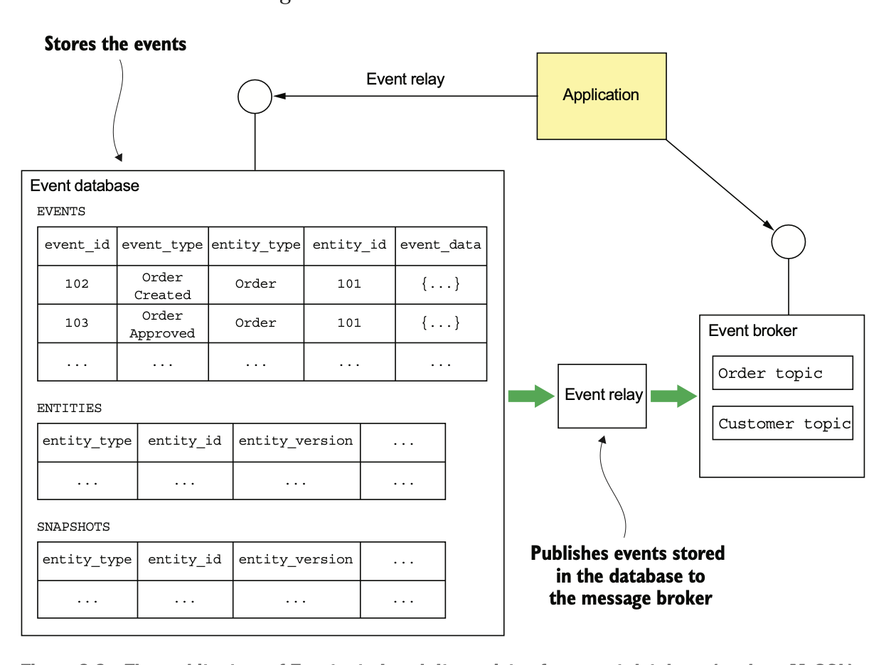
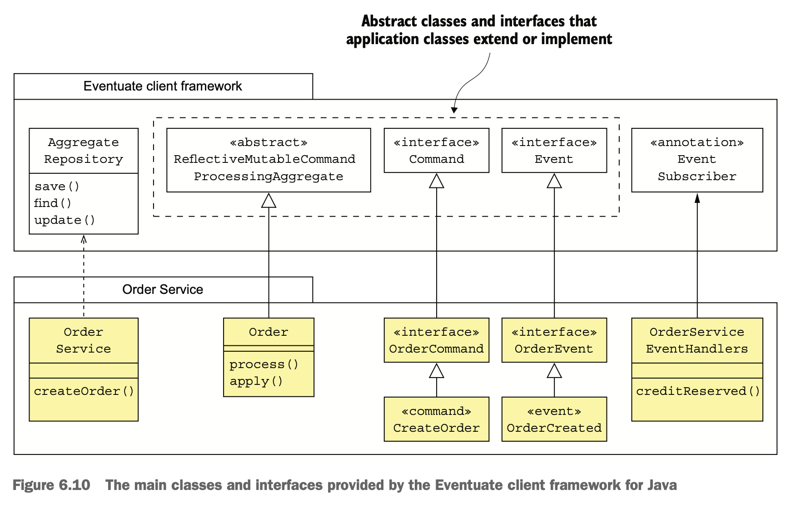

# 6.2.0 Foreground

이벤트 소싱은 이벤트 저장소에 이벤트를 저장한다.

이벤트 저장소란 DB와 메세지 브로커가 합쳐진 것을 의미한다.

Aggregate의 이벤트를 삽입 / 조회하는 API가 있어 마치 DB처럼 움직이고, 이벤트를 구독할 수도 있어서 Message Broker처럼 움직이기도 한다.

<br>

이벤트 저장소를 구현하는 데에는 몇 가지 방법이 있다.

먼저 이벤트 소싱 저장소와 프레임워크를 직접 구현하는 방법으로, RDBMS에 그냥 저장하는 방법이다.

성능은 떨어지겠지만 Subscriber가 event 테이블에서 직접 event들을 polling하는 것이다.

하지만 전에 말 했듯이, 모든 이벤트를 순서대로 처리해 주는 것 또한 고려해야 한다.

<br>

또 다른 방법은 성능이나 확장성이 뛰어나고 여러 기능들을 지원하는 특수한 제품을 사용하는 방법이다.

- **Event Store:** 닷넷 기반의 오픈소스 저장소로, Greck Young이 개발했다.
- **Lagom:** LightBand에서 개발한 프레임워크이다.
- **Axon:** 이벤트 소싱 및 CQRS를 이용한 이벤트 주도 Application을 위한 오픈 소스 자바 프레임워크이다.
- **Eventuate:** 이 책의 저자가 개발한 서비스로, Cloud Service나 Kafka/RDBMS 기반의 버전 두 가지가 있다.

프레임워크마다 구현은 조금 다를지라도 근본 개념은 같다.

이 책은 역시나 Eventuate 프레임워크를 사용한다.

# 6.2.1 Eventuate Local 이벤트 저장소 원리

Eventuate Local은 오픈 소스 이벤트 저장소로, 아키텍쳐는 다음과 같다.



이벤트는 MySQL 등 DB에 저장되고, Application은 Aggregate 이벤트를 조회 / 삽입하며 Apache Kafka 등의 메세지 브로커에서 이벤트를 가져와 소비한다.

Transactional Log Tailing 장치는 DB에서 계속해서 메세지를 Message Broker로 이동시킨다.

## Eventuate Local의 DB Schema

Event DB는 세 테이블로 구성된다.

- **events:** 이벤트가 저장된다.
- **entities:** 엔티티당 row 하나가 저장된다.
- **snapshots:** 스냅샷이 저장된다.

### events 테이블

가장 핵심이 되는 테이블로, DDL은 다음과 같다.

``` sql
create table events (
    event_id varchar(1000) PRIMARY KEY,
    event_type varchar(1000),
    event_data varchar(1000) NOT NULL,
    entity_type VARCHAR(1000) NOT NULL,
    entity_id VARCHAR(1000) NOT NULL,
    triggering_event VARCHAR(1000)
);
```

triggering_event 컬럼은 중복 이벤트나 메세지를 찾기 위한 컬럼으로, **이벤트를 생성한 메세지나 이벤트의 ID가 저장된다.**

### entities 테이블

엔티티별 현재 버젼을 저장하는 entities 테이블이다.

낙관적 lock을 구현하기 위해 사용된다.

``` sql
create table entities (
    entity_type VARCHAR(1000),
    entity_id VARCHAR(1000),
    entity_version VARCHAR(1000) NOT NULL,
    PRIMARY KEY(entity_type, entity_id)
);
```

엔티티가 생성되면 이 테이블에 저장되고, 엔티티가 수정될 때마다 verison도 수정된다.

### snapshots 테이블

엔티티별 snapshot이 저장되는 테이블로, entity_type과 entity_id를 컬럼으로 가진다.

``` sql
create table snapshots (
    entity_type VARCHAR(1000),
    entity_id VARCHAR(1000),
    entity_version VARCHAR(1000),
    snapshot_type VARCHAR(1000) NOT NULL,
    snapshot_json VARCHAR(1000) NOT NULL,
    triggering_events VARCHAR(1000),
    PRIMARY KEY(entity_type, entity_id, entity_version)
)
```

snapshot_json은 snapshot을 json으로 직렬화 하여 표현한 것이다.

snapshot_type은 그 타입을 의미한다.

entity_verison은 snapshot의 대상이 되는 엔티티의 버전이다.

<br>

이 schema는 `find()`, `create()`, `update()` 이 3가지 작업을 제공한다.

- **`find()`:** snapshot 테이블에서 가장 최근의 snapshot을 조회하고, 존재한다면 events 테이블을 뒤져 event_id가 entity_version보다 크거나 같은 이벤트를 찾고, 없으면 주어진 엔티티에 대한 이벤트들을 모두 조회한다.
  또, entity 테이블에서 엔티티의 현재 버젼을 가져온다.
- **`create()`:** entities 테이블에 새로운 row를 저장하고, events 테이블에는 이벤트를 저장한다.
- **`update()`:** entities 테이블에 있는 엔티티 버전을 올리고, events 테이블에 새로운 row를 저장한다.

``` sql
UPDATE
	entities
SET entity_version = ?
WHERE entity_type = ?
	and entity_id = ?
	and entity_version = ?
```

처음에 조회한 버전과 바뀌었는지 검사해서 낙관적 lock을 수행하는 것이다.

## Eventuate Local의 Event Broker를 Subscribe하여 이벤트 소비

서비스는 Apache Kafka로 구현된 Event Broker를 구독하여 Event를 Consume한다.

Event Broker에는 Aggregate마다 topic이 있어 topic별로 메세지 순서를 보장할 수 있기 때문에 수평 확장 할 수 있다.

AggregateID를 partition key로 사용하기 때문에 Aggregate마다 발행한 이벤트 순서가 보존된다.

Service는 이 AggregateID를 topic으로 구독해서 Consume한다.

## Eventuate Local Event Relay가 Event를 DB에서 Message Broker로 전파

Event Relay는 Event DB에 있는 정보들을 Event Broker로 전파한다.

웬만하면 Transactional Log Taliing응 사용하고, 안되면 DB를 Polling해도 된다.

예를 들어 Master / Slave 구조의 replica를 가지고 있는 MySQL의 Event Relay라면 마치 자신이 Slave인 것 처럼 MySQL에 접속해서 binlog(MySQL에서 수정된 기록)를 가져온다.

events 테이블에 이벤트가 들어오면 Apache Kafka Topic으로 발행된다.

다른 종류의 변경은 무시하게 된다.

<br>

Event Relay는 독립적인 프로세스로 배포된다.

재시작을 정확하게 하기 위해 주기적으로 binlog의 현재 파일명이나 offset을 읽어 Apache Kafka Topic에 저장한다.

작동될 때 Event Relay는 Topic에서 마지막으로 기록한 위치를 조회하고, 해당 위치부터 binlog를 조회한다.

# 6.2.2 Java용 Eventuate Client Framework

Eventuate Client는 Eventuate Local Event 저장소를 사용하는 이벤트 소싱 Application의 개발 프레임워크다.



위 그림에서 볼 수 있다싶이 Aggregate, Command, Event를 위한 기본적인 클래스와 CRUD를 제공하는 AggregateRepository, Event Subscriber API가 있다.

## ReflectiveMutableCommandProcessingAggregate 클래스

ReflectiveMutableCommandProcessingAggregate는 이 Aggregate의 기초 클래스이다.

이 클래스는 구체화된 Aggregate 클래스와 Aggregate Command 클래스의 부모 클래스를 타입 파라미터로 받는다.

긴 이름이 말하듯이 **Reflection을 통해 커맨드나 이벤트를 적절한 메소드에 할당**한다.

커맨드는 `process()`,  이벤트는 `apply()`에 각각 Dispatch된다.

Eventuate 버전으로 바꾼 Order 클래스는 ReflectiveMutableCommandProcessingAggregate를 상속한다.

``` java
public class Order
    extends ReflectiveMutableCommandProcessingAggregate<Order, OrderCommand> {
    public List<Event> process(CreateOrderCommand command) { ... }
    public void apply(OrderCreatedEvent event) { ... }
}
```

여기에는 Order와 Order 커맨드의 Base Interface인 OrderCommand를 타입 파라미터로 넘겨줬다.

## Aggregate Command 정의

Aggregate의 Command 클래스는 주어진 Base Interface를 상속해야 한다.

> 이 Base Interface도 Command 인터페이스를 상속해야 한다.

따라서 Order Aggregate의 Command도 다음과 같이 생긴 OrderCommand를 상속한다.

``` java
public interface OrderCommand extends Command { }

public class CreateOrderCommand implements OrderCommand { ... }
```

## Domain Event 정의

Aggregate의 이벤트 클래스는 메소드가 하나도 없는 Marker Interface인 Event를 상속한다.

다음과 같이 Aggregate의 모든 Event클래스에 적용할 공용 기초 인터페이스를 정의해 두는게 좋다.

``` java
interface OrderEvent extends Event { }

public class OrderCreated extends OrderEvent { ... }
```

## AggregateRepository 클래스로 Aggregate 조작

Eventuate Client Framework는 Aggregate를 생성 / 검색 / 수정하는 메소드들을 제공한다.

우선 가장 간단한 방법은 AggregateRepository를 사용하는 것이다.

AggregateRepository는 Aggregate, Base Command Class를 타입 파라미터로 받는 클래스로, 다음 세 메소드가 오버로드 되어있다.

- **`save()`:** Aggregate 생성
- **`find()`:** Aggregate 검색
- **`update()`:** Aggregate 수정

`save()`나 `update()`는 boilerplate를 캡슐화 했기 때문에 굉장히 편리하게 사용할 수 있다.

예를 들어, `save()`는 Command 객체를 매개변수로 받아 다음과 같은 순서로 동작한다.

1. 기본 생성자로 Aggregate 인스턴스 생성
2. `process()`를 통해 커맨드 처리
3. `apply()`를 통해 생성된 이벤트 적용
4. 생성된 이벤트를 이벤트 저장소에 저장

`update()`도 마찬가지다.

1. 이벤트 저장소에서 Aggregate 조회
2. `process()`를 통해 커맨드 처리
3. `apply()`를 통해 생성된 이벤트 적용
4. 생성된 이벤트를 이벤트 저장소에 저장

AggregateRepository는 외부 요청에 대한 응답으로 Aggregate를 생성 / 수정할 때 주로 사용한다.

``` java
public class OrderService {
    private AggregateRepository<Order, OrderCommand> orderRepository;
    
    public OrderService(AggregateRepository<Order, OrderCommand> orderRepository) {
        this.orderRepository = orderRepository;
    }
    
    public EntityWithIdAndVersion<Order> createOrder(OrderDetails orderDetails) {
        return orderRepository.save(new CreateOrder(orderDetails));
    }
}
```

## Domain Event 구독

Eventuate Client Framework는 Event Handler에 대한 API도 제공한다.

`@EventSubscriber` 어노테이션을 통해 이벤트를 처리할 Spring Bean을 지정해 준다.

`@EventSubscriber`의 id는 durable subscription의 식별자로 사용된다.

Subscriber가 없을 때 발행된 이벤트들은 누군가가 Subscribe했을 때 전달된다.

`@EventHandlerMethod`는 메소드를 Event Handler로 식별하는 어노테이션이다.

``` java
@EventSubscriber(id = "orderServiceEventHandlers")
public class OrderServiceEventHandlers {
    @EventHandlerMethod
    public void creditReserved(EventHandlerContext<CreditReserved> ctx) {
        CreditReserved event = ctx.getEvent();
        ...
    }
```

Event Handler는 EventHandlerContext 타입의 파라미터를 받는다.

