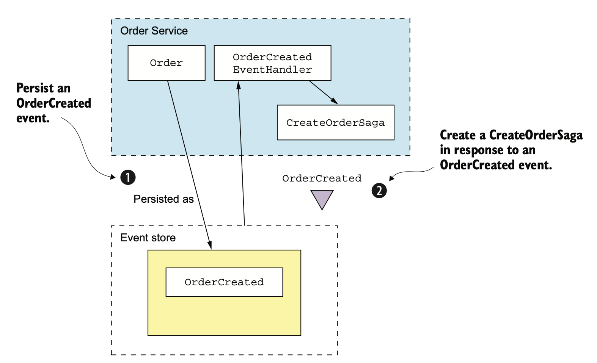
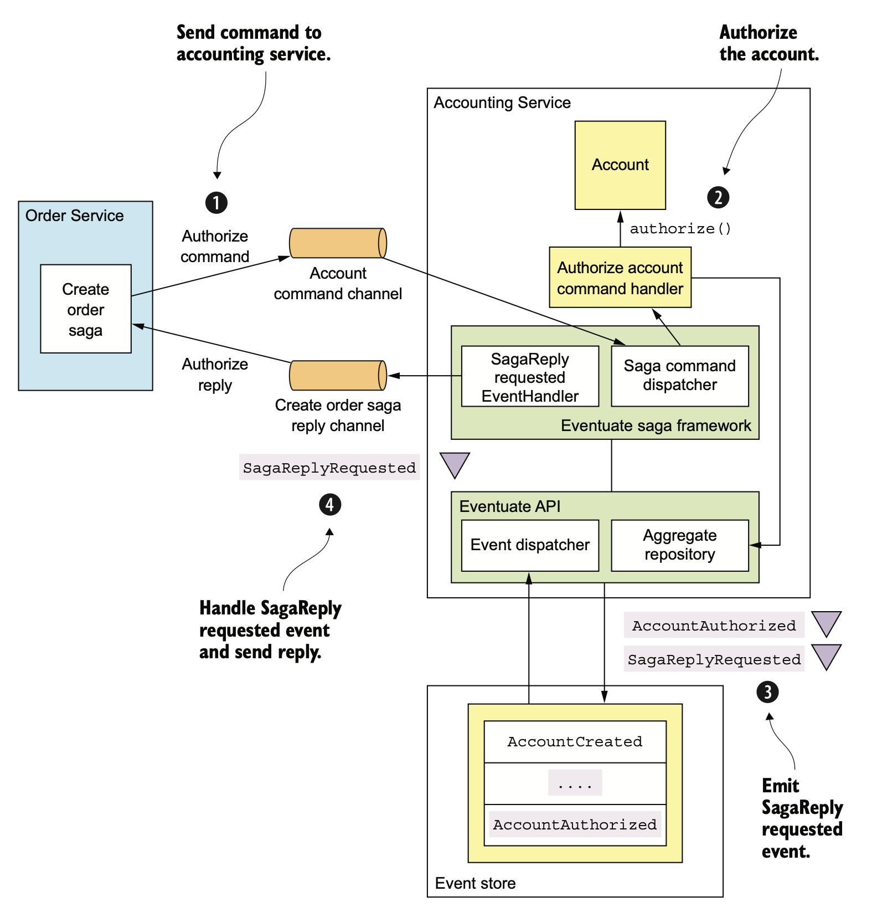
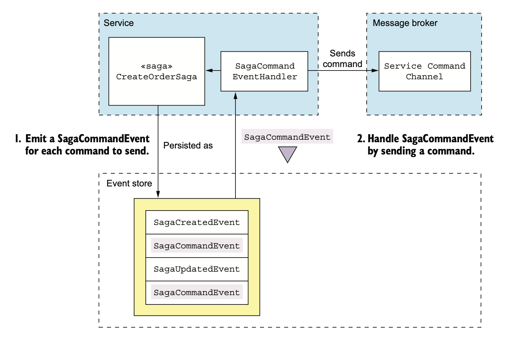

# 6.3.0 Overview

만약 Event Sourcing으로 서비스를 구현했다면 그 코드는 다음과 같을 것이다.

``` java
public class OrderService {
    private AggregateRepository<Order, OrderCommand> orderRepository;
    
    public OrderService(AggregateRepository<Order, OrderCommand> orderRepository) {
        this.orderRepository = orderRepository;
    }
    
    public EntityWithIdAndVersion<Order> createOrder(OrderDetails orderDetails) {
        return orderRepository.save(new CreateOrder(orderDetails));
    }
}
```

하지만 데이터 일관성을 위해 MSA에선 대부분 Saga를 시작하거나 참여해야 한다.

따라서 Saga와 Event Sourcing 기반의 비지니스 로직을 결합해야 한다.

<br>

Event Sourcing에서는 Choreography Saga를 손쉽게 사용할 수 있다.

참여자는 자신의 Aggregate가 발생시킨 Domain Event를 교환하고, 각 참여자 Aggregate는 Command를 처리하고 새로운 이벤트를 발생시킨다.

물론 Aggregate와 Aggregate를 수정하는 이벤트는 따로 작성해 주어야 한다.

<br>

하지만 Event Sourcing 기반의 비지니스 로직을 Orchestration Saga에 결합하는건 훨씬 어렵다.

이벤트 저장소의 트랜잭션 개념이 상당히 제한되어 있기 때문이다.

Application에서는 하나의 Aggregate만 생성 / 수정하고 이벤트를 발행하게 되는데, Saga의 각 단계는 반드시 원자적으로 동작해야 한다.

- **Saga 생성:** Saga를 시작한 서비스는 원자적으로 Aggregate를 생성 / 수정하고 Saga Orchestrator를 생성해야 한다.

  예를 들어, 주문 서비스는 `createOrder()`는 Order Aggregate와 CreateOrderSaga를 생성해 주어야 한다.

- **Saga Orchestration:** Saga Orchestrator는 응답을 소비하고, 자신의 상태를 수정한 후 커맨드 메세지 전송까지를 원자적으로 해야한다.

- **Saga 참여자:** 주방, 주문 서비스 등 Saga 참여자들은 메세지를 소비하고, 중복 메세지를 걸러내고, Aggregate를 생성 /  수정하고, 응답 메세지를 전송하는 것까지 원자적으로 수행해야 한다.

이처럼 이벤트 저장소와 트랜잭션 사이에 안맞는 부분이 있기 때문에 Orchestration Saga와 Event Sourcing을 함께 사용하는건 어렵다.

<br>

이벤트 저장소가 RDBMS인지 NoSQL인지는 Event Sourcing과 Orchestration Saga가 함께 사용될 수 있는지를 판가름한다.

Eventuate Tram Saga Framework와 Tram Messaging Framework는 유연한 ACID에 의존한다.

Saga Orchestrator와 참여자는 ACID 트랜잭션을 걸고, DB를 원자적으로 수정한 뒤 메세지를 교환한다.

Eventuate Local 등의 RDBMS 기반 이벤트 저장소를 사용한다면 Eventuate Saga Framework를 속이고 ACID 트랜잭션 내부에서 수정할 수 있다.

하지만 NoSQL인 경우 Eventuate Tram Saga Framework와 동일한 트랜잭션에 참여할 수 없다.

# 6.3.1 Choreography Saga 구현하기

Event Sourcing과 같은 Event Driven은 Choreography Saga를 구현하기 굉장히 간단하다.

Aggregate가 수정되면 Saga가 이벤트를 발행하고, 각각의 Event Handler는 해당 이벤트를 Consume한 후 Aggregate를 수정한다.

Event Sourcing 프레임워크가 알아서 이벤트 핸들러들을 멱등하게 만들어 준다.

<br>

4장에서는 Choreography Saga 기반으로 주문 생성 Saga를 구현해 봤다.

ConsumerService, KitchenService, AccountingService는 OrderService의 이벤트를 구독하고, OrderService는 이 세 서비스의 이벤트들을 구독한다.

각 서비스들은 아까 본 것과 비슷한 Event Handler를 가지고 있고, Event Handler가 Aggregate를 수정하면 또 다른 이벤트가 발행된다.

``` java
@EventSubscriber(id = "orderServiceEventHandlers")
public class OrderServiceEventHandlers {
    @EventHandlerMethod
    public void creditReserved(EventHandlerContext<CreditReserved> ctx) {
        CreditReserved event = ctx.getEvent();
        ...
    }
```

<br>

Event Sourcing과 Choreography Saga는 궁합이 잘 맞는다.

Event Sourcing은 메세징 기반의 IPC, 메세지 중복 제거, 원자적 상태 수정 등 Choreography Saga가 필요로 하는 여러 메커니즘을 제공한다.

<br>

Choreography Saga는 간단한 대신 단점이 많은데, 이벤트 소싱에만 해당하는 단점이 하나 있다.

바로 **이벤트가 여러 목적을 가지게 되는 것**이다.

이벤트 소싱은 상태 변화를 알리기 위해 이벤트르 사용하는데, 이걸 Choreography Saga에 적용하면 상태 변화가 없어도 이벤트를 발행해야 한다.

예를 들어 Aggregate를 수정하면 비지니스 규칙을 어기게 되어 업데이트 하면 안 되는 상황이라고 생각해 보자.

이 경우 반드시 이벤트를 발생시켜 오류를 보고해 주어야 한다.

더 큰 문제는 Saga 참여자가 Aggregate를 생성할 수 없는 경우다.

에러 이벤트를 발생시킬 Aggregate가 존재하지 않게 되어버린다.

<br>

이런 문제때문에 Orchestration Saga를 구현하는게 낫다.

# 6.3.2 Orchestration Saga 생성

Saga Orchestrator는 특정 서비스 메소드에 의해 생성된다.

`OrderService.createOrder()`는 Aggregate를 생성 / 수정하고, Saga Orchestrator를 생성한다.

서비스는 첫 번째 작업이 수행되면 두 번째 작업은 최종적으로 수행되는 방식으로 수행된다.

이 두 가지가 반드시 수행되게 하는 방법은 이벤트 저장소마다 다르다.

## Saga Orchestrator with RDBMS

RDBMS 이벤트 저장소를 사용하는 경우 이벤트 저장소를 수정하고 Saga Orchestrator를 생성하는 작업을 한 트랜잭션으로 간단하게 묶을 수 있다.

예를 들어 OrderService가 Eventuate Local과 Tram Saga Framework를 사용한다면 `createOrder()`는 다음과 같이 묶어줄 수 있다.

``` java
@RequiredArgsConstructor
class OrderService {
    private final SagaManager<CreateOrderSagaState> createOrderSagaManager;
    
    @Transactional
    public EntityWithIdAndVersion<Order> createOrder(OrderDetails orderDetails) {    
        EntityWithIdAndVersion<Order> order =
            orderRepository.save(new CreateOrder(orderDetails));
        
        CreateOrderSagaState data =
            new CreateOrderSagaState(order.getId(), orderDetails);
        
        createOrderSagaManager.create(data, Order.class, order.getId());
        return order;
    }
...
```

앞서 봤던 OrderService와 4장의 OrderService를 결합한 형태이다.

Eventuate Local은 RDBMS를 사용하기 때문에 Eventuate Tram Saga Framework와 같은 ACID 트랜잭션에 참가할 수 있다.

## Saga Orchestrator with NoSQL

NoSQL 이벤트 저장소를 사용하는 서비스는 이벤트 저장소를 수정하고 Saga Orchestrator를 생성하는 것을 원자적으로 수행하기 힘들다.

Saga Orchestration Framework가 전혀 다른 DB를 사용할 수도 있다.

설사 동일한 NoSQL을 사용한다고 하더라도 트랜잭션이 제한적이기 때문에 원자적으로 수정 / 삭제가 안되는 경우가 많다.

그 대신 서비스는 **Aggregate가 발생시킨 도메인 이벤트에 대해 Saga Orchestrator를 생성하는 이벤트 핸들러**를 가지고 있어야 한다.

<br>

아래 그림은 OrderCreated 이벤트 핸들러로 CreateOrderSaga를 생성하는 과정이다.



1. 주문 서비스가 Order Aggregate를 만들어 이벤트 저장소에 저장한다.
2. 이벤트 저장소는 OrderCreated 이벤트를 발행한다.
3. Event Handler가 이 이벤트를 Consume한다.
4. Event Handler는 Eventuate Tram Saga Framework를 호출해서 CreateOrderSaga를 생성한다.

Saga Orchestrator를 생성하는 Event Handler는 **중복 이벤트 처리**를 반드시 해줘야 한다.

적어도 한 번은 메세지를 전달하기 때문에 Event Handler가 여러번 호출될 가능성도 있다.

해결 방법은 크게 두 가지가 있을 수 있다.

### 이벤트를 발생시킨 AggregateID를 SagaID로 쓴다.

Aggregate 생성 이벤트에 반응하여 Saga가 생성된다면 적합할 수 있다.

### 이벤트 ID를 SagaID로 사용한다.

이벤트 ID가 유일하기 때문에 SagaID도 반드시 유리하다고 할 수 있다.

중복 이벤트라면 Event Handler가 생성 시도 할 때 ID가 겹치므로 실패하게 된다.

동일한 Saga Instance가 여러개 있을 가능성이 있을 때 괜찮다.

<br>

RDBMS 이벤트 저장소를 사용하는 경우에도 이것처럼 이벤트 기반으로 Saga를 생성할 수 있다.

OrderService가 더이상 명시적으로 Saga Instance를 생성하지 않기 때문에 느슨한 결합을 유지할 수 있다.

# 6.3.3 Event Sourcing 기반 Saga 참여자 구현

Orchestration Saga에 참여하는 서비스를 Event Sourcing으로 구현했다고 가정해 보자.

Eventuate Local처럼 RDBMS Event Store를 사용한 서비스라면 별로 어렵지 않게 Command 메세지를 원자적으로 처리하고, 응답을 보낼 수 있다.

Eventuate Tram 프레임워크가 시작한 ACID Transaction에서 Event Store를 수정하면 된다.

하지만 Eventuate Tram 프레임워크와 동일한 Transaction으로 묶을 수 없는 Event Store를 이용하는 서비스는 다른 방법을 이용해야 한다.

## 커맨드 메세지를 멱등하게 처리해야 한다.

Command Message를 멱등하게 처리하려면 먼저 Event Sourcing 기반의 Saga 참여자가 중복 메세지를 걸러낼 방법을 찾아내야 한다.

아까 전에 설명한 메세지 처리 방법을 사용하여 쉽게 해결할 수 있는 이슈다.

1. 메세지는 처리할 때 생성되는 이벤트에 메세지 ID를 저장한다.
2. Saga 참여자는 다음 Aggregate를 수정하기 전에 Event에서 꺼낸다.
3. 만약 처리한 기록이 있으면 취소한다.

## 응답 메세지를 원자적으로 전송해야 한다.

다음으로는 Saga 참여자가 응답을 원자적으로 하는 것이다.

이론적으로 Saga Orchestrator는 Aggregate가 발행한 Event를 구독할 수는 있지만, 그러면 두 가지 문제가 발생한다.

- Saga Command가 실제로 Aggregate를 변경했는지 알 수 없다.
  이벤트를 발행하지 않게 되므로 Saga Orchestrator에는 어떤 메세지도 전달되지 않는다.
- Event Sourcing을 사용하는 참여자와 그렇지 않은 참여자를 Saga Orchestrator에서 다르게 처리해 주어야 한다.
  Domain Event를 수신하려면 자신의 응답 채널 뿐만 아니라 Aggregate의 Event 채널도 구독해야 하기 때문이다.

<br>

Saga 참여자가 Saga Orchestrator의 응답 채널로 응답 메세지를 보내는게 가장 좋은 방법인데, Saga 참여자는 응답 메세지를 직접 보내는게 아니라 다음 과정을 거친다.

1. Saga Command Handler가 Aggregate를 생성 / 수정할 때 SagaReplyRequested라는 가짜 이벤트와 진짜 이벤트가 함께 Event Store에 저장되어야 한다.
2. SagaReplyRequested의 Event Handler는 Event에 포함된 데이터로 Response 메세지를 구성하고 Saga Orchestrator의 응답 채널에 발행한다.

## Event Sourcing 기반의 Saga 참여자 예제

주문 생성 Saga의 참여자중 하나인 회계 서비스를 보자.

다음 그림은 Saga가 전송한 인증 Command를 Eventuate Saga Framework로 구현한 회계 서비스에서 처리하는 방법이다.



1. 주문 생성 Saga에서 계좌 인증 Command를 Command Channel을 통해 회계 서비스로 전달한다.

   Eventuate Saga Framework의 SagaCommandDispatcher가 AccountingServiceCommandHandler를 호출해서 처리한다.

2. AccountingServiceCommandHandler는 주어진 Accounting Aggregate로 Command를 전달하여 처리한다.

3. Aggregate가 AccountAuthorizedEvent와 SagaReplyRequestedEvent를 발행한다.

4. SagaRelayRequestEventHandler는 주문 생성 Saga에 Response를 전달하여 SagaReplyRequestedEvent를 처리한다.

AccountingServiceCommandHandler는 Account Aggregate를 수정하기 위해 `AggregateRepository.update()`를 호출해서 AuthorizeAccount 커맨드 메세지를 처리한다.

``` java
@RequiredArgsConstructor
public class AccountingServiceCommandHandler {

    private final AggregateRepository<Account, AccountCommand> accountRepository;
    
    public void authorize(CommandMessage<AuthorizeCommand> cm) {
        AuthorizeCommand command = cm.getCommand();
        accountRepository.update(
            command.getOrderId(),
            command,
            replyingTo(cm)
            	.catching(
                    AccountDisabledException.class,
                    () -> withFailure(new AccountDisabledReply())
                )
            .build());
    }
}
```

`authorize()` 메소드는 AggregateRepository를 호출하여 Account Aggregate를 수정한다.

`update()`에 세 번째 메소드로 전달된 파라미터인 UpdateOptions는 다음과 같이 표현한다.

``` java
replyingTo(cm)
    .catching(
    	AccountDisabledException.class,
    	() -> withFailure(new AccountDisabledReply())
	)
    .build());
```

UpdateOptions는 다음과 같은 역할을 한다.

- 메세지가 한 번만 처리되도록 메세지 ID를 PK로 가진다.
  Eventuate 프레임워크는 모든 Event에 ID를 저장하는 방식으로 중복 메세지를 무시한다.

- Event Store에 가짜 이벤트인 SagaReplyRequestedEvent를 함께 저장한다.

  SagaReplyRequestedEventHandler는 SagaReplyRequestedEvent를 받으면 CreateOrderSaga의 응답 채널에 메세지를 보낸다.

- Aggregate가 AccountDisabledException을 던질 때 기본 응답 Response 대신 AccountDisabledReply를 반환한다.

# 6.3.4 Event Sourcing기반 Saga Orchestrator 구현

이제 Event Sourcing 기반으로 Saga Orchestrator를 구현할 수 있다.

이를 통해 정말 완벽하게 Event Store에 기반한 Application를 만들 수 있다.

## Event Sourcing으로 Saga Orchestrator 저장

Saga Orchestrator의 Lifecycle은 매우 단순하다.

처음 생성된 뒤로는 Saga 참여자의 응답에 따라 계속해서 수정된다.

그러므로 Saga는 다음 Event들을 저장할 수 있다.

- **SagaOrchestratorCreated:** Saga가 생성되었다.
- **SagaOrchestratorUpdated:** Saga가 수정되었다.

Saga Orchestrator는 생성 될 때 SagaOrchestratorCreated 이벤트를, 수정 되었을 때 SagaOrchestratorUpdated 이벤트를 발행한다.

이 두 이벤트에는 **Saga Orchestrator의 상태를 복구하기 위한 정보들이 담겨있다.**

예를 들어 CreateOrderSaga의 이벤트에는 직렬화된 CreateOrderSagaState가 있을 수  있다.

## Command 메세지 발행 보장

Saga의 상태를 수정하는 것과 Command 메세지의 전송을 어떻게 원자적으로 하는가에 대한 문제다.

Eventuate Tram Saga Framework는 **Orchestrator의 수정과 Command 메세지의 발행을 한 Transaction에서 수행**했다.

RDBMS Event Store를 사용하는 경우에는 이처럼 쉽게 묶어줄 수 있다.

<br>

NoSQL의 경우에는 **보내야 할 Command 메세지를 나타내는 메세지를 전송하는 것**이다.

Event Handler는 이 이벤트를 구독해서 적절한 채널에 Command 메세지를 전송한다.



1. Saga Orchestrator가 전송하려는 SagaCommandEvent를 Event Store에 저장한다.

   여기에는 목적지 채널, Command 객체 등 Command 전송에 필요한 메세지가 모두 담겨있다.

2. Event Store에서 Event를 발행하여 SagaCommandEventHandler가 그 Event를 받는다.

3. SagaCommandEventHandler는 SagaCommandEvent들을 받아 처리하고 목적지에 발행한다.

이렇게 처리하면 적어도 1회 이상은 전송된다.

SagaCommandEventHandler가 중복된 Command 메세지를 전달할 수도 있는데, 다행히 SagaCommandEvent의 ID를 Command 메세지 ID로 사용하면 중복 메세지를 쉽게 거를 수 있다.

## Response를 한 번만 처리하기

Saga Orchestrator도 앞에서 설명한 방법으로 중복 메세지를 걸러내야 한다.

응답을 처리할 때 Orchestrator가 발행할 이벤트에 Response 메세지 ID를 보관하면 중복 제거를 쉽게 할 수 있다.

