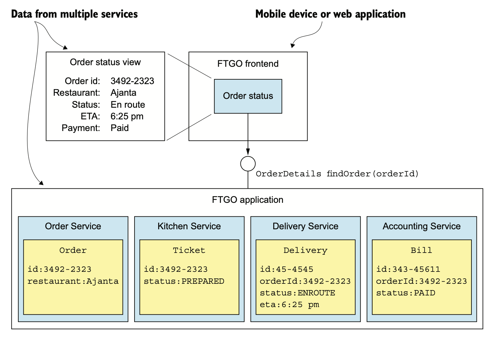
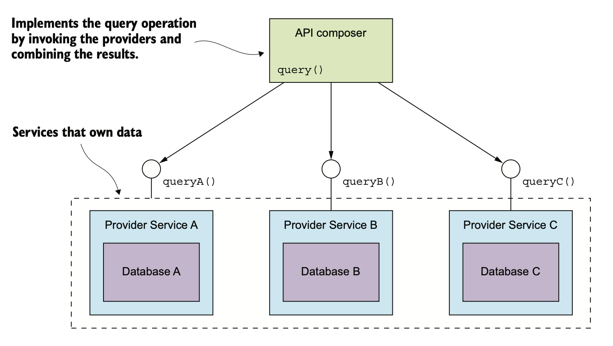
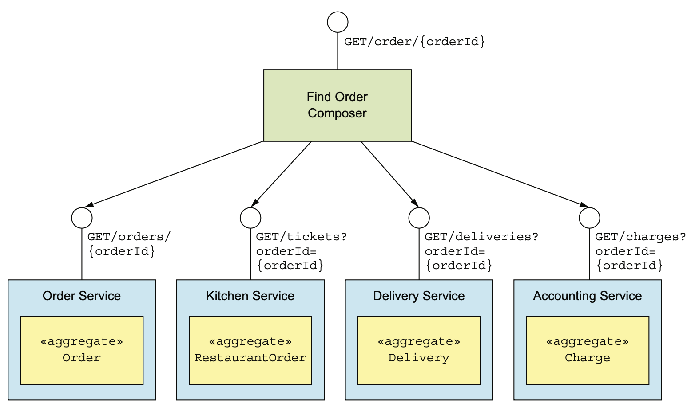
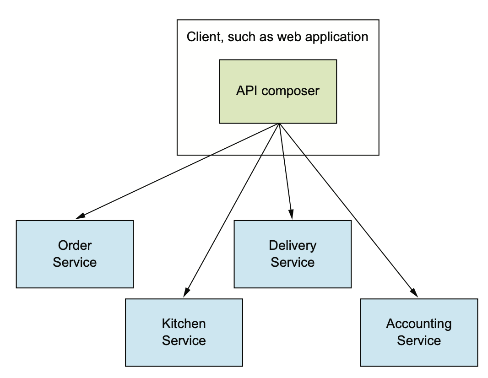
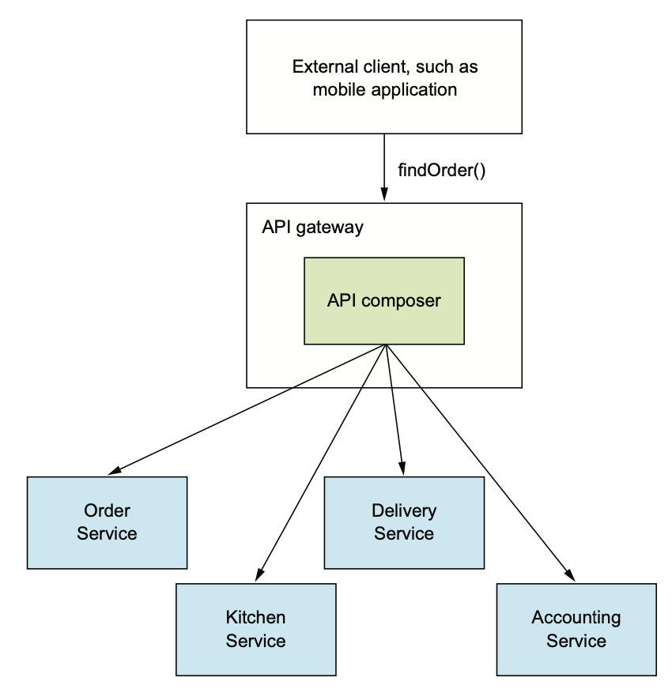
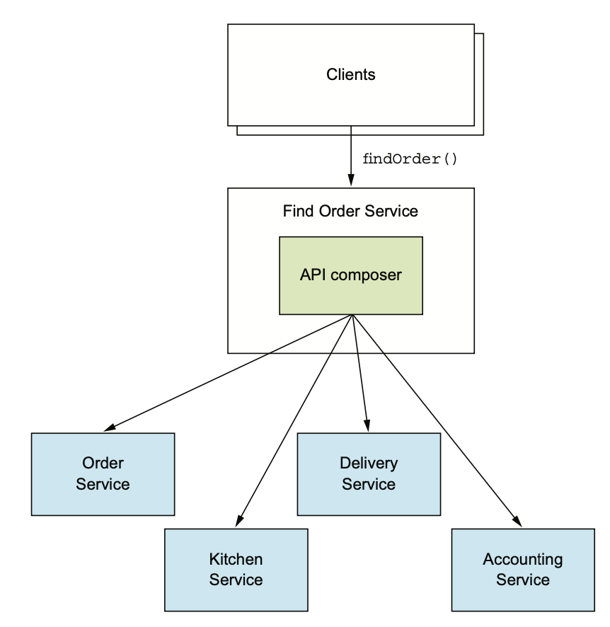

# 7.1.1 findOrder() 쿼리

`findOrder()`는 PK로 주문 정보를 조회하는 메소드다.

orderId를 매개변수로 받아 주문 내역이 포함된 OrderDetails를 반환해 준다.

다음 그림은 Order Status에 관한 뷰를 구현한 프론트엔드 모듈이 이걸 호출하게 된다.

Monolithic Application에서는 DB가 하나기 때문에 SELECT문으로 간단하게 DB를 Join해서 주문 내역을 조회할 수 있다.

반면 MSA로 전환하면 데이터가 여러 서비스로 나뉘게 된다.

- **주문 서비스:** 주문 내역이나 주문 상태 등 주문 기본 정보
- **주방 서비스:** 음식점의 관점에서 보는 주문 상태, 픽업 준비까지 예상되는 소요시간
- **배달 서비스:** 주문 배달 상태, 배달 예상 정보, 현재 배달원 위치
- **회계 서비스:** 주문 지불 상태

# 7.1.2 API 조합 패턴

API 조합 패턴은 데이터를 가진 서비스를 호출하고, 그 정보들을 합쳐서 반환해 준다.

- **API Composer:** Provider Service를 조회해서 데이터를 조회한다.
- **Provider Service:** API Composer에서 필요한 데이터를 가진 서비스

API Composer는 세 Provider Service에서 데이터를 조회하고, 합친다.

API Composer는 Web Client가 될 수도 있고 API Gateway와 Service들이 될 수도 있다.

 

이 패턴으로 어떤 작업을 구현할 수 있는지에 대한 여부는 데이터가 어떻게 분할되었는지, Provider Service가 어떤 API를 노출했는지, DB가 어떤 기능을 제공하는지 등 다양한 요소에 영향을 받는다.

예를 들어, Provider Service에서 API를 제공하더라도 대규모 데이터를 InMemory로 Join해야 할수도 있다.

따라서 이걸로 구현하기 힘든 상황도 있을 수 있곘지만, 대부분 이 방식으로 구현할 수 있다.

# 7.1.3 API 조합 패턴으로 findOrder 구현

`findOrder()`는 단순히 PK로 EQ Join을 하면 된다.

orderId로 데이터를 가져오는 API Endpoint는 Provider Service가 당연히 제공할 것이라고 보기 때문에 API 조합 패턴으로 구현하기 좋다.

여기서 API Composer는 **Rest Endpoint를 외부에 노출시킨 서비스**이다.

HTTP가 아니라 gRCP와 같은 IPC를 사용해도 결과는 같다.

API Composer에게 들어온 `GET /order/{orderId}` 요청은 orderId로 다른 네 서비스에 API 요청을 보내고, 수합해서 Join한다.

# 7.1.4 API Compose 설계 이슈

## 누가 API Composer 역할을 맡아야 하는가

### Service Client를 API Composer로 한다.

Frontend나 Android와 같이 **해당 View를 구현한 Client가 처리하는 방법**이다.

같은 LAN에서 동작한다면 효율적으로 조회할 수 있다.

하지만 Client가 외부에 있고 Network가 느리다면 별로 좋지 않은 방법이다.

### API Gateway를 API Composer로 한다.

쿼리 작업에 Application의 외부 API도 있다면 타당한 방법이다.

요청을 다른 서비스에 Routing하는 대신, 직접 API Composer 로직을 처리한다.

**방화벽 외부의 Client가 효율적으로 값을 조회**할 수 있게 해준다.

### Stand Alone 서비스를 만든다

내부적으로 여러 서비스가 사용하면 이 방법이 괜찮다.

API Gateway에서 처리하기에는 로직이 복잡하고, 외부에서 접근 가능한 쿼리 작업을 구현할 때에도 유용하다.

## API Composer는 Reactive를 사용해야 한다.

MSA에서 지연 시간을 최소화 하는게 골칫거리로 다가온다.

쿼리의 지연 시간을 최대한 줄이려면 여러 API를 한 번에 호출하는게 좋다.

예를 들어 주문 검색 Aggregate는 호출 대상들이 의존 관계가 없기 때문에 동시에 호출하는게 맞다.

그러나 연관 관계를 가지면 한 API를 호출한 후에 다른 API를 호출해야 할수도 있다.

 

그러나 순차 / 병렬 코드가 뒤섞이면 복잡할 수도 있다.

> 그냥 Coroutine을 쓰면 간단하다!

관리에 좋고 성능 / 확장성까지 좋으려면 CompletableFuture나 RxJava 등을 사용해야 한다.

# 7.1.5 API 조합 패턴의 단점

## 오버헤드 증가

여러 서비스를 호출하고 DB에 쿼리하는데에는 많은 오버헤드가 발생한다.

Monolithic Application에서는 Client의 요청 하나, Service의 쿼리 하나로 대부분의 작업을 처리하지만 API 조합 패턴은 여러번 요청하고 쿼리도 여러번 날려야 한다.

## 가용성 저하 우려

하나의 쿼리 작업에 세 Provider Service가 참여했는데, 그 중 한 서비스에서라도 문제가 있다면 쿼리 작업이 불가능하다.

그렇다면 가용성을 높이는 전략에 대해 알아보자.

### Provider Service가 불능이면 캐싱된 데이터를 반환한다.

성능 향상의 목적으로 API Composer에 캐싱된 Provider Service의 데이터를 잘 사용하면 가용성을 높일 수 있다.

### API Composer에서 비완성의 데이터를 전송한다.

예를 들어 주방 서비스가 내려갔다면 API Composer에서 이 데이터는 버리고 나머지 데이터만 반환한다.

## 데이터 일관성 결여

Monolithic Application에서는 하나의 Transaction에서 쿼리를 처리했기 때문에 ACID 트랜잭션이 데이터를 일관되게 보장해 줬다.

API Composer에서 이걸 처리해 주어야 하는데, 그러면 코드가 점점 복잡해지게 된다.

또한 이런 문제를 항상 API Composer에서 감지할 수 있는게 아니기 때문에 잘못된 데이터가 client에게 반환될 수도 있다.

