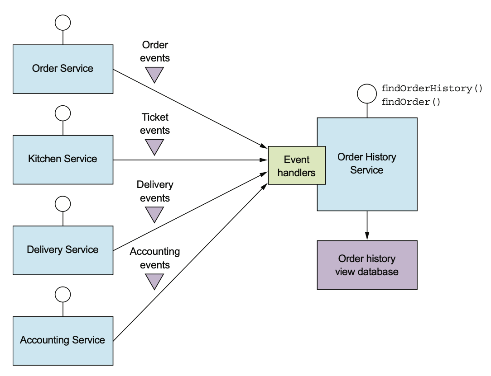

# 7.2.0 서론

대부분의 RDBMS에선 Transaction을 걸어 Record를 관리하고 Text 검색은 Elastic Search나 Solar 등 Text 검색 DB를 사용한다.

Applicaton에 따라 RDBMS와 Text DB를 둘 다 출력해서 동기화 하기도 하고, 주기적으로 RDBMS에서 Text DB로 동기화 하기도 한다.

이렇게 하는 이유는 **여러 DB들의 장점들을 최대한 활용하기 위해서**이다.

 

CQRS는 **이러한 아키텍쳐를 일반화 한 것이다.**

하나 또는 그 이상의 View Database를 유지한다.

CQRS는 API 조합 패턴으로는 효율적으로 구현하기 힘든 쿼리를 구현할 수 있기 때문에 각광받게 되었다.

# 7.2.1 CRQS의 필요성

API 조합 패턴을 사용하면 여러 서비스 사이의 데이터 조회를 쉽게 구현할 수 있다.

하지만 API 조합 패턴은 MSA에서 반쪽짜리밖에 안된다.

이 패턴만으로는 효율적으로 구현하기 어려운 쿼리가 많기 때문이다.

단일 서비스 쿼리만으로도 힘든 경우도 있고, 서비스에서 사용하는 DB가 효율적인 쿼리를 지원하지 않는 경우도 있다.

아직 API 조합 패턴을 사용하기 힘든 상황이 눈에 잘 보이지 않을 수 있는데, 언제 힘든지부터 알아보자.

## findOrderHistory() 쿼리

`findOrderHistory()` 쿼리는 다음 매개변수를 받아 소비자의 주문 이력을 출력한다.

- **consumerid:** 소비자 ID
- **OrderHistoryFilter:** 필터 조건으로, 어느 시점 이후의 주문까지 반환할지, 주문 상태, 음식점과 메뉴 항목을 검색할 키워드

이 쿼리는 조건에 부합하는 OrderHistory 객체를 최신순으로 반환하며, 주문 이력 View를 구현한 Client Module에게 호출된다.

 

겉으로 보기에는 `findOrderHistory()`는 `findOrder()`과 비슷하지만, 단건 주문 정보가 아니라 여러 건 이라는 차이가 있다.

API Composer에서 그냥 구현하면 될 것 같지만, 조금 어렵다.

 

모든 서비스에서 필터링이나 정렬을 위한 값을 가지고 있는 것은 아니다.

예를 들어 `findOrderHistory()`의 OrderHistoryFilter에는 Menu item에 대응되는 keyword라는게 있다.

하지만 Menu에 대한 정보를 저장하는건 주문, 주방 서비스밖에 없고 나머지 서비스들은 keyword로 데이터를 필터링 할 수 없고, 어느 서비스에선 정렬을 할 수 없다.

API 조합기 패턴은 이 문제를 해결하는 몇 가지 방법이 있다.

### InMemory Join을 사용한다.

어떤 소비자의 모든 주문 데이터를 배달, 주문 서비스에서 가져온 후 주방 서비스에서 가져온 데이터와 Join하는 방법이다.

하지만 이런 방법으로 거대한 데이터를 API Composer에서 조합하면 효율이 매우 떨어진다.

### API Composer로 주문, 주방 서비스에서 조회한 후에 주문 ID로 다른 서비스에 요청한다.

하지만 이건 해당 서비스가 대량 조회를 제공할 때에만 가능한 일이다.

OrderId를 하나하나 API호출하는건 당연히 불가능하다.

 

`findOrderHistory()`같은 쿼리 작업은 API Composer가 RDBMS의 기능을 재탕할 뿐이다.

## findAvailableRestaurants()

여러 서비스에서 데이터를 가져오는 쿼리만 어려운게 아니라, 그냥 한 서비스에서도 쿼리를 구현하기 힘들 때도 있다.

1. 데이터를 가진 서비스에 쿼리를 보내는게 부적절할 때
2. 서비스 DB가 효율적인 쿼리를 지원하지 않을 때

`findAvailableRestaurants()`를 한 번 보자.

이 쿼리는 특정 시점에 주어진 위치로 배달 가능한 음식점을 찾는 쿼리다.

이 쿼리는 **배달 주소의 특정 거리 내에 있는 음식점을 위치 기준으로 찾는 것**이 중심이다.

 

여기서 가장 어려운 부분은 위치 정보로 쿼리를 구현하는건데, 이 쿼리의 구현은 DB의 종류에 달렸다.

MongoDB나 PostgreSQL, MySQL의 geospatial extension이라는 것을 사용하면 매우 쉽게 구현할 수 있다.

지리 공간형 데이터, Index, 쿼리가 내장된 DB를 사용하면 음식점 서비스는 Restaurant를 location 속성을 가진 DB로 저장하면 된다.

 

그러나 만약 사용중인 DB에서 이러한 작업을 지원하지 않으면 어떻게 할까?

음식점 Data의 Replica를 지리 공간 쿼리에 맞게 설계해서 유지하는 방법밖에는 없다.

Application에 따라 DynamoDB의 Geography Indexing Library for DynamoDB를 사용하거나 아예 다른 DB에 저장하면 된다.

## 관심사 분리의 필요성

단일 서비스 쿼리가 어려운 또 다른 이유가 **데이터를 가진 서비스에 쿼리하면 안될 경우가 있기 때문이다.**

`findAvailableRestaurants()`처럼 음식점 서비스에 있는 데이터를 조회하는 쿼리 작업의 경우에는 음식점 서비스가 음식점명, 주소, 요리, 메뉴, 오픈 시간 등 여러 속성들이 포함되어 있다.

음식점 데이터를 가지고 있는 음식점 서비스에 쿼리하는게 좋아보이지만, 데이터의 소유 말고 다른 것도 고려해 보아야 한다.

 

관심사를 어떻게 분리할지, 어느 서비스에 너무 많은 책임을 주지 않게 하려면 어떻게 해야할지 등도 고려해 보아야 한다.

예를 들어, 음식점 서비스는 음식점 주인이 자기가 운영하는 음식점을 관리하기 위한 서비스이지, 성능이 중요한 대용량 데이터를 조회하는건 이 서비스의 책임이 아니다.

 

`findAvailableRestaurants()`쿼리, 즉 다른 팀이 구현하고 음식점 서비스에서는 데이터만 제공하는 편이 낫다.

`FindOrderHistory()` 쿼리로 위치 정보 Index를 유지해야 한다면 일부 데이터를 최종 일관성만 보존된 Replica를 관리해야 한다.

# 7.2.2 CQRS 개요

7.2.1에서 설명한 예제를 MSA에서 다음 세 문제에 봉착하게 된다.

## CQRS는 Command과 Query를 분리한다.

CQRS(Command and Query Responsibility Segregation)는 이름처럼 관심사의 분리를 위한 패턴이다.

CQRS는 Persistent Data Model과 그걸 사용하는 모듈을 Command와 Query로 나눈다.

조회 기능은 Query쪽 Module과 Data Model, 생성 / 수정 / 삭제는 Command쪽 Module과 Data Module쪽에 구현하는 방식이다.

양 Data Model 사이의 동기화 작업은 Command에서 발행한 Event를 Query쪽에서 구독해서 사용한다.

CQRS와 상관없이 대부분의 서비스는 다양한 CRUD 작업이 구현된 API를 가지고 있다.

CQRS가 아닌 서비스는 이런 작업을 보통 DB에 매핑된 Domain Model로 구현하게 된다.

성능이 중요하다면 Domain Model을 거치지 않고 바로 DB로 접속하기도 한다.

 

CQRS에서 Command쪽은 CRUD를 처리하고 자체 DB에 매핑된다.

Join이 없는 단순 쿼리나 PK 기반 쿼리도 처리할 수 있다.

Command쪽은 데이터가 바뀔 때마다 Eventuate Tram이나 Event Source 등을 사용하여 도메인 이벤트를 발행한다.

## CQRS와 쿼리용 서비스

CQRS는 서비스 내부 뿐만 아니라 이걸 그대로 서비스로 옮겨 **쿼리 서비스**를 구현하는 것 또한 가능하다.

쿼리 서비스에는 **Command 작업이 전혀 없이 쿼리 작업으로만 이루어진 API**가 있고, 하나 이상의 다른 서비스가 발행한 이벤트를 구독한다.

> 즉, CRU없이 Read만 한다는 의미다.

또한 다른 서비스에서 발행한 이벤트를 받아 DB를 항상 최신 상태로 수정해 주어야 한다.

쿼리 서비스는 **여러 서비스에서 발행한 이벤트를 받아 최신 View를 유지해야 할때 유용하다.**

이런 View는 어느 특정 서비스에 속한게 아니기 때문에 따로 서비스로 빼는게 맞다.

`findOrderHistroy()` 쿼리가 구현된 주문 이력 서비스가 좋은 예제라고 할 수 있다.

이 서비스는 여러 서비스에서 발행된 이벤트를 받아 Order History View Database에 저장한다.

 
CQRS는 여러가지 DB를 사용할 수 있고, 그에 따라 다양한 DB의 장점을 활용할 수 있다.

# 7.2.3 CQRS의 장점

## MSA에서 효율적인 처리

CQRS는 여러 서비스의 데이터를 조회하는 쿼리를 효율적으로 구현할 수 있다.

API 조합 패턴을 사용하면 거대한 데이터들을 InMemory Join하는 대신 여러 서비스에서 데이터를 미리 Join해올 수 있다.

## 다양한 쿼리의 효율적인 구현

다양한 쿼리를 Application / Service에 효율적으로 구현할 수 있다.

원래 아키텍쳐에선 갖가지 쿼리를 지원하기 어렵고, 아예 불가능한 경우도 있었다.

게다가 일부 NoSQL은 쿼리가 매우 제한적이기 때문에 어렵다.

## Event Sourcing Application에서 쿼리가 가능하다.

CQRS는 Event Sourcing의 이벤트 저장소는 PK 저장만 지원한다 라는 문제를 해결해 준다.

CQRS는 하나 이상의 Aggregate View를 정의하고, Event Sourcing에서 발행한 Event를 구독하여 항상 최신 상태의 View를 유지한다.

## 관심사가 더욱 분리된다.

CQRS는 커맨드와 쿼리를 분리해 주고, 각각의 코드 모듈과 DB Schema를 별도로 정의하게 된다.

이렇게 관심사를 분리하면 커맨드 / 쿼리 둘 다 관리가 수월해 진다.

 

또, CQRS를 사용하게 되면 쿼리를 구현한 서비스와 데이터를 소유한 서비스를 나누게 할 수 있다.

데이터를 가지고 있다고 해서 다른 서비스에서 원하는 복잡한 쿼리를 관리하는건 어렵다.

## 7.2.4 CQRS의 단점

## Architecture가 복잡하다.

개발자는 View를 수정 / 조회하는 로직을 추가로 짜야하며, 별도의 데이터 저장소를 관리해야 한다.

심지어 DB의 종류가 다양한 Application이라면 운영 복잡도는 더욱 증가한다.

## 복제 시차를 신경써야 한다.

커맨드 / 쿼리 양쪽 View 사이의 시차를 처리해야 한다.

당연히 커맨드쪽에서 이벤트를 발행하는 것과 쿼리쪽에서 이벤트를 받아 View를 수정하는 데에는 시간 차이가 존재한다.

따라서 경우에 따라 Client는 **수정되기 전의 Aggregate를 조회할 수도 있다.**

 

한 가지 해결법은 양쪽 API가 Client에게 버전 정보를 전달해서 오래된 데이터를 분간할 수 있게 하는 것이다. 

Client는 새로운 데이터를 받을 때까지 계속해서 Polling하게 된다.

 

Native 모바일 앱이나 SPA같은 UI Application은 쿼리를 하지 않고 **커맨드가 성공하면 자신의 Local Model을 수정하는 방식**을 사용할 수도 있다.

 

이렇게 CQRS는 여러 장단점이 있으니 꼭 필요할 때에만 사용하는게 좋다.

