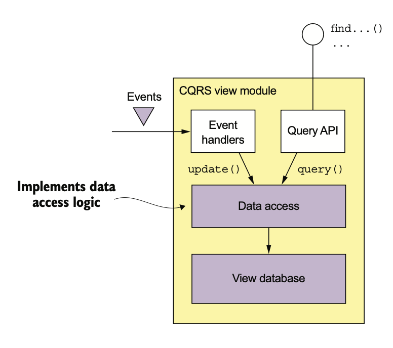
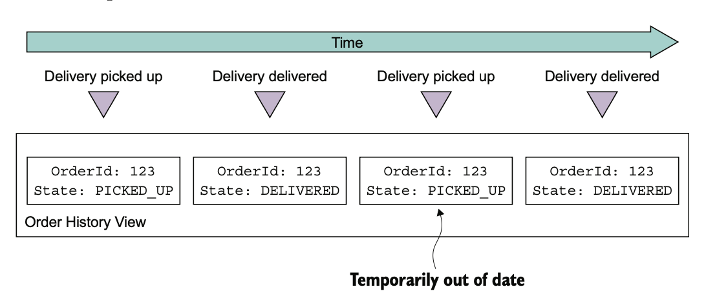

# 7.3.0 서론

CQRS의 View Module에는 **하나 이상의 쿼리 작업으로 구성된 API**가 있다.

다른 서비스가 발행한 이벤트를 구독해서 최신 상태로 유지된 DB를 조회하는 QueryAPI이다.

View Module은 View DB와 3개의 Sub Module을 가지게 된다.



Event Handler와 Query API Module은 Data Access Module을 통해 DB를 조회 / 수정한다.

Event Handler Module은 Event를 구독해서 DB를 수정하고, Query API Module은 데이터를 조회한다.

View Module을 개발할 때에는 몇 가지를 결정해야 한다.

- DB를 선택하고 Schema를 설계해야 한다.
- Data Access Module을 설계할 때에는 멱등성과 동시 업데이트 등 다양한 문제를 고려해야 한다.
- 기존 Application에서 새로운 View를 구현하거나 기존의 Schema를 변경할 경우에는 View를 효율적으로 (재)빌드할 메커니즘을 짜야한다.
- View Client에서 시차 처리를 어떻게 할지 구현해야 한다.

# 7.3.1 View DB 선택

DB는 신중하게 선택하고 Schema를 잘 설계해야 한다.

DB와 Data Model의 목적은 View Model의 쿼리 작업을 효율적으로 수행하는 것이다.

하지만, DB Event Handler가 수행하는 업데이트 작업을 효율적으로 지원해야 한다.

## SQL vs NoSQL

최근까지 RDBMS만 사용되었지만 점차 RDBMS의 기능만으로는 부족한 경우가 많아졌다.

이른바 NoSQL이 등장하게 되었다.

NoSQL은 트랜잭션 기능이 제한적이고 범용적인 쿼리는 부족하지만, **특정 UseCase에서 우수한 성능과 확장성, 그리고 유연한 Data Model**로 인해 기존의 RDBMS보다 뛰어난 경우가 있다.

<br>

NoSQL은 CQRS와 매우 잘 맞다.

NoSQL의 장점은 부각되고, 단점은 미약하다.

NoSQL의 풍부한 Data Model과 우수한 성능도 CQRS에 잘 맞는다.

또한, CQRS는 단순 트랜잭션에서 고정된 쿼리만 실행하기 때문에 NoSQL의 문제도 영향을 크게 받지는 않는다.

<br>

물론 RDBMS를 사용하는게 좋을 수도 있다.

| Need                    | Use                                                          | Example                                          |
| ----------------------- | ------------------------------------------------------------ | ------------------------------------------------ |
| JSON을 PK로 검색        | MongoDB, DynamoDB와 같은 Document DB<br />혹은 Redis같은 Key-Value DB 사용 | MongoDB로 고객별 주문 이력 관리                  |
| 쿼리 기반으로 Json 조회 | Document DB                                                  | 고객 View를 MongoDB, DynamoDB로 구현             |
| Text Query              | ElasticSearch와 같은 Text 검색엔진 사용                      | 주문별 Document를 통해 주문 텍스트 검색 구현     |
| Graph Query             | Neo4j와 같은 GraphDB                                         | 고객, 주문 등을 그래프로 표현하여 부정 탐지 구현 |
| 전통적인 SQL            | RDBMS                                                        | 일반적인 비지니스 Report와 분석                  |

## Update 작업

View Data Model에서는 조회 뿐만 아니라 Event Handler에 이벤트를 받았을 때 실행될 Update 작업도 효율적으로 해야한다.

Event Handler는 보통 View DB에 있는 Record를 PK로 찾아 수정 / 삭제한다.

예를 들어, `findOrderHistory()`의 CQRS를 구현한다고 가정했을 때, 이 View는 주문 서비스의 이벤트를 받아 해당 Record를 수정한다.

<br>

하지만 FK를 통해 Record를 수정 / 삭제를 해야할 수도 있다.

Delivery에 관련된 Event Handler가 그런 경우가 될 수 있는데, 만약 Delivery와 Order가 1:1이라면 그냥 쉽게 구현할 수 있다.

하지만 대부분 1:N이기 때문에, OrderId를 가져야 한다.

만약 DeliveryCreated같은 경우에는 OrderId를 포함하게 될 수도 있겠지만, 그렇지 않을수도 있다.

예를 들어 DeliveryPickedUp Event Handler는 deliveryId를 외래 키로 하여 주문 Record를 수정해야 한다.

<br>

RDBMS나 MongoDB와 같은 일부 DB는 필요한 컬럼에 Index를 걸어 FK 기반의 수정을 잘 지원하지만, 다른 NoSQL들에서는 Non-Primary Key로 업데이트가 쉽지 않다.

Application이 Update할 Record를 결정하려면 FK에서 PK로 매핑해주는 데이터를 가지고 있어야 한다.

예를 들어 PK기반의 수정만 지원하는 DynamoDB를 사용한다면 나중에 설명할 보조 인덱스에서 조회해서 수정 / 삭제할 Record의 PK를 찾아야 한다.

# 7.3.2 Data Access Module 설계하기

Event Handler나 Query API는 **DAO나 Helper 클래스로 구성된 Data Acess Module을 사용한다.**

DAO는 Event Handler가 호출한 Update 작업과 Query Module이 호출한 조회 작업을 실질적으로 수행한게 된다.

또한 고수준 코드에서 사용되는 자료형과 DB간의 매핑, 동시 Update 처리와 Update 멱등성 보장 등의 많은 작업을 처리한다.

## 동시성 처리

동일한 DB Record를 동시에 Update하는 경우가 있다.

View가 Aggregate에서 발행된 Event 한 종류만 처리한다면 동시성 이슈는 발생하지 않는다.

Aggregate가 발행한 이벤트가 순차적으로 처리되기 때문이다.

하지만 여러 이벤트를 구독한다면 여러 Event Handler가 하나의 Record에 대해 Update를 하려고 할 수도 있다.

<br>

예를 들어 Order의 Event Handler와 Delivery의 Event Handler가 동시에 호출되어 하나의 주문을 동시에 수정할 수도 있다.

DAO는 서로의 데이터를 덮어쓰지 않도록 해야한다.

만약 DAO가 Record를 읽고, 수정한다면 비관적 / 낙관적 Lock 중 하나를 구현해야 한다.

## 멱등한 Event Handler

Event Handler는 같은 Event를 한 번 이상 받을 수도 있다.

Query쪽 Event Handler에서 같은 이벤트를 처리해도 결과가 같다면 문제 될 일은 없다.

최악의 경우, Data Store가 일시적으로 동기화가 안되는 문제가 발생하게 된다.

예를 들어 주문 이력 View의 경우를 보자.



1. Command Event Handler는 배달 픽업, 주문 배달됨 이벤트를 받는다.

2. Message Broker에 문제가 생겨 배달 픽업, 주문 배달됨 이벤트를 다시 보내 Command Event Handler가 받는다.

   > 전에도 말했듯이 Message Broker는 한 번 이상 메세지를 전달하는걸 보장한다.

3. 일시적으로 최신 데이터가 아닌게 조회되게 된다.

<br>

중복 이벤트로 인해 부정확한 결과가 나오는건 멱등하다 라고 말할 수 없다.

멱등하지 않은 Event Handler는 자신이 View Data Store에서 이미 처리된 Message들을 저장해 뒀다가 이미 처리된 Message는 감지하고 버려야 한다.

<br>

Event Handler는 반드시 Event ID를 기록하고 Data Store를 Update하는 작업을 원자적으로 수행해야 한다.

그 방법은 DB 종류마다 다르다.

당연히 RDBMS는 그냥 한 Transaction에서 처리 완료한 Event를 processed_events 테이블에 저장하면 된다.

하지만 NoSQL은 Transaction이 제한적이기 때문에 **자신이 Update하는 Record에 이벤트를 저장**해야 한다.

<br>

Event Handler가 모든 Event ID를 기록할 필요까지는 없다.

만약 EventID가 Auto Increment처럼 1씩 증가한다면 Aggregate Instance에서 받은 max(eventId)를 저장해 주면 된다.

게다가, Record가 하나의 Aggregate에 대응한다면 Event Handler는 그냥 max(eventId)만 저장하면 된다.

여러 Aggregate에서 받은 Event들을 Aggregate Type, AggregateId를 key로 max(eventId)를 저장해야 한다.

``` json
{
    "Delivery3949384394-039434903" : "0000015e0c6fc264-0242ac1100e50002",
    "Order3949384394-039434903" : "0000015e0c6fc18f-0242ac1100e50002"
}
```

다양한 서비스에서 발행한 Event를 조합한 View의 일부분이다.

나중에 다시 설명하겠지만 event-tracking 필드 이름은 aggregateType과 aggregateId를 합친 것이다.

그리고 값은 event의 id로, aggregateType과 aggregateId로 검색해서 eventId를 조회할 수 있는 형태이다.

## Client Application에서 최종 일관성이 보장된 View를 사용할 수 있다.

CQRS를 적용하지 못 하면 수정 직후 조회를 한 Client는 자신이 수정한 수정사항을 보지 못 할수도 있다고 했다.

하지만 Messaging Infrastructure의 지연 시간은 불가피하기 때문에 이 View는 최종 일관됨을 보장한다.

Command Module과 Query Module의 API를 사용해서 비일관성을 감지할 수는 있긴 하다.

Command 작업에서 Client에게 발행된 eventId가 포함된 토큰을 반환하고, Client는 이 토큰을 Query 작업에 전달해서 아직 View가 수정되지 않았다면 에러를 반환해 줄 수 있다.

# 7.3.3 CQRS View 추가 / 수정

CQRS는 계속해서 추가되고 수정된다.

새로운 Query를 위해 새로운 View를 짜야할 수도 있고, Schema가 바뀌거나 코드의 버그를 변경하기 위해 View를 재생성 해야할 수도 있다.

<br>

View를 추가하려면 그냥 Query Module을 만들고, Data Store를 세팅하고, 서비스를 세팅하면 언젠가 View는 최신 상태가 될 것 같다.

기존의 View를 수정하는 것도 그냥 Event Handler를 수정하고 View를 재생성 하면 될 것 같다.

하지만 이건 실제로는 힘든 방법이다.

## Archive된 Event로 CQRS 구축

Message Broker에 메세지를 영구 보관할 수는 없다.

그러므로 필요한 Event를 Message Broker에서 읽기만 해서는 View를 구축할 수 없다.

따라서 S3같은 곳에 더욱 Event들을 Archive해서 가져와야 한다.

Apache Spark처럼 확장 가능한 빅데이터 기술을 활용하면 가능하다.

## CQRS View를 단계별로 구축

전체 Event를 처리하는데에 드는 리소스도 View 생성의 다른 문제가 될 수 있다.

결국 언젠가 View는 느려지고, 비용도 많이 들게 된다.

해결 방법으로 **two-step incremental 알고리즘**을 적용하면 된다.

1. 주기적으로 각 Aggregate의 마지막 Snapshot 이후에 발행된 Event를 바탕으로 새로운 Snapshot을 계산한다.
2. 이렇게 계산된 Snapshot과 그 후에 발행된 Event들로 CQRS를 구축한다.

