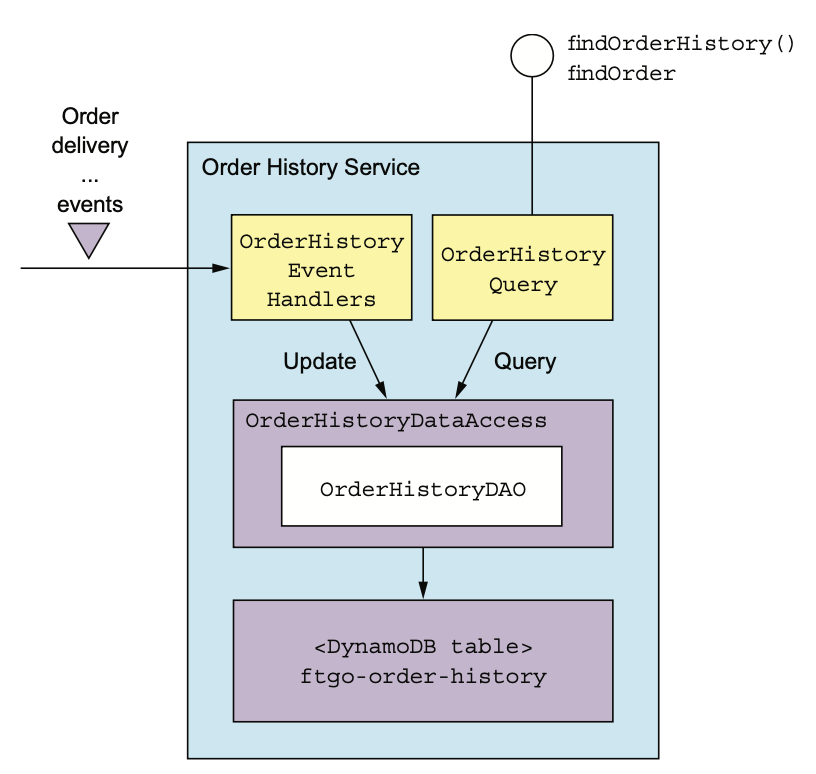
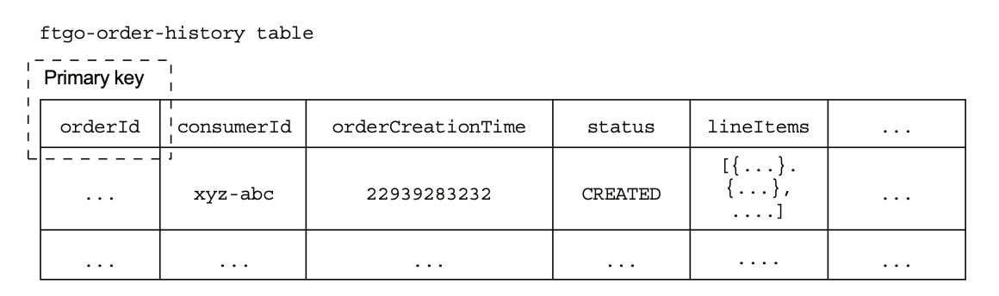
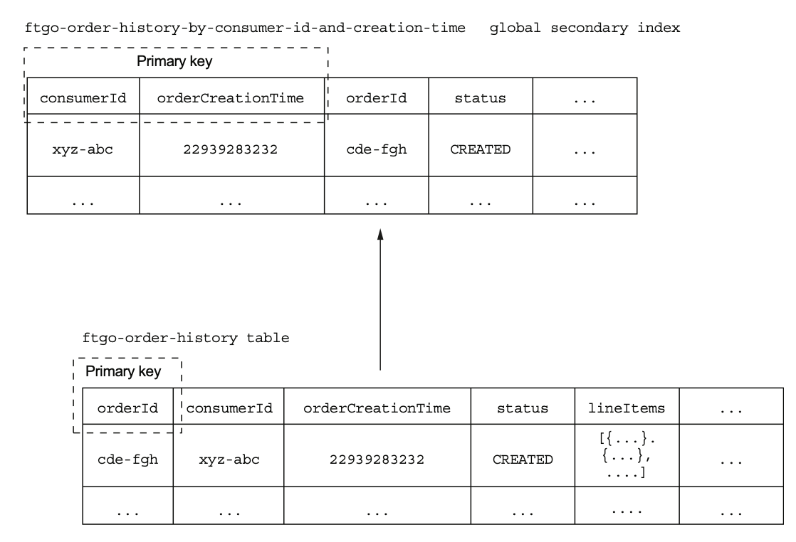

# 7.4.0 서론

이제 DynamoDB로 `findOrderHistory()` 쿼리 작업을 구현할 때 발생하는 이슈들을 둘러보자.

DynamoDB는 완전 관리형 DB이기 때문에 DB의 성능을 동적으로 바꿀 수 있다.

DynamoDB의 Data Model은 JSON처럼 계층형 Key-Value로 구성되어 있다.

<br>

`findOrderHistory()`의 CQRS View는 여러 Service의 Consume하기 때문에 Stand Alone으로 구현하게 된다.

이 서비스에는 `findOrderHistory()`, `findOrder()`이 구현된 API가 있다.

`findOrder()`는 API 조합 패턴으로 구현할 수도 있지만, `findOrderHistory()`에서 취합한 Event로 그냥 구현할 수 있기 때문에 API로 구현한다.



# 7.4.1 OrderHistoryEventHandlers Module

OrderHistoryEventHandlers는 Event를 소비해서 DynamoDB Table을 Update하는 Event들을 받는 EventHandler들이 포함된 Module이다.

단순히 전달받은 인수를 OrderHistoryDao에게 전달해 준다.

``` java
@RequiredArgsConstructor
public class OrderHistoryEventHandlers {
    private final OrderHistoryDao orderHistoryDao;
    
    public void handleOrderCreated(DomainEventEnvelope<OrderCreated> dee) {
        orderHistoryDao.addOrder(
            makeOrder(
                dee.getAggregateId(),
                dee.getEvent()),
            makeSourceEvent(dee)
        );
    }

    private Order makeOrder(String orderId, OrderCreatedEvent event) {
        ...
    }
    
    public void handleDeliveryPickedUp(DomainEventEnvelope<DeliveryPickedUp> dee) {
        orderHistoryDao.notePickedUp(
            dee.getEvent()
            	.getOrderId(),
            makeSourceEvent(dee));
    }
    ...
}
```

Event Handler는 DomainEventEnvelope 타입의 파라미터를 받는다.

Event 정보와 Event에 대한 MetaData가 여기 담겨있다.

예를 들어 OrderCreated 이벤트가 발행되면 `handleOrderCreated()`가 호출되고, 이 메소드는 `orderHistoryDao.addOrder()`를 호출해 준다.

마찬가지로 DeliveryPickedUp Event가 발행되면 `handleDeliveryPickedUp()`이 호출되고, `orderHistoryDao.notePickUp()`이 호출된다.

# 7.4.2 DynamoDB Data Modeling과 Query 설계

다른 NoSQL DB처럼 DynamoDB도 Data Access 능력이 RDBMS에 비해 훨씬 떨어지기 때문에 Data 저장을 잘 설계해야 한다.

특히 Query쪽에 따라 어떻게 저장하면 좋을지가 결정되기 때문에 이번에 소개할 내용들을 고민해 보아야 한다.

## FTGO-order-history 테이블 설계

DynamoDB의 저장 모델은 Item들과 Item에 효율적으로 조회할 수 있도록 돕는 index들로 구성된다.

Item은 Attribute들의 집합이고, Attribute는 String과 같은 Scalar 값, 문자열 리스트, 혹은 또 다른 Attribute의 목록이다.

Item은 RDBMS에서 Row에 해당하지만, RDBMS보단 훨씬 유연하기 때문에 모든 Aggregate를 저장할 수도 있다.

이러한 유연성으로 인해 OrderHistoryDataAccess Module은 각 Order를 ftgo-order-history라는 테이블 하나에 모두 저장할 수 있다.

Order 클래스의 Field는 각 Item의 Attribute에 매핑된다.

OrderCreationTime이나 status같이 단순한 필드는 단일 값 Attribute에, lineItems와 같은 필드는 Json 배열과 같이 저장된다.



PK는 테이블을 설계할 때 매우 중요하다.

DynamoDB는 Item을 PK로 삽입 / 수정 / 조회한다.

PK는 당연히 orderId로, Order History 서비스는 orderId로 식별해서 사용한다.

## findOrderHistory Query 전용 Index 정의

Find-order-history 테이블은 PK로 Order를 수정 / 조회할 수 있지만 검색 결과를 여러개 반환하는 `findOrderHistory()`같은 작업은 지원하지 않는다.

이 메소드가 DynamoDB의 `query()` 메소드를 사용하기 때문인데, **두 개의 PK를 조합한 복합키를 사용해야 할 수 있는 작업이다.**

첫 번째 속성은 partition key로, 1장에서 배운 Z축 확장(특정 데이터를 특정 DB가 처리하도록 하는 것)할 때, 이 key를 통해 Item이 저장될 partition을 지정해 준다.

두 번째 속성은 sort key로, `query()`작업은 주어진 partition key를 가지고, 주어진 범위 내의 정렬 key를 가지며, Filtering 옵션에 맞는 Item 목록을 주어진 sort key로 정렬하면 된다.

<br>

`findOrderHistory()` 작업은 소비자의 주문을 최신 순서대로 정렬한 후 반환하기 때문에 consumerId를 partition key로, orderCreationDate를 sort key로 가져야 한다.

하지만 이 두 가지는 유일성을 보장하는게 아니기 때문에 PK로는 부족하다.

해결 방법은 **DynamoDB의 보조 인덱스**를 사용하는 것이다.

이 index는 consumerId, orderCreationDate를 non unique key로 가지고 있다.

RDBMS의 Index와 같이 DynamoDB의 Index도 자동으로 Update되지만 non-key attribute도 가질 수 있다.



ftgo-order-history-by-consumer-id-and-creation-time이라는 Index는 consumerId, orderCreationId를 PK로 가지고, orderId, status 등을 non -PK로 사용한다.

> 자세한건 DynamoDB를 직접 사용하면서 공부하는게 나을 것 같다.

## findOrderHistory 구현

`findOrderHistory()` 작업은 검색어나 필터링 조건 등에 해당하는 filter라는 매개변수를 받는다.

DynamoDB query 작업은 **sort key에 범위 제약을 걸 수 있는 방법을 제공**하기 때문에 쉽게 필터링 할 수 있다.

그 밖에 non-unique attribute는 필터 표현식을 통해 구현 가능하다.

예를 들어, OrderHistoryDaoDynamoDB에서 CANCELLED 상태인 주문은 `orderStatue = :orderStatus`로 검색할 수 있다.

<br>

음식점명, 메뉴 항목 중 하나에 하나만 필터링 하는건 조금 까다롭다.

음식정명과 메뉴 항목을 토큰화 한 후 keyword들을 `contains(keywords, :keyword1) OR contains(keyword, :keyword2)`처럼 사용할 수 있다.

## Pagination

주문을 엄청나게 한 사람도 있을 수 있기 때문에 `findOrderHistory()` 쿼리에 pagination을 적용해야 한다.

DynamoDB 쿼리는 최대 개수를 poolSize 매개변수로 지정해 줄 수 있다.

개수가 이 값보다 더 많다면 쿼리 결과에 LastEvaluatedKey라는 Attribute가 나오고, 개수가 이 값보다 적다면 LastEvaluatedKey Attribute는 없다.

DAO에선 다음 페이지를 조회할 때에는 exclusiveStartKey를 LastEvaluatedKey로 설정해서 조회하면 된다.

<br>

DynamoDB는 위치 기반 페이지네이션, 즉 1페이지나 3페이지로 넘어가는 페이지네이션은 불가능하다.

따라서 주문 이력 서비스는 Client에게 opaque Pagination Token을 반환해 준다.

Client는 이 Token을 받아 다음 페이지를 요청한다.

## 주문 Update하기

DynamoDB는 Item을 추가 / 수정하는 `PutItem()`과 `UpdateItem()`둘 다 지원한다.

`PutItem()`은 PK로 찾은 Item을 삽입 / 수정하는 작업이다.

이걸 통해 OrderHistoryDaoDynamoDB를 삽입 / 수정은 되겠지만 동일한 Item을 동시에 Update했을 때 정확히 처리된다는 보장은 없다.

예를 들어 두 Event Handler가 동일한 Item을 수정한다고 가정해 보자.

각각의 Event Handler는 OrderHistoryDaoDynamoDB를 호출하여 우선 DynamoDB의 Item을 수정할 것이다.

이 수정된 Item을 DynamoDB에 `PutItem()`을 호출하여 Update할텐데, Event Handler A가 Event Handler B의 변경 사항을 덮어쓸 수도 있다.

DynamoDB의 낙관적 Lock을 통해 OrderHistoryDaoDynamoDB에서 Update가 유실되는 문제는 해결할 수 있겠지만, `UpdateItem()`이 훨씬 효율적이다.

<br>

`UpdateItem()`은 Item의 개별적인 Attribute를 Update하고 필요 시 Item을 생성해 준다.

두 Event Handler가 동시에 Order Item의 Attribute를 수정할 수도 있기 때문에 이게 낫다.

## 중복 Event 감지

주문 이력 서비스의 모든 Event Handler는 멱등하다.

각 Event Handler는 하나 이상의 Order Item Attribute를 Set해준다.

따라서 중복 Event를 무시해도 될 것 같지만, 간혹 Order Item이 최신 상태가 아니게 될 수도 있다.

이런 문제를 예방하기 위해 중복 Event를 걸러내야 한다.

<br>

OrderHistoryDaoDynamoDB는 Item별로 Update를 한 Event들을 일일히 기록한다.

`UpdateItem()`의 Conditional Update 기능을 사용하면 중복 Event가 아닐 때만 수정하는게 가능하다.

<br>

조건 표현식이 참 일때만 Conditional Update가 진행된다.

조건 표현식은 속성이 존재하는지, 주어진 값인지 확인할 수 있다.

OrderHistoryDaoDynamoDB는 AggregateType + AggregateID로 이루어진 Aggregate Instance에서 전달받은 Event를 추적할 수 있다.

``` sql
attribute_not_exists(«aggregateType»«aggregateId»)
     OR «aggregateType»«aggregateId» < :eventId
```

eventId가 마지막에 처리된 eventId보다 클 경우에만 수정할 수 있게 된다.

가령 ID가 3949384394-039434903인 Delivery Aggregate가 ID가 123323-343434인 DeliveryPickUp Event를 받았다고 하자.

Tracking Attribute Name은 Delivery3949384394-039434903라고 할 수 있다.

Event Handler는 이 값이 123323-343434보다 크거나 같으면 중복 Event로 판단한다.

``` sql
attribute_not_exists(Delivery3949384394-039434903)
             OR Delivery3949384394-039434903 < :eventId
```

# 7.4.3 OrderHistoryDaoDynamoDB

## addOrder()

`addOrder()`는 order, sourceEvent를 받아 ftgo-order-history 테이블에 Order를 추가하는 메소드이다.

``` java
public class OrderHistoryDaoDynamoDb {
    @Override
    public boolean addOrder(Order order, Optional<SourceEvent> eventSource) {
        UpdateItemSpec spec = new UpdateItemSpec()
            .withPrimaryKey("orderId", order.getOrderId())
            .withUpdateExpression("SET orderStatus = :orderStatus, " +
                                  "creationDate = :cd, consumerId = :consumerId, lineItems =" +
                                  " :lineItems, keywords = :keywords, restaurantName = " +
                                  ":restaurantName")
            .withValueMap(new Maps()
                          	.add(":orderStatus", order.getStatus().toString())
                          	.add(":cd", order.getCreationDate().getMillis())
                          	.add(":consumerId", order.getConsumerId())
                          	.add(":lineItems", mapLineItems(order.getLineItems()))
                          	.add(":keywords", mapKeywords(order))
                          	.add(":restaurantName", order.getRestaurantName())
                          	.map())
            .withReturnValues(ReturnValue.NONE);
        return idempotentUpdate(spec, eventSource);
    }
```

sourceEvent에는 aggregateType, aggregateId, eventId가 포함되어 있고, Conditional Update를 구현하기 위해 사용한다.

`addOrder()`는 AWS SDK의 일부이다.

## notePickedUp()

`notePickedUp()`은 DeliveryPickedUp Event Handler가 호출하는 메소드이다.

Order Item의 deliveryStatus를 PICKED_UP으로 변경한다.

``` java
public class OrderHistoryDaoDynamoDb {
    @Override
    public void notePickedUp(String orderId, Optional<SourceEvent> eventSource) {
        UpdateItemSpec spec = new UpdateItemSpec()
            .withPrimaryKey("orderId", orderId)
            .withUpdateExpression("SET #deliveryStatus = :deliveryStatus")
            .withNameMap(Collections.singletonMap("#deliveryStatus",
                                                  DELIVERY_STATUS_FIELD))
            .withValueMap(Collections.singletonMap(":deliveryStatus",
                                                   DeliveryStatus.PICKED_UP.toString()))
            .withReturnValues(ReturnValue.NONE);
        
        idempotentUpdate(spec, eventSource);
    }
```

## idempotentUpdate()

`idempotentUpdate()`는 중복 Update를 방지하기 위해 UpdateItemSpec에 조건부 표현식을 추가하고 Item을 수정한다.

``` java
public class OrderHistoryDaoDynamoDb {
    private boolean idempotentUpdate(UpdateItemSpec spec, Optional<SourceEvent> eventSource) {
        try {
            table.updateItem(
                eventSource.map(es -> es.addDuplicateDetection(spec))
                	.orElse(spec));
            return true;
        } catch (ConditionalCheckFailedException e) {
            // Do nothing
            return false;
        }
    }
}
```

sourceEvent를 받아서 `SourceEvent.addDuplicateDetection()`을 호출해서 조건부 표현식을 추가한다.

만약 중복 이벤트일 경우, ConditionalCheckFailedException에서 catch되어 update에 실패했다는 의미의 false를 반환해 준다.

## findOrderHistory()

`findOrderHistory()`는 보조 인덱스인 ftgo-order-history-by-id-and-creation-time을 이용하여 ftgo-order-history 테이블을 조회한다.

이 메소드는 소비자를 식별하는 consumerId와 필터 조건이 정의된 filter를 받아 AWS SDK의 QuerySpec을 생성한다.

``` java
public class OrderHistoryDaoDynamoDb {
    @Override
    public OrderHistory findOrderHistory(String consumerId, OrderHistoryFilter filter) {
        QuerySpec spec = new QuerySpec()
            .withScanIndexForward(false) // 최근 순서대로
            .withHashKey("consumerId", consumerId)
            .withRangeKeyCondition(new RangeKeyCondition("creationDate") // 반환할 주문 일자 최댓값
                                   .gt(filter.getSince().getMillis()));
        
        filter.getStartKeyToken()
            .ifPresent(token ->
				spec.withExclusiveStartKey(toStartingPrimaryKey(token))
			);
        
        Map<String, Object> valuesMap = new HashMap<>();

        String filterExpression = Expressions.and(
            keywordFilterExpression(valuesMap, filter.getKeywords()),
            statusFilterExpression(valuesMap, filter.getStatus())
        ); // Filter Expression을 만들고, OrderHistoryFilter의 값을 토대로 Placeholder를 세팅함
        
        if (!valuesMap.isEmpty())
            spec.withValueMap(valuesMap);
        
        if (StringUtils.isNotBlank(filterExpression)) {
            spec.withFilterExpression(filterExpression);
        }
        
        filter.getPageSize()
            .ifPresent(spec::withMaxResultSize); // limit 세팅
        
        ItemCollection<QueryOutcome> result = index.query(spec);
        
        return new OrderHistory(
            StreamSupport.stream(result.spliterator(), false)
            	.map(this::toOrder)
            	.collect(toList()),
            Optional.ofNullable(
                result
                	.getLastLowLevelResult()
                	.getQueryResult()
                	.getLastEvaluatedKey()
            ).map(this::toStartKeyToken));
    }
```

1. 이 메소드는 QuerySpec을 만들고, 주석 해둔 대로 필요한 조건들을 건다.
2. 만약 Filter요청에 exclusiveStartKey가 있다면 QuerySpec에 추가해 준다.
3. filterExpression을 만든다.
4. 만약 요청 valuesMap이 비어있지 않다면 spec에 적용
5. 만약 filterExpression이 비어있지 않다면 spec에 적용
6. 만약 요청에 pageSize가 있다면 limit 세팅
7. 조회된 결과를 Order로 변경
8. 결과 반환

