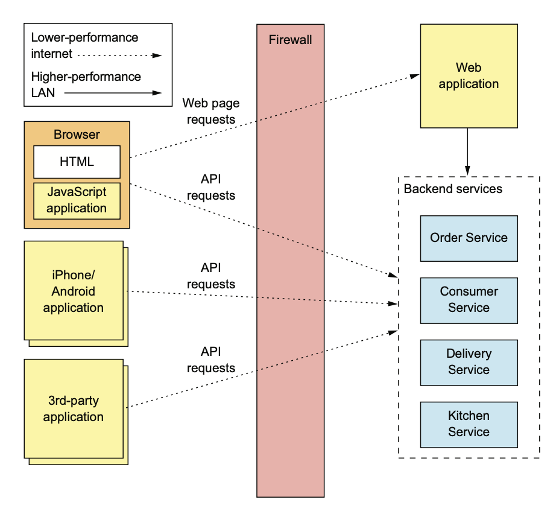
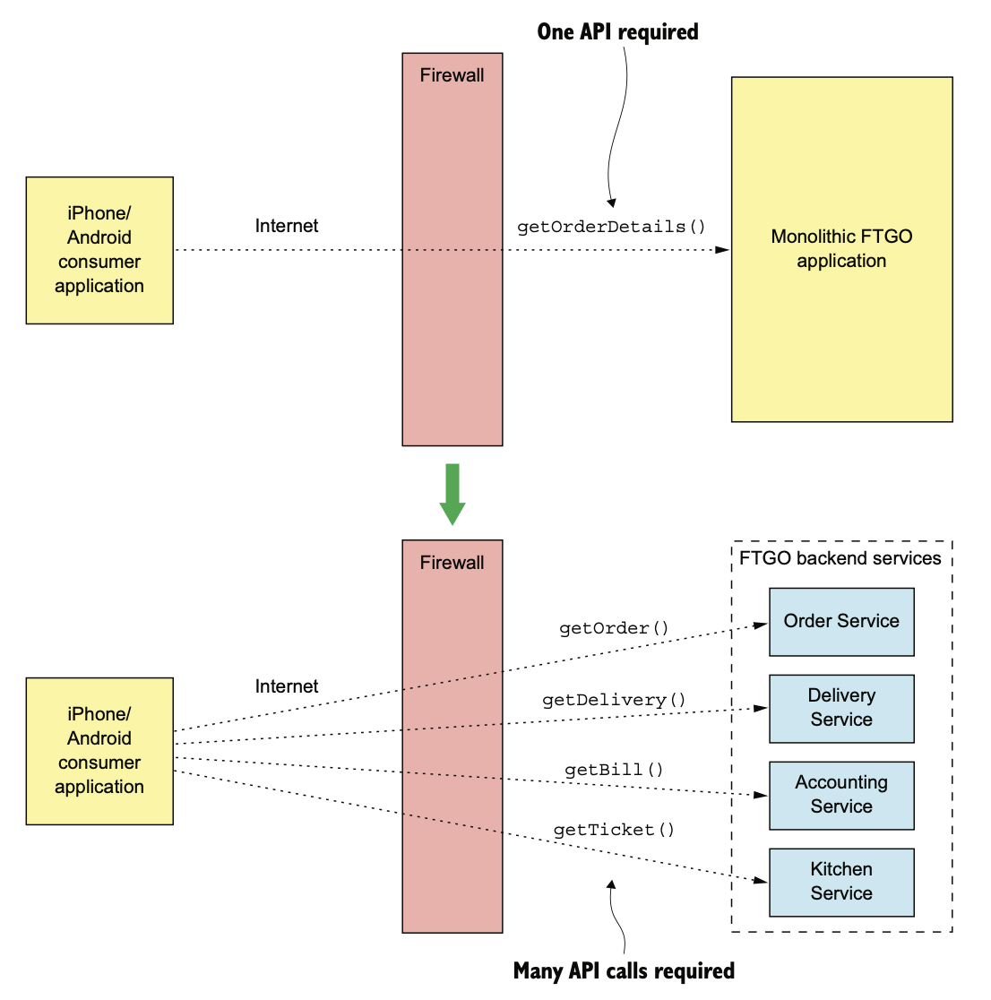

# 8.1.0 서론

FTGO Application의 API를 호출하는 Client는 다음과 같다.

- 브라우저 기반 일반 소비자 / 음식점 전용 UI, 내부 관리자용 UI가 구현된 Application
- 브라우저에서 실행중인 Javascript Application
- 소비자 / 배달원용 모바일 앱
- Third party Application

Web Application은 방화벽 내부에서 실행되기 때문에 **대역폭이 높고 지연 시간이 짧은 LAN**을 통해 서비스에 접속한다.

하지만 다른 Client는 방화벽 외부에 있기 때문에 대역폭이 낮고 지연율이 높은 인터넷이나 모바일 네트워크로 서비스에 접근해야 한다.

 

Client가 매우 직관적이게 서비스에 직접 요청하도록 할 수도 있다.

하지만 그런 방식은 다음과 같은 단점들이 있다.

- Service API가 나누어져 있기 때문에 Client가 필요한 데이터를 가져오려면 요청을 여러번 해야한다.
  그만큼 효율은 낮아지고, UX는 안좋아진다.
- Client가 서비스와 API를 알아야 하기 때문에 캡슐화가 제대로 되지 않고, 나중에 아키텍쳐나 API를 바꾸기도 어렵다.
- Client가 사용하기 불편하거나 실용적이지 않은 IPC를 서비스에서 사용중일 수도 있다.

# 8.1.1 Issues On Mobile Client

소비자는 FTGO Moblie Client에서 주문을 하고, 주문 이력을 관리한다.

기본적인 주문 정보와 배달중일 경우 배달 상태를 한 눈에 볼 수 있는 주문 조회 View를 개발한다고 가정해 보자.

 

Monolithic Application에서는 그냥 주문 내역을 반환하는 API를 노출시켜주면 되지만, Mobile Client가 원하는 정보를 요청하면 한 번에 반환해 줄 수 있었다.

하지만 MSA는 데이터가 여러 서비스에 분산되어 있다.

- 주문 서비스: 기본 주문 정보
- 주방 서비스: 음식점 관점에서 본 주문 상태와 픽업 준비를 마칠 예상 시간
- 배달 서비스: 주문 배달 상태, 예상 배달 시간, 현재 위치
- 회계 서비스: 주문 지불 상태

만약 Mobile Client가 직접 호출하는 구조라면 서비스를 여러번 호출해야 한다.

이렇게 설계하면 많은 단점들이 발생하게 된다.

## Client가 너무 자주 요청해서 UX가 나쁘다.

앱이 사용자에게 보여줄 데이터를 여러 번 요청해야 하기 때문에, 높은 지연시간으로 인해 앱이 멈춘 것 처럼 보일 수도 있다.

인터넷은 LAN보다 지연시간이 100배는 오래걸리기 때문에 별로 좋은 방법은 아니다.

모바일 앱은 대부분 동시에 요청을 보내 지연시간을 최소화 하기 때문에 별 문제가 없을 수도 있다.

하지만 Client가 어떠한 이유로 인해 동시에 요청을 보낼 수 없다면 UX가 나빠지게 된다.

 

또한 복잡한 API 조합 코드를 작성해야 하기 때문에 UX를 개선하는 등의 개발도 힘들다.

## 캡슐화되지 않아 Frontend와 Backend가 밀접하게 연관된다.

Application이 발전함에 따라, 서비스 개발자는 하위 호환이 안되게 바꿔야 할수도 있게 된다.

System을 여러 서비스로 분해하는 등 체계 자체를 건드릴 수도 있고, 서비스가 나뉘거나 병합될 수도 있다.

그런데 이게 Client쪽에서 세부 서비스에 대한 정보가 있다면 해당 서비스를 호출하는 Client들이 모두 바껴야 한다.

특히 모바일 앱은 새 버전을 출시하기가 굉장히 까다롭기 때문에 치명적이다.

## Client에게 비 친화적인 IPC를 사용하는 서비스

보통 HTTP, WebSocket과 같은 프로토콜을 사용한다.

하지만 서비스 개발자가 선택할 수 있는 프로토콜은 gRPC, AMQP 등 다양하게 선택할 수 있다.

서비스끼리는 쉽게 통신할 수 있을지 몰라도, 앱에선 사용하기 어려운 경우도 많고 방화벽 친화적이지 않은 경우도 많다.

# 8.1.2 Issue On Another Client

## Issue On Web Application

전통적인 서버는 HTTP 요청을 받아 HTML을 반환하며, 방화벽 내부에서 실행되고 LAN으로 서비스에 접근한다.

Web Application에 API 조합 로직을 구현할 때 지연 시간이나 대역폭은 별 문제가 되지 않는다.

사실 Web Application은 웹에 비 친화적인 프로토콜을 사용하여 서비스에 접근할 수 있다.

백엔드 팀은 다른 백엔드 팀과 긴밀하게 협업하기 때문에 서비스가 바뀔 때마다 Web Application도 수정할 수 있다.

따라서 Web Application이 직접 서비스에 접근하는건 가능하다.

## 브라우저 기반 Javascript Application

요즘 브라우저 Application은 대부분 JS를 사용한다.

서버쪽에선 주로 HTML을 생성하지만, 서비스를 호출하는건 대부분 브라우저의 JS라고 할 수 있다.

브라우저 기반의 JS Application을 수정하는건 쉽지만, 모바일 앱과 같이 인터넷으로 서비스에 접근하기 때문에 네트워크 지연 문제는 여전히 존재한다.

 

또한 브라우저 기반의 UI쪽은 일반 앱보다 더 많은 서비스를 조합해야 하는 경우가 많다.

따라서 효율적으로 API를 조회하기 힘들다.

## Third Party Application

개발자들을 위해 외부에 공개한 API를 제공한다.

이런 Third Party Application은 인터넷을 통해 API에 접근하기 때문에 API조합 패턴을 하기엔 비효율적이다.

하지만 Third Party Application을 위한 API를 설계하는 것에 비하면 사소한 문제이다.

 

Third Party개발자에게 새 버전의 API를 사용하도록 강요하기 힘들다.

