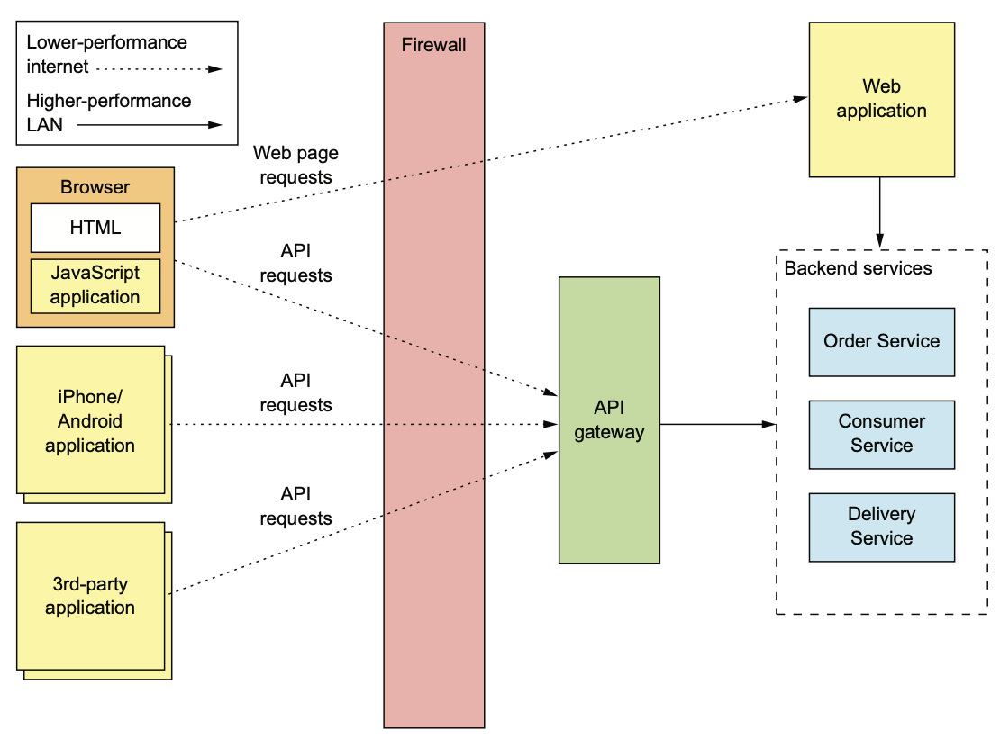
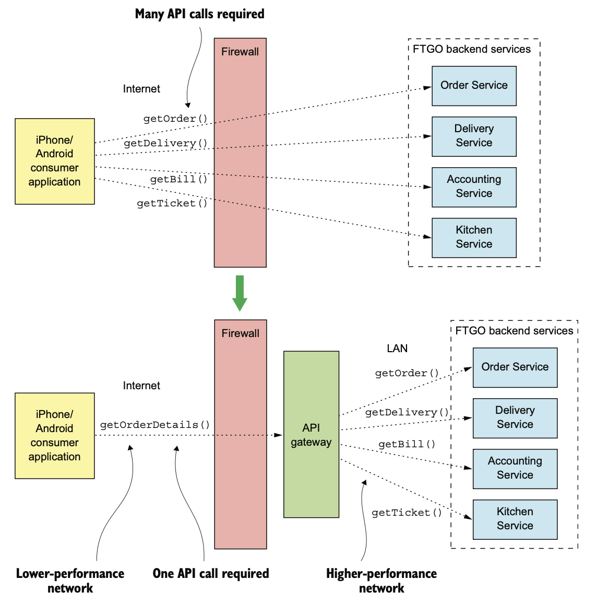
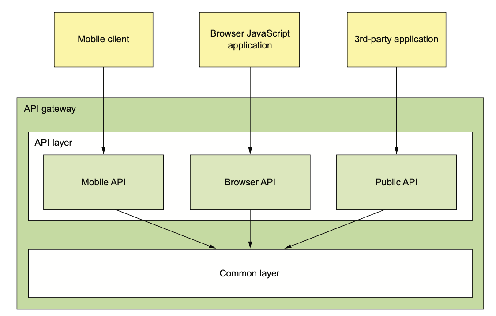
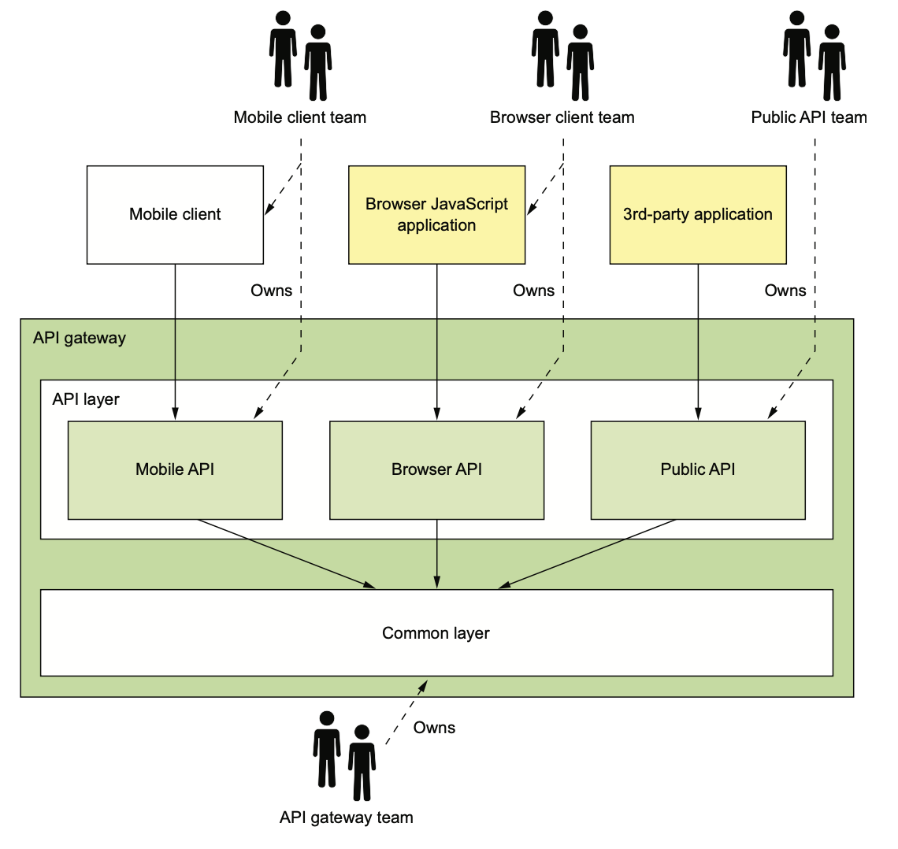
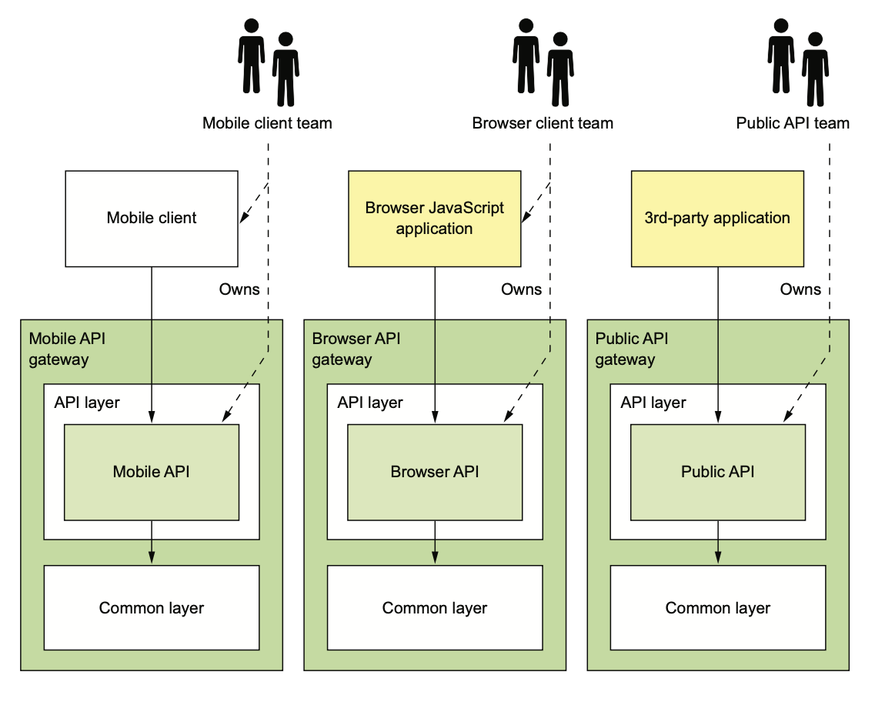

# 8.2.1 API Gateway Pattern Overview

API Gateway는 **방화벽 외부의 Client가 Application에 API 요청을 할 수 있도록 돕는 창구**같은 느낌이다.

객체 지향 설계에서 볼 수 있는 Facade 패턴과 비교하면 편한데, **내부 Application Architecture를 캡슐화하고 Client에게는 단일 API를 제공**한다.



API Gateway는 다음 역할을 한다.

- 요청 Routing
- API 조합
- Protocol 전환

**외부 Client의 요청은 모두 API Gateway를 지나고 API Gateway는 적절하게 요청을 서비스로 라우팅 해준다.**

API 조합 패턴으로 요청을 처리하기도 하고, Client 친화적인 HTTP와 같은 Protocol에서 비 친화적인 gRPC와 같은 Protocol로 변환할 수도 있다.

## 요청 Routing

요청 Routing은 API Gateway의 주요 기능 중 하나로, 요청이 들어오면 Routing Map을 찾아보고 어느 서비스에 보낼지 결정하게 된다.

Routing Map은 예를 들어 요청이 들어온 HTTP Method + HTTP URL을 서비스의 URL에 매핑할 수 있다.

Nginx의 Reverse Proxy와 비슷하다고 보면 된다.

## API 조합

API Gateway는 단순한 Reverse Proxy보다 많은 일을 처리한다.

API 조합 패턴도 API Gateway에서 처리하는 작업 중 하나이다.

예를 들어 API Gateway에 구현된 주문 내역 조회 API는 API 조합 패턴으로 조회한다.

다음 그림과 같이 API Gateway에 요청 한 번 보내면 API Gateway가 서비스에 쿼리해 준다.



## Protocol 변환

API Gateway는 Protocol 변환을 수행한다.

덕분에 Application 내부에서 RestAPI와 gRPC를 혼용하더라도 외부에는 RestAPI를 제공해 줄 수 있다.

## API Gateway는 Client마다 적합한 API를 제공

API Gateway는 만능 API를 제공한다.

각각의 API는 Client마다 필요로 하는 데이터도 천차만별이다.

예를 들어 Third Party Application은 모든 정보가 필요하지만, Mobile Client는 그 중 일부만 필요할 수도 있다.

다양한 Third Party Application을 제공하는 Public API는 어떤 Field와 어떤 객체를 반환해야 할지 Client가 요청 시 지정할 수도 있겠지만, Client에게 제어권을 넘기는 경우는 잘 없다.

<br>

따라서 API Gateway가 각 Client들에게 맞춤형 API를 제공하는 편이 좋다.

예를 들어 앱 Client에게는 앱에 맞는 API를 제공하는게 낫다.

안드, iOS끼리도 나눌 수 있고, Third Party용으로도 나눌 수 있다.

뒤에서 설명할 BFF 패턴은 Client마다 API Gateway를 따로 정의해서 Client 맞춤형 API 개념을 발전시킨 패턴이다.

## Edge Functions

API Gateway는 Edge Functions도 지원한다.

Edge Functions는 Application의 끝에서 요청을 처리하는 함수이다.

- Authentication: 요청한 사용자의 신원 확인
- Authorization: 작업을 수행할 권한이 있는지 확인
- rate limiting: Client의 초당 요청 개수 제한
- caching: 요청 횟수를 줄이기 위해 Response Cache
- Metrics collection: 분석용 API 사용 지표 수집
- Request Logging: 요청을 Logging

<br>

Edge Functions가 구현될 곳은 세 부분으로 나눌 수 있다.

### 1. Backend Service

Caching, Metrics, Authorization을 Backend Service에서 구현하면 적합할 할 것 같다.

하지만 보통 서비스에 요청을 보내기 전에 Edge Functions에서 요청을 검증하는게 더 낫다.

### 2. API Gateway 이전(Upstream)

요청이 API Gateway에 들어오기 전, 이러한 작업을 처리한다.

### 3. Dedicated Edge Service

**관심사가 분리**된다는 장점을 가지게 된다.

API Gateway는 API Routing과 조합해 주는데 집중하고, Authentication처럼 중요한 Edge Functions들의 책임을 중앙화 할 수 있다.

이 방식의 단점이라면 네트워크를 타는 횟수, 즉 hop의 개수가 증가하기 때문에 네트워크 지연 시간이 늘어나고 Application의 복잡도도 증가한다.

## API Gateway Architecture

API Gateway는 API Layer와 Common Layer로 구성된 모듈 아키텍쳐이다.



API Layer에는 **독립적인 하나 이상의 API Module**이 있고, 각 API Module에는 특정 Client를 위한 API가 구현되어 있다.

Common Layer에는 Edge Functions 등의 공통 기능이 구현되어 있다.

 <br>

이 API Gateway에는 세 가지 Module이 존재한다.

- Mobile API
- Browser API
- Public API

API Module은 두 가지 방법으로 API Operation을 구현한다.

1. 서비스 API 하나에 매핑되는 API Operation은 해당하는 API에 요청을 보내준다.

   범용 Routing 규칙이 정의된 파일을 읽어 Generic Routing Module을 응용할 수 있다.

   

2. API를 조합하는 복잡한 작업은 사용자 정의 코드로 구현해야 한다.

   API를 구현한 코드는 여러 서비스를 호출하여 결과를 조합해 준다.

## API Gateway 소유권 Model

API Gateway의 개발은 누가 담당해야 할지 결정하는데에는 몇가지 방법이 있다.

### API Gateway를 전담하는 팀 생성

팀이 ESB 개발을 SOA와 비슷하다.

하지만 앱 개발자가 어떤 서비스 API에 접근해야 하는데, API Gateway 팀에 요청을 해서 작업이 끝날 때까지 기다리는 방법밖에 없다.

느슨하게 결합된 팀을 추구하는 MSA에서 이렇게 중앙에서 병목현상이 발생하게 되면 안된다.

Netflix에서 권장하는 것 처럼 **API를 만든 팀이 API Gateway를 담당**하는게 좋다.

따라서 API Gateway팀은 Common Module을 만들고 Gateway 운영 이슈에 집중하는게 좋다.

API를 변경할 일이 생기게 되면 해당 팀이 변경한 소스를 API Gateway Repository 커밋한다.

매끄러운 협업을 위해선 CI/CD를 구축해서 배포 파이프라인을 완전히 자동화 하는게 좋다.

### Frontend Pattern을 위한 Backend

문제는 책임 소재가 불분명해 지는 것이다.

*여러 팀의 사람들이 같은 Repository에 커밋하고, API Gateway 팀은 그 운영을 맡는다*라는 구조는 책임 소재가 불분명하다.

"빌드한 사람이 임자다"라는 마인드는 MSA의 철학과 잘 맞지 않는다.



해결 방법은 **각 Client마다 API Gateway를 따로 두는 BFF 방식**이다.



Public API팀은 자신만의 API Gateway를 소유 / 운영하고, 앱 팀도 자신만의 API Gateway를 소유 / 운영하게 된다.

이론상 API Gateway들은 각자 다른 기술스택을 적용해서 개발할 수 있지만, Common이 중복될 가능성이 있기 때문에 API Gateway의 기술스택은 통일하는게 편하다.

여기서 말하는 Common은 API Gateway팀에서 개발한 공유 라이브러리를 의미한다.

BFF의 장점은 다음과 같다.

1. API 모듈들이 서로 격리된다.
2. API Module이 자체 Process로 작동되기 때문에 관측성도 좋아지고, 독립적으로 확장하기도 좋다.
3. API Gateway를 더 작고 단순한 Application으로 유지할 수 있기 때문에 시간도 단축된다.

# 8.2.2 API Gatway의 장단점

## 장점

- Application의 내부 구조 캡슐화
- Client마다 최적의 API를 제공하여 Client - Application 사이의 통신 수도 줄일 수 있다.

## 단점

- 개발 / 배포 / 관리를 할 고가용 Component가 하나 증가하게 된다.
- API Gateway가 개발 병목 지점이 될 수도 있다.

이런 단점들에도 불구하고 BFF 패턴으로 API를 독립적으로 개발 / 배포할 수 있기 때문에 API Gateway를 사용하는게 합리적이다.

# 8.2.3 API Gateway: on Netflix

Netlix는 잘 알려진 API Gateway 예제이다.

Netflix에서도 처음에 Streaming Service API를 하나의 API Gateway로 노출시키려고 했었다.

하지만 Device 종류가 너무 많아서 힘들다는 사실을 깨닫고, Device마다 API Gateway를 두고, API Gateway를 구현하는건 각 팀에서 담당한다.

<br>

처음에는 각 Client 팀에서 Groovy Script로 API 조합 / Routing 수행하는 API를 작성했다.

각각의 Script는 Service Team에서 제공한 Java Client 라이브러리로 하나 이상의 API를 호출한다.

별 문제 없이 Client 개발자는 수 천개의 Script를 작성하게 되었다.

Netflix API Gateway는 하루 수십억건의 요청을 처리하고, API 호출당 6~7개의 서비스가 관여한다.

Netflix에서는 이런 방식으로는 운영하기 힘들다는걸 알고, BFF와 비슷한 패턴으로 이전중이다.

<br>

새로운 아키텍쳐에선 API Module을 NodeJS로 개발하고, 각각의 API Module은 Docker에서 실행된다.

script는 서비스를 직접 실행하는게 아니라 Netflix Falcor를 통해 서비스 API를 노출해 주는 Second API Gateway를 호출한다.

Netflix Falcor는 선언형으로 API를 동적 조합하는 기술로, Client 요청 하나에 여러 서비스를 호출할 수 있도록 해준다.

이런 아키텍쳐 덕분에 API Module은 서로 분리되어 신뢰성 / 관측성은 향상되고 Client API Module은 독립적 확장이 가능하다.

# 8.2.4 API Gateway

API Gateway를 설계할 때에는 다음 요소들을 검토해 보아야 한다.

## 성능과 확장성

API Gateway는 요청이 들어오는 문이고, 외부 요청은 모두 API Gateway를 거쳐야 한다.

그 때문에 API Gateway의 성능과 확장성은 굉장히 중요한 포인트이다.

여기서 API Gateway에 동기 / 비동기를 사용하는지는 성능과 확장성에 큰 영향을 준다.

<br>

동기는 요청마다 하나의 Thread를 만들어 사용한다.

따라서 간단하고 잘 작동하는 편이다.

그러나 동기는 무거운 OS Thread를 사용하기 때문에 Thread수에 제약이 있고, 따라서 API Gateway에 요청할 수 있는 수도 제한적이다.

반면 비동기는 단일 Event Loop Thread가 요청을 Event Handler로 매핑해 준다.

비동기는 다중 Thread를 사용하는 오버헤드가 없어서 확장성이 좋지만, 복잡하고 디버깅이 어렵다는 단점이 있다.

또한 Event Handler는 Event Loop에서 Blocking이 일어나지 않도록 제어권을 빠르게 반환해 주어야 한다.

<br>

실제로 Netflix에서 Zulu을 NIO로 수정했다.

NIO는 어느 한 작업으로 인해 Blocking되는 Thread를 없애 Network Connection의 비용을 절약했고, Zuul Cluster에서 IO 작업은 25% 성능을 향상시키고, CPU 사용률을 25% 절약했다.

하지만 CPU작업에서는 별 차이가 없었다.

## Reactive Programming 추상체 사용

API Gateway는 여러 서비스 결과를 조합한다.

서비스에 따라 Client 요청 파라미터에 의존하는 것도 있고, 다른 서비스의 결과에 의존하는 것도 있다.

한 가지 방법은 API Endpoint Handler가 의존성에 따라 서비스 호출 순서를 달리하는 방법이다.

``` java
@RestController
public class OrderDetailsController {
    
    @RequestMapping("/order/{orderId}")
    public OrderDetails getOrderDetails(@PathVariable String orderId) {
        OrderInfo orderInfo = orderService.findOrderById(orderId);
        
        TicketInfo ticketInfo = kitchenService
            .findTicketByOrderId(orderId);
        
        DeliveryInfo deliveryInfo = deliveryService
            .findDeliveryByOrderId(orderId);
        
        BillInfo billInfo = accountingService
            .findBillByOrderId(orderId);
        
        OrderDetails orderDetails = OrderDetails
            .makeOrderDetails(orderInfo, ticketInfo, deliveryInfo, billInfo);
        
        return orderDetails;
    }
    ...
```

하지만 서비스를 순차적으로 호출하는 것은 서비스의 응답 시간의 총 합만큼 기다려야 한다.

응답 시간을 조금이나마 줄이기 위해선 최대한 동시에 서비스를 호출하도록 해야한다.

<br>

원래는 Callback으로 동시성 코드를 작성했다.

사실 비동기, Event Driven IO도 대부분 원래 Callback 기반이고, 서비스를 동시에 호출해야 하는 API Composer도 대부분 Callback을 이용한다.

`ExecutorService.submitCallback()`을 호출하여 요청을 동시에 처리하는 방식이다.

하지만 문제는 이 메소드가 Blocking API를 가지고 있는 Future를 반환한다는 것이다.

확장성을 위해선 API Composer가 `ExecutorService.submit(Runnable)`을 호출하고, 각각의 Runnable이 요청 결과를 넘겨 Callback을 호출하는게 좋다.

<br>

기존의 Callback 방식으로 API Composer를 짜면 Callback Hell에 빠지기 쉽상이다.

코드가 뒤엉켜 알아보기 힘들고, 특히 병렬로 실행하는 것과 순차적으로 실행하는 것을 섞어야 할 때 문제가 발생하기 쉽다.

따라서 API Composer는 Reactive하게 선언형으로 만드는게 좋다.

## 부분 실패 처리

API Gateway는 확장성도 필요하지만 안정적이어야 한다.

부하 분산기 뒤에 여러 API Gateway를 켜놓고 동작시키면 되는 일이다.

부하 분산기는 알아서 적절한 API Gateway에 요청을 라우팅해 준다.

<br>

실패한 요청, 그리고 지연시간이 너무 긴 요청도 적절하게 처리해 주어야 한다.

API Gateway가 서비스를 호출했는데, 서비스가 갑자기 느려지거나 응답 불능에 빠질 가능성도 염두에 두어야 한다.

만약 서비스가 요청에 응답할 수 없는 상황이라면 리소스만 계속해서 소모하고 Client에게는 응답을 주지 못하는 결과를 낳을 수도 있기 때문이다.

이를 해결하기 위해 회로 차단기 패턴을 사용할 수 있다.

## Architecture의 Good Citizen이 되어야 한다

3장에서 설명한 Service Discovery 패턴을 통해 API Gateway같은 Client가 자신이 호출할 Service Instance의 위치를 파악할 수 있다.

11장에서 설명할 Observability를 활용하면 개발자가 Application의 상태를 모니터링하고, 문제를 발견하는데 도움이 된다.

