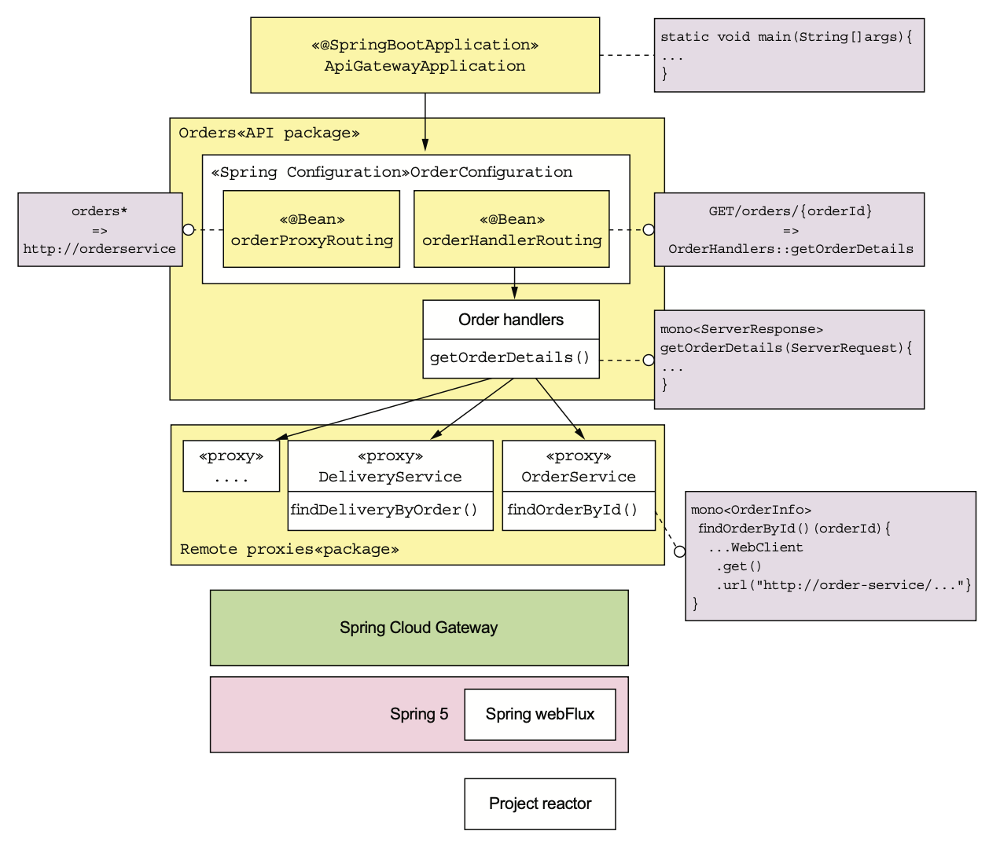
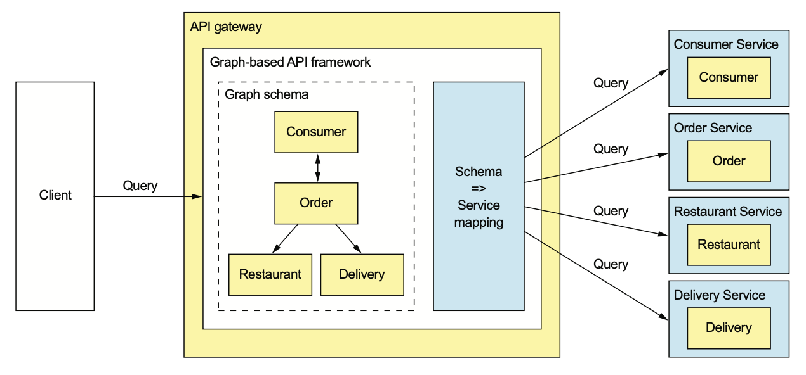
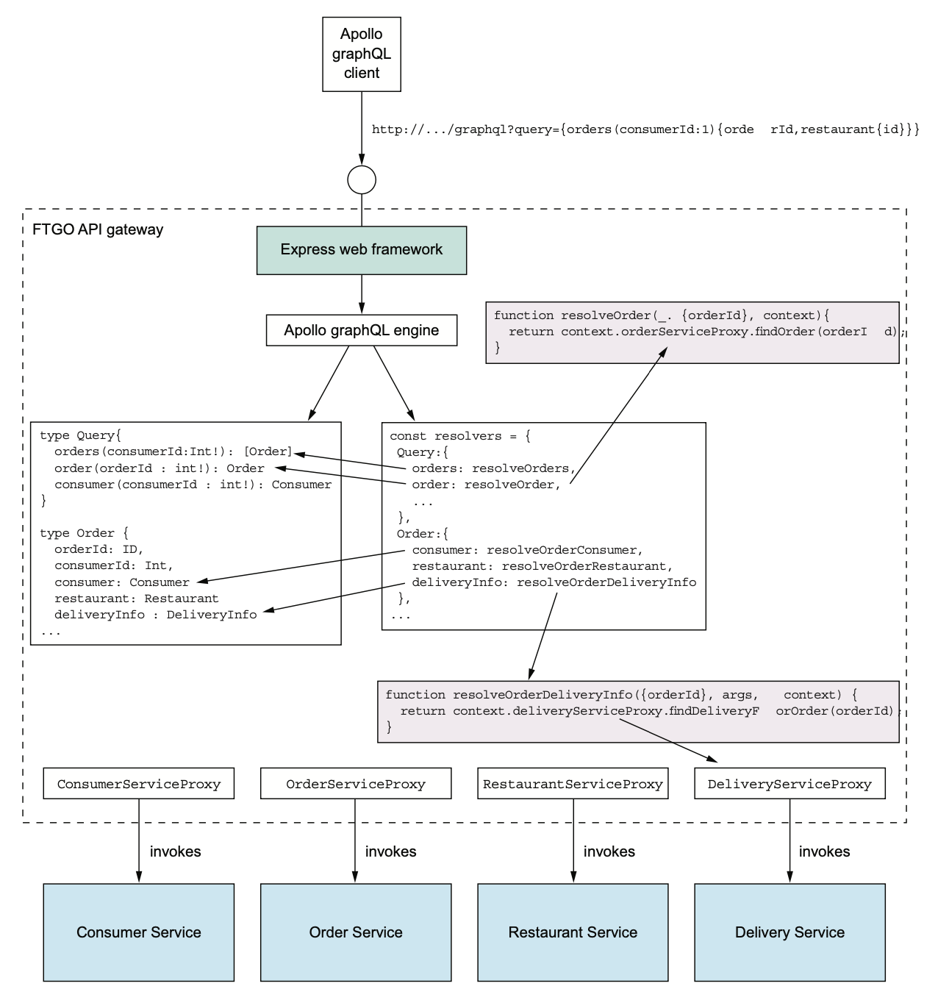
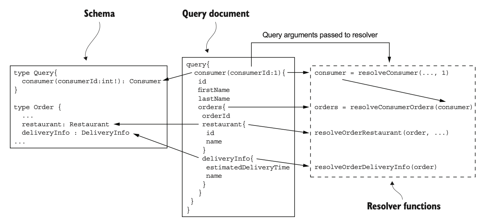

# 8.3.0 서론

API Gateway를 구현하는 방법은 두 가지가 있다.

- **off-the-shelf API Gateway Product / Service 사용:** 개발하는 노력은 거의 없겠지만 유연성은 매우 떨어진다.

  예를 들어 API Composer를 거의 지원하지 않는다.

- **API Gateway Framework를 사용하거나 Web Framework로 직접 구현:** 가장 유연한 방식이지만 많은 개발 노력을 투입해야 한다.

# 8.3.1 기성 API Gateway Product / Service 사용

API Gateway 기능이 구현된 서비스나 제품은 다양하다.

그 중 AWS의 서비스부터 소개하고, 직접 구성할 수 있는 제품을 몇 가지 소개할 것이다.

## AWS API Gateway

AWS에서 제공하는 서비스로, 하나 이상의 HTTP Method를 제공하는 Rest Resource 모음이다.

HTTP Method와 Resource는 백엔드 서비스로 라우팅 해줄 수 있다.

필요하다면 Template 기반으로 Request / Response로 구성할수도 있으며 인증 기능 또한 내장되어 있다.

<br>

AWS API Gateway는 앞에서 설명한 대부분의 기능을 충족한다.

처음에 구성만 잘 해두면 확장 등의 문제는 AWS에서 알아서 처리해 주기 때문에 신경하지 않아도 된다.

<br>

하지만 다음과 같은 단점들이 있다.

1. API Composer로써의 역할을 지원하지 않는다.

2. JSON 위주의 HTTP(S)와 Server Discovery Pattern만 지원한다.

   Application은 AWS ELB로 EC2나 ECS로 요청을 분산한다.

이런 단점이 있다면 API 조합 패턴이 굳이 필요 없다면 이정도도 충분한 서비스이다.

## AWS Application Load Balancer

AWS ALB는 HTTP, HTTPS, WebSocket, HTTP/2용 부하 분산기이다.

기능 자체는 AWS API Gateway와 비슷하다고 할 수 있다.

AWS EC2 Instance로 라우팅 하는 규칙이 정의되어 있다.

하지만 기능이 제한적이고 HTTP 메소드 기반의 라우팅, API 조합, 인증같은 로직은 없다.

## 다른 제품

Kong이나 Traefik과 같이 우리가 직접 설치 / 운영할 수 있는 오픈소스 제품도 있다.

Kong은 Nginx, Traefik은 Go로 작성된 API Gateway이다.

두 제품 모두 HTTP Method, Header, 경로를 통해 서비스를 선택하는 유연한 라우팅 규칙을 선택해 줄 수 있다.

Kong은 Edge Functions Plugin을, Traefik은 Registry에 연동할 수 있다.

하지만 API 조합 패턴은 지원하지 않는다는 단점이 있다.

# 8.3.2 API Gateway 개발

API Gateway는 그냥 다른 서비스로 라우팅해주는 서비스이기 때문에 개발하기 어려운 부분은 딱히 없다.

하지만 다음 두 가지 이슈는 고민해봐야 한다.

- 코드 복잡도를 최소화 할 수 있는 라우팅 규칙 정의 메커니즘
- HTTP Header 처리 등 Proxy로직 구현

좋은 프레임워크를 사용하면 이미 구현된 기능을 사용하면 되기 때문에 코드양이 줄어든다.

<br>

이 책에서는 Zuul과 Spring Cloud Gateway를 사용한다.

## Netflix Zuul

Routing, rate limiting, Authentication과 같은 Edge Functions가 탑재된 프레임워크이다.

개념 자체는 Servlet Filter나 Interceptor와 비슷하다.

HTTP 요청을 변환하는 filterChain을 적절하게 조합해서 요청을 처리하고, 서비스를 호출하고, Client에게 반환하기 전에 응답을 가공한다.

Zuul을 그냥 사용할 수도 있겠지만, Pivotal에서 개발한 Spring Cloud Zuul을 사용하면 더 단순하고, 유연하게 개발할 수 있다.

<br>

하지만 경로 기반의 라우팅만 지원한다는 크나큰 단점이 있다.

예를 들어, `GET /orders`로 들어온 요청을 `POST /orders`로 라우팅 할 수는 없다.

또한 7장의 쿼리 아키텍쳐도 지원하지 않는다.

## Spring Cloud Gateway

Spring 5, Spring Boot 2, Spring Webflux등의 프레임워크 기반 API Gateway Framework이다.



- **ApiGateWay 패키지:** API Gatway 메인 프로그램
- **하나 이상의 API Package:** API Endpoint가 구현된 API Package
- **Proxy Package:** Service를 호출하기 위해 API Package가 사용하는 Proxy Class들

<br>

OrderConfiguration은 주문 관련 요청을 Routing하는 Spring Bean이 정의된 클래스이다.

API요청을 서비스에 매핑하는 규칙은 orderProxyRouting Bean에 정의된다.

예를 들어, `/order`로 시작되는 요청들은 OrderService로 매핑해 준다.

<br>

orderHandlerRouter Bean은 orderProxyRouting Bean에 정의된 규칙을 override한다.

API 요청을 Handler 메소드, 즉 Spring Webflux 메소드를 호출한다.

예를 들어 `GET /orders/{orderId}`는 `OrderHandlers::getOrderDetails()`에 매핑된다.

OrderHandlers에 `getOrderDetails()`는 API를 조합해서 주문 내역을 조회한다.

OrderService같은 서비스는 Remote Proxy Class로 호출한다.

### OrderConfiguration

OrderConfiguration은 `/order`에 대한 요청을 처리하는 Spring Bean이다.

Spring Webflux Routing DSL로 정의된 요청 라우팅은 orderProxyRouting, orderHandlerRouting에 정의되어 있다.

``` java
@Configuration
@EnableConfigurationProperties(OrderDestinations.class)
public class OrderConfiguration {
    
    @Bean
    public RouteLocator orderProxyRouting(
        RouterLocatorBuilder builder,
        OrderDestinations orderDestinations
    ) {
        return builder.routes()
            .route(r -> r.path("/orders")
				.and().method("POST").uri(orderDestinations.getOrderServiceUrl()))
            .route(r -> r.path("/orders")
                .and().method("PUT").uri(orderDestinationsgetOrderServiceUrl()))
			.route(r -> r.path("/orders/**")
                .and().method("POST").uri(orderDestinationsgetOrderServiceUrl()))
			.route(r -> r.path("/orders/**")
                .and().method("PUT").uri(orderDestinationsgetOrderServiceUrl()))
			.route(r -> r.path("/orders")
                .and().method("GET").uri(orderDestinationsgetOrderServiceUrl()))
    }
    
    @Bean
    public RouterFunction<ServerResponse> orderHandlerRouting(OrderHandlers orderHandlers) {
        return RouterFunctions.route(
            GET("/orders/{orderId}"),
            orderHandlers::getOrderDetails
        );
    }
    
    @Bean
    public OrderHandlers orderHandlers(
        OrderService orderService,
        KitchenService kitchenService,
        DeliveryService deliveryService,
        AccountingService accountingService
    ) {
        return new OrderHandlers(orderService, kitchenService, deliveryService, accountingService);
    }
}
```

위에서 볼 수 있다싶이 OrderDestinations는 `@ConfigurationProperties`로 서비스 URL을 외부에서 설정할 수 있다.

``` java
@ConfigurationProperties(prefix = "order.destinations")
@Getter
public class OrderDestinations {
    @NotNull
    private String orderServiceUrl;
}
```

이 클래스 덕분에 서비스 URL을 환경변수에 넣거나 OS의 ORDER_DESTINATIONS_ORDER_SERVICE_URL로 지정할 수 있다.

### OrderHandlers

`getOrderDetails()` 메소드는 API 조합을 비롯한 비지니스 로직들이 구현된 Event Handler가 있다.

서비스에는 실제로 요청을 해주는 여러 Proxy Class가 주입된다.

``` java
@RequiredArgsConstructor
public class OrderHandlers {
    private final OrderService orderService;
    private final KitchenService kitchenService;
    private final DeliveryService deliveryService;
    private final AccountingService accountingService;
    
    public Mono<ServerResponse> getOrderDetails(ServerRequest serverRequest) {
        String orderId = serverRequest.pathVariable("orderId");
        
        Mono<OrderInfo> orderInfo = orderService.findOrderById(orderId);
        Mono<Optional<TicketInfo>> ticketInfo = kitchenService.findTicketByOrderId(orderId)
            .map(Optional::of) // TicketInfo를 Optional<TicketInfo>로 변환한다.
            .onErrorReturn(Optional.empty()); // 에러가 나면 Optional.empty로 변환한다.
        
        Mono<Optional<DeliveryInfo>> deliveryInfo = deliveryService.findDeliveryByOrderId(orderId)
            .map(Optional::of)
            .onErrorReturn(Optional.empty());
        
        Mono<Optional<BillInfo>> billInfo = accountingService
            .findBillByOrderId(orderId)
            .map(Optional::of)
            .onErrorReturn(Optional.empty());
        
        Mono<Tuple4<OrderInfo, Optional<TicketInfo>,
             Optional<DeliveryInfo>, Optional<BillInfo>>> combined =
                 Mono.when(orderInfo, ticketInfo, deliveryInfo, billInfo); // 4개의 값을 하나로 합친다.
        
        // Tuple 4개를 OrderDetails로 변환한다.
        Mono<OrderDetails> orderDetails = combined.map(OrderDetails::makeOrderDetails);
        
        // OrderDetails를 ServerResponse로 변경한다.
        return orderDetails.flatMap(person -> ServerResponse.ok()
					.contentType(MediaType.APPLICATION_JSON)
					.body(fromObject(person)));
    }
}
```

`getOrderDetails()`는 API를 조합해서 주문 내역을 조회한다.

1. 요청의 pathVariable에서 orderId를 가져온다.
2. Proxy를 통해 네 서비스를 비동기로 동시에 호출하고, 가용성을 위해 `onError(Optional.empty())`를 사용한다.
3. 값 4개가 포함된 `Mono<Tuple4>`에서 `Mono.when()`으로 조합한다.
4. `OrderDetails::makeOrderDetails`를 호출해서 `Mono<Tuple4>`를 `Mono<OrderDetails>`로 변환한다.
5. Spring Webflux에서 ServerResponse로 OrderDetails를 반환한다.

### OrderServiceProxy

OrderServiceProxy는 주문 서비스용 Proxy Class다.

WebClient를 통해 주문 서비스를 호출해 준다.

``` java
@RequiredArgsConstructor
@Service
public class OrderServiceProxy {
    private final OrderDestinations orderDestinations;
    private final WebClient client;
    
    public Mono<OrderInfo> findOrderById(String orderId) {
        Mono<ClientResponse> response = client
            .get()
            .uri(orderDestinations.orderServiceUrl + "/orders/{orderId}", orderId)
            .exchange();
        
        return response.flatMap(resp -> resp.bodyToMono(OrderInfo.class));
    }
}
```

OrderInfo를 조회하는 `findOrderById()`WebClient로 주문 서비스에 HTTP 요청을 전송한다.

그리고 수신한 JSON을 OrderInfo로 역직렬화 한다.

### ApiGatewayApplication

API Gateway의 main함수가 담긴 클래스이다.

``` java
@SpringBootConfiguration
@EnableAutoConfiguration
@EnableGateway
@Import(OrdersConfiguration.class)
public class ApiGatewayApplication {
    public static void main(String[] args) {
        SpringApplication.run(ApiGatewayApplication.class, args);
    }
}
```

Spring Cloud Gateway는 API Gateway를 구현하기에 굉장히 좋은 프레임워크이다.

간결한 Routing은 DSL로, API 조합이나 프로토콜 변환은 Handler Method로 쉽게 구현할 수 있다.

# 8.3.3 API Gateway 개발 - GraphQL

주문 내역을 반환해 주는 `GET /orders/{orderId}` Endpoint를 API Gateway에 구현한다고 해보자.

간단하게 보일 수도 있지만 여러 서비스에서 데이터를 가져오기 때문에 서비스를 호출하고 API를 조합하는 코드를 작성해야 한다.

Client마다 필요한 데이터가 다른것도 문제가 될 수 있다.

<br>

그렇다면 Client가 자신이 필요한 데이터를 지정하면 된다.

expand라는 매개변수로 관련 리소스를 지정하고, field라는 매개변수로 반환될 필드를 지정할 수 있다면 된다.

혹은 BFF의 일부로 endpoint를 여러 버전으로 정의할 수도 있다.

하지만 API Gateway의 수많은 API들을 이렇게 구현하는건 힘들다.

<br>

GraphQL처럼 효율적으로 데이터를 가져오도록 설계된 그래프 기반 API를 필요로 하게 되버린다.

Graph 기반 API Framework는 Graph기반 Schema로 API를 구성하는게 핵심이라고 할 수 있다.

Graph 기반 Schema는 Property와 다른 연관된 Node를 정의한다.



Graph 기반 API의 장점은 다음과 같다.

- Client가 반환할 데이터를 제어할 수 있다.
- 개발하는 노력을 엄청나게 줄일 수 있다.

<br>

이 챕터에선 GraphQL로 API Gateway를 구축하는 몇 가지 방법을 소개한다.

> Netflix Falcor도 Graph기반 API 기술로, 서버 데이터를 JSON 객체 그래프로 Modeling하고, Client는 Falcor 서버에 쿼리해서 데이터를 가져오게 된다.
>
> Client가 Property를 수정할 수도 있다.

Node.js Express Web Framework와 Apolo GraphQL 서버를 통해 JS로 개발한다.

핵심 내용은 다음과 같다.

- **GraphQL Schema:** 서버 쪽 Data Model과 이 Model이 지원하는 쿼리를 정의한다.
- **Resolver:** Schema Element를 다양한 서비스에 매핑한다.
- **Proxy Class:** FTGO 서비스를 호출한다.

GraphQL과 Express Web Framework를 연결하는 약간의 Glue Code도 있다.



> Express라니..마음에 들지 않는다.
>
> 책에서 설명한대로 일단 진도는 맞추지만 전에 설명했듯 API Gateway는 기술 스택을 통일해야 하기 때문에 Netflix의 Falcor를 통해 하는건 어떤가?
>
> Express에 관심이 없기 때문에 설명이 부실할 수도 있다.

## GraphQL Schema 정의

GraphQL API는 Schema 중심적으로, 서버쪽 Data Model 구조와 작업(Client가 수행 가능한 쿼리 등)을 정의한 타입들로 구성된다.

이 챕터에선 그 중 Object Type, Enum 두 가지 타입만 사용한다.

Object Type에는 타입과 이름이 지정된 field가 있다.

field는 숫자, 문자열, Enum 등의 Scalar타입, Scalar 리스트, 다른 객체형의 Reference다.

기존 객체 지향 클래스의 field와 비슷하다고 할 수 있겠지만, GraphQL에서 field는 값을 반환하는 함수의 개념이다.

GraphQL Client는 파라미터를 가질 수 있기 때문에 함수가 반환한 데이터를 가공할 수 있다.

<br>

GraphQL에선 Schema에서 지원되는 쿼리를 Field로 정의한다.

Schema Query는 관례상 Query라는 type을 정의해서 사용한다.

``` typescript
type Query { // Client에서 실행할 수 있는 Query
	orders(consumerId : Int!): [Order]
	order(orderId : Int!): Order
	consumer(consumerId : Int!): Consumer
}

type Consumer {
    id: ID // 소비자 식별용 ID
    firstName: String
    lastName: String
    orders: [Order] // 한 명의 사용자가 여러 주문을 할 수 있음
}

type Order {
    orderId: ID,
    consumerId : Int,
    consumer: Consumer
    restaurant: Restaurant
    deliveryInfo : DeliveryInfo
	...
}

type Restaurant {
	id: ID
	name: String
	...
}

type DeliveryInfo {
    status : DeliveryStatus
    estimatedDeliveryTime : Int
    assignedCourier :String
}

enum DeliveryStatus {
    PREPARING
    READY_FOR_PICKUP
    PICKED_UP
	DELIVERED
}
```

자세히 보면 Java의 클래스와 비슷하게 생긴걸 알 수 있다.

유일한 차이점은 식별자를 나타내는 ID밖에 없다.

<br>

Schema에 정의된 쿼리는 다음과 같다.

- **`orders()`:** 해당하는 Customer의 주문 목록 반환
- **`order()`:** 주어진 order 반환
- **`consumer()`:** 주어진 Consumer 반환

RestAPI와 별 차이 없다고 느낄 수도 있겠지만, GraphQL은 Client에게 제어권을 부여해 준다.

## GraphQL Query 실행

GraphQL의 가장 큰 장점은 Client가 반환된 데이터를 쿼리 언어로 제어할 수 있는 것이다.

Client는 Query Document가 담긴 요청을 서버에 전송해서 쿼리를 실행한다.

<br>

다음과 같이 사용자의 firstName, lastName을 조회하는 간단한 쿼리는 쿼리 이름, 파라미터 값, 반환될 결과 field를 Query Document에 정의한다.

``` typescript
query {
	consumer(consumerId:1) { // 소비자 정보를 확인하는 consumer라는 쿼리를 지정하고 반환할 필드 정의
        firstName
        lastName
    }
}
```

이 쿼리는 firstName, lastName을 반환해 준다.

<br>

조금 더 복잡하게 이번엔 소비자 정보, 이 소비자가 한 주문들, 주문별 음식점 ID와 음식점 이름을 반환하는 쿼리이다.

``` typescript
query {
    consumer(consumerId:1)  {
        id
        firstName
        lastName
        orders {
            orderId
            restaurant {
                id
                name
            }
            deliveryInfo {
                estimatedDeliveryTime
                name
            }
        }
    }
}
```

이 쿼리는 Consumer에 없는 데이터를 서버에 요청해 준다.

이렇듯 GraphQL Client는 타의적으로 원하는 데이터를 특정할 수 있다.

<br>

필드 하나만 조회하는 단순 쿼리도 있겠지만 여러 쿼리를 실행하도록 Query Document에 시킬 수 있다.

Query Document는 필드마다 파라미터를 주고, 그 객체의 어느 필드가 Client에게 필요할지 명시해 준다.

``` typescript
query {
    c1: consumer (consumerId:1)  { id, firstName, lastName }
    c2: consumer (consumerId:2)  { id, firstName, lastName }
}
```

c1과 c2를 alias라고 부른다.

반환된 결과에서 Consumer를 구분하기 위해 사용하게 된다.

이렇듯 같은 타입의 두 객체를 반환할 수도 있다.

## Schema를 Data와 연결

GraphQL 서버는 쿼리 실행 시 Data Store에서 요청한 데이터를 가져와야 한다.

MSA에선 GraphQL 서버가 데이터를 소유한 서비스를 하나하나 호출해 주어야 할 것이다.

Schema에 정의된 Object Field에 Resolver를 붙여주면 GraphQL Schema를 Datasource와 연관지어줄 수 있다.

GraphQL 서버는 먼저 최상위 쿼리로 데이터를 가져오고, 결과 객체들의 필드를 재귀적으로 조회하는 Resolver 함수를 호출하여 API를 조합한다.

<br>

Resolver 함수와 Schema를 연관 짓는 방법은 GraphQL 서버마다 다른다.

예를 들어 아폴로 GraphQL서버를 통해 Resolver를 정의한 코드이다.

중첩된 JS 객체를 만들고, 최상위 프로퍼티는 Query, Order과 같은 객체에 대응한다.

Order.consumer과 같은 2차 프로퍼티는 각각 Field와 Resolver 함수를 정의한다.

``` typescript
const resolvers = {
    Query: {
        orders: resolveOrders,
        consumer: resolveConsumer,
        order: resolveOrder
    },
    Order: {
        consumer: resolveOrderConsumer,
        restaurant: resolveOrderRestaurant,
        deliveryInfo: resolveOrderDeliveryInf
        ...
    };
}
```

Resolver 함수는 다음 세 가지 매개변수를 가진다.

- **Object:** resolveOrders같은 최상위 쿼리 필드의 경우, Root객체 Object는 보통 Resolver에서 무시한다.

  그 외 경우에는 Resolver가 부모 객체에 반환한 값이 Object가 된다.

  예를 들어 Order.consumer 필드의 Resolver 함수는 Order Resolver 함수가 반환한 결과를 받는다.

- **Query 파라미터:** Query Document에 정의된 값들

- **Context:** 모든 Resolver에서 접근할 수 있는 Query 실행 상태, 사용자 정보, 의존성을 Resolver에 전달하기 위해 사용된다.

Resolver 함수는 서비스를 호출하거나 API를 조합해서 여러 서비스의 데이터를 가져올 수 있다.

아폴로 GraphQL 서버의 Resolver 함수는 Java CompletableFuture의 JS 버전인 Promise를 반환한다.

Promise는 Resolver함수가 Data store에서 가져온 객체가 포함되어 있다.

<br>

몇 가지 예제를 들어보자.

다음 함수는 주문 쿼리의 Resolver 함수다.

``` typescript
function resolveOrders(_, { consumerId }, context) {
    return context.orderServiceProxy.findOrders(consumerId);
}
```

Context의 OrderServiceProxy를 호출해서 소비자 주문 목록을 가져오는 함수다.

첫 번째 파라미터는 무시하고, Query Document에 정의된 consumerId를 `OrderServiceProxy.findOrders()`에 전달한다.

`findOrders()`는 OrderHistoryService에서 소비자 주문 목록을 조회하는 메소드이다.

<br>

다음 함수는 주문 배달할 음식점을 조회하는 Order.restaurant field의 Resolver이다.

``` typescript
function resolveOrderRestaurant({restaurantId}, args, context) {
    return context.restaurantServiceProxy.findRestaurant(restaurantId);
}
```

<br>

GraphQL은 재귀 알고리즘을 통해 Resolver함수를 실행한다.

가장 먼저 Query Document에 지정된 최상위 쿼리의 Resolver함수를 실행하고, 반환된 객체마다 Query Document에 지정된 필드를 하나씩 순회하며 가져온다.

만약 Field에 Resolver가 있다면 Object와 Query Document의 파라미터를 Resolver에 전달하여 호출해 준다.

<br>

다음 그림은 소비자가 각 주문별 배달 / 음식점 정보를 가져오는 쿼리를 재귀로 실행하는 알고리즘이다.



1. GraphQL 엔진이 Consumer를 조회하는 `resolveConsumer()`를 호출한다.
2. 소비자가 한 주문 목록을 조회하는 Consumer.orders 필드의 Resolver 함수인 `resolveConsumerOrders()`를 호출한다.
3. GraphQL 엔진은 orders를 순회하며 Order.restaurant와 Order.deliveryInfo Field의 Resolver를 각각 호출한다.

## Batch / Caching을 통한 최적화

GraphQL이 쿼리 실행 시 엄청나게 많은 Resolver를 실행해야 할수도 있다.

각 Resolver가 독립적으로 실행되기 때문에 서비스 호출 횟수가 너무 많다면 성능이 저하될수도 있다.

방금 쿼리를 예제로 들어보자.

주문이 N개라면 사용자 서비스 한 번, 주문 이력 서비스 한 번, 음식점 서비스 N번 호출할 수 있다.

GraphQL이 아무리 병렬 호출을 하더라도 성능 저하의 우려가 있다.

<br>

따라서 성능 최적화를 위해 Batch / Cache을 조합하여 사용한다.

Batch는 서비스를 N번 호출할 것을 한 번에 다 조회하는 방식으로 전환하고, 캐싱은 불필요한 중복 조회를 방지하기 위해 동일한 요청이라면 캐싱해둔 값을 반환하는 방법이다.

<br>

Node.js기반의 GraphQL 서버에서 Batch / Cache를 구현할 때에는 DataLoader Module을 사용한다.

이 Module은 이벤트 루프에서 실행중 발생한 Load를 모아 개발자가 작성한 Batch Load 함수를 호출해 준다.

또, 중복 Load를 막기 위해 호출을 캐싱한다.

다음은 DataLoader를 적용한 코드이다.

``` typescript
const DataLoader = require('dataloader');

class RestaurantServiceProxy {
    constructor() {
        this.dataLoader =
            new DataLoader(restaurantIds =>
				this.batchFindRestaurants(restaurantIds));
    }
    
    findRestaurant(restaurantId) {
        return this.dataLoader.load(restaurantId);
    }
    
    batchFindRestaurants(restaurantIds) {
       ...
    }
}
```

## 아폴로 GraphQL 서버와 Express 연계

아폴로 GraphQL 서버는 GraphQL 쿼리를 실행한다.

Client가 이 서버를 호출하면 Web Framework에 연계해야 한다.

<br>

아폴로 GraphQL 서버를 Express Application에서 사용하는 방법으로, 여기서 핵심은 appllo-server-express Module에 있는 grapnelExpress함수이다.

이 함수는 Schema에 대해 GraphQL 쿼리를 실행하는 Express Request Handler를 build한다.

다음은 GraphQL Request Handler의 Endpoint인 `GET /graphql`, `POST /graphql`에 Routing하도록 구성했다.

``` typescript
const {graphqlExpress} = require("apollo-server-express");
const typeDefs = gql`
   type Query {
    orders: resolveOrders,
   ...
}
  type Consumer {
   ...
const resolvers = {
   Query: {
...
} }

const schema = makeExecutableSchema({ typeDefs, resolvers });

const app = express();

function makeContextWithDependencies(req) {
    const orderServiceProxy = new OrderServiceProxy();
    const consumerServiceProxy = new ConsumerServiceProxy();
    const restaurantServiceProxy = new RestaurantServiceProxy();
    ...
    return {
        orderServiceProxy,
		consumerServiceProxy,
        restaurantServiceProxy,
        ...
    };
}
    
function makeGraphQLHandler() {
     return graphqlExpress(req => {
        return { schema: schema, context: makeContextWithDependencies(req) }
    });
}

app.post('/graphql', bodyParser.json(), makeGraphQLHandler());
app.get('/graphql', makeGraphQLHandler());
app.listen(PORT);
```

이 예제는 보안문제는 전혀 고려하지 않았지만, 구현하기는 쉽다.

Passport라는 Node.js의 프레임워크를 활용하면 API Gateway에서 사용자를 인증할 수도 있다.

## GraphQL Client

GraphQL 서버는 HTTP 기반의 API를 제공하기 때문에 Client Application은 적당한 HTTP 라이브러리로 요청하기만 하면 된다.

``` http
GET http://localhost:3000/graphql?query={orders(consumerId:1){orderId,restaurant{id}}}
```

하지만 Request Format을 적절하게 잘 맞추어 사용하면 캐싱 기능까지 제공하는 GraphQL Client 라이브러리를 사용하는게 낫다.

``` javascript
class FtgoGraphQLClient {
    constructor(...) {
        this.client = new ApolloClient({ ... });
}
    findConsumer(consumerId) {
        return this.client.query({
            variables: { cid: consumerId},
            	query: gql`
                    query foo($cid : Int!) {
                    consumer(consumerId: $cid)  {
                        id
                        firstName
                        lastName
					}
				}`,
        	}
		})
    }
 }
```

