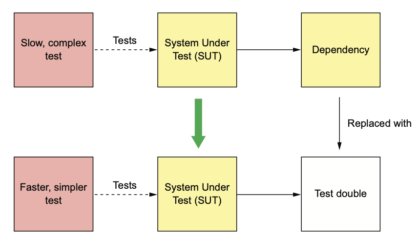

# 9.1.0 서론

코드에서 주문 서비스를 변경할 일이 생겼다고 가정해 보자.

테스트코드가 없다면 모두 직접 실행하고 요청을 보내어 코드가 잘 작동하는지 테스트해야 한다.

물론 주문 서비스와 서비스가 의존한 모든 서비스, DB 등은 작동중이어야 한다.

하지만 이런 방식의 테스트는 너무 느리고 번거롭다.

# 9.1.1 Test 개요

앞으로 automation test 즉, 테스트 자동화를 그냥 Test 라고 약칭한다.

위키피디아에서 정의한 Test Case는 다음과 같다.

*Test Case는 어떤 목적을 달성하기 위해 개발된 테스트 입력, 실행 조건, 기대 결과의 집합이다.*

다시 말해 Test의 목적은 SUT(System Under Test)의 동작을 확인하는 것이다.

여기서 말하는 System은 *테스트 해야할 Software Element*를 가리키는 말이다.


## Automation Test 작성하기

Automation Test는 대부분 JUnit 등 테스트 프레임워크로 작성한다.

Test Class에 속한 Test Method 하나하나가 모두 Test이다.


Test Suite의 단계는 다음과 같다.

1. **setup:** SUT와 그 의존성들로 구성된 Test Fixture를 초기화 한다.
2. **execute:** SUT를 호출한다.
3. **verify:** 호출 결과와 SUT를 assert한다.
4. **teardown:** Test Fixture를 깨끗하게 정리한다.

코드 중복을 줄이고, Test를 단순화 하기 위해 메소드 이전에 실행되는 설정 메소드, 테스트 이후 실행되는 정리 메소드를 테스트 클래스에 따로 둔다.

예를 들어 OrderController는 OrderService를 호출하고, OrderService 또한 다른 많은 Application이나 Infra 서비스에 의존하게 된다.

그렇다면 어떻게 OrderService, 즉 SUT만을 테스트 할 수 있을까?

<br>

해결 방법은 **의존성을 Test Double로 대체**하는 것이다.

Test Double은 의존 관계에 있는 서비스 등을 흉내내는 객체이다.



Test Double은 Stub과 Mock이 있다.

Stub과 Mock을 햇갈리는 사람들이 꽤 있는데, 동작 방식이 조금 다르다.

**Stub은 SUT에 값을 반환하는 Test Double, Mock은 SUT가 정확하게 의존 서비스를 호출했는지 확인하기 위한 Test Double**이다.

또한 Mock은 Stub의 일종이라고 할 수 있다.

## Test 종류

Test의 종류는 성말 다양하다.

성능 테스트, 사용성 테스트는 Application의 품질을 확인하는 테스트이다.

- **Unit Test:** Controller나 Service 클래스 같이 서비스의 작은 부분들을 테스트한다.
- **Integration Test:** Application Service가 Infra Service와 잘 연동되어 있는지 테스트한다.
- **Component Test:** 개발 서비스에 대한 Acceptance Test(인수 테스트)
- **End-To-End Test:** 전체 Application에 대한 Acceptance Test

테스트를 분류하는 중요한 기준은 scope이다.

> 우리가 TDD처럼 **개발과정의 일부로** 진행하는 Test를 Compile time unit test라고 부른다.

## Test의 분류 - Test Quadrant

Brian Marick이 창안해낸 Test Quadrant(테스트 사분면)은 두 가지 기준으로 Test를 분류한다.

- Business Facing Test인가 Technology Facing Test인가

  Business Facing Test에서는 도메인 전문가의 용어를, Technology Facing Test는 개발자와 구현 기술로 기술한다.

- 프로그래밍을 돕기 위함인가 Application을 평가하기 위함인가

  개발자는 개발을 돕기 위한 테스트를 업무로 사용하지만, Application 평가 테스트는 개선이 필요한 부분을 찾기 위함이다.


위 그림처럼 Test Quadrant로 분류하면 영역별로 4개의 Test 유형이 도출된다.

1. **Q1(개발 지원 및 기술 관련):** Unit / Integration Test
2. **Q2(개발 / 비지니스 지원 관련)**: Component / End-To-End Test
3. **Q3(Application / 비지니스 평가 관련):** Exploratory / usability test
4. **Q4(Application / 기술 평가 관련):** Performance나 Stress 등 기능과 관계 없는 Non-Functional test

## Test Pyramid로 Test Effort에 집중하기

Application의 동작을 확신하기 위해서는 여러 종류의 Test를 작성해봐야 한다.

그러나 Test Scope가 넓어질수록 실행시간과 복잡도는 증가하고, 신뢰성은 떨어진다.

신뢰성이 떨어진 Test를 믿으라면 누가 믿겠는가?

그럴바엔 그냥 Test를 안 짜는게 낫다.

<br>

Test 중 가장 작은, Unit Test가 있다.

작성하기 쉽고, 빠르며, 신뢰성이 그렇게 높진 않다.

전체 Application을 대상으로 하는 End-To-End Test도 있지만, 작성하기도 어렵고 매우 느리고 복잡하다.

개발 / 테스트에 예산을 무한정 쏟을 수는 없기에 Test Suite의 효용성에 문제가 없는 내에서 가장 범위가 좁은 테스트를 해야한다.

<br>

이 점에서 Test Pyramid는 좋은 해결책이 될 수 있다.

Pyramid의 아래쪽은 빠르지만 못 미더운 Unit Test가, 위쪽은 느리고 복잡하고 불안정한 End-To-End Test가 올 수 있다.

Test Pyramid에서는 **위로 올라갈수록 Test의 수가 줄어든다.**

따라서 많은 단위 테스트를, 적은 End-To-End 테스트를 작성해야 한다.


하지만 다른 서비스와 연관된 서비스는 어떻게 테스트해야 할까?

# 9.1.2 MicroService Test

MSA에서는 IPC가 중심을 맡는다.

MSA 기반 Application은 팀 별로 각자 서비스를 개발하고 꾸준히 API를 발전시켜나가는 분산 시스템이다.

서비스 개발자는 자신의 서비스가 다른 서비스에 제대로 의존하고 있는지, Client와 잘 연동은 되는지 테스트해야 한다.

<br>

MSA에서 서비스는 다양한 Communication 스타일과 IPC로 서로 통신하게 된다.

REST나 gRPC를 쓸 수도 있고, 비동기 메세징을 사용하는 서비스도 있다.


위 그림에서 화살표는 Consumer -> Producer를 향한다.

- **RestClient to Service:** API Gateway는 서비스로 요청을 Routing하고 API를 조합한다.
- **Domain Event Consumer -> Subscriber:** 주문 이력 서비스는 발행된 Event를 소비하게 된다.
- **Command Message Requestor -> Replier:** 주문 서비스는 여러 서비스에 Command Message를 발행하고 Response를 Consume한다.

두 서비스 사이의 Communication은 두 서비스간의 합의라고 할 수 있다.

예를 들어 주문 이력 서비스와 주문 서비스는 발행될 이벤트 구조와 채널을 합의한 것이다.

API Gateway와 서비스 또한 RestAPI Endpoint에 대해 합의를 봐서 양쪽이 똑같이 맞춰야 한다.

만약 비동기 Request / Response 형식을 사용한다면 Command 채널, Format, 응답 메세지 Format을 맞춰야 한다.

<br>

서비스 개발자는 자신이 Consume하는 서비스의 API가 안정적인지 확인해야 하고, 자신이 제공하는 API를 함부로 바꾸면 안된다.

예를 들어 주문 서비스 개발 담당자는 주문 서비스에 의존하는 서비스들에게 호환되지 않는 방향으로 API를 변경하려면 미리 알려줘야 한다.

<br>

두 서비스가 상호 작용할 수 있는지에 대한 테스트는 두 서비스를 모두 실행시키고, 서비스와 통신을 한 후, 기대한 결과가 나오는지 확인해보면 된다.

서비스간 상호 작용 문제는 이렇게 해결할 수 있겠지만, End-To-End 방식이기 때문에 해당 서비스와 무수히 많은 연관 관계에 있는 서비스를 실행시켜야 한다는 단점이 있다.

원래는 저수준의 IPC만 검사하려고 했지만 다른 서비스의 비지니스 로직 등의 고수준 기능까지 호출해야 하는 상황이 되버린 것이다.

End-To-End 테스트는 최대한 작성하지 않는게 좋다.

이럴땐 컨슈머 주도 계약 테스트를 하면 된다.

## Consumer-driven contract test

API Gateway의 OrderServiceProxy는 `GET /orders/{orderId}`같은 Rest Endpoint를 여러 개 호출한다.

따라서 API Gateway와 주문 서비스 양쪽 API가 서로 맞는지 테스트해야 한다.

Consumer contract test 용어로는 *두 서비스가 Consumer-Provider 관계를 맺는다*라고 말한다.

여기서 Consumer는 API Gateway, Provider는 주문 서비스가 될 수 있다.

Consumer contract test는 **Provider의 API가 Consumer가 기대한 것과 같은지 확인하는, Provider에 대한 Integration Test**라고 할 수 있다.

<br>

Consumer contract test는 **Provider API의 Shape가 Consumer가 기대한 것과 같은지 확인하는 것**이다.

Rest Endpoint의 경우 Consumer Contract Test는 다음 작업을 하는 API가 구현되었는지 확인한다.

- Consumer가 기대한 HTTP Method와 경로가 맞는가?
- Consumer가 기대한 Header를 받는가?
- Consumer가 기대한 Request Body를 받는가?
- Consumer가 기대한 Status Code, Header, Body가 포함된 Response를 반환하는가?

<br>

Consumer Contract Test는 Provider의 비지니스 로직을 정확하게 테스트하는게 아니다.

비지니스 로직은 단위 테스트에서 검증해야 한다.

Consumer 개발팀은 Consumer Contract Test Suite를 작성하고 PR등의 방법을 통해 Provider의 Test Suite를 추가한다.

주문 서비스를 호출하는 다른 서비스들도 Test Suite를 추가한다.


각 Test Suite는 각 Consumer에 해당하는 주문 서비스 API를 테스트 한다.

예를 들어 주문 이력 서비스의 Test Suite는 기대한 이벤트를 제대로 발행하는지 테스트하는 것 이라고 생각할 수 있다.

<br>

이렇게 취합된 Test Suite는 주문 서비스 배포 파이프라인에서 실행된다.

만약 Consumer Contract Test가 실패했다면 Producer쪽 Team에서 API를 요구대로 안 맞게 했다는 것이다.

Producer쪽에 API를 다시 바로잡든, Consumer와 다시 협의해야 한다.

<br>

Consumer Contract Test는 일반적으로 Testing By Example을 사용한다.

Consumer과 Provider 사이에 Communication을 Contract라는 Sample 모음집으로 정의하는 것이다.

Communication을 OpenAPI나 JSON Schema 등으로 정의하는게 나아보이기도 하지만, Test를 작성할 때 이런 Schema들은 딱히 필요없다.

Schema로 응답을 검증할 수는 있겠지만, 어차피 Provider에게 Sample Request을 보내 호출해야 한다.

<br>

게다가 Consumer Test에는 Sample Response도 필요하다.

Consumer Driven Contract Test는 Provider를 Test 하는게 중심이긴 하지만, Consumer가 정상적으로 연결되었는지도 Test하는 것이기 때문이다.

예를 들어 RestAPI 서비스의 Consumer쪽에선 Contract대로 HTTP Request를 보내고, HTTP Response를 반환하는지 확인하는 클래스를 구성한다.

이 테스트를 작성하는건 뒤에서 자세히 다뤄보도록 하고, 먼저 Spring Cloud Contract로 테스트를 구성해보자.

## Spring Cloud Contract로 Service Test

Consumer Contract Test는 Spring Application용인 Sping Cloud Contract, 그리고 다양한 언어를 지원하는 Pact가 있다.

FTGO에서는 Spring 기반 Application인 Spring Cloud Contract를 사용한다.

이 프레임워크에선 GroovyDSL로 아까 설명한 Contract를 작성할 수 있다.

각 Contract는 Consumer과 Provider 사이에 구체적인 Sample이라고 할 수 있다.

Spring Cloud Contract는 Provider의 Contract Test 코드를 작성하고 Consumer Integration Test용 Mock을 구성한다.

<br>

예를 들어 API Gateway의 담당자가 주문 서비스의 Consumer Contract Test를 작성한다고 가정해 보자.

다음 그림과 같이 주문 서비스팀과 긴밀하게 협의해야 한다.

API Gateway와 주문 서비스 사이에 Communication이 정의된 Contract를 작성하고, Contract를 바탕으로 주문 서비스팀은 주문 서비스를, API Gateway팀은 API Gateway를 테스트한다.


절차는 다음과 같다.

1. 하나 이상의 Contract를 작성한다.

   Contract는 API Gateway가 서비스에 전송할 HTTP Request와 기대 Response가 정의되어 있다.

   이 Contract는 PR을 통해 주문 서비스에 전달된다.

2. 주문 서비스에선 Consumer Contract Test로 주문 서비스를 Test한다.

   테스트코드는 Spring Cloud Contract에서 자동으로 생성해 준다.

3. 주문 서비스팀은 주문 서비스를 테스트한 Contract를 Maven Repository로 발행한다.

4. API Gateway팀은 주문 서비스팀에서 발행한 Contract를 API Gateway Test를 작성한다.

<br>

주문 서비스에서 발행한 Contract를 가지고 API Gateway를 테스트하기 위해 이미 배포된 주문 서비스와 API Gateway가 잘 동작함을 확신할 수 있다.

이 Test 방식의 핵심은 **Contract**이다.

다음 코드는 HTTP Request / Response에서 Spring Cloud Contract 예제이다.

``` groovy
org.springframework.cloud.contract.spec.Contract.make {
    request { // HTTP Method와 Path
        method 'GET'
        url '/orders/1223232'
    }
    
    response { // Expect Response
        status 200
        headers {
            header('Content-Type': 'application/json;charset=UTF-8')
        }
        body("{ ... }")
    }
}
```

Request Element는 Request Endpoint를 호출하는 HTTP Request이고, Response Element는 API Gateway가 기대하는 HTTP Response이다.

Groovy Contract는 Provider 코드의 일부이다.

각 Consumer 팀은 자신이 개발한 서비스가 Provider와 Communication하는 방법이 정의된 Contract를 작성해서 PR등의 방법으로 그쪽으로 넘긴다.

Provider팀은 Contract를 JAR로 패키징하고, maven repository로 발행한다.

Consumer쪽 Test는 Repository에서 JAR를 내려받는다.

<br>

Contract별 Request / Response는 Test Data와 Expected Behavior이라는 두 가지 역할을 합니다.

Consumer쪽 Test에서 Contract는 Mockito의 Mock객체와 비슷한 Stub을 통해 주문 서비스를 시뮬레이션하기 위해 사용한다.

그 덕분에 API Gateway는 굳이 주문 서비스를 실행하지 않아도 Test할 수 있다.

Provider쪽 Test에서는 생성된 Test Class Code가 Contract의 Request를 Provider에게 넘겨 호출하고, 실제로 Provider가 Contract에 맞게 Response를 주는지 테스트한다.

나중에 다시 자세히 알아보고 일단 Messaging API를 테스트하러 넘어가자

## Messaging API를 Consumer Contract Test로 테스트하기

Provider API로부터 어떤 결과를 Expect하는 Consumer는 RestAPI만 있는게 아니다.

Domain Event를 Subscribe하고 비동기 Request / Response를 하는 서비스도 Consumer이다.

이런 서비스는 다른 서비스의 Messaging API를 Consume하고, 해당 API의 특성을 가정하기 때문에 위와 같은 이유로 Consumer Contract Test를 해야한다.

<br>

Spring Cloud Contract를 사용하면 Messaging API의 Communication도 테스트 할 수 있다.

Contract의 구조와 Test에서 Contract를 어떻게 사용할지는 Communication의 종류마다 다르다.

Domain Event 발행 Contract는 Sample Domain Event로 구성된다.

Provider Test는 Provider가 Event를 발생시키게 하고, 그게 Contract와 일치하는지 검사한다.

Consumer Test는 이 Consumer가 이 Event를 처리할 수 있는지를 검사한다.

<br>

비동기 Request / Response의 Contract는 HTTP와 비슷하게 Request / Response로 구성된다.

Provider Test는 Contract에 요청 메세지를 API에 넘겨 호출하고, 그 결과가 Expect한 결과인지 확인한다.

Consumer Test는 Contract를 통해 Stub Subscriber를 구현하고, 이 Stub Subscriber는 Contract의 Request Message를 Listening하다가 주어진 Response를 반환한다.

# 9.1.3 Deploy Pipeline

배포 파이프라인은 모든 서비스에 있다.

Jez Humble은 배포 파이프라인이 **Desktop에서 작성한 코드를 Production에 반영하는 자동화 프로세스**라고 했다.

배포 파이프라인은 다음 단계로 구성된다.

1. Test Suite 실행
2. Service Release
3. 배포

완전 자동화가 가장 이상적이지만, 일부 작업은 어쩔 수 없이 수동으로 해야한다.

보통 Jenkins와 같은 CI 서버로 배포 파이프라인을 구축한다.


Code가 Pipeline을 지나갈수록 Test Suite는 **점점 Production과 유사하고, 엄격한 테스트 환경**에서 테스트된다.

동시에, 각 Test Suite의 실행 시간은 급격하게 늘어난다.

- **Pre-commit Test:** 개발자가 변경 사항을 커밋하기 전 테스트를 진행한다.
- **Commit Test:** 서비스가 컴파일된 후 단위 테스트를 실행하고, 정적 코드 분석을 수행한다.
- **Integration Test:** 통합 테스트를 실행한다.
- **Component Test:** Component Test를 수행한다.
- **Deploy:** Production에 서비스를 배포한다.

CI 서버는 개발자가 변경 사항을 커밋하는 즉시 Commit Test 단계를 거치기 때문에 굉장히 빠르게 피드백할 수 있다.

이후 단계에선 실행 시간이 길어지고, 피드백도 점점 느려지게 된다.

테스트가 모두 성공했을 때, 파이프라인 마지막 단계에서는 Production에 서비스를 배포한다.

이렇게 모든걸 자동화하면 좋겠지만, 그렇지 않은 경우도 있을 수 있다.

