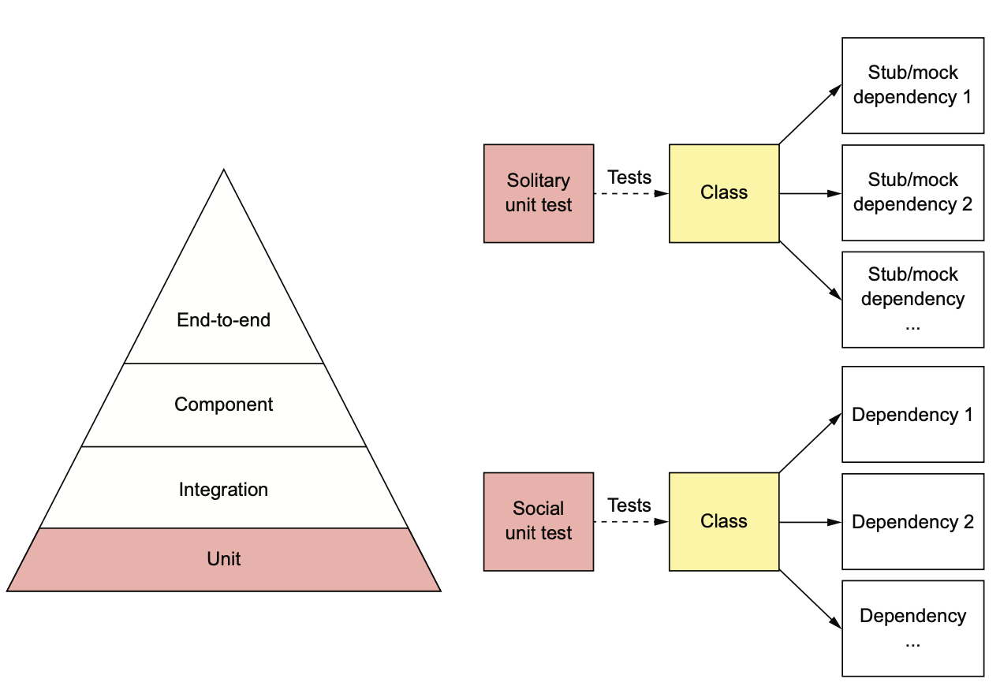
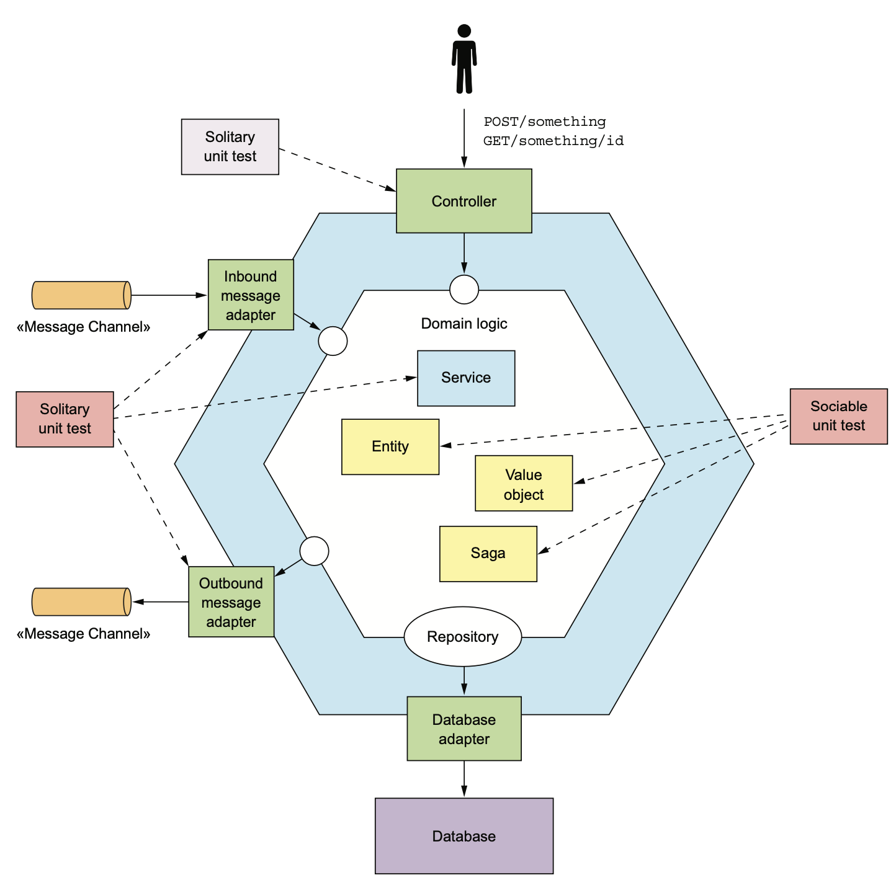

# 9.2.0 서론

주문 서비스에서 주문 총합이 정확하게 계산되는지 테스트한다고 가정해 보자.

주문 서비스를 실행하고, RestAPI를 호출한 후, 반환된 HTTP Response이 기대한 값인지 테스트 코드를 통해 검증해야 한다.

그러나 이렇게 작성하자니 복잡한데다가 너무 속도가 느리다는 단점이 있다.

이 테스트가 Order 클래스의 Compile Time Test라면 완료될때까지 기다려야 하기 때문에 힘들다.

Order 클래스에 대한 단위 테스트를 개발하는게 훨씬 생산적이다.

<br>

개발을 지원하는 테스트인 Unit Test는 Test Pyramid 최 하층에 있다.

단위 테스트는 서비스의 가장 작은 Unit이 제대로 동작하는지 확인하게 된다.

일반적으론 단위가 클래스이기 때문에 클래스가 예상대로 동작하는지에 대한 테스트이다.



- **Solitary Unit Test:** 클래스와 의존성을 Mock객체로 나타내고, 클래스만 따로 테스트한다.
- **Sociable Unit Test:** 클래스와 의존성을 테스트한다.

어떤 종류의 테스트를 할지는 클래스의 책임과 아키텍쳐에서의 역할마다 다르다.

<br>

다음 그림은 전형적인 육각형 아키텍쳐이고, 전형적으로 많이 사용되는 단위 테스트를 표시한 것이다.



일반적으로 Controller와 Service를 Solitary Unit Test를, Entity와 VO같은 Domain 객체는 Sociable Unit Test를 사용한다.

- Order과 같은 **식별자를 가진 Entity 객체들은 Sociable Unit Test**를 사용한다.
- Money와 같은 **VO들은 Sociable Unit Test**를 사용한다.
- CreateOrderSaga와 같이 **여러 서비스에 걸쳐 일관성을 유지하는 Saga는 Sociable Unit Test**를 사용한다.
- OrderService와 같이 Entity, VO 어디에도 속하지 않는, **비지니스 로직을 구현한 도메인 서비스는 Solitary Unit Test**를 사용한다.
- HTTP 요청을 처리하는 **Controller는 Solitary Unit Test**를 사용한다.
- **Inbound / Outbound Messaging Gateway는 Solitary Unit Test**를 사용한다.

# 9.2.1 Entity Unit Test

다음 클래스는 Order Entity에 대한 단위 테스트인 Order Unit Test이다.

``` java
public class OrderTest {
    private ResultWithEvents<Order> createResult;
    private Order order;
    
    @Before
    public void setUp() throws Exception {
        createResult = Order.createOrder(
            CONSUMER_ID,
            AJANTA_ID,
            CHICKEN_VINDALOO_LINE_ITEMS
        );
        
        order = createResult.result;
    }
    
    @Test
    public void shouldCalculateTotal() {
        assertEquals(
            CHICKEN_VINDALOO_PRICE.multiply(CHICKEN_VINDALOO_QUANTITY),
             order.getOrderTotal()
        );
    }
    ...
}
```

1. 각 테스트를 수행하기 전, `@Before`에서 필요한 Order를 생성한다.
2. `@Test`에선 Order의 메소드 중 하나를 호출해서 받은 결과 값을 검증한다.

`shouldCalculateTotal()`는 `Order.getOrderTotal()`이 기대한 값을 반환하는지 테스트한다.

이 단위테스트는 Order 클래스와 그 의존 관계에 대한 Sociable Unit Test다.

실행이 매우 빨라 Compile-Time Test로도 사용할 수 있고, Order클래스가 Money에 의존하기 때문에 반드시 Money도 테스트해야 한다.

# 9.2.2 VO Unit Test

VO는 Immutable에 Side Effect를 걱정할 필요 없기 때문에 테스트하기 쉽다.

단지 주어진 상태의 객체를 생성하고, 이 객체의 메소드를 호출하여 수신한 값을 Assert한다.

다음 코드는 금액을 나타내는 단순한 Money 클래스의 메소드가 잘 동작하는지 확인한다.

``` java
public class MoneyTest {
    private final int M1_AMOUNT = 10;
    private final int M2_AMOUNT = 15;
    
    private Money m1 = new Money(M1_AMOUNT);
    private Money m2 = new Money(M2_AMOUNT);
    
    // Money의 add 메소드가 잘 동작하는지 검사한다.
    @Test
    public void shouldAdd() {
        assertEquals(new Money(M1_AMOUNT + M2_AMOUNT), m1.add(m2));
    }
    
    // Money의 multiply 메소드가 잘 동작하는지 테스트한다.
    @Test
    public void shouldMultiply() {
        int multiplier = 12;
        assertEquals(new Money(M2_AMOUNT * multiplier), m2.multiply(multiplier));
    }
}
```

Money 클래스는 어느 클래스에도 의존하지 않기 때문에 독립적인 Unit Test라고 할 수 있다.

# 9.2.3 Saga Unit Test

CreateOrderSaga처럼 중요한 비지니스 로직이 구현된 클래스는 반드시 테스트해주어야 한다.

Saga는 참여자들에게 Command 메세지를 보내고, 이들의 Response를 처리하는 Persistence Object이다.

4장에서 배웠던 주문 생성 Saga는 소비자 서비스, 주방 서비스 등 여러 서비스들과 Command나 Response 메세지를 교환한다.

이 클래스의 테스트는 Saga를 생성하고, Saga가 기대한 순서대로 참여자가 메세지를 전송하는지 테스트한다.

우선 성공하는 경우의 테스트를 진행하고, 참여자가 실패 메세지를 반환해서 Saga가 Rollback되는 다양한 시나리오에 대해서도 Test를 작성해야 한다.

<br>

실제 DB와 Message Broker를 Stub과 함께 다양한 Saga 참여자를 Simulation하는 테스트를 사용하면 별 문제 없을 것 같다.

예를 들어 소비자 서비스용 Stub으로 consumerService라는 이름의 Command 채널을 구독하고, 원하는 Response Message를 주면 된다.

하지만 이런식의 테스트는 너무 느리다.

DB나 Message Broker와 Communication해야하는 클래스를 Mocking한 Test가 더 낫다.

<br>

다음 코드는 주문 생성 Saga의 단위 테스트로, Eventuate Tram Saga Test Framework로 작성한 Saga 클래스와 그 의존성을 테스트하는 Sociable Test이다.

Eventuate Saga Test Framework는 Saga와의 상호작용을 추상화해서 사용하기 쉬운 DSL을 제공해 준다.

``` java
public class CreateOrderSagaTest {
    @Test
    public void shouldCreateOrder() {
        given()
            .saga(new CreateOrderSaga(kitchenServiceProxy), // Saga 생성
                  new CreateOrderSagaState(
                      ORDER_ID,
                      CHICKEN_VINDALOO_ORDER_DETAILS)
                 )
            )
            .expect() // Consumer Service에 ValidateOrderByConsumer 메세지를 발행했는지 검증
                .command(
                    new ValidateOrderByConsumer(
                        CONSUMER_ID,
                        ORDER_ID,
                        CHICKEN_VINDALOO_ORDER_TOTAL
                    )
                )
            .to(ConsumerServiceChannels.consumerServiceChannel)
            .andGiven()
	            .successReply() // 이 메세지 처리를 성공했다는 응답 전송
            .expect()
                .command(
                    new CreateTicket(AJANTA_ID, ORDER_ID, null)
	        	).to(KitchenServiceChannels.kitchenServiceChannel); // 다음으로 주방 서비스에 메세지를 발행했는지 검증
    }
    
    @Test
    public void shouldRejectOrderDueToConsumerVerificationFailed() {
        given()
            .saga(new CreateOrderSaga(kitchenServiceProxy),
                  new CreateOrderSagaState(
                      ORDER_ID,
                      CHICKEN_VINDALOO_ORDER_DETAILS)
                 )
            .expect()
                .command(new ValidateOrderByConsumer(
                    CONSUMER_ID,
                    ORDER_ID,
                    CHICKEN_VINDALOO_ORDER_TOTAL
                ))
            .to(ConsumerServiceChannels.consumerServiceChannel)
            .andGiven()
	            .failureReply() // Order를 소비사 서비스에서 거부했음을 알리는 failure 메세지를 전송
			// Saga에서 주문 서비스에 RejectOrderCommand보냈는지 검증
            .expect()
            	.command(new RejectOrderCommand(ORDER_ID))
            	.to(OrderServiceChannels.orderServiceChannel);
    }
}
```

`shouldCreateOrder()`메소드는 별 문제 없는 경우를 테스트하는 것이고, `shouldRejectOrderDueToConsumerVerificationFailed()`는 CreateOrderSaga가 주문이 거부된 소비자를 위해 RejectOrderCommand가 제대로 전송되었는지 확인한다.

# 9.2.4 Domain Service Unit Test

서비스의 비지니스 로직은 대부분 Entity, VO, Saga로 구현하고 나머지는 OrderService같은 Domain Service 클래스로 구현한다.

OrderService는 전형적인 Domain Service 클래스이다.

이 클래스에서는 Entity와 Repository를 호출하여 Domain Event를 발행한다.

이런 종류의 클래스를 효과적으로 테스트하는 방법은 Repository 및 Messaging 클래스같은 의존성을 Mocking하고 Solitary Unit Test를 수행하는 것이다.

<br>

1. **setting:** Service Dependency의 Mock객체를 구성한다.
2. **execute:** Service 메소드를 실행한다.
3. **verify:** 서비스 메소드가 올바른 값을 반환하고, 의존 클래스가 올바르게 호출되었는지 검증해 준다.

``` java
public class OrderServiceTest {
    private OrderService orderService;
    private OrderRepository orderRepository;
    private DomainEventPublisher eventPublisher;
    private RestaurantRepository restaurantRepository;
    private SagaManager<CreateOrderSagaState> createOrderSagaManager;
    private SagaManager<CancelOrderSagaData> cancelOrderSagaManager;
    private SagaManager<ReviseOrderSagaData> reviseOrderSagaManager;

    @Before
    public void setup() {
        orderRepository = mock(OrderRepository.class);
        eventPublisher = mock(DomainEventPublisher.class);
        restaurantRepository = mock(RestaurantRepository.class);
        createOrderSagaManager = mock(SagaManager.class);
        cancelOrderSagaManager = mock(SagaManager.class);
        reviseOrderSagaManager = mock(SagaManager.class);
        // Mock된 Dependency들이 주입된 Service 생성
        orderService = new OrderService(orderRepository, eventPublisher,
                                        restaurantRepository, createOrderSagaManager,
                                        cancelOrderSagaManager, reviseOrderSagaManager);
    }
    
    @Test
    public void shouldCreateOrder() {
        // findById가 AJANTA 음식점을 반환하도록 설정
        when(restaurantRepository
             .findById(AJANTA_ID)).thenReturn(Optional.of(AJANTA_RESTAURANT));
        
        // 주문 ID를 세팅하기 위해 OrderRepository.save 세팅
        when(orderRepository.save(any(Order.class)))
            .then(invocation -> {
                Order order = (Order) invocation.getArguments()[0];
                order.setId(ORDER_ID);
                return order;
            }
		);
        
        // OrderService.createOrder() 호출
        Order order = orderService.createOrder(CONSUMER_ID,
                 AJANTA_ID, CHICKEN_VINDALOO_MENU_ITEMS_AND_QUANTITIES);
        
        // 새로 생성된 Order가 DB에 저장되었는지 확인
        verify(orderRepository).save(same(order));
        
        // OrderService가 OrderCreatedEvent를 발행했는지 확인
        verify(eventPublisher).publish(
            Order.class,
            ORDER_ID,
            singletoneList(new OrderCreatedEvent(CHICKEN_VINDALOO_ORDER_DETAILS))
        );
        
        // OrderService가 CreateOrderSaga를 생성했는지 검사함
        verify(createOrderSagaManager)
            .create(
            	new CreateOrderSagaState(
               		ORDER_ID,
               		CHICKEN_VINDALOO_ORDER_DETAILS
                ),
            	Order.class,
	            ORDER_ID);
    }
}
```

`setup()`함수는 Mock Dependency가 주입된 OrderService를 생성한다.

`shouldCreateOrder()`는 `OrderService.createOrder()`가 OrderRepository를 호출해서 Order를 저장하고, OrderCreatedEvent를 발행하고, CreateOrderSaga를 생성하는 과정에서 문제가 없는지 확인한다.

# 9.2.5 Controller Unit Test

주문 서비스 같은 서비스는 보통 다른 서비스나 API Gateway로부터 들어온 HTTP 요청을 처리하는 Controller를 하나 이상 가지고있다.

Controller 클래스는 RestAPI 처리를 담당하는 메소드들로 구성되어 있다.

Controller 메소드는 Domain Service를 호출하여, 그 응답 객체를 반환한다.

<br>

예를 들어 OrderController는 OrderService, OrderRepository를 호출한다.

이런 Controller를 효율적으로 테스트하기위해 Service나 Repository를 Mocking하는게 좋다.

<br>

OrderServiceTest와 비슷한 Test Class를 만들어 Controller 객체를 만들고, 메소드를 호출할 수도 있다.

하지만 이렇게 하면 Routing같은 중요 기능은 테스트하기 힘들다.

따라서 MockMVC Test Framework를 활용하는게 훨씬 효율적이다.

이런 프레임워크는 HTTP 요청을 보내어 HTTP Response를 검증할 수 있기 때문에 진짜 네트워크 요청을 하지 않아도 HTTP Request Routing과 Java 객체를 JSON으로 변환할 수 있다.

> 이게 스프링 프레임워크를 이용한 테스트는 Unit Test가 아니라고 생각할수도 있다.
>
> 물론 아까 봤던 Unit Test보다 훨씬 무겁긴한데, Spring MockMVC 문서에선 외부 Servlet Container를 사용하지 않기 때문에 Unit Test라고 간주한다.

다음은 OrderController Test Class이다.

OrderController가 의존하는 클래스를 Mocking해서 사용한 Solitary Unit Test이다.

이 테스트는 Rest Assured MockMVC를 사용해서 작성했다.

<br>

이 프레임워크는 Controller와 세부 Communication을 추상화하고 간단한 DSL을 제공하기 때문에 Controller에 Mock HTTP Request를 전송하고 Response를 쉽게 확인할 수 있다.

OrderControllerTest는 일단 OrderService와 OrderRepository의 Mock이 주입된 OrderController를 생성한다.

필요하다면 Controller가 정말 Mock된 메소드를 호출했는지도 확인할 수 있다.

``` java
public class OrderControllerTest {
    private OrderService orderService;
    private OrderRepository orderRepository;
    
    @Before
    public void setUp() throws Exception {
        orderService = mock(OrderService.class);
        orderRepository = mock(OrderRepository.class);
        orderController = new OrderController(orderService, orderRepository);
    }
    
    @Test
    public void shouldFindOrder() {
        when(orderRepository.findById(1L))
            .thenReturn(Optional.of(CHICKEN_VINDALOO_ORDER));
        
        given().
            standaloneSetup(
            	configureControllers(
                    new OrderController(orderService, orderRepository)
                )
        	).when()
            .get("/orders/1")
            .then()
            .statusCode(200)
            .body("orderId",
                  equalTo(new Long(OrderDetailsMother.ORDER_ID).intValue()))
            .body("state",
                  equalTo(OrderDetailsMother.CHICKEN_VINDALOO_ORDER_STATE.name()))
            .body("orderTotal",
                  equalTo(CHICKEN_VINDALOO_ORDER_TOTAL.asString()));
    }
    
    @Test
    public void shouldFindNotOrder() { ... }
    private StandaloneMockMvcBuilder controllers(Object... controllers) { ... }

}
```

`shouldFindOrder()`는 일단 Order를 반환하도록 OrderRepository를 구성하고, HTTP 요청을 보내어 Order를 조회한다.

이 메소드는 최종적으로 요청이 성공했는지, 원하는 데이터가 Body에 있는지 검증한다.

# 9.2.6 Event / Message Handler Unit Test

서비스는 보통 외부 시스템에서 전송된 메세지를 처리한다.

예를 들어 OrderService는 다른 서비스에서 발행한 Domain Event를 처리하는 OrderEventConsumer라는 Message Adapter를 가지고있다.

Message Adapter는 Contoller처럼 Domain Service를 호출하는 단순 클래스이다.

Message Adapter의 각 메소드들은 Message나 Event에서 꺼낸 데이터를 Service에 넘겨 처리한다.

<br>

Message Broker는 Controller와 비슷하게 Unit Test할 수 있다.

Test별로 Message Adapter 객체를 생성하고 Message Channel에 전송하고, Service Mock이 호출되었는지 확인한다.

물론 세부적인 Messaging Infra를 Stubbing했기에 Message Broker가 관여하지 않는다.

<br>

OrderEventConsumer의 테스트 클래스이다.

OrderEventConsumer가 각 Event를 적절한 Handler로 Routing해서 OrderService가 정상적으로 호출되었는지 검사한다.

이 테스트는 Eventuate Tram Mock Messaging 프레임워크를 사용한다.

이 프레임워크는 RestAssured와 동일하게 given when then Format으로 Mock Messaging Test를 할 때 쉽게 사용할 수 있는 DSL을 제공한다.

각 Test는 Mock OrderService가 주입된 OrderEventConsumer 객체를 만들어 Domain Event를 발행하고, OrderEventConsumer가 Service Mock을 잘 호출하는지 검사한다.

``` java
public class OrderEventConsumerTest {
    private OrderService orderService;
    private OrderEventConsumer orderEventConsumer;
    
    @Before
    public void setUp() throws Exception {
        orderService = mock(OrderService.class);
        orderEventConsumer = new OrderEventConsumer(orderService);
    }
    
    @Test
    public void shouldCreateMenu() {
        given()
            .eventHandlers(orderEventConsumer.domainEventHandlers()) // OrderEventConsumer Event Handler 세팅
		.when()
            .aggregate("net.chrisrichardson.ftgo.restaurantservice.domain.Restaurant", AJANTA_ID)
		.publishes(new RestaurantCreated( // RestaurantCreated Event 발행
            AJANTA_RESTAURANT_NAME,
            RestaurantMother.AJANTA_RESTAURANT_MENU
        ))
        then().
            verify(() -> { // OrderEventConsumer가 OrderService.createMenu()를 호출했는지 검증
                verify(orderService)
                    .createMenu(
	                    AJANTA_ID,
                    	new RestaurantMenu(RestaurantMother.AJANTA_RESTAURANT_MENU_ITEMS))
                    )
            });
    }
}
```

이런 Unit Test는 매우 빠르다.

그러나 Unit Test는 Order가 NoSQL에 저장될지, RDBMS에 저장될지 알 수 없다.

또한 CreateOrderSaga가 올바른 메세지를 발행했는지 알 방법이 없다.

그래서 통합테스트도 필요하다.

