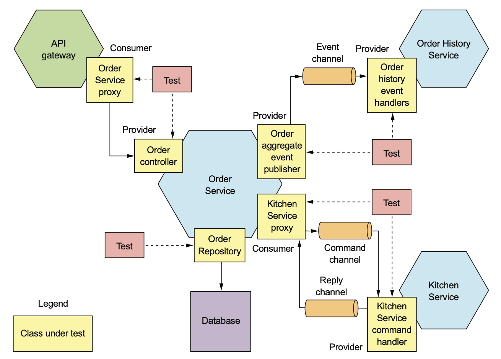
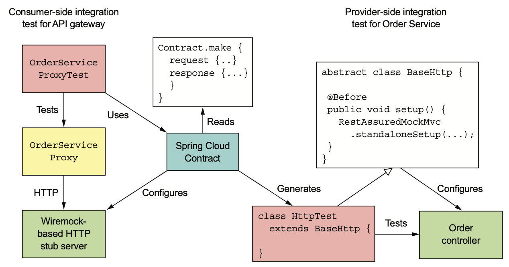
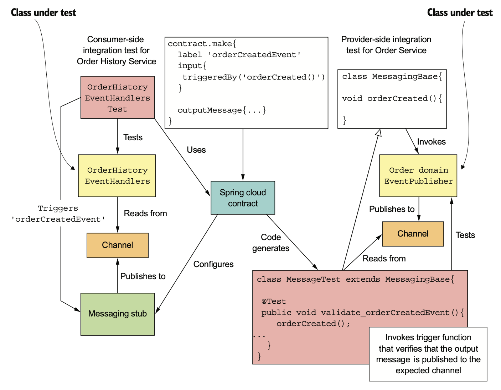
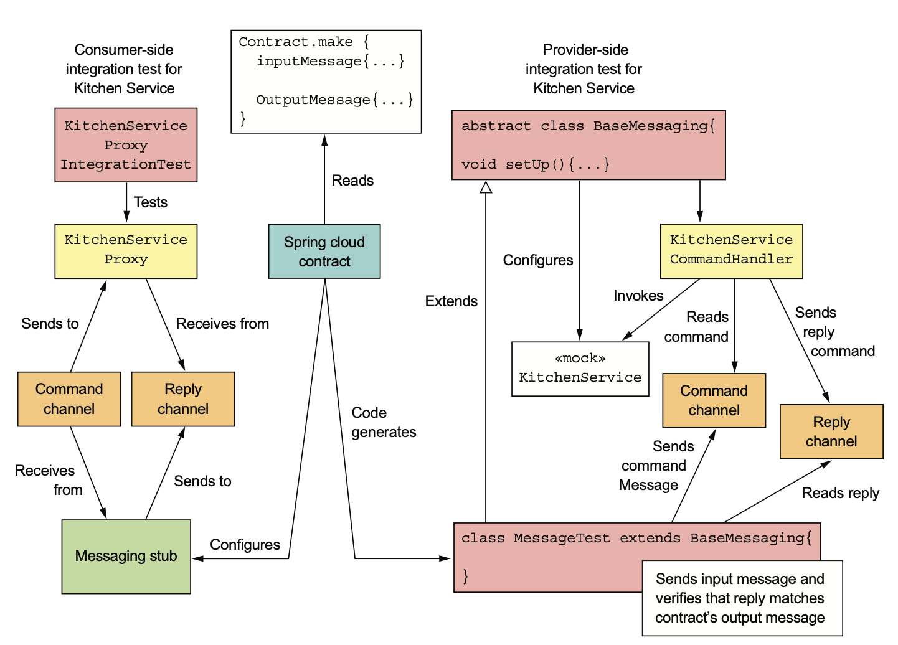

# 10.1.0 서론

대부분의 서비스는 다른 서비스들과 Communication한다.

주문 서비스의 Rest API는 Gateway가 Consume하고, Domain Event는 주문 이력 서비스 등 다른 서비스에서 Consume한다.

또한 주문 서비스는 다른 서비스를 사용한다.

MySQL에 Order를 저장하고, 주방 서비스를 비롯한 다른 서비스에 Command를 보내고 받은 Response를 Consume한다.



서비스가 잘 동작하는지 테스트하기 위해서는 Infra Service, 다른 Application Service와 적절하게 Communication하는지 확인해야 알 수 있다.

서비스를 전부 띄우고 End-To-End 테스트를 하는 것이 가장 확실하겠지만 느리고, 취약하며, 비용도 비싸다.

End-To-End Test가 나름의 역할이 있긴 하지만, Test Pyramid의 가장 위에있기 때문에 횟수를 줄이는편이 가장 좋다.

<br>

따라서 Unit Test의 바로 윗단계인 Integration Test를 작성하는게 낫다.

Integration Test는 전체 서비스를 실행시키지는 않는다.

그 대신 검증의 유효성에는 문제 없으면서 Test를 간소화할 수 있는 두 가지 전략을 사용한다.

<br>

1. **각 서비스의 Adapter(+ Supporter 클래스까지) 테스트한다.**

10.1.1절에서 배울 JPA Persistence Test는 직접 Repository를 호출하여 정말 save가 되었는지 검증한다.

또한 OrderDomainEventPublisher 클래스를 호출하여 확인하는 Test도 있다.

전체 서비스 대신 몇몇 소수의 클래스로 Test 범위를 좁히게 되면 Test가 단순하고 빨라진다.

2. **Contract Test**

Contract는 두 서비스 간 Communication의 구체적인 예제이다.

| Communication 종류        | Consumer         | Provider    | Contract                           |
| ------------------------- | ---------------- | ----------- | ---------------------------------- |
| Rest Request / Response   | API Gateway      | 주문 서비스 | HTTP Request / Response            |
| Publish / Subscribe       | 주문 이력 서비스 | 주문 서비스 | Domain Event                       |
| 비동기 Request / Response | 주문 서비스      | 주방 서비스 | Command Message와 Response Message |

요청은 다음과 같이 구성된다.

- Publish / Subscribe형 Communication일 경우: Contract는 메세지 1개
- (비동기) Request / Response Communication일 경우: 메세지 2개

Contract는 Consumer / Provider 둘 다 Test해서 서로 보고있는 API가 일치하는지 검증한다.

Consumer를 테스트하는지, Provider를 테스트하는지에 따라 사용하는 방법은 다르다.

- **Consumer Test:** Consumer의 Adapter에 대한 테스트로, Contract를 통해 Provider를 Mocking한 Stub을 구성할 수 있기 때문에 Provider없이 Consumer Integration Test를 작성할 수 있다.
- **Provider Test:** Provider의 Adapter에 대한 테스트로, Adapter의 Dependency를 Mock으로 잡아두고 Contract를 통해 Adapter를 테스트한다.

# 10.1.1 Persistence Integeration Test

대부분의 서비스에서는 DB에 데이터를 저장한다.

주문 서비스는 Order과 같은 Aggregate를 JPA로 MySQL에 저장하고, 주문 이력 서비스는 AWS DynamoDB에 CQRS View를 저장한다.

9장에서의 테스트는 **In-Memory 객체만을 테스트**했기에 서비스가 제대로 동작하는지에 대해서는 Integration Test를 작성해야 한다.

<br>

Persistence Integration Test의 순서는 다음과 같다.

- **setup:** DB Schema를 생성하고 Known 상태로 만들고, Transaction을 실행한다.
- **execute:** DB 작업을 수행한다.
- **verify:** DB의 상태, DB에서 조회한 객체를 검증한다.
- **teardown:** setup에서 시작한 Transaction을 Rollback하는 등 DB에 변경한 내용을 undo해야할 때 필요하다.

<br>

다음 코드는 Order Aggregate와 OrderRepository에 대한 Persistence Integration Test이다.

Persistence Integration Test는 JPA로 DB Schema를 생성하는 것을 제외하곤 DB 상태에 대한 Assumption은 없다.

따라서 DB 내용을 Rollback할 필요가 없고, 따라서 메모리에 변경사항이 Cache되는 ORM의 문제도 막을 수 있다.

> JPA의 Cache와 실제 DB의 동기화를 걱정해야 할수도 있다.

``` java
@RunWith(SpringRunner.class)
@SpringBootTest(classes = OrderJpaTestConfiguration.class)
public class OrderJpaTest {
    
    @Autowired
    private OrderRepository orderRepository;
    
    @Autowired
    private TransactionTemplate transactionTemplate;
    
    @Test
    public void shouldSaveAndLoadOrder() {
        Long orderId = transactionTemplate.execute((ts) -> {
            Order order =
                new Order(CONSUMER_ID, AJANTA_ID, CHICKEN_VINDALOO_LINE_ITEMS);
            orderRepository.save(order);
            return order.getId();
        });
        
        transactionTemplate.execute((ts) -> {
            Order order = orderRepository.findById(orderId).get();
            assertEquals(OrderState.APPROVAL_PENDING, order.getState());
            assertEquals(AJANTA_ID, order.getRestaurantId());
            assertEquals(CONSUMER_ID, order.getConsumerId().longValue());
            assertEquals(CHICKEN_VINDALOO_LINE_ITEMS, order.getLineItems());
            return null;
        });
    }
}

```

`shouldSaveAndLoadOrder()`는 두 Transaction을 실행하게 된다.

1. 생성된 Order를 DB에 저장한다.
2. Order를 조회해서 각 Field가 적절하게 초기화되었는지 검증한다.

여기서 고민할 점은 Persistence Integration Test에서 DB를 어떻게 제공할까이다.

Docker를 통해 올리는것도 효율적이고, docker-compose gradle plugin으로 서비스를 자동으로 실행할수도 있다.

DB는 서비스가 Communication하는 또 다른 서비스일뿐이다.

Application 서비스간 통신에 대한 Integration Test은 우선 Rest부터 차례대로 보자.

# 10.1.2 Rest Integration Test

Rest는 흔하게 쓰이는 Service간 통신 메커니즘이다.

Rest Client / Service는 Rest Endpoint와 Request / Response 규약을 따라야한다.

<br>

API Gateway는 여러 서비스의 RestAPI를 호출한다.

OrderService의 `GET /orders/{orderId}`도 API Gateway가 호출하는 RestAPI Endpoint이다.

API Gateway와 주문 서비스 사이에서 End-To-End Test없이 잘 통신하는지 확인하기 위해선 Integration Test를 작성해야 한다.

<br>

이전 장에서 말했듯이 Consumer Driven Contract Test를 활용하는게 좋다.

다음 그림은 Spring Cloud Context를 사용해 Rest기반 Communication Test를 하는 과정이다.



1. API Gateway에 대한 Consumer Integration Test는 Contract를 통해 HTTP Stub 서버를 구축한다.
   1. Contract의 Request는 API Gateway가 Stub에 어떤 Request를 보내는지 기술한다.
   2. Contract의 Response는 API Gateway가 Stub로부터 어떤 Response를 받았는지 기술한다.
2. Spring Cloud Contract는 Contract를 통해 OrderService Integration Test를 작성한다.
3. Contract가 작성한 OrderService Integration Test를 통해 Spring Mock MVC등을 통해 Controller를 테스트한다.

<br>

여기서 OrderServiceProxyTest는 OrderServiceProxy를 테스트하는데, OrderServiceProxy는 Wiremock에 요청을 보내준다.

Wiremock은 HTTP 서버를 Mocking해주는 Tool로, 여기서는 OrderService를 흉내내준다.

Spring Cloud Contract는 Wiremock을 관리하고 설정해준다.

<br>

Provider에서 Spring Cloud Contract는 HttpTest라는 Test Class를 생성한다.

HttpTest는 Rest Assured Mock으로, OrderService의 Controller를 테스트해준다.

이런 Test Class는 반드시 우리가 작성한 Base 클래스를 상속받아야 한다.

여기서는 Mock Dependency가 주입된 OrderController Instance를 BaseHttp라는 Base 클래스가 만들어준 후, `RestAssuredMockMvc.standaloneSetup()`으로 Spring MVC를 구성한다.

## Rest API Example

다음 코드에서 볼 수 있다싶이 Rest Contract에는 Client가 전송하는 Request와, 서버가 반환할 Response를 지정해준다.

``` groovy
org.springframework.cloud.contract.spec.Contract.make {
    request {
        method 'GET'
        url '/orders/1223232'
    }
    response {
        status 200
        headers {
            header('Content-Type': 'application/json;charset=UTF-8')
        }
        body('''{"orderId" : "1223232", "state" : "APPROVAL_PENDING"}''')
    }
}
```

이 Contract는 API Gateway가 주문 서비스에서 주문을 성공적으로 조회할 경우의 Test Case이다.

## Consumer Driven Integration Contract Test In OrderService

OrderService의 Integration Contract Test는 OrderService의 API가 Contract대로 되었는지 검증한다.

Spring Cloud Contract는 생성된 Test Class가 상속받은 Abstract Base Class는 Test 설정을 담당한다.

``` java
public abstract class HttpBase {
    private StandaloneMockMvcBuilder controllers(Object... controllers) {
        ...
		return MockMvcBuilders.standaloneSetup(controllers)
            .setMessageConverters(...);
    }
    
    @Before
    public void setup() {
        OrderService orderService = mock(OrderService.class);
        OrderRepository orderRepository = mock(OrderRepository.class);
        // Mock을 주입한 OrderController 생성
        OrderController orderController = new OrderController(orderService, orderRepository);
        
        // OrderRepository에서 
        when(orderRepository.findById(1223232L))
            .thenReturn(Optional.of(OrderDetailsMother.CHICKEN_VINDALOO_ORDER));
        
        ...
        // OrderController로 Spring MVC 설정
        RestAssuredMockMvc.standaloneSetup(controllers(orderController));
    }
}
```

위 예제에서 Contract로 지정된 orderId인 1223232를 Mock OrderRepository의 `findById()`에 전달해 준다.

이 Test로 OrderService의 `GET /orders/{orderId}` Endpoint가 Client의 기대대로 반환하는지 테스트할 수 있다.

## Consumer Integration Test: API Gateway의 OrderServiceProxy

API Gateway의 OrderServiceProxy는 `GET /orders/{orderId}` Endpoint를 호출하게된다.

다음 예제는 이 Endpoint가 Contract대로 구현되었는지 검증하는 OrderServiceProxyIntegrationTest이다.

``` Java
@RunWith(SpringRunner.class)
@SpringBootTest(classes=TestConfiguration.class,
	webEnvironment= SpringBootTest.WebEnvironment.NONE)
// Spring Cloud Contract가 랜덤 포트에 Contract대로 Wiremock 서버를 구성하도록 설정
@AutoConfigureStubRunner(ids =
	{"net.chrisrichardson.ftgo.contracts:ftgo-order-service-contracts"},
	workOffline = false)
@DirtiesContext
public class OrderServiceProxyIntegrationTest {
    
    // Spring Cloud Contract가 실행되는 포트
    @Value("${stubrunner.runningstubs.ftgo-order-service-contracts.port}")
    private int port;
    private OrderDestinations orderDestinations;
    private OrderServiceProxy orderService;
    
    @Before
    public void setUp() throws Exception {
        orderDestinations = new OrderDestinations();
        String orderServiceUrl = "http://localhost:" + port;
        // 해당 서비스에 요청을 보내도록 설정
        orderDestinations.setOrderServiceUrl(orderServiceUrl);
        
        orderService = new OrderServiceProxy(
            orderDestinations,
            WebClient.create()
        );
    }
    
    @Test
    public void shouldVerifyExistingCustomer() {
        OrderInfo result = orderService.findOrderById("1223232").block();
        assertEquals("1223232", result.getOrderId());
        assertEquals("APPROVAL_PENDING", result.getState());
    }
    
    @Test(expected = OrderNotFoundException.class)  
    public void shouldFailToFindMissingOrder() {
        orderService.findOrderById("555").block();
    }
}
```

각각의 Test 메소드들은 OrderServiceProxy를 호출해서 정확한 값이 반환되는지, 기대한 Exception이 발생하는지 확인한다.

`shouldVerifyExistingCustomer()`는 `findOrderById()`가 Contract의 Response에서 지정한 값을 반환하는지 검증한다.

`shouldVerifyExistingCustomer()`는 존재하지 않는 주문을 조회할 때 OrderNotFoundException을 던지는지 검증한다.

# 10.1.3 Pub/Sub Style Integration Test

다수의 서비스가 Consume하는 Domain Event를 발행하는 서비스가 있다.

이런 서비스의 Integration Test는 Publisher / Consumer가 바라보는 Message Channel과 Domain Event의 구조가 일치하는지 검증해야한다.

예를 들어 주문 서비스는 Order Aggregate를 생성 / 수정할때마다 Order~~ 라는 이름의 Event를 발행하고, 주문 이력 서비스에서는 이 Event를 Consume한다.

따라서 이 두 서비스 사이에서 서로 문제없이 연동되는지 테스트해야한다.

<br>

다음 그림은 Pub/Sub Communication을 Integration Test하는 과정이다.



앞에서 봤던 Rest Communication과 굉장히 비슷하다.

Communication이 Contract로 정의되는 부분은 같지만 **각 Contract마다 Domain Event를 지정한다**라는 차이점이 있다.

<br>

Consumer쪽 테스트에서는 Contract에서 지정된 Event를 발행하고 OrderHistoryEventHandler가 Mock Dependency를 올바르게 호출하는지 검사한다.

Provider쪽에서는 Spring Cloud Contract가 MessagingBase를 상속한 테스트 클래스를 생성한다.

각 테스트 메소드가 MessagingBase에 있는 hook method를 호출하게되면 Service에 의해 Event 발행이 실행된다.

아래 코드는 각각의 Hook Method가 Order Aggregate Event발행을 담당하는 OrderDomainEventPublisher를 호출한다.

이 테스트 메소드는 OrderDomainEventPublisher가 원하는 Event를 발행하는지 검증한다.

## OrderCreated Event Publish Contract

``` groovy
org.springframework.cloud.contract.spec.Contract.make {
    label 'orderCreatedEvent'
    input {
        triggeredBy('orderCreated()') // 나중에 실행할 메소드
    }
    
    outputMessage {
        sentTo('net.chrisrichardson.ftgo.orderservice.domain.Order')
        body('''
        	{
        		"orderDetails":{
        			"lineItems":[
        				{
        					"quantity":5,
        					"menuItemId":"1",
                            "name":"Chicken Vindaloo",
                            "price":"12.34","total":"61.70"
                        }
                    ],
                    "orderTotal":"61.70",
                    "restaurantId":1,
                    "consumerId":1511300065921
                },
                "orderState":"APPROVAL_PENDING"
            }''')
        headers {
            header('event-aggregate-type',
                   'net.chrisrichardson.ftgo.orderservice.domain.Order')
            header('event-aggregate-id', '1')
        }
    }
}
```

이 Contract의 주요한 Element는 다음과 같다.

- **label:** Consumer Test에서 Spring Contract가 Event 발행을 Trigger하기 위해 사용하는 Element
- **triggerBy:** 생성된 Test Method가 Event 발행을 Trigger하기 위해 호출하는 Base(부모) 클래스의 메소드 이름

## Consumer Driven Contract Test: OrderService

주문 서비스의 Provider 쪽 테스트에는 Consumer Driven Contract Test이다.

이 Test는 Order Aggregate Domain Event의 발행을 담당하는 OrderDomainEventPublisher가 Client가 기대한대로 Event를 발행하는지 검사한다.

아래 코드는 Spring Cloud Contract가 생성한 Test Class의 Base Class인 MessagingBase이다.

이 클래스는 OrderDomainEventPublisher가 InMemory Messaging Stub을 사용하도록 설정하고, 생성된 Test가 Event 발행을 Trigger하기 위해 호출하는 `orderCreated()`같은 메소드를 정의한다.

``` java
@RunWith(SpringRunner.class)
@SpringBootTest(classes = MessagingBase.TestConfiguration.class,
                webEnvironment = SpringBootTest.WebEnvironment.NONE)
@AutoConfigureMessageVerifier
public abstract class MessagingBase {
    
    @Autowired
    private OrderDomainEventPublisher OrderDomainEventPublisher;
    
    @Configuration
    @EnableAutoConfiguration
    @Import({EventuateContractVerifierConfiguration.class,
             TramEventsPublisherConfiguration.class,
             TramInMemoryConfiguration.class})
    public static class TestConfiguration {
        // OrderDomainEventPublisher Bean을 등록한다.
        @Bean
        public OrderDomainEventPublisher OrderDomainEventPublisher(DomainEventPublisher eventPublisher) {
            return new OrderDomainEventPublisher(eventPublisher);
        }
    }
    
    protected void orderCreated() { // 생성된 클래스는 이 메소드를 호출하여 이벤트를 발행한다.
        OrderDomainEventPublisher.publish(
            CHICKEN_VINDALOO_ORDER,
            singletonList(
                new OrderCreatedEvent(CHICKEN_VINDALOO_ORDER_DETAILS)
            )
        );
    }
}
```

이 Test Class는 OrderDomainEventPublisher에 InMemory Stub을 설정한다.

`orderCreated()`는 앞에서 봤던 Contract로 생성된 Test Method가 호출해준다.

이 메소드는 OrderDomainEventPublisher를 호출하여 OrderCreated 이벤트를 발행하고, Test Method에서는 이 이벤트를 받아 Contract에 명시된 Event랑 맞는지 검증한다.

## Consumer Driven Contract Test: OrderHistoryService

주문 이력 서비스에선 주문 서비스에서 발행한 Event를 Consume하는 서비스다.

7장에서 설명했듯이 이 Event를 처리해주는 Adapter Class는 OrderHistoryEventHandlers이다.

이 클래스의 Event Handler는 OrderHistoryDao가 주입된 OrderHistoryEventHandlers를 생성한다.

각 테스트 메소드들은 Spring Cloud를 호출하여 Contract에서 정의된 Event를 발행하고, OrderHistoryEventHandlers가 OrderHistoryDao를 제대로 호출했는지 검사한다.

``` java
@RunWith(SpringRunner.class)
@SpringBootTest(classes= OrderHistoryEventHandlersTest.TestConfiguration.class,
                webEnvironment= SpringBootTest.WebEnvironment.NONE)
@AutoConfigureStubRunner(ids = {"net.chrisrichardson.ftgo.contracts:ftgo-order-service-contracts"},
                         workOffline = false)
@DirtiesContext
public class OrderHistoryEventHandlersTest {
    @Configuration
    @EnableAutoConfiguration
    @Import({OrderHistoryServiceMessagingConfiguration.class,
             TramCommandProducerConfiguration.class,
             TramInMemoryConfiguration.class,
             EventuateContractVerifierConfiguration.class})
    public static class TestConfiguration {
        @Bean
        public ChannelMapping challenMapping() {
            return new DefaultChannelMapping.DefaultChannelMappingBuilder().build();
        }
        
        @Bean
        public OrderHistoryDao orderHistoryDao() {
            return mock(OrderHistoryDao.class);
        }
    }
    
    @Test
    public void shouldHandleOrderCreatedEvent() throws ... {
        when(orderHistoryDao.addOrder(any(Order.class), any(Optional.class)))
            .thenReturn(false);
        
        // OrderCreatedEvent Stub을 Trigger하여 OrderCreated 이벤트 발행
        stubFinder.trigger("orderCreatedEvent");
        
        // OrderHistoryEventHandlers가 orderHistoryDao.addOrder()을 호출했는지 검증
        OrderCreated event.eventually(() -> {
            ArgumentCaptor<Order> orderArg = ArgumentCaptor.forClass(Order.class);
            ArgumentCaptor<Optional<SourceEvent>> sourceEventArg =
                ArgumentCaptor.forClass(Optional.class);
            
            verify(orderHistoryDao).addOrder(orderArg.capture(), sourceEventArg.capture());
            
            Order order = orderArg.getValue();
            Optional<SourceEvent> sourceEvent = sourceEventArg.getValue();
            assertEquals("Ajanta", order.getRestaurantName());
        });
    }
}
```

`shouldHandleOrderCreatedEvent()`는 Spring Cloud Contract가 OrderCreated 이벤트를 발행하도록 한다.

OrderHistoryEventHandlers가 `orderHistoryDao.addOrder()`을 호출했는지 검증한다.

# 10.1.4 Async Style Integration Test

Pub/Sub 말고도 비동기 Request / Response 형태로 Communication하는 서비스도 Messaging기반 Communication을 할 수 있다.

4장에서 배웠던 주문 서비스는 주방 서비스를 비롯한 여러 다른 서비스에 Command 메세지를 전송해서 받은 Response를 Saga로 처리한다.

<br>

Async Request / Response에는 Command를 전송하는 서비스인 Requestor, Command 처리 후 응답을 반환하는 Replier가 있다.

Requestor와 Replier가 바라보는 Command 메세지 채널명 / Command / Response 메세지의 구조는 일치해야한다.

다음 그림은 주문 서비스와 주방 서비스 사이의 Communication을 테스트하는 과정이다.

Async Request / Response Communication의 Integration Test는 Rest와 굉장히 비슷하기 때문에 서비스간 Communication을 Contract로 정의하는건 똑같다.

단지 HTTP Request / Response 대신 Input / Output 메세지를 지정해준다는 차이만 있다.



1. Consumer쪽에선 Command Message Proxy 클래스가 Command 메세지를 전송하고 Response 메세지를 제대로 처리하는지 검증한다.
2. Provider쪽에선 Spring Cloud Contract를 기반으로 코드를 생성하게 된다. 하나의 메소드는 하나의 Contract와 매칭되며, Input Message를 Command 메세지로 보내고, Response 메세지가 OutputMessage와 같은지 검증한다.

## Async Request / Response예제

다음은 하나의 Input / Output 메세지로 구성된 Communication의 Contract이다.

Input / Output 메세지 모두 Channel, Body, Header가 있고 Provider 관점에서의 규칙을 따랐다.

Replier쪽 Channel은 Input 메세지의 messageFormat에, Response를 전송할 Channel은 sentTo에 지정한다.

``` groovy
org.springframework.cloud.contract.spec.Contract.make {
    label 'createTicket'
    input { // 주문 서비스에서 주방 서비스 채널로 전송한 Command 메세지
        messageFrom('kitchenService')
        messageBody('''{"orderId":1,"restaurantId":1,"ticketDetails":{...}}''')
        messageHeaders {
            header('command_type','net.chrisrichardson...CreateTicket')
            header('command_saga_type','net.chrisrichardson...CreateOrderSaga')
            header('command_saga_id', $(consumer(regex('[0-9a-f]{16}-[0-9a-f]{16}'))))
            header('command_reply_to','net.chrisrichardson...CreateOrderSaga-Reply')
        }
    }
    outputMessage { // 주방 서비스에서 받은 메세지
        sentTo('net.chrisrichardson...CreateOrderSaga-reply')
        body([ticketId: 1])
        headers {
            header('reply_type', 'net.chrisrichardson...CreateTicketReply')
            header('reply_outcome-type', 'SUCCESS')
        }
    }
}
```

## Consumer Driven Contract Test: Async Consumer

Async Request / Response의 Consumer쪽 Integration Test는 Rest Client와 거의 같다.

서비스의 MessagingProxy를 호출해서 다음을 검증한다.

- Contract대로 Command 메세지를 전송하는지
- Proxy가 Response 메세지를 적절하게 처리하는지

<br>

다음 예제는 주문 서비스가 주방 서비스를 호출할 때 사용되는 MessagingProxy인 KitchenServiceProxy의 Consumer쪽 Test이다.

``` java
@RunWith(SpringRunner.class)
@SpringBootTest(classes= KitchenServiceProxyIntegrationTest.TestConfiguration.class,
                webEnvironment= SpringBootTest.WebEnvironment.NONE)
// 주방 서비스 Stub이 Response하도록 설정
@AutoConfigureStubRunner(ids = {"net.chrisrichardson.ftgo.contracts:ftgo-kitchen-service-contracts"},
                         workOffline = false)
@DirtiesContext
public class KitchenServiceProxyIntegrationTest {
    @Configuration
    @EnableAutoConfiguration
    @Import({TramCommandProducerConfiguration.class,
             TramInMemoryConfiguration.class,
             EventuateContractVerifierConfiguration.class})
    public static class TestConfiguration { ... }
    
    @Autowired
    private SagaMessagingTestHelper sagaMessagingTestHelper;
    
    @Autowired
    private KitchenServiceProxy kitchenServiceProxy;
    
    @Test
    public void shouldSuccessfullyCreateTicket() {
        CreateTicket command = new CreateTicket(
            AJANTA_ID,
            OrderDetailsMother.ORDER_ID,
            new TicketDetails(
                Collections.singletonList(
                    new TicketLineItem(
                        CHICKEN_VINDALOO_MENU_ITEM_ID,
                        CHICKEN_VINDALOO,
                        CHICKEN_VINDALOO_QUANTITY
                    )
                )
            )
        );
        
        String sagaType = CreateOrderSaga.class.getName();
        
        CreateTicketReply reply = sagaMessagingTestHelper // Command를 전송하고 대기한다.
            .sendAndReceiveCommand(kitchenServiceProxy.create, command, CreateTicketReply.class, sagaType);
        
        assertEquals(new CreateTicketReply(OrderDetailsMother.ORDER_ID), reply); // Response 검증
    }
}
```

`shouldSuccessfullyCreateTicket()`은 CreateTicket Command 메세지를 전송하고 원하는 값이 Response에 있는지 검증한다.

sagaMessagingTestHelper는 비동기 메세지 전송 / 수신을 돕는 Helper Class이다.

## Consumer Driven Contract Test: Async Provider

Provider는 Response를 올바르게 전송해서 Command 메세지를 잘 처리했는지 검증해야한다.

Spring Cloud Contract는 Contract별로 Test method를 가지고있는 Test Class를 생성한다.

``` java
@RunWith(SpringRunner.class)
@SpringBootTest(classes =
                AbstractKitchenServiceConsumerContractTest.TestConfiguration.class,
                webEnvironment = SpringBootTest.WebEnvironment.NONE)
@AutoConfigureMessageVerifier
public abstract class AbstractKitchenServiceConsumerContractTest {
    @Configuration
    @Import(RestaurantMessageHandlersConfiguration.class)
    public static class TestConfiguration {
        
        @Bean
        public KitchenService kitchenService() {
            return mock(KitchenService.class); // kitchenService를 mocking
        }
    }
    
    @Autowired
    private KitchenService kitchenService;
    
    @Before
    public void setup() {
        reset(kitchenService);
        // mocking된 service가 Contract의 Response에 해당하는 값을 반환하도록 설정
        when(kitchenService.createTicket(eq(1L), eq(1L), any(TicketDetails.class)))
            .thenReturn(new Ticket(1L, 1L, new TicketDetails(Collections.emptyList())));
    }
}
```

0

