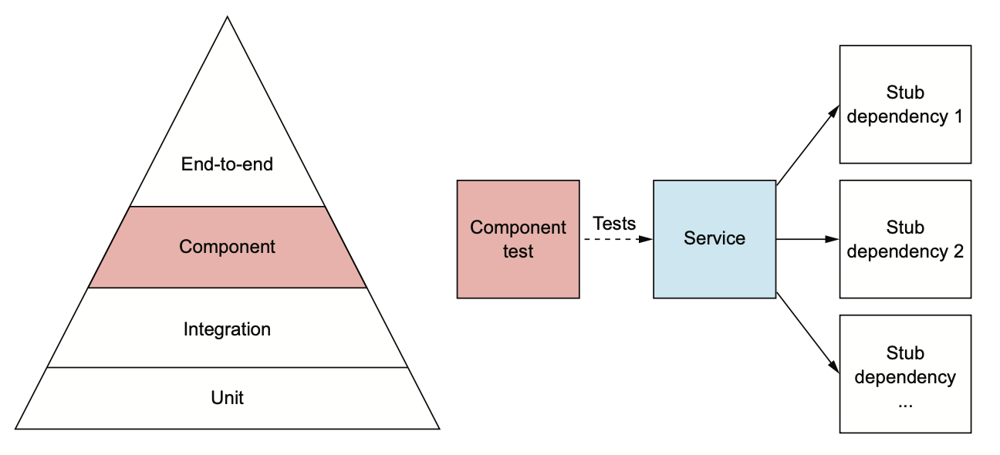
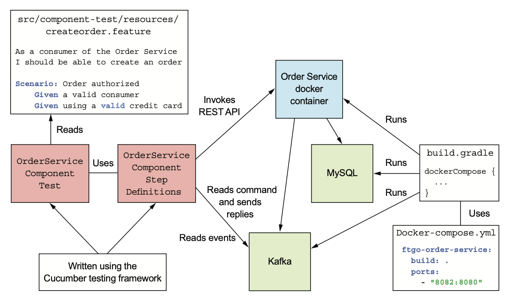

# 10.2.0 서론

주문 서비스가 의도대로 동작하는지 검증한다고 가정해보자.

즉, 주문 서비스를 일종의 Black Box처럼 해놓고 주문 서비스와 의존 서비스들을 배포하는 End-To-End Test는 느리고, 취약하고, 비싸다.

Service Acceptance Test는 Intergration Test와 End-To-End 사이의 Component 테스트를 하는게 효율적이다.

Component 테스트에서는 모든 의존성을 Mocking한 Stub으로 대체하고, 서비스를 분리해서 동작 방식을 검증한다.

심지어 DB같은 Infrastructure쪽도 InMemory DB를 사용하는 경우도 있다.

Component 테스트는 End-To-End에 비해 쉽고, 빠르다.

<br>

Service Acceptance Test를 위해 Gherkin이라는 Test DSL 사용방법을 살펴보고, 설계 이슈를 살펴보자.



# 10.2.1 Acceptance Test 정의

Acceptance Test는 Component의 비지니스 로직과 관련된 Test이다.

Acceptance Test는 User Story나 Usecase에서부터 시작하며, **내부 구현이 아닌 Client 관점에서 어떤 동작이 외부에 노출되는지 기술**한다.

예를 들어 주문하기 라는 User Story는 주문 서비스의 주요 Story이다.

```
나는 주문 서비스의 소비자로서 주문 할 수 있어야 한다.
```

이 Story는 다음과 같이 확장할 수 있다.

```
내가 유효한 사용자라면
내가 유효한 신용카드를 사용했다면
Ajanta 음식점에서 주문을 받는다면
내가 이 음식점에 치킨 Vindaloo를 주문했다면
나의 주문이 승인되어야한다.
그리고 OrderAuthorized 이벤트가 발행되어야한다.
```

주문 서비스가 원하는 동작을 이 서비스의 API 관점에서 시나리오로 기술하는 것이다.

<br>

시나리오마다 하나의 인수테스트가 존재하며, 다음 단계로 구성된다.

1. given: 설정 단계
2. when: 실행 단계
3. then: 검증 단계
4. and: 검증 단계

위 시나리오의 Acceptance Test는 다음 일을 수행한다.

1. `POST /orders` Endpoint로 요청을 보내 Order를 생성한다.
2. `GET /orders/{orderId}` Endpoint를 호출하여 Order의 State를 검사한다.
3. 올바른 Message Channel을 구독하여 OrderAuthorized 이벤트를 발행했는지 검증한다.

# 10.2.2 Gherkin으로 Acceptance Test 작성

Acceptance Test를 Java로 짜도 되겠지만 고수준의 Scenario와 저수준 Java Test가 어긋날 가능성도 있다.

또한 Scenario 자체의 정확도가 너무 낮거나 애매모호해서 Java로 옮기기 힘든 경우도 있다.

따라서 최대한 수동 작업은 없애고, 실행 가능한 간단한 Scenario를 작성하는게 좋다.

<br>

Gherkin은 **실행 가능한 명세를 작성하는 DSL**이다.

일단 Scenario를 위에서 봤던것처럼 고수준에서 정의하고, Cucumber라는 Gherkin용 자동화 프레임워크를 통해 명세를 실행한다.

한 서비스의 Gherkin 명세는 다수의 Feature로 구성되고, 각각의 Feature는 앞에서 봤던것처럼 여러 Scenario로 구성된다.

Scenario는 Given-When-Then 구조를 가진다.

<br>

예를 들어 서비스의 동작이 주문하기, 주문 취소, 주문 변경과 같은 Feature는 다음 Element로 구성된다.

- **이름:** Feature의 이름은 주문하기이다.
- **간략한 명세:** Feature가 존재하는 이유에 대해 설명한다.
- **Scenario:** 주문이 승인되거나 만료등의 이유로 주문이 거부되는 Scenario

``` cucumbers
Feature: 주문하기
	나는 주문 서비스의 소비자로서
	주문할 수 있어야한다.
	
	Scenario: Order authorized
		Given a valid consumer
        Given using a valid credit card
        Given the restaurant is accepting orders
        When I place an order for Chicken Vindaloo at Ajanta
        Then the order should be APPROVED
        And an OrderAuthorized event should be published
        
    Scenario: Order rejected due to expired credit card
        Given a valid consumer
        Given using an expired credit card
        Given the restaurant is accepting orders
        When I place an order for Chicken Vindaloo at Ajanta
        Then the order should be REJECTED
        And an OrderRejected event should be published
```

두 시나리오에서 소비자는 주문을 시도한다.

첫 번째 시나리오는 성공하는 시나리오이지만, 두 번째 시나리오에서는 신용카드 만료로 인해 주문이 거부된다.

## Cucumber를 통한 Gherkin 명세 실행

Cucumber는 Gherkin으로 작성한 Test를 실행하는 테스트 자동화 프레임워크이다.

Cucumber를 사용하려면 먼저 Step Definition을 작성한다.

이 클래스는 given, when, then 각 step의 의미를 정의한 메소드로 구성된다.

`@Given`, `@When`, `@Then`, `@And`를 붙여주고 Cucumber가 Step을 매칭하는데 필요한 정규표현식은 Annotation 값으로 넘겨준다.

``` java
public class StepDefinitions ...  {
    @Given("A valid consumer")
    public void useConsumer() { ... }
    
    @Given("using a(.?) (.*) credit card")
    public void useCreditCard(String ignore, String creditCard) { ... }
    
    @When("I place an order for Chicken Vindaloo at Ajanta")
    public void placeOrder() { ... }
    
    @Then("the order should be (.*)")
    public void theOrderShouldBe(String desiredOrderState) { ... }
    
    @And("an (.*) event should be published")
    public void verifyEventPublished(String expectedEventClass)  { ... }
    
}
```

자세한건 10.2.4에서 다루도록 하자

# 10.2.3 Component Test 설계

주문 서비스의 Component Test를 작성한다고 가정해보자.

Component Test가 Cucumber를 호출하려면 먼저 주문 서비스를 실행하고, 서비스 의존성을 설정해야한다.

또한 DB나 Infrastructure도 설정해 주어야한다.

속도, 단순성, 현실성을 고려한 옵션들을 소개한다.

## In-Process Component Test

이 테스트는 InMemory Stub과 Mock Dependency로 서비스를 실행한다.

예를 들어 SpringBootApplication Test Framework로 작성한 Spring Boot 기반 서비스의 Component Test를 작성하는 것이다.

`@SpringBootApplication`을 붙인 Test Class는 JVM에서 실행하고, 서비스가 Mock과 Stub을 사용할 수 있도록 Dependency를 주입해준다.

예를 들어 주문 서비스 테스트에선 H2, HSQLDB 등 InMemory JDBC DB와 Eventuate Tram용 InMemory Stub을 사용하도록 구성한다.

In-Progress Component Test는 작성하기 쉽고 빠르지만, 배포 가능한 서비스를 테스트할 수 없다.

## Out-Of-Process Component Test

서비스를 Production Ready 형식으로 묶고, 별도의 Process에서 실행하는게 좀 더 낫다.

요즘은 주로 서비스를 Docker Container 이미지로 패키징한다.

Out-Of-Process Component Test는 DB, Message Broker는 실제 서비스를 사용하고 Application 서비스같은 Dependency는 Mock으로 대체한다.

예를 들어 주문 서비스에서 MySQL, Kafka는 진짜를 사용하고 소비자 서비스는 Stub을 둔다.

주문 서비스는 다른 서비스와 메세지를 주고받으며 Communication하기 때문에 Stub은 Apache Kafka의 메세지를 Consume하고, 메세지를 반환한다.

<br>

Out-Of-Process Component Test는 Test Coverage가 향상되지만 테스트 작성이 어렵고, 실행이 느리고, In-Progress Component Test보다 취약할수도 있다.

## Out-Of-Process Component Test에서 Service Stubbing

Service Under the Test는 보통 Response를 주는 Communication 형태로 Dependency를 호출한다.

예를 들어 주문 서비스는 Async Request / Response로 다양한 서비스에 Command 메세지를 전송한다.

API Gateway도 HTTP로 요청을 보낸다.

Out-Of-Process Component Test에서는 Request를 처리하고, Response를 대신할 수 있도록 Stub을 구성해야한다.

Integration Test에서 사용한 Spring Cloud Contract도 괜찮고, Component Test 전용 Stub을 구성하는 Contract를 작성하는 방법도 있다.

하지만, 이런 Contract는 Component Test에서만 사용하게 된다.

또한 Spring Cloud Contract까지 사용하기엔 조금 무겁다.

따라서 Stub은 Test 내부에 있는게 훨씬 이득이다.

# 10.2.4 OrderService Component Test

다음 그림은 주문 서비스의 Component Test 설계이다.

OrderServiceComponentTest는 Cucumber를 실행하는 Test Class이다.

``` java
@RunWith(Cucumber.class)
@CucumberOptions(features = "src/component-test/resources/features")
public class OrderServiceComponentTest {
}
```

`@CucumberOptions`는 Gherkin Feature 파일의 위치를 지정한다.

그 위쪽에 `@RunWith(Cucumber.class)`는 JUnit에게 Cucumber Runner를 사용하도록 설정한다.

일반적인 Test Class와 다르게 테스트 메소드는 Cucumber에서 StepDefinition으로 정의한다.

<br>

Spring Boot에서 Cucumber를 사용하기 위해서는 구성이 조금 바뀐다.

OrderServiceComponentTestStepDefinitions는 테스트 클래스는 아니지만, `@ContextConfiugration` 어노테이션이 달려있다.

이 어노테이션으로 인해 ApplicationContext를 가져오기 때문에 Messaging Stub 등 다양한 Spring Component를 정의할 수 있다.



## OrderServiceComponentTestStepDefinitions

Component Test의 핵심은 각 Step이 정의된 OrderServiceComponentTestStepDefinitions 클래스라고 할 수 있다.

``` java
@ContextConfiguration(classes =
     OrderServiceComponentTestStepDefinitions.TestConfiguration.class)
public class OrderServiceComponentTestStepDefinitions {
    @Autowired
    protected SagaParticipantStubManager sagaParticipantStubManager;
    
    @Given("using a(.?) (.*) credit card")
    public void useCreditCard(String ignore, String creditCard) {
        switch (creditCard) {
            case valid:
                sagaParticipantStubManager
                    .forChannel("accountingService")
                    .when(AuthorizeCommand.class)
                    .replyWithSuccess();
                break;
            case expired:
                sagaParticipantStubManager
                    .forChannel("accountingService")
                    .when(AuthorizeCommand.class)
                    .replyWithFailure();
                break;
            default:
                fail("Don't know what to do with this credit card");
        }
    }
}
```

이 메소드가 사용하는 sagaParticipantStubManager는 Saga 참여자를 Stub으로 구성해주는 Helper Class이다.

`useCreditCard()`는 이 클래스를 통해 신용카드의 상태에 따라 성공 / 실패 메세지를 응답하는 회계 서비스 Stub을 구성한다.

``` java
@ContextConfiguration(classes =
                      OrderServiceComponentTestStepDefinitions.TestConfiguration.class)
public class OrderServiceComponentTestStepDefinitions {
    private int port = 8082;
    private String host = System.getenv("DOCKER_HOST_IP");
    
    protected String baseUrl(String path) {
        return String.format("http://%s:%s%s", host, port, path);
    }
    
    private Response response;
    
    @When("I place an order for Chicken Vindaloo at Ajanta")
    public void placeOrder() {
        // 주문 서비스를 RestAPI 호출하여 Order를 생성한다.
        response = given()
            .body(new CreateOrderRequest(
                consumerId,
                RestaurantMother.AJANTA_ID, Collections.singletonList(
                    new CreateOrderRequest.LineItem(
                        RestaurantMother.CHICKEN_VINDALOO_MENU_ITEM_ID,
                        OrderDetailsMother.CHICKEN_VINDALOO_QUANTITY))))
            .contentType("application/json")
            .when()
            .post(baseUrl("/orders"));
    }
```

`baseUrl()`은 주문 서비스의 URL을 반환해주는 메소드이다.

<br>

`theOrderShouldBe()`는 Order가 생성되었는지, 기대되는 state에 있는지 검증한다.

``` java
@ContextConfiguration(classes =
                      OrderServiceComponentTestStepDefinitions.TestConfiguration.class)
public class OrderServiceComponentTestStepDefinitions {
    
    @Then("the order should be (.*)")
    public void theOrderShouldBe(String desiredOrderState) {
        Integer orderId = this.response
            .then()
            .statusCode(200)
            .extract()
            .path("orderId");
        
        assertNotNull(orderId);
        
        eventually(() -> {
            String state = given()
                .when()
                .get(baseUrl("/orders/" + orderId))
                .then()
                .statusCode(200)
                .extract()
                .path("state");
            assertEquals(desiredOrderState, state);
        });
    }
}
```

`eventually()`는 내부적으로 반복해서 검증한다.

``` java
@ContextConfiguration(classes =
                      OrderServiceComponentTestStepDefinitions.TestConfiguration.class)
public class OrderServiceComponentTestStepDefinitions {
    @Autowired
    protected MessageTracker messageTracker;
    
    @And("an (.*) event should be published")
    public void verifyEventPublished(String expectedEventClass) throws ClassNotFoundException {
        messageTracker.assertDomainEventPublished(
            "net.chrisrichardson.ftgo.orderservice.domain.Order",
            (Class<DomainEvent>)Class.forName("net.chrisrichardson.ftgo.orderservice.domain."
                                              + expectedEventClass));
    }
}
```

`verifyEventPublished()`에서 사용된 MessageTracker는 테스트중 발행된 Event를 기록하고있는 Helper Class이다.

이 클래스와 SagaParticipatnStubManager는 `@TestConfiguration`과 `@Configuration`가 생성해준다.

## Component Test 실행하기

Component Test의 속도가 느린 편이기 때문에 `./gradlew test`로 돌리기에는 시원찮다.

테스트코드를 `/src/component-test/java`에 넣어놓고 `./gradlew componentTest`로 실행하는게 더 낫다.

<br>

Component Test는 Docker를 통해 주문 서비스와 의존 서비스들을 실행한다.

Docker-Compose는 다수의 Container를 정의하고, 묶어서 start / stop시킬 수 있는 편리한 툴이다.

전체 Application / Infrastructure 서비스의 Container에 대한 docker-compose는 root에 있는 docker-compose에 정의한다.

<br>

gradle의 docker-compose를 사용하면 Test가 실행되기 전 Container를 실행하고, 끝난 뒤 Container를 종료시킬 수 있다.

``` groovy
apply plugin: 'docker-compose'

dockerCompose.isRequiredBy(componentTest)
componentTest.dependsOn(assemble)

dockerCompose {
   startedServices = ['ftgo-order-service']
}
```

위와 같이 구성했을 때 Gradle은 두 가지 일을 하게된다.

1. Component Test 직전에 Gradle Docker-Compose 플러그인을 실행하며, 주문 서비스와 의존하는 Infrastructure 서비스를 start한다.
2. Docker 이미지에 필요한 JAR파일이 먼저 build될 수 있도록 componentTest가 assemble에 의존한다.

ftgo의 전체 build.gradle은 다음과 같다.

``` groovy
buildscript {
    repositories {
        mavenCentral()
        jcenter()
        maven {
            url 'https://repo.spring.io/libs-milestone'
        }
        eventuateMavenRepoUrl.split(',').each { repoUrl -> maven { url repoUrl } }
    }
    dependencies {
        classpath "org.springframework.cloud:spring-cloud-contract-gradle-plugin:$springCloudContractDependenciesVersion"
        classpath "com.avast.gradle:gradle-docker-compose-plugin:$dockerComposePluginVersion"
        classpath 'com.google.protobuf:protobuf-gradle-plugin:0.8.10'

        classpath "org.jsonschema2pojo:jsonschema2pojo-gradle-plugin:${js2pVersion}"
        classpath "io.eventuate.tram.core:eventuate-tram-spring-commands"
        classpath "io.eventuate.tram.core:eventuate-tram-spring-events"

        classpath(platform("io.eventuate.platform:eventuate-platform-dependencies:$eventuatePlatformVersion"))

    }
}

apply plugin: FtgoServicePlugin

apply plugin: 'spring-cloud-contract'
apply plugin: 'docker-compose'
apply plugin: 'com.google.protobuf'

apply plugin: IntegrationTestsPlugin
apply plugin: ComponentTestsPlugin

apply plugin: FtgoJSONSchema2PojoPlugin

dependencyManagement {
    imports {
        mavenBom "org.springframework.cloud:spring-cloud-contract-dependencies:$springCloudContractDependenciesVersion"
    }
}

contracts {
    contractsDslDir = new File("../ftgo-order-service-contracts/src/main/resources/contracts")
    packageWithBaseClasses = 'net.chrisrichardson.ftgo.orderservice.contract'
    generatedTestSourcesDir = project.file("${project.buildDir}/generated-integration-test-sources/contracts")
    sourceSet = "integrationTest"
}

sourceSets {
    integrationTest {
        java {
            srcDir project.file("${project.buildDir}/generated-integration-test-sources/contracts")
        }
    }
}

compileTestGroovy.enabled=false

componentTest.dependsOn(assemble)


// 이번 챕터에서 다룬 부분은 여기이다.
dockerCompose {

    integrationTests {
        startedServices = [ 'mysql']
        stopContainers = true
    }

    componentTests {
        startedServices = [ 'ftgo-order-service']
        //forceRecreate = true
	stopContainers = true
    }

}

integrationTest.dependsOn(integrationTestsComposeUp)
componentTestsComposeUp.dependsOn(integrationTestsComposeUp)
componentTest.dependsOn(componentTestsComposeUp)


protobuf {
    protoc {
        // Download from repositories
        artifact = 'com.google.protobuf:protoc:3.0.0'
    }
    plugins {
        grpc {
            artifact = "io.grpc:protoc-gen-grpc-java:${grpcVersion}"
        }
    }
    generateProtoTasks {
        all()*.plugins {
            grpc {
                // To generate deprecated interfaces and static bindService method,
                // turn the enable_deprecated option to true below:
                option 'enable_deprecated=false'
            }
        }
    }
}

apply plugin: 'idea'

idea {
    module {
        sourceDirs += file("${projectDir}/build/generated/source/proto/main/java");
        sourceDirs += file("${projectDir}/build/generated/source/proto/main/grpc");
    }
}

// 이미 ComponentTestsPlugin에서 정의되어있다.
// apply plugin: 'eclipse'

eclipse {
  sourceSets {
    main {
      java {
         srcDirs += ["build/generated/source/proto/main/java", "build/generated/source/proto/main/grpc"]
      }
    }
  }
}

dependencies {
    // dependencies
}

ftgoJsonSchema2Pojo {

    ftgoConsumerService {
        source = files("${ftgoApiSpecsDir}/ValidateOrderByConsumer.json")
        targetPackage = "net.chrisrichardson.ftgo.consumerservice.api"
        includeAdditionalProperties = false
        generateBuilders = true
        useLongIntegers = true
    }
    ftgoAccountingService {
        source = files("${ftgoApiSpecsDir}/messages")
        targetPackage = "net.chrisrichardson.ftgo.accountservice.api"
        includeAdditionalProperties = false
        generateBuilders = true
        useLongIntegers = true
    }
    ftgoRestaurantService {
        source = files("${ftgoApiSpecsDir}/ftgo-restaurant-service-api-spec/messages")
        targetPackage = "net.chrisrichardson.ftgo.restaurantservice.events"
        includeAdditionalProperties = false
        generateBuilders = true
        useLongIntegers = true
    }

}
```

