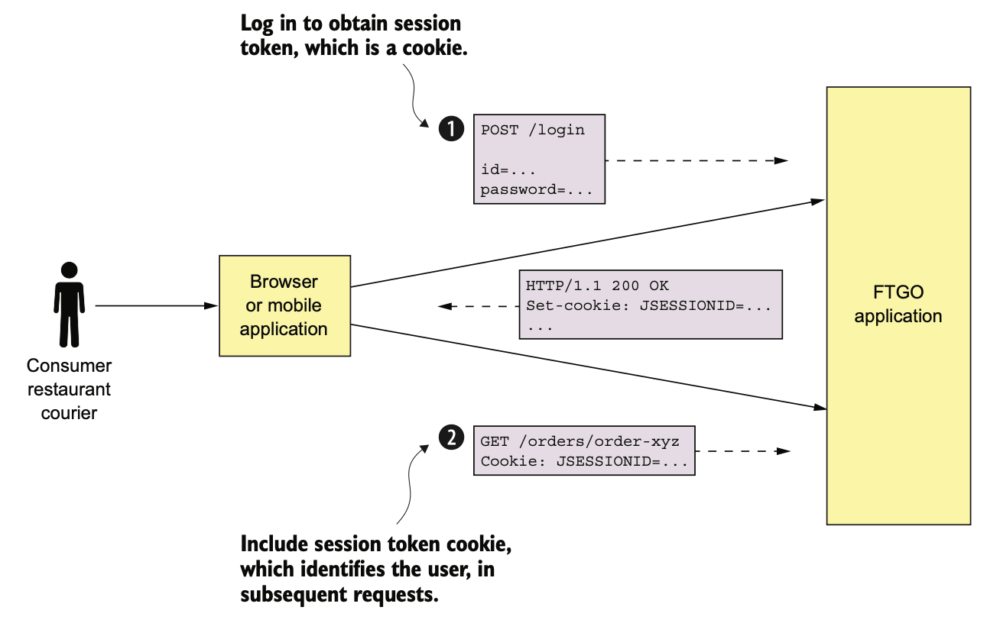
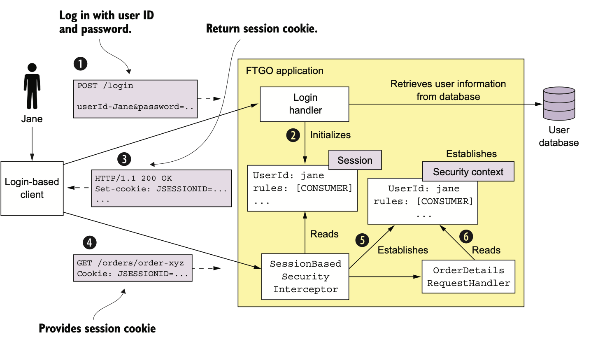
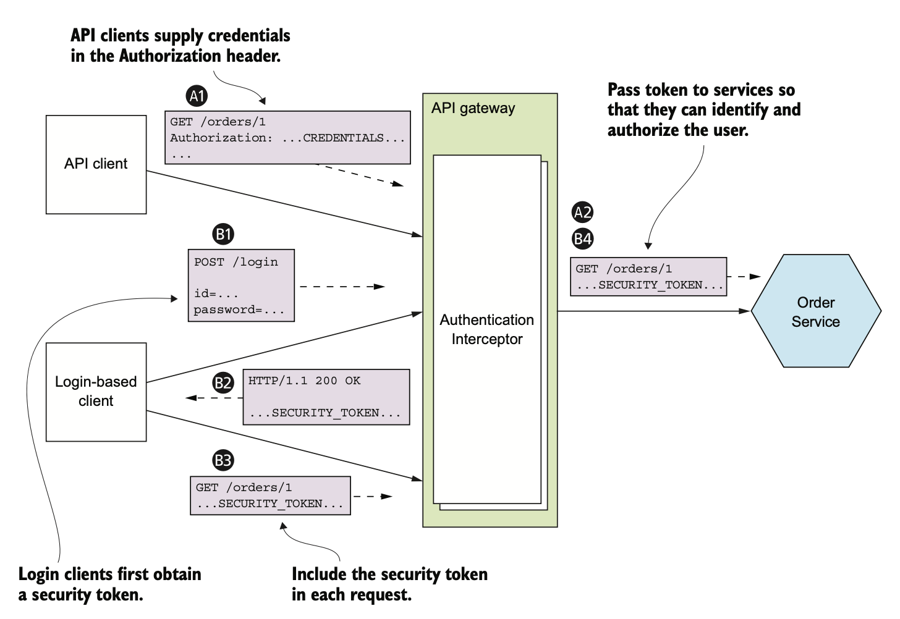
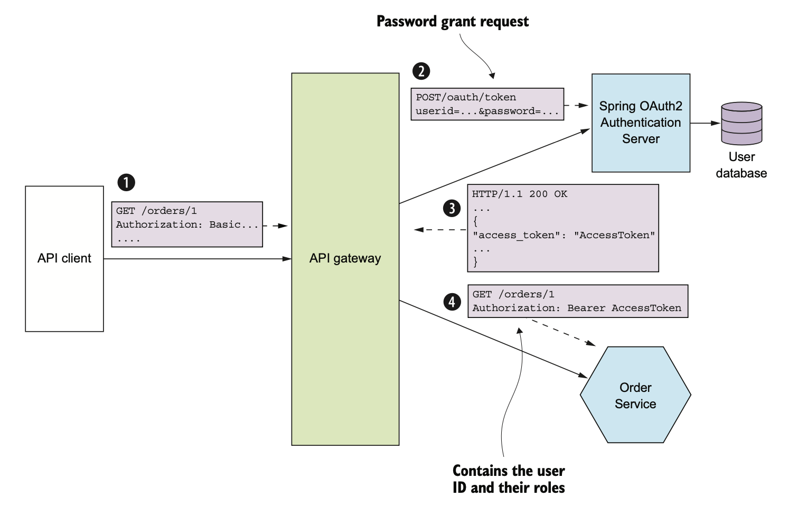
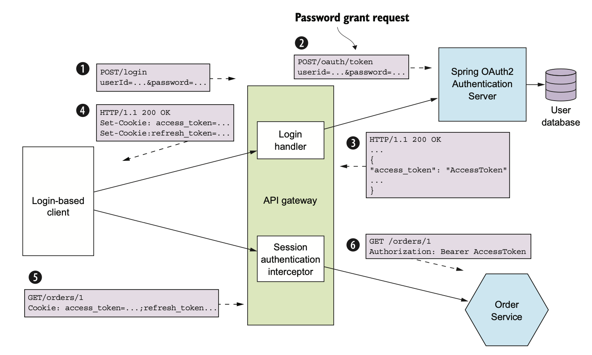

# 11.1.0 서론

회사에서 보안은 굉장히 중요한 이슈이다.

Application 개발자는 주로 다음 네 가지 보안 요소를 구현하게 된다.

- **Authentication:** Application에 접근하는 Application이나 Principal의 신원을 확인한다.
  ID / PASSWORD나 Application API Key / Secret 등 Principal의 credentials을 확인하게된다.
- **Authorization:** Principal이 Data에 작업을 요청해서 수행할 권한이 있는지 검사한다.
  보통 Role Based 보안이나 Access Control List와 함께 사용한다.
  Role Based는 사용자에게 하나 이상의 역할을 배정해서 권한을 부여하고, ACL은 사용자나 역할을 대상으로 특정 객체에 접근할 권한을 부여한다.
- **auditing:** 보안 이슈를 탐지하고, 관련 법규 검사(Compliance) 시행한다.
- **Security IPC:** 모든 서비스를 드나드는 통신에서 TLS를 경유하는게 이상적이다.
  서비스간 통신에서 인증이 필요한 경우도 있다.

# 11.1.1 기존 Monolithic Application에서의 보안

FTGO Application은 소비자, 배달원, 음식점 등 다양한 Client가 접속한다.

다음 그림은 Monolithic FTGO에서 Client가 인증을 받고 요청하는 과정이다.

1. 사용자가 ID / 비밀번호을 담아 POST 요청을 보낸다.
2. FTGO에서 이 정보가 옳다면 Client에게 Session Token을 반환한다.
3. Client는 이후 요청에 이 Session Token을 담아 전송한다.

이 아키텍쳐의 핵심은 Session이다.

ID와 역할은 Session에 담겨 관리되고, FTGO는 Java EE Application으로 HttpSession 객체를 메모리에 올려서 사용한다.

Session은 Session Token으로 식별되며, Client는 요청마다 Session Token을 함께 보낸다.

 

1. Client가 로그인 요청을 보낸다.

2. LoginHandler에서 Principal을 검증하고, Session을 만드는 등 로그인 요청을 처리한다.

3. LoginHandler가 Client에게 Session Token을 반환한다.

4. Client는 이후 요청마다 Session Token을 반환한다.

5. Session이 담겨있다면 SessionBasedSecurityInterceptor가 가장 먼저 처리한다.

   요청이 들어올때마다 Session Token을 검증하고 SecurityContext를 설정해준다.

6. RequestHandler는 권한이 있는지 검증하고 신원을 획득한다.

FTGO에선 역할로 인가시킨다.

사용자마다 CONSUMER, RESTAURANT, COURIER, ADMIN 역할을 정의하고 Spring Security의 보안 메커니즘을 사용해 역할별로, Endpoint별로 접근을 제한한다.

 

기존 Monolithic Application에서 하던 방법은 거의 유일한 방법이라고도 할만하다.

InMemory Session의 단점은 특정 Session은 항상 동일한 Application에 보내야하기 때문에 라우팅이나 부하 분산이 복잡해진다.

예를 들면 Application을 닫기 전 모든 Session이 만료되기를 기다리며 Session Draining을 구현해야 한다.

혹은 DB에 Session을 때려박는 방법도 있다.

# 11.1.2 MSA에서 Security 구현

MSA는 모든 외부 요청을 API Gateway나 하나 이상의 서비스가 처리한다.

이런 서비스는 각각 별도의 Security를 구현해야한다.

하지만 MSA에서 Security를 구현하려면 우선 어디에서 인증 / 인가를 담당할지부터 결정해야한다.

하지만 아까 썼던 방식은 MSA에서는 통하지 않기 때문에 또 다른 방법을 생각해내야 한다.

- **InMemory Security Context:** Thread Local같은 InMemory SecurityContext를 통해 사용자 신원을 전달하는데, 서비스끼리 Thread를 공유할수도 없는 노릇이다.
- **Centralized Session:** InMemory Session이 의미없으니 중앙화를 한다고 해도 의미없다.
  결합도가 굉장히 올라가긴 하지만, Session이 저장된 하나의 DB에 여러 서비스가 접근할 수 있긴 하다.

## API Gateway에서 인증 처리하기

인증을 처리하는 방법에는 여러가지가 있다.

서비스마다 알아서 구현한다. 미인증 요청이 내부 Network에 들어올 수 있고, 모든 개발자가 보안을 구현해야하기 때문에 귀찮고 실수 가능성도 높다.

따라서 API Gateway가 일괄적으로 처리해주는게 낫다.

API Gateway에서 문제가 발생해도 API Gateway만 수정하면 되기때문에 편하고, 복잡한 인증 로직을 감출 수 있다.

 

Client는 Credential을 포함해서 요청을 보내고, API Gateway는 이 Request를 인증한다.

예를 들어 로그인 기반 Application에서는 Credential을 API Gateway에 POST 요청으로 보내고, Session Token을 발급받는다.

 

대부분 API Gateway에선 요청을 인증하고 난 후에 다른 서비스를 호출한다.

API Gateway로부터 호출받은 서비스는 누가 Request를 보냈는지 알아야하고, 인증을 마쳤는지도 확인해야한다.

해결 방법은 **API Gateway에서 서비스에 요청을 보낼 때 Token을 함께 보내는 것이다.**

서비스는 이 Token을 통해 Request를 검증하고, Principal 정보를 얻을 수 있다.

API Client쪽 순서는 다음과 같다.

1. Client는 Credential이 포함된 요청을 보낸다.
2. API Gateway가 Credential을 인증하고 보안 토큰을 생성해서 서비스에 전달한다.

로그인 기반에선는 다음과 같다.

1. Client는 Credential이 포함된 로그인 요청을 보낸다.
2. API Gateway에서 보안 토큰을 반환한다.
3. Client는 요청에 보안 토큰을 함께 보낸다.
4. API Gateway에선 보안 토큰을 검증하고 서비스로 보내준다.

## 인가 처리하기

Authorization 또한 Authentication처럼 중요한 메커니즘이다.

Authorization도 API Gateway에서 처리해주면 좋을 것 같다.

권한 없는 API에 Forwarding하기 전에 거부하면 된다.

 

하지만 이렇게 API Gateway에 Authorization 로직을 두게되면 **API Gateway와 서비스가 강하게 결합**되기 때문에 문제가 발생할 수도 있다.

또한 API Gateway에서 Role Base로 Endpoint를 제한할 수는 있겠지만, 객체마다 접근 권한을 제어하는 ACL까지 구현하기는 힘들다.

API Gateway가 세부 도메인 로직까지 알아야 하는건 말이 안된다.

 

따라서 인가 로직은 서비스에서 구현하는게 좋다.

## JWT로 User Identity / Role 전달하기

API Gateway에서 어떤 종류의 토큰을 사용하고, 어떤 종류의 데이터를 담을지도 결정해야한다.

토큰의 종류는 두 개로 나눌 수 있다.

- **난독화 토큰:** UUID처럼 알아볼 수 없는 토큰으로, 성능이나 가용성이 떨어지고 지연시간이 길다.

  Token 수신자가 Token 유효성을 검증하고, 보안 서비스에 RPC 호출을 해야하기 때문이다.

- **투명 토큰:** 사실상 투명 토큰의 표준격인 JWT는 사용자의 Identity나 Role을 안전하게 표현할 수 있는 수단이다.

  사용자 정보, 만료 시간 등 각종 데이터가 담긴 JSON 객체를 Payload에 담아 JWT를 생성한 곳과 받는 곳에서만 알 수 있는 Secret으로 암호화한다.

JWT가 훨씬 좋아보이지만, **Token 자체에 정보가 담겼기 때문에 한 번 발행하면 취소가 불가능하다.**

Token이 악의적인 해커에게 탈취당해도 이 토큰의 사용을 막을 별다른 방법이 없다.

이를 해결하기 위해서는 JWT 토큰의 유효기간을 짧게 잡아야 하는데, 그러면 Session을 유지하기 위해 계속 JWT를 재발행 해야한다.

## OAuth 2.0 응용하기

Credentials나 Role 등 사용자 정보를 관리하는 User Service를 구현한다고 해보자.

API Gateway는 이 User Service를 호출해서 Client 요청을 인증하고 JWT를 가져온다.

서비스 API를 설계하고 자신의 Web Framework로 구현하면 되겠지만, 이런 서비스를 직접 개발하는건 귀찮다.

 

따라서 이미 잘 구현된 OAuth 2.0 표준이 구현된 서비스나 Framework를 갖다쓰면 된다.

원래 OAuth 2.0은 github나 google 등 Public Cloud Service 사용자가 사용하는 Third Party Application에 비밀번호를 노출하지 않고 해당 계정의 정보에 접근하도록 할 수 있다.

 

처음에는 위에서 소개한 방법으로 사용되었는데, Application의 인증 / 인가 용도로도 사용할 수 있다.

따라서 MSA에서 OAuth 2.0 Protocol로 Security를 구현해보자.

 

다음은 OAuth 2.0의 핵심 개념이다.

- **Authorization Server:** 사용자 인증과 Token 발급 API를 제공한다.
- **Access Token:** 리소스 접근을 허가하기 위한 토큰으로, 구현체마다 format이 다르겠지만 Spring은 JWT를 사용한다.
- **Refresh Token:** Client가 새로운 Access Token을 받기 위한 토큰으로, 수명은 길지만 서버측에서 취소시킬 수 있다.
- **Resource Server:** Access Token으로 접근을 허용하는 서비스로, MSA에선 서비스가 Resource Server이다.
- **Client:** Resource Server에 접근하려하는 Client로, MSA에선 API Gateway가 될 수 있다.

로그인 기반 Client는 나중에 다시 알아보고, 우선 API Client를 인증해보자.

다음 그림은 API Client의 요청을 API Gateway가 인증하는 과정이다.

1. Client는 기본적인 Credential을 담아 Authentication 요청을 보낸다.
2. API Gateway는 OAuth 2.0 Authentication Server에 Password Grant 방식으로 요청을 보낸다.
3. Authentication Server는 API Gateway의 Credential을 검증해서 Access Token과 Refresh Token을 반환한다.
4. API Gateway는 서비스에 요청을 할때마다 발급받은 Access Token을 넣어 보내고, 서비스는 Access Token으로 요청을 인증한다.

 

OAuth 2.0 기반 API Gateway는 Access Token을 Session Token처럼 사용해서 Session-Oriented Client를 인증할수도 있다.

> 데이터를 주고받기 전 반드시 Session 연결을 맺는 Client

Access Token이 만료되면 Refresh Token을 통해 Access Token을 다시 발급받게 된다.

 

다음 그림은 API Gateway가 OAuth 2.0으로 Session-Oriented Client를 처리하는 과정이다.

1. 로그인 기반 Client가 Credential을 API Gateway에 POST한다.
2. API Gateway의 Login Handler는 OAuth 2.0 Authentication Server에 Passord Grant 방식으로 요청을 보낸다.
3. Authentication Server는 Client의 Credential을 검증하고, 토큰들을 반환한다.
4. API Gateway는 받은 토큰을 쿠키 형식 등으로 반환한다.
5. Client는 Access / Refresh Token을 API 호출마다 함께 보낸다.
6. API Gateway의 Session Authentication Interceptor는 Access Token을 검증하고 서비스에 토큰을 넣어 보낸다.

Access Token의 (거의)만료되었을 때 OAuth 2.0에서 Refresh Grant를 요청해서 Access Token을 재발급받는다.

 

OAuth는 **검증된 보안 표준**이라는 큰 장점이 있다.

기존의 OAuth 인증 서버를 그대로 갖다 쓸 수 있기 때문에 편리하고, 보안을 확실하게 지킬 수 있다.

물론 OAuth 방식밖에 없는건 아니지만, 어찌하던 다음 개념은 유지된다.

- API Gateway가 인증을 담당함
- API Gateway나 서비스는 JWT 등의 투명 토큰으로 Principal 정보를 주고받음
- Principal이나 role에 대한 정보를 담은 Token을 사용함

