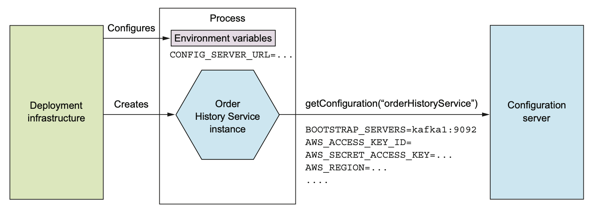

# 11.2.0 서론

주문 이력 서비스는 Apache Kafka에서 전달받은 Event를 소비하고, AWS DynamoDB의 Item을 읽고, 쓰는 동작을 한다.


하지만 위에서 볼 수 있다싶이 이 서비스를 실행하기 위해서는 여러가지 Property가 필요하다.

가령 AWS DynamoDB의 주소나 Kafka의 포트 등등이 있을 수 있다.

당연히 개발환경과 Product 환경이 다른 정보를 사용하기 때문에 서비스에 이런 값들을 하드코딩하는건 위험하다.

배포 파이프라인을 통해 같은 서비스를 여러 환경에서 동작할 수 있도록 해야한다.

<br>

Configuration Properties들을 미리 하드코딩 하던가, 혹은 Spring의 profile를 사용하는건 보안에 취약하고 배포에 한계가 있다.

게다가 Credential처럼 민감한 데이터는 Hashicorp Vault나 AWS Parameter Store같은 보안 서비스에 안전하게 저장하는게 낫다.

<br>

Runtime에 Property 값을 서비스에게 제공하는 Externalized에는 두 가지 종류가 있다.

- **push model:** OS 환경변수나 설정 파일에서 Property를 읽어 배포 인프라에서 Service Instance에게 값을 주입한다.
- **pull model:** Service Instance가 Configuration 서버에서 Property값을 읽는다.

# 11.2.1 Push Based Externalized

push model은 배포 환경과 서비스 사이의 콜라보가 필요하다.

배포 환경은 Service Instance가 생성될 때 Property 값을 제공한다.

다음은 환경변수로 전달하는 방식으로, Configuration 파일도 이와 비슷하게 사용한다.


배포 환경과 서비스는 Property 값을 주고 받는 방법을 맞춰야한다.

구체적인건 배포 환경마다 다르다.

<br>

Externalized Property를 받은 Application에선 `System.getEnv()`로 값을 가져올 수 있다.

Spring Boot에선 훨씬 편하게 Property값을 읽어올 수 있다.

Spring Boot에서 읽어올 수 있는 값들은 다음과 같다.

1. CLI 인수
2. OS 환경변수 / JSON으로 작성된 JVM System Property
3. JVM System Property
4. OS 환경변수
5. 현재 디렉토리의 Configuration 파일

> Property 이름이 겹치면 위에서부터 우선적용된다.

Property 값은 Spring의 ApplicationContext로 load하고, 다음과 같이 `@Value`로 특정 property를 가져오면 된다.

``` java
@Value("${aws.region}")
private String awsRegion;
```

Spring에선 awsRegion 값을 `aws.region` 값으로 초기화한다.

`aws.region`는 Confiugration 파일, AWS_REGION 환경 변수 등 다양한 곳에서 읽을 수 있다.

<br>

push model이 지금도 많이 사용되는 방식이기는 하지만, 이미 실행중인 서비스의 Property를 바꾸는건 거의 불가능하다.

Configuration Property 값이 여러 서비스에 흩어지는 것도 문제가 될 수 있다.

따라서 pull model을 검토해봐야한다.

# 11.2.2 Pull Based Externalized

pull model은 Service Instance가 시작될 때 필요한 값을 Configuration Server에 요청해서 읽어오는 방식이다.

Configuration Server에 접근할 때 필요한 정보는 환경 변수 등 push model로 인스턴스에 넣어준다.

<br>

Configuration Server를 구현하는 방법에는 여러 방법이 있을 수 있다.

- VSC
- SQL / NoSQL
- Spring Cloud Config Server등의 전용 서버, Hashicorp Vault나 AWS Parameter Store



Spring Cloud Config는 Server / Client로 구성된 서버 기반 Framework이다.

서버쪽은 VSC, DB, Hashicorp Vault등 다양하게 지원하고, Client는 서버에서 Configuration Property를 가져와 ApplicationContext에 주입한다.

Configuration Server의 장점은 다음과 같다.

- **중앙화:** 모든 Configuration Property를 한 곳에서 관리하게되면 편하고, 전역으로 기본 값을 설정할 수 있다.
- **민감한 데이터의 투명한 복호화:** DB Credential같은 민감한 데이터는 암호화가 최선인데, 암호화한 데이터를 서비스에서 복호화하기 위해선 암호화 키가 필요하다.
  Configuration Server는 Property를 자동으로 복호화해서 전달한다.
- **동적 Reconfiguration:** 수정된 값을 Polling등의 방식으로 Reconfiguration한다.