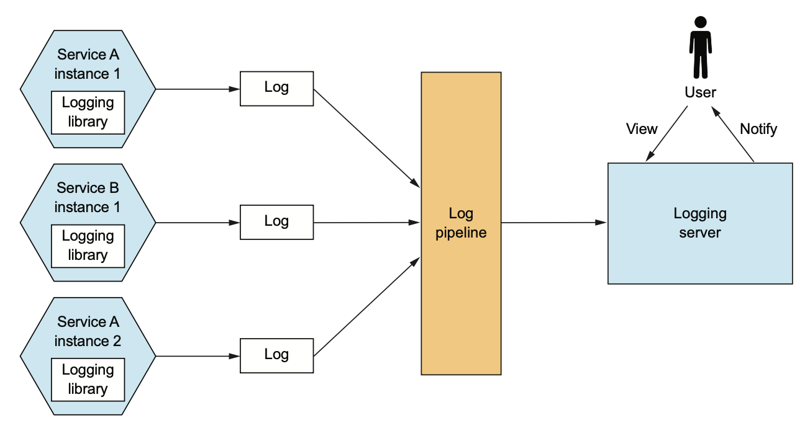
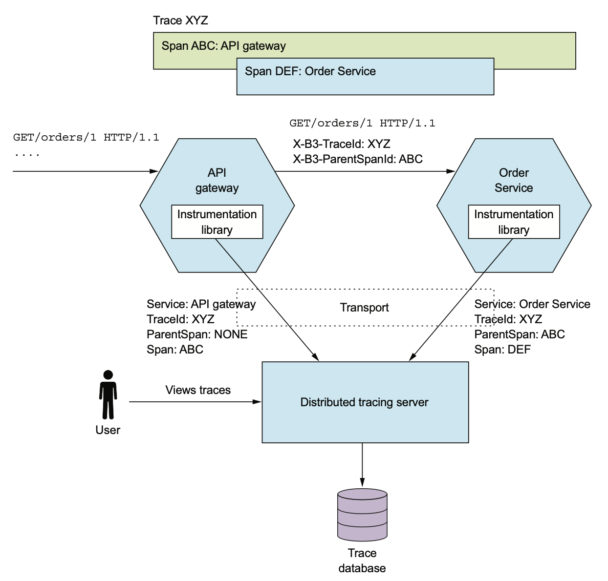

# 11.3.0 서론

FTGO를 Product에 배포한다고 해보자.

운영하는 사람의 입장에선 Request Per Second, 리소스 사용률 등 Application의 사용률이 궁금할 것이다.

혹시나 Service Instance가 실패하거나 Disk가 가득 차버리는 등의 문제가 발생할수도 있다.

이럴 때엔 운영하는 사람이 먼저 이 사실을 알아차려야한다.

<br>

하드웨어의 가용성이나 이용률 등을 모니터링하는 일은 대부분 운영자의 일이다.

하지만 개발자가 Service Instance의 동작과 Health Check API를 노출시켜주면 TroubleShooting할 수 있다.

<br>

- **Health Check API:** 서비스의 상태를 반환하는 API
- **Log Aggregation:** 서비스 활동을 로깅하며 로그 검색과 알림 시스템이 있는 중앙 로깅 서버에 로그를 보낸다.
- **Distributed Tracing:** 각 외부 요청에 ID를 붙여 서비스를 드나드는 과정을 추적한다.
- **Exception Tracing:** 예외 중복 제거하고, 개발자 알림을 보내주고, 예외별 해결법을 추적한다.
- **Application Metrics:** Service는 Counter나 게이지 등 metrics를 보여주고, 수집한 데이터를 metrics 서비스에 전달한다.
- **Auditing Logging:** 사용자 Action을 Logging한다.


이 패턴들의 가장 큰 특징은 개발자, 운영자 업무 영역이 정해져있는 것이다.

예를 들어 Health Check API 패턴에서 개발자는 자기 서비스의 Health Check API를 구현하고, 운영자는 그걸 호출해서 모니터링한다.

Log Aggregation 패턴에서도 개발자는 로그를 남기고, 운영자가 로그를 수집한다.

# 11.3.1 Health Check API

실행중이지만 요청을 처리하기 힘든 API가 있을 수 있다.

이제 막 실행된 Service Instance도 준비가 끝날때까지 요청을 처리할 수 없다.

요청을 처리할 준비도 안됐는데 그 Instance에 Routing해줄순 없다.

또한, Service Instance가 종료되지 않고 Fail이 뜰수도 있다.

Service Instance를 복원할 수 없다면 강제로 종료시키고 새 Instance를 실행해야한다.

<br>

Service Instance는 자신이 요청을 처리할 수 있는 상태인지에 대해 알려야하기 때문에 Infrastructure쪽에서 호출 가능한 Health Check Endpoint를 서비스에 구현하는것도 좋은 방법이다.


Spring Actuator의 경우에는 `GET /actuator/health` Endpoint를 호출했을 때 정상이면 200, 그 외에는 503을 반환해준다.

배포 인프라에선 서비스의 상태를 계속해서 살피고, 문제가 있다면 바로 조치할 수 있도록 주기적으로 Health Check API를 호출한다.

Health Check Request Handler는 Service Instance와 Service Instance와 외부 서비스의 접속 상태를 검증한다.

DB에도 주기적으로 Test용 쿼리를 보내어 상태를 체크하고, 200 혹은 500을 반환한다.

<br>

Health Check Request Handler는 Response Body를 비우고 Status Code로 알수 있겠지만, 각 Adapter에 대한 자세한 정보를 반환하기도 한다.

민감한 정보도 포함되었을 수도 있기 때문에 Spring Actuator같은 경우에는 Response 수준을 설정할 수 있도록 해준다.

## Health Check Endpoint 구현하기

Health Check Endpoint를 구현한 코드는 Service Instance의 상태를 어떻게든 확인해야한다.

우선 Instance가 다른 서비스에 접근 가능한지 확인할 수 있다.

다른 서비스의 API를 호출해볼수도 있고, 테스트용으로 DB Connection을 얻고 테스트 쿼리를 실행할수도 있다.

하지만 구현하기 귀찮고 노력도 많이 든다.

<br>

Spring Boot Actuator는 `/actuator/health` Endpoint를 호출하면 Health Check 실행 결과를 반환해준다.

이 라이브러리는 관습적으로 필요한걸 간단하게 설정하도록 해준다.

예를 들어 JDBC Datasource를 사용한다면 테스트 쿼리를 실행하는 Health Check를, RabbitMQ를 사용한다면 RabbitMQ가 가동중인지 확인하는 Health Check로직을 설정해 준다.

또는 HealthIndicator 인터페이스를 구현한 클래스를 정의하여 직접 구현할수도 있다.

이 인터페이스의 `health()`는 Health Check 결과를 반환하고, `/actuator/health`로 요청이 들어왔을 때 실행된다.

## Health Check Endpoint 호출

주로 서비스를 배포할 때, 배포 인프라에서 Health Check API를 호출하게 된다.

방법은 세부 인프라를 구축하는 방법마다 다르다.

# 11.3.2 Log Aggregation

Log는 소중한 Trouble Shooting도구이다.

Application에 문제가 발생했다면 당연히 로그부터 보기 때문이다.

하지만 MSA에서의 로그는 관리하기 쉽지 않다.

예를 들어 `getOrderDetails()` 쿼리에서 발생한 오류는 어떻게 디버깅해야할까?

log가 API Gateway부터 다른 서비스들까지 흩어져있을 때 어떻게 로그를 가져올 수 있을까?

<br>

해결 방법은 **모든 서비스 Instance가 남긴 로그를 Log Pipeline으로 중앙의 Logging Server로 보내는 것이다.



로깅 서버에서 저장된 로그는 조회, 검색, 분석이 간편하며 특정 메세지가 왔을 때 알림을 전송할수도 있다.

로깅 서버는 보통 운영 팀에서 담당하지만 유용한 로그를 남기는건 개발자가 해야한다.

## 서비스 로그 생성

몇 가지에 대해 고민해봐야 한다.

1. 로깅 라이브러리 선정
2. 로그를 어디에 저장할지

프로그래밍 언어는 로깅 라이브러리 하나쯤은 있다.

Java 진영에선 Logback, Log4J, JUL이 있고, 이들의 Facade 역할을 하는 SLF4J가 있다.

<br>

로그를 저장할 위치도 결정해야한다.

기존에는 그냥 파일 시스템의 경로에 저장했지만, Container나 Serverless 등을 사용하는 요즘에는 이런 방식을 사용하지 않는다.

애초에 Lambda에는 영구적으로 뭔가를 저장할 수 없기 때문에 따로 로그를 저장해줘야한다.

## Log Aggregation 인프라

로깅 인프라에선 로그를 수집, 저장한다.

ELK는 대표적인 로깅 인프라 서비스이다.

- **ElasticSearch:** 로깅 서버로 사용되는 Text Search Oriented NoSQL
- **Logstash:** 서비스의 로그를 수집하여 ElasticSearch에 출력하는 pipeline
- **Kibana:** ElasticSearch용 시각화 툴

다른 파이프라인은 Fluentd나 Apache Flume이 있고, AWS Cloudwatch Logs등 다양한 제품이 있다.

# 11.3.3 Distributed Tracing

`getOrderDetails()`가 갑자기 느려진 이유를 찾는다고 가정해보자.

외부 네트워크 문제는 아니고, API Gateway나 서비스 중 한곳에서 지연이 발생했다.

서비스마다 평균 응답시간을 재다보면 원인을 찾을수는 있겠지만, 이건 각각의 요청에 대한 평균 시간일 뿐이다.

게다가 서비스 호출이 많아지면 복잡해지고, 한 사람이 모든 서비스를 알수도 없다.

<br>

Application이 어떤 작업을 처리하는지 알아보기 좋은 방법은 Distributed Tracing(분산 추적)을 사용하는 것이다.

Distributed Tracing은 Monolithic Application의 Perfomance Profiler와 비슷하다고 보면 된다.

요청을 처리할때마다 서비스 호출 정보를 기록해서 어떤 요청에서 얼마나 시간이 소모됐는지 알 수 있다.

<br>

Distributed Tracing 서버는 API Gateway에서 요청을 처리할 때 발생한 일들을 시각화해준다.

API Gateway로 들어온 Inbound 요청과 Gateway에서 주문 서비스에 요청한 내용이 저장된다.


위와 같은걸 trace라고 한다.

외부 요청을 나타내는 trace는 하나 이상의 span으로 구성되게 된다.

Span은 작업 이름, 시작 / 종료 Timestamp 등으로 구성되어있다.

중첩된 경우 Child Span을 가지기도 한다.

위에서 Parent Span은 API Gateway 호출이고, Child Span은 API Gateway가 서비스를 호출한 것이다.

<br>

Distributed Tracing에선 각 요청마다 ID를 부여하고, 서비스는 이 ID를 로그에 남기게 된다.

특정 요청에 대한 로그는 ID로 쉽게 찾을 수 있다.

<br>

예를 들어 주문 서비스에서 다음과 같은 로그가 발생했다고 가정해보자

```
2018-03-04 17:38:12.032 DEBUG [ftgo-order-service, 8d8fdc37be104cc6, 8d8fdc37be104cc6, false]

7 --- [nio-8080-exec-6] org.hibernate.SQL :
	select order0_.id as id1_3_0_, order0_.consumer_id as consumer2_3_0_, order0_.city as city3_3_0_,
    order0_.delivery_state as delivery4_3_0_, order0_.street1 as street5_3_0_,
    order0_.street2 as street6_3_0_, order0_.zip as zip7_3_0_,
    order0_.delivery_time as delivery8_3_0_, order0_.a
```

`ftgo-order-service,8d8fdc37be104cc6,8d8fdc37be104cc6,false`에는 다음과 같은 정보가 담겨있다.

- Application 이름(ftgo-order-service)
- Trace ID(8d8fdc37be104cc6)
- Span ID(8d8fdc37be104cc6)
- Span이 Distributed Tracing Server에 Export되지 않았다는 Flag(false)

8d8fdc37be104cc6를 검색하면 요청의 모든 로그를 얻을 수 있다.

Distributed Tracing은 각 서비스에서 사용되는 Instructiomentation Library와 Distributed Tracing서버로 구성된다.

Instructiomentation Library는 Trace ID나 Parent Span ID등 Trace 정보를 Outbound 요청에 추가하고 Distributed Tracing 서버에 Trace를 전달한다.

Trace를 전달할 때 표준으로 많이 사용되는 B3는 X-B3-TraceId, X-B3-ParentSpanId같은 Header를 사용한다.



## Instrumentation Library

Instrumentation Library는 Span Tree를 만들어 Distributed Tracing Server로 보낸다.

이 Library를 서비스에서 직접 호출할수도 있겠지만, 비지니스 로직이 얽히기 때문에 AOP를 사용하는게 좋다.

<br>

AOP로 잘 알려진건 Spring Cloud Sleuth가 Spring AOP를 통해 Distributed Tracing에 연계해준다.

이 라이브러리를 의존성에 추가하면 서비스가 Distributed Tracing API를 따로 호출할 필요가 없다.

## Distributed Tracing Server

Instrumentation Library는 Distributed Tracing Server에 Span을 전송하고 Distributed Tracing Server는 받은 Span을 짜집어 제대로된 Trace로 바꿔 DB에 저장한다.

원래 트위터에서 개발한 Open Zipkin이 유명한 Distributed Tracing Server였다.

서비스는 HTTP 또는 Message Broker로 Span을 Zipkin Server로 전송하고, Zipkin은 DB에 Trace를 저장한다.

아까 봤듯이 Trace를 표시하는 UI도 있다.

AWS의 X-ray도 Distributed Tracing Server의 일종이다.

# 11.3.4 Application Metrics

Product 환경에서 모니터링과 알림은 매우 중요하다.

모니터링은 사용된 모든 기술들의 Metrics를 수집해서 Application의 Health 정보를 제공한다.


CPU 사용량 등의 Infrastructure 수준의 Metrics부터 지연 시간이나 요청 수 등의 Application 수준의 Metrics까지 다양하다.

Metrics는 주기적으로 다음을 Sampling한다.

- **name:** Metrics 이름
- **value:** 값
- **timestamp:** Sampling한 시간

Dimension이라는 Key - Value를 지원하는 모니터링 시스템도 있다.

예를 들어 `jvm_memory_max_bytes`라면 `area="heap", id="PS Eden Space"`와 `area="heap", id="PS Old Gen"`와 같은 Dimension과 함께 Report하는 것이다.

주로 머신 이름, 서비스 이름 등 부가 정보를 제공하는 용도로 사용된다.

보통은 모니터링 시스템은 하나 이상의 Dimension과 Metrics를 수집한다.

<br>

모니터링도 운영팀에서 관장하지만, 서비스 개발자도 두 가지 일을 해줘야한다.

1. 서비스가 자신의 동작에 대한 Metrics를 수집해야한다.
2. 이런 지표를 JVM과 Application Framework 수준에서 Metrics Server에 Expose한다.

## 서비스 수준의 Metrics 수집

Metrics를 수집하기 위해 필요한 일은 사용하는 프레임워크에 따라 다르다.

Spring Boot 기반에선 Micrometer Metrics를 의존성에 추가하고 몇 줄만 추가하면 기본적인 Metrics를 바로 얻을 수 있다.

Spring Boot의 Autoconfiguration 덕에 개발자가 Metrics에 신경을 쓸 필요가 없다.

Application의 특정 Metrics를 가져오고싶다면 Micrometer Metrics API를 직접 호출하면 된다.

<br>

다음은 주문 서비스에서 주문 접수 / 승인 / 거부 횟수에 대한 Metrics를 수집하는 코드이다.

Micrometer Metrics의 MeterRegistry라는 인터페이스를 사용하여 Custom Metrics를 수집한다.

``` java
@RequiredArgsConstructor
public class OrderService {
    
    // Application에 특정한 Metrics를 관리하는 Micrometer Metrics 라이브러리
    private final MeterRegistry meterRegistry;
    
    public Order createOrder(...) {
        meterRegistry.counter("placed_orders").increment(); // 주문 성공시 place_orders counter 증가
        return order;
    }
    
    public void approveOrder(long orderId) {
        ...
		meterRegistry.counter("approved_orders").increment(); // 주문 성공시 approved_orders counter 증가
    }
    
    public void rejectOrder(long orderId) {
        ...
    	meterRegistry.counter("rejected_orders").increment(); // 주문 성공시 rejected_orders counter 증가
    }
}
```

## Metrics Service에 Metrics 전달

서비스가 수집한 Metrics를 Push / Pull 방식으로 Metrics Service에 전달한다.

Push Model은 Service Instance가 API를 호출해서 Metrics Service에 넘겨주는 방법이다.

> AWS Cloud Watch

Pull Model은 Metrics Service는 micrometer-registry-prometheus 라이브러리로 prometheus와 연동한다.

Classpath에 이 라이브러리를 추가하고 `GET /actuator/prometheus` 요청을 보내면 prometheus가 원하는 format대로 Metrics를 가져올 수 있다.

다음은 OrderService가 보고한 Custom Metrics이다.

```
$ curl -v http://localhost:8080/actuator/prometheus | grep _orders
# HELP placed_orders_total
# TYPE placed_orders_total counter
placed_orders_total{service="ftgo-order-service",} 1.0
# HELP approved_orders_total
# TYPE approved_orders_total counter
approved_orders_total{service="ftgo-order-service",} 1.0
```

prometheus 서버에선 이걸 Polling해서 Metrics를 가져온다.

prometheus에 쌓인 Metrics는 Grafana라는 툴로 시각화할 수 있다.

또한 알림 기능도 있다.

예를 들어 placed_orders_total의 변화율이 일정량 이상으로 내려갔을 때 알림을 받는 방식이다.

# 11.3.5 Exception Tracing

Exception Log를 남겨야 하는 일은 드물긴 하지만 원인을 식별하는데에 중요한 단서가 된다.

또한 Exception은 시스템의 실패나 개발 버그의 징후이기도 하다.

기존에는 로그에서 예외를 검색하거나 로그에 예외가 발생하면 알림을 보내도록 로깅 서버를 구성했다.

하지만 이런 방식에는 다음과 같은 단점이 있다.

- 로그 파일은 대부분 한 줄이지만, Exception은 여러 줄로 구성된다.
- 로그 파일에 있는 Exception의 해결 방법을 Tracing할 수 없다. 따라서 Issue Tracker에 일일히 복붙해야한다.
- 중복된 예외를 처리할 수 없다.

<br>

정리하자면 예외의 중복을 제거하고, 알림을 보내고, 해결 과정을 관리하는 Exception Tracing 서비스를 따로 두는게 좋다.

다른 서비스에 Exception이 발생하면 Exception Tracing 서비스에 보내도록 구성하면 된다.

<br>

서비스가 직접 Exception Tracing 서비스를 호출해도 되지만, 서비스에 내장된 Client 라이브러리를 사용하는게 편하다.

HoneyBadger라는 라이브러리는 Exception을 붙잡고, 보고하는 Servlet Filter 등 여러 편리한 장치를 제공한다.


# 11.3.6 Auditing Logging

Auditing Logging은 **사용자의 Action을 기록**하는 것이다.

일반적으론 수상한 동작 감지, 고객 지원 등의 목적으로 사용된다.

사용자가 누구인지, 어떤 객체에 무엇을 했는지 기록해서 DB에 저장한다.

<br>

구현하는 방법은 다음과 같다.

- Auditing Logging을 비지니스 로직에 추가한다.
- AOP를 활용한다.
- Event Sourcing을 사용한다.

## Auditing Logging을 비지니스 로직에 추가한다.

Auditing Logging을 그냥 비지니스 로직에 추가하는 것이다.

서비스의 메소드마다 Auditing Log를 생성하고, DB에 저장한다.

하지만 **Auditing Logging 처리와 비지니스 로직이 섞이게 된다.**

## AOP 활용

AOP로 각 서비스 메소드 호출을 Intercept하는 Advice로 Auditing Logging을 구현할수도 있다.

확실한 방법이지만, Advice는 메소드명이나 파라미터만 접근할 수 있기 때문에 어떤 비지니스 객체를 대상으로 하는지 등 비지니스 지향적인 Auditing Log를 구성하기 힘들다.

## Event Sourcing

Event Sourcing은 애초에 모든 작업을 기록하기 때문에 Auditing Log를 지원한다.

하지만 이 방법에선 Query를 기록하지 않기 때문에 별도의 Log가 필요하면 다른 방법을 사용해야한다.