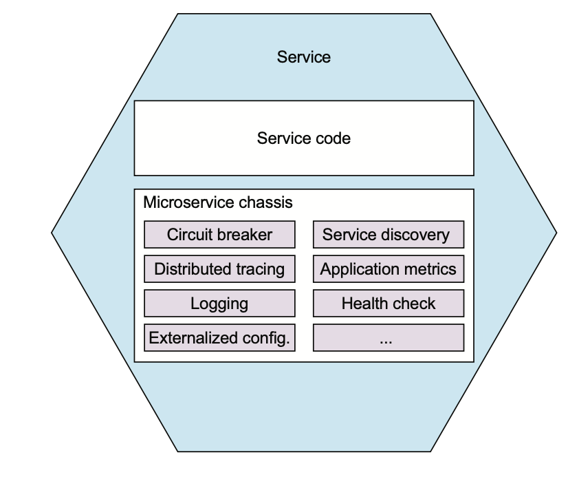
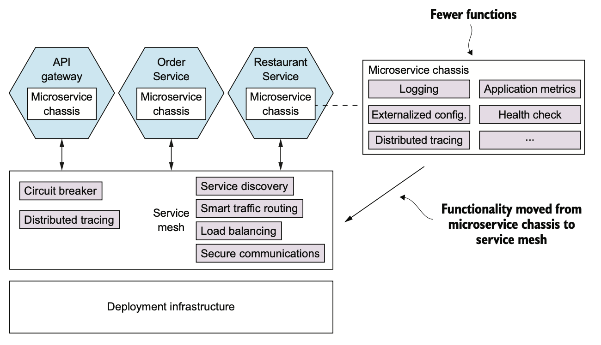

# 11.4.0 서론

Metrics, Exception Tracing에 Exception Report, Health Check, Security 등 서비스에서 구현해야하는 것들을 이번 챕터에서 살펴봤다.

이 외에도 여러가지를 추가로 구현해야하는데, 서비스마다 이걸 해주기는 굉장히 귀찮다.

 

Microservice Chassis는 이러한 일들을 처리해주는 프레임워크들이다.

MSA에서 지금까지 배웠던 것에 대한 코드를 작성할 필요가 없고, 그만큼 개발 속도가 빨라진다.

# 11.4.1 Microservice Chassis

Microservice Chassis는 다양한 관심사를 한 번에 처리해준다.

- Externalized configuration
- Health checks
- Application metrics
- Service discovery
- Circuit Breakers
- Distributed Tracing

Microservice Chassis를 사용하면 개발자의 코드는 줄고, 때에 따라 코드를 아예 안짜도 되는 경우까지 있다.

FTGO Application은 Spring boot, Spring Cloud를 Microservice Chassis로 사용한다.

Externalized는 Spring boot, Circuit Breakers는 Spring Cloud가 제공한다.

> Spring Cloud에서 Client쪽 Service Discovery도 지원하지만 전용 Service Discovery를 사용한다.

Go에선 Go Kit이나 Micro를 사용하면 된다.

 

개발하는 언어 / 플랫폼의 조합마다 Microservice Chassis가 필요하다는 단점은 있다.

다행히도 Microservice Chassis의 기능들은 대부분 인프라에서 대신 구현할 수 있다.

# 11.4.2 Service Mesh

Microservice Chassis가 다양한 관심사를 처리하기엔 좋지만, 사용하는 언어마다 하나씩 필요한게 문제다.

Spring Cloud가 JVM으로 작성된 서비스에는 유용한 반면 Node.js에는 도움이 되지 않는 것처럼 말이다.

따라서 공통 기능을 서비스 외부에 Service Mesh에 구현하는 것이다.

Service Mesh는 한 서비스와 다른 서비스, 외부 Application 사이의 Communication을 조정하는 Infrastructure이다.

 

서비스를 드나드는 Traffic은 모두 Circuit Breaker, Distributed Tracing 등 다양한 관심사가 구현된 Service Mesh를 통과한다.

또한 Service Mesh는 Transport Layer Security로 IPC를 보안한다.

따라서 특정 공통 기능을 서비스에 구현할 필요가 없다.

Service Mesh 덕에 Microservice Chassis는 Health Check 등 Application Code와 단단하게 결합된 관심사만 구현하면 되기 때문에 훨씬 단순해진다.

단 Microservice Chassis는 Distribute Tracing을 전파하여 분산 추적을 하도록 해줘야한다.

> Service Mesh를 구현한 제품은 다음과 같다.
>
> - Istio
> - Linkerd
> - Conduit
>
> 현재 가장 성숙한건 Linkerd이다.