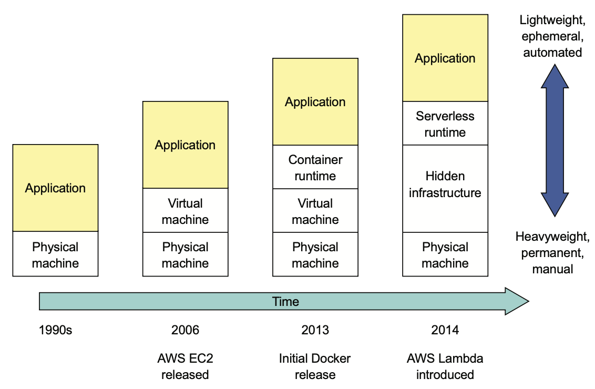
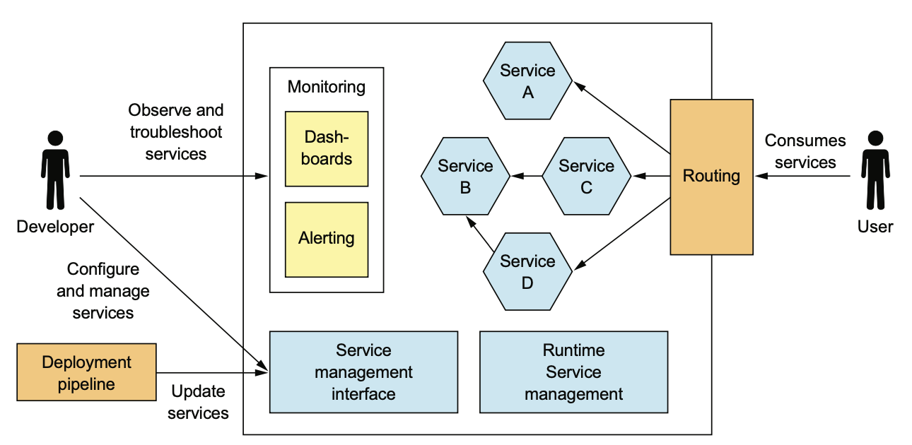
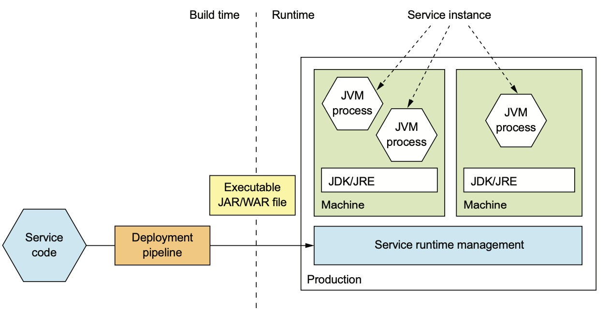
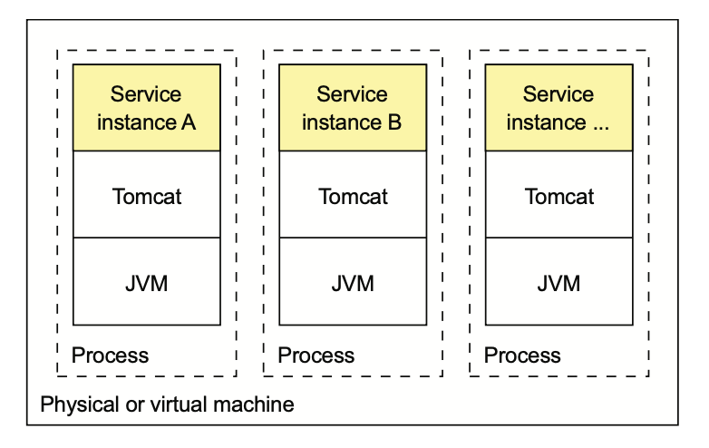
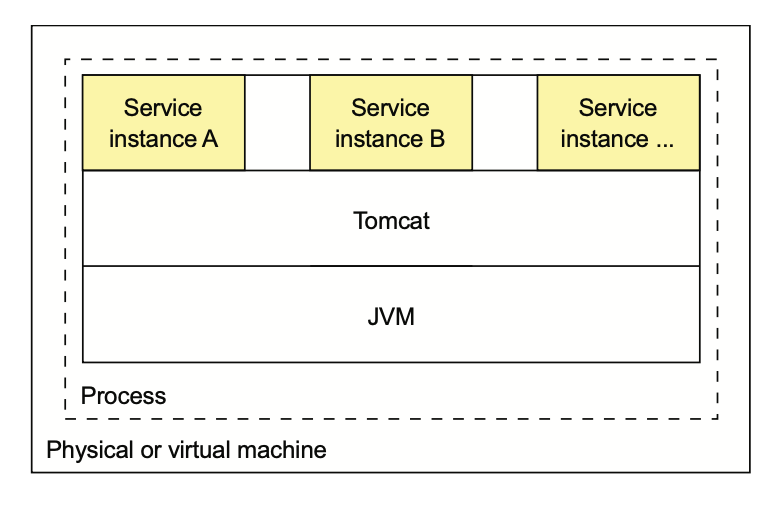

# 12.1.0 서론

배포는 프로세스와 아키텍쳐 개념의 조화이다.

- **배포 프로세스:** 소프트웨어를 Production에 반영하기 위해 사람이 해야하는 단계
- **배포 아키텍쳐:** 소프트웨어가 실행되는 환경 구성

요즘은 코드를 Production에 넘겨주는 것 부터, Production 환경 자체가 Cloud로 점차 변해가는 추세이다.

 

요즘은 우리가 작성한 코드를 운영팀에게 넘겨주는게 아니라, DevOps 체제 아래 **개발 팀이 직접 Application을 배포**한다.

오늘날의 가상 머신은 Immutable이고, 언제든지 갈아끼울 수 있는 개체로 취급하기 때문에 설정을 다시하기보단 폐기하고 다시 만드는 방법을 주로 채택한다.

가상 머신보다 더 가벼운 컨테이너 개념은 배포 수단으로 각광받고 있다.

또한 아예 서버리스 배포 플랫폼을 사용할수도 있다.

 

이러한 배포 프로세스의 발전은 MSA와는 관련이 없지 않다.

원래라면 수십, 수백개의 서비스를 관리해야 할걸 대부분 자동화 시켜준다.

또한 서비스를 확장하고 배포하려면 자동화된 배포 프로세스와 아키텍쳐가 있어야한다.

 

다음은 고수준의 Production 환경이다.

Production에서 다음 4가지는 필수라고 할 수 있다.

- **Service Management Interface:** 개발자가 서비스를 생성 / 수정 / 설정할 수 있는 인터페이스로, CLI나 GUI에서 RestAPI를 호출하는게 가장 좋다.

- **Runtime Service Management:** Service Instance가 적절한 개수만큼 실행되도록 한다.

  서비스 중 하나가 깨지는 등 요청을 처리할 수 없을 때 Production은 그 Instance를 재시동 해야한다.

  아예 Machine 자체가 깨졌을 경우, 다른 Machine에서 동작하도록 해야한다.

- **Monitoring:** 서비스가 뭘 하고있는지, 로그나 Metrics를 개발자가 볼 수 있도록 한다.

- **Request Routing:** 사용자의 요청을 서비스로 Routing해준다.

 

Spring Boot로 개발한 음식점 서비스를 배포한다고 가정해보자.

먼저 Spring Boot라면 JAR이나 WAR, Go라면 OS별 특정한 실행 파일같이 특정 패키지로 배포하는게 가장 먼저 떠오른다.

 

음식점 서비스를 배포하려면 우선 JDK를 설치해야 한다.

WAR이라면 Web Container도 필요하게 된다.

이러한 패키지를 서버에 올리고 실행하면, Service Instance는 개별적인 JVM 프로세스로 실행된다.

 

Service를 Production에 자동 배포하는 배포 파이프라인을 구축하는게 가장 좋다.

이 배포 파이프라인은 실행 가능한 JAR/WAR을 빌드하고, Production의 Service Management Interface를 호출해서 새 버전의 서비스를 배포한다.

Service Instance는 대부분 단일 프로세스지만, 여러 프로세스로 구성할 때도 있다.

예를 들어 JVM은 하나겠지만, Node.js에선 Worker Process를 추가로 둘 수 있다.

혹은 다음과 같이 하나의 서버에 여러 JVM을 올리고, JVM당 하나의 Instance를 가동할수도 있다.

단일 프로세스에서 여러 Service Instance를 지원하는 언어도 있다.

# 12.1.1 language-specific package의 장점

## 배포가 빠르다

Host에 서비스를 복사하고, 실행하면 끝이기 때문에 배포 속도가 빠를 수밖에 없다.

네트워크를 통해 이동하는 Byte 수 자체도 비교적 적다.

서비스를 실행하는 속도도 매우 빠른편이다.

## 리소스를 효율적으로 사용할 수 있다.

여러 Service Instance가 서버, OS를 공유하기 때문에 리소스를 효율적으로 사용할 수 있다.

여러 Service Instance가 같은 프로세스에서 실행되면 JVM이나 웹서버를 공유하기에 효율적이다.

# 12.1.2 language-specific package의 단점

## 기술스택을 캡슐화 할 수 없다

운영자는 각 서비스의 배포 방법을 모두 알고있어야 한다.

서비스별로 Runtime Version이 있고, 필요한 Software Package Version이 다를 수 있기 때문에 정확하게 구분해줘야 한다.

서비스마다 언어 / 프레임워크가 상이하고, 버전 또한 다를 수 있다.

따라서 자신의 서비스에 대한 많은 정보를 운영팀과 공유해야한다.

이런 문제로 인해 운영팀이 버전을 잘 못 설치하는 등의 이유로 배포 중 문제를 야기할 수 있다.

## Service Instance의 리소스를 제한할 수 없다

Service Instance가 소모하는 리소스를 제한할 수 없다.

한 Process가 전체 CPU / Memory를 소모한다면 다른 Instance는 기아상태에 빠질 수도 있다.

## 여러 Service Instance가 동일 서버에서 실행되면 격리할 수 없다

같은 서버에 여러 Instance를 실행하면 각 Instance들을 격리할 수 없다.

어느 한 곳에서 이상하게 동작하면 다른 곳에도 악영향을 끼칠수도 있기 때문에 서비스가 불안정해진다.

## Service Instance를 어디에 둘지 자동으로 결정하기 힘들다

같은 곳에 여러 Service Instance를 두면 Service Instance의 위치를 결정하는것도 일이다.

CPU나 메모리같은 한정된 리소스는 Service Instance에서 적절하게 나눠가져야 한다.

한 곳에 여러 Service Instance가 있다면 너무 많지도 않고, 적지도 않게 서버를 효율적으로 사용하도록 Service Instance를 잘 배치해야 한다.

Virtual Machine 기반이나 Cloud, Container Orchestration Framework는 이런걸 자동으로 한다.

 

이러한 단점으로 인해 요즘은 잘 안쓰는 방법이다.

