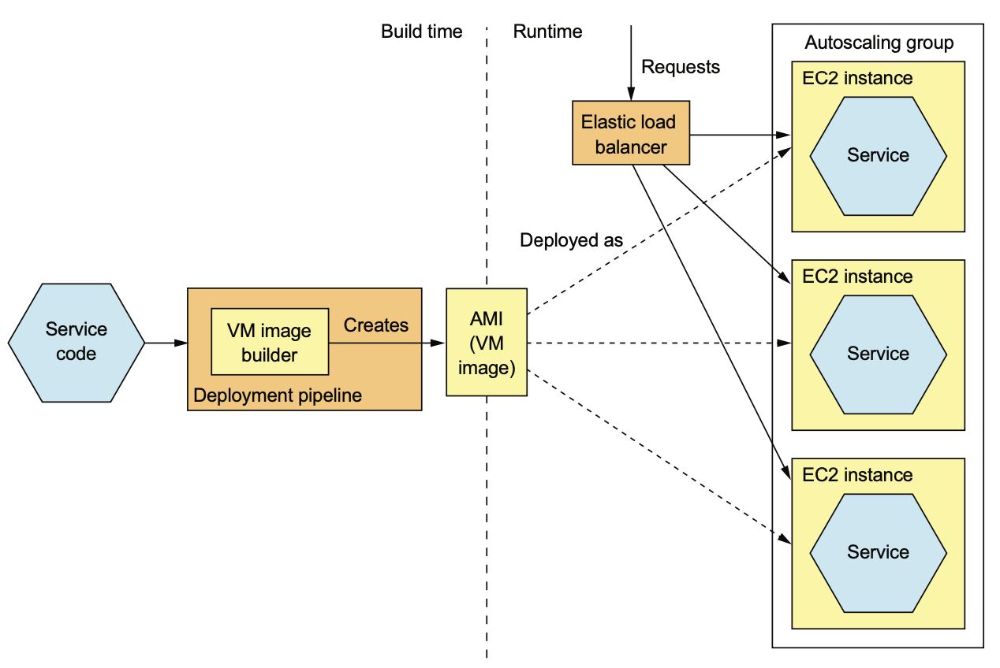

# 12.2.0 서론

EC2에 음식점 서비스를 배포한다고 가정해보자.

EC2를 미리 생성 / 구성하고 JAR / WAR를 복사하면 된다.

하지만 Cloud를 사용한다는 것 외에는 방금 전에 본 것과 차이가 없기에 Amazon Machine Image로 묶어서 배포하는게 낫다.

각 Service Instance는 AMI에서 생성된 EC2 Instance이다.

EC2 Instance를 적당한 만큼 실행하는 AWS Auto Scaling으로 관리한다.

 

서비스의 배포 파이프라인은 VM Image Builder를 실행해서 서비스 코드와 소프트웨어 실행에 필요한 라이브러리가 포함된 Virtual Machine 이미지를 생성한다.

예를 들어 FTGO의 VM Image Builder는 JDK와 실행 가능한 JAR를 설치한다.

VM Image Builder는 리눅스의 init 시스템을 통해 VM 부팅 시 Application이 실행되도록 구성한다.

Deploy Pipeline에서 사용 가능한 VM Image Build 툴은 다양하다.

초반엔 Netflix가 동영상 스트리밍 서비스를 AWS에 배포하는데 사용했던 Aminator라는 툴로 EC2 AMI를 생성했다.

그 후 Packer라는 VM Image Builder는 Aminator와 달리 EC2, VMWare, Digital Ocean 등 다양한 기술을 지원한다.

Packer로 AMI를 생성하려면 기초 이미지, 소프트웨어 설치 후 AMI를 구성하는 여러 Provisioner가 구성된 Configuration 파일을 작성한다.

> AWS의 Elastic Beanstalk를 사용하면 서비스를 VM으로 간단하게 배포할 수 있다.
>
> Elastic Beanstalk는 코드를 WAR로 묶어 올리면 서비스를 load-balance된 하나 이상의 Managed EC2로 배포한다.
>
> K8S만큼 인기있는건 아니지만 Service Instance를 EC2에 배포하는 간편한 방법 중 하나이다.
>
>  
>
> 특이한 점은 **Elastic Beanstalk이 여기서 설명한 세 가지를 조합**하는 것이다.
>
> Elastic Beanstalk는 Docker Container로도 배포할 수 있다.
>
> 각 EC2 Instance는 하나 이상의 Container를 실행한다.
>
> 하지만 Docker Orchestration Framework와 달리 EC2 Instance 단위로 확장된다.

# 12.2.1 VM의 장점

## VM Image로 기술 스택을 캡슐화한다

서비스에 관련된 의존성을 모두 VM에 담을 수 있다.

서비스 실행에 필요한 소프트웨어를 빈틈없이 설치하고, 실행하기 때문에 에러가 날 일도 거의 없다.

VM으로 묶는건 기술 스택이 캡슐화된 Black Box를 만드는것과 같다.

VM Image는 따로 수정하지 않아도 어느 환경에서도 실행될 수 있다.

## Service Instance가 격리된다

Service Instance가 **완전히 떨어져 동작**한다.

이게 모든 VM 기술이 추구하는 목표 중 하나이고, 정해진 CPU나 메모리가 VM마다 배정되기 때문에 다른 서비스의 리소스를 못 뺏어온다.

## 성숙한 Cloud Infrastructure

고도로 자동화된 Cloud Infrastructure를 완전히 활용할 수 있다.

AWS같은 Public Cloud는 물리적인 서버에게 과부하를 주지 않는 방향으로 VM을 Scheduling하고, VM간의 load-balancing이나 auto-scaling 등 유용한 기능도 제공한다.

# 12.2.2 VM의 단점

## 리소스를 효율적으로 활용할 수 없다

Service Instance마다 OS까지 포함된 모든 VM이기 때문에 오버헤드가 크다.

또한 Public Iaas는 대부분 VM의 크기가 제한되기 때문에 VM을 제대로 활용하기 힘들다.

## 비교적 배포가 느리다

상대적으로 느린 것이긴 하지만, VM Image는 크기가 커서 Build까지 몇 분은 걸리고 네트워크를 타는 데이터 양도 많다.

VM Image에서 VM Instance를 생성할 때에도 시간이 꽤 걸리는 편이다.

## System 관리 오버헤드가 발생한다

OS나 Runtime Patch를 해야한다.

이정돈 당연한게 아닌가 싶을수도 있겠지만 Serverless에선 이마저도 필요없다.

