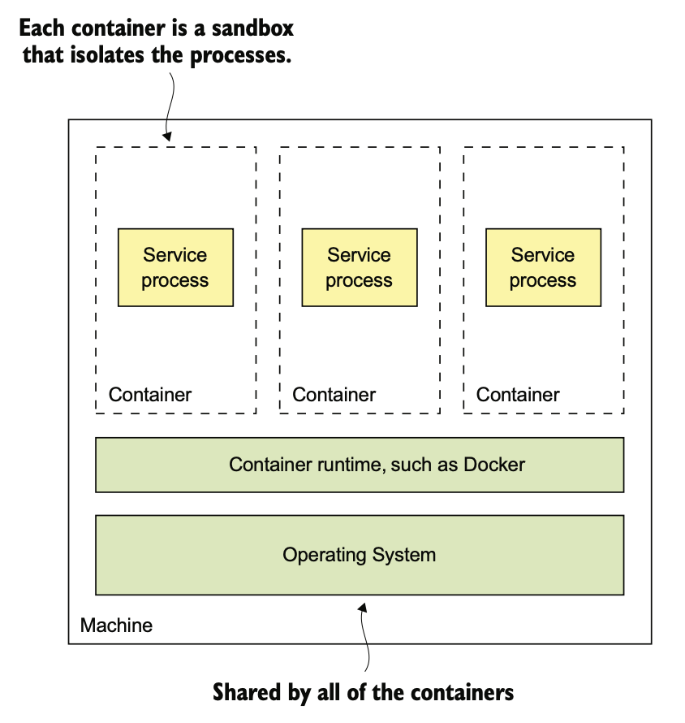
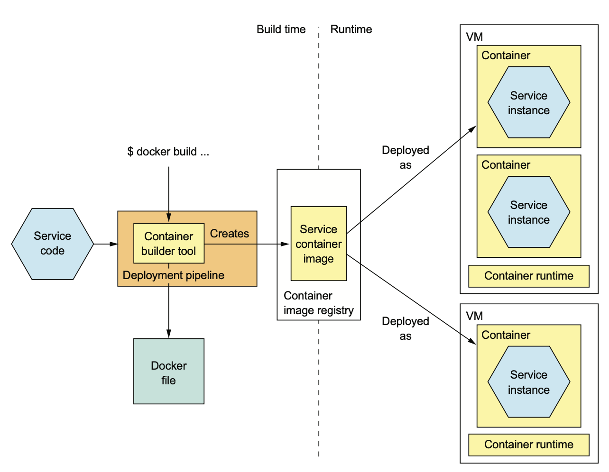

# 12.3.0 서론

Container는 최근에 등장한 VM보다 가벼운 배포 수단이다.

Container는 격리된 Sandbox에서 하나 이상의 프로세스로 실행된다.

<br>

Process 입장에선 Container가 VM인것처럼 실행된다.

고유한 IP주소를 가지고, 포트 충돌이 나지도 않고, Container마다 Root File System을 가지고 있다.

Container Runtime은 OS 메커니즘을 통해 Container를 격리한다.

Solaris도 있겠지만 가장 유명한건 역시 Docker이다.



Container를 생성할 때 CPU, 메모리, IO 리소스를 지정할 수 있다.

Container Runtime은 Container가 지정한 임계치 넘게 리소스를 차지하지 않도록 감시한다.

K8S같은 Orchestration Tool을 사용할 경우 특히 Container 리소스를 잘 지정해야 한다.

<br>

다음은 서비스를 Container에 배포하는 과정이다.

1. 배포 파이프라인은 Build 시 Container Image Build Tool과 Image Description을 읽어 Container 이미지를 생성한다.
2. Registry에 이미지를 보관한다.
3. Runtime에서 이미지를 가져와 Container를 생성한다.



# 12.3.1 서비스를 Docker로 배포하기

서비스를 Container로 배포하려면 반드시 이미지로 묶어줘야 한다.

Container Image는 Application과 서비스 구동에 필요한 모든 File System Image이다.

더 가벼운것도 있겠지만 대부분 리눅스의 Root File System을 사용한다.

## Docker Image Build

이미지를 빌드하기 위해서는 먼저 이미지 빌드 방법이 담긴 Dockerfile을 작성해야한다.

1. 기초 Container Image를 선택한다.
2. 소프트웨어를 설치하고 Container를 구성할 때 필요한 커맨드들을 나열한다.
3. Container 생성 시 실행할 Shell Command를 지정한다.

다음 예제는 음식점 서비스 이미지를 Build하는 Dockerfile이다.

실행 가능한 JAR 파일이 담긴 Container Image를 Build하고, Container가 시작될 때 `java -jar`을 실행한다.

``` dockerfile
FROM openjdk:8u171-jre-alpine # Base Image
RUN apk --no-cache add curl # Health Check에 사용할 curl 설치
CMD java ${JAVA_OPTS} -jar ftgo-restaurant-service.jar # Container 실행 시 java -jar을 실행함
# Docker가 Health Check를 호출하도록 설정
HEALTHCHECK --start-period=30s
	--interval=5s CMD curl http://localhost:8080/actuator/health || exit 1
COPY build/libs/ftgo-restaurant-service.jar . # build 디렉토리의 JAR을 이미지 내부로 복사
```

openjdk:8u171-jre-alpine이라는 Base Image는 JRE가 포함된 최소한의 Linux 기본 Image이다.

실행 30초 후부터 5초마다 HealthCheck를 호출하도록 했다.

<br>

Dockerfile이 있으면 이제 Image를 build할 수 있다.

다음은 음식점 서비스 Image를 Build하는 Shell Command이다.

```shell
cd ftgo-restaurant-service # 디렉토리 변경
../gradlew assemble # 서비스 JAR 빌드
docker build -t ftgo-restaurant-service . # 이미지 빌드
```

여기서 Docker build는 두 파라미터를 받는다.

`-t`는 이미지 이름, `.`은 Docker의 Context라고 부르는 존재로 여기서는 현재 디렉토리로 구성된다.

여기서 Context를 조금 더 알아보자면 Dockerfile과 Image를 Build하기 위한 파일들이다.

build로 Docker Daemon에 Context를 업로드하면 Docker Daemon이 Image를 Build해준다.

## Docker Image를 Registry에 Push

Build 프로세스는 마지막에 Docker Image를 Registry에 Push해줘야 한다.

여기서 Docker Registry는 Maven Repository처럼 Image를 올리는 곳이다.

대표적으로는 Docker hub가 Public Docker Registry이다.

혹은 Docker Cloud Registry나 AWS EC2 Container Registry가 제공하는 Private Registry도 있다.

<br>

Docker Image를 Registry에 Push하려면 Docker Command를 실행해야한다.

1. Tag로 Image 앞에 Registry이름과 Port를 붙여준다. 또한 버전이 필요하다면 버전도 넣어준다.

   ``` shell
   docker tag ftgo-restaurant-service registry.acme.com/ftgo-restaurant-
        service:1.0.0.RELEASE
   ```

2. Docker push로 Tag를 붙인 Image를 Registry에 업로드한다.

   ``` shell
   docker push registry.acme.com/ftgo-restaurant-service:1.0.0.RELEASE
   ```

Docker Image에 있는 Layered File System 덕에 이미지의 일부분만 네트워크로 전송되기 때문에 금방 할 수 있다.

OS, Runtime, Application은 별도의 계층에 존재하기 때문에 Docker는 목적지에 존재하지 않는 Layer만 전송한다.

## Docker Container 실행

서비스를 Container Image로 패키징 한 후에 하나 이상의 Container를 생성할 수 있다.

Container Infrastructure는 Registry에서 Production 서버로 Image를 가져오고, 이미지로부터 Container를 가져온다.

Container 하나하나가 Service Instance인 것이다.

<br>

Container를 create / start하는건 run 명령어로 할 수 있다.

Container의 이미지, 환경변수 등 다양한 파라미터를 받는다.

``` shell
docker run \
  -d  \ # Background
  --name ftgo-restaurant-service  \ # Container 이름
  -p 8082:8080  \ # 포트
  -e SPRING_DATASOURCE_URL=... # 환경변수
  -e SPRING_DATASOURCE_USERNAME=...  \
  -e SPRING_DATASOURCE_PASSWORD=... \
  registry.acme.com/ftgo-restaurant-service:1.0.0.RELEASE # 이미지
```

run은 local에 Image가 없다면 Registry에서 Image를 가져온다.

Container가 Run / Start되면 Dockerfile에서 지정된 `java -jar`이 실행된다.

<br>

Run은 좋아보이지만 몇 가지 단점이 있다.

- 단일 Container를 실행시키기 때문에 의존 서비스를 실행시킨다는 보장이 없다
- Container의 충돌이나 Docker가 재시작 됐을 때 자동으로 실행하는 등 기본적인 관리 기능은 Docker 엔진에서 관리하지만, Machine에서 Crush가 난 것까지는 막을 수 없다.

따라서 Docker-Compose를 통해 **의존 서비스들까지 배포함을 보장**해주면 편하다.

하지만 docker-compose도 결국 단일 서버에서만 동작하게 된다.

따라서 서비스의 배포를 보장하기 위해서는 K8S같이 여러 서버를 단일 리소스 풀로 변경해주는 Container Orchestration Framework가 필요하다.

# 12.3.2 Container 패턴의 장점

가상 머신의 장점은 그대로 가져오면서, 가상머신을 경량화 했다.

이미지를 묶고, 전송하는 것도 빠르고 실행도 빠르다.

# 12.3.3 Container 패턴의 단점

Container Image를 직접 관리해야한다.

OS와 Runtime Patch도 정기적으로 해주어야 한다.

Google Container Engine이나 ECS를 사용하지 않는 한 Container Infrastructure 및 VM Infrastructure를 직접 관리해야한다.

