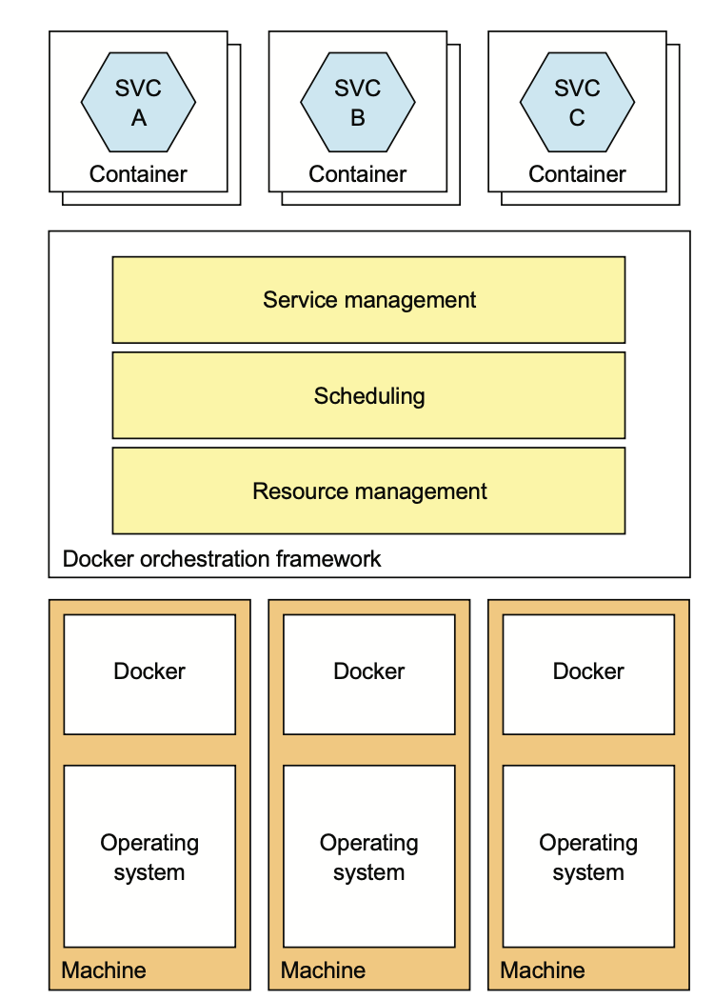
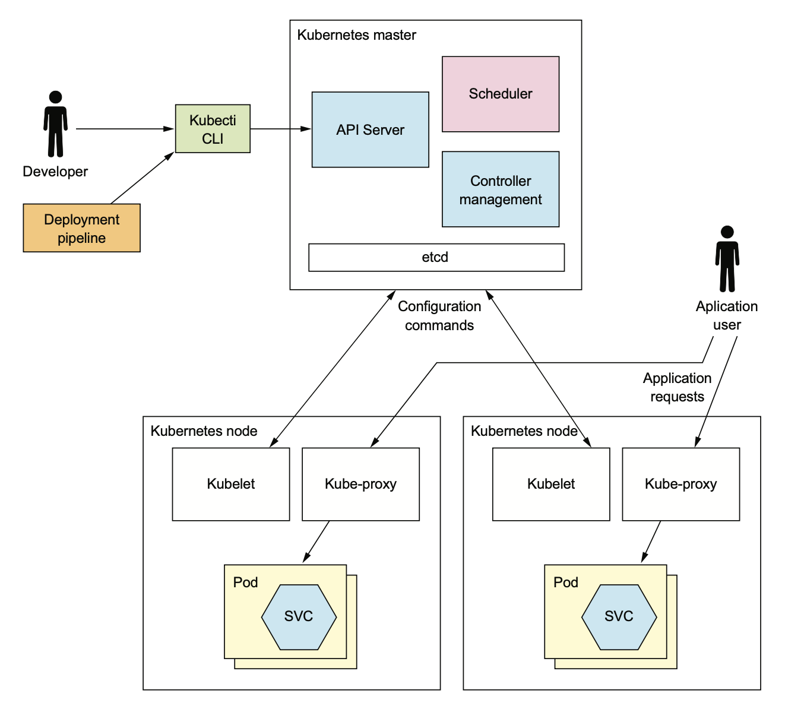
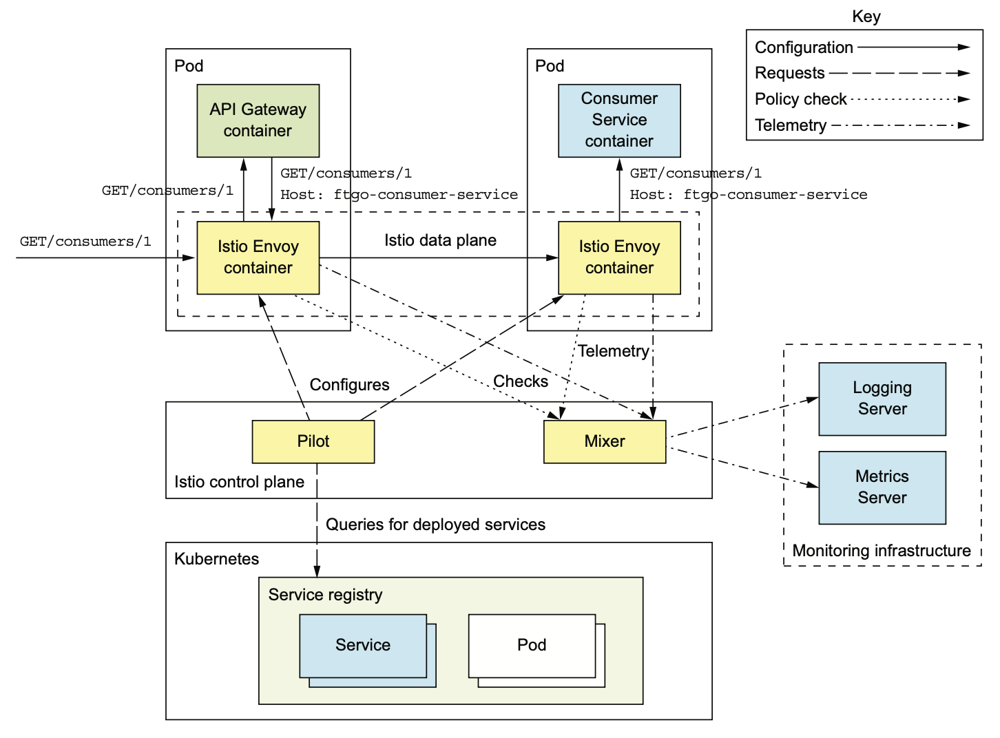
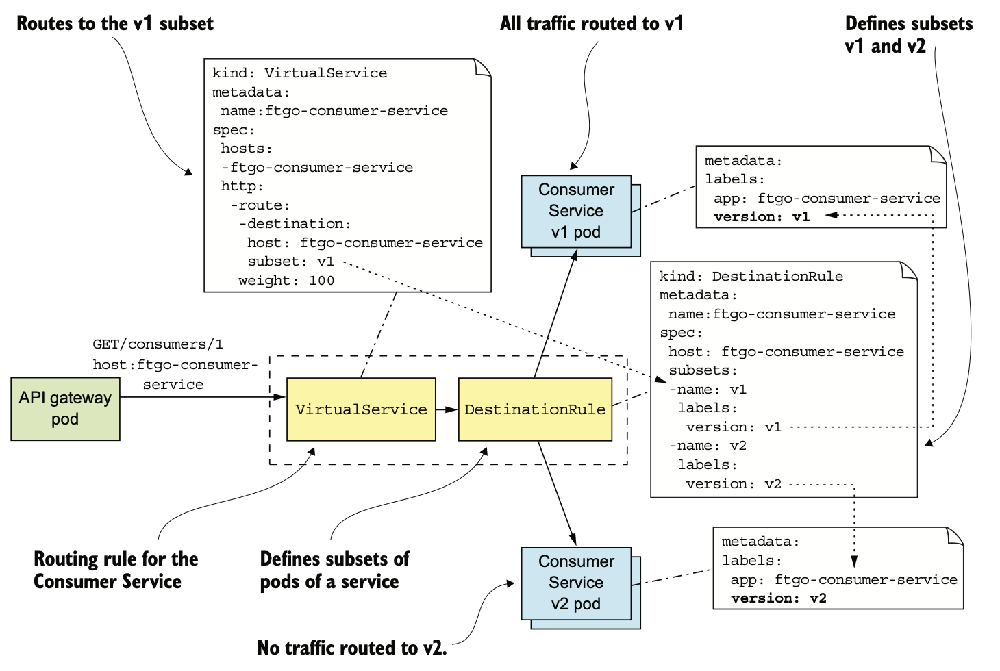

# 12.4.1 K8S 개요

Kubernetes는 **Container가 실행되는 여러 서버를 하나의 리소스 Pool로 취급하는 Container Orchestration Tool**이다.

*N개의 Service Instance를 실행해라*라고 지시하기만 하면 나머지는 Kubernetes가 알아서 처리해준다.

<br>

## Kubernetes의 주요 기능

- **리소스 관리:** 여러 서버를 CPU, 메모리, Storage Volume을 묶은 하나의 리소스 Pool로 취급한다.

- **Scheduling:** Container를 실행할 서버를 선택한다.

  기본적으로 Container가 필요로하는 리소스와 Node별 리소스 상황에 따라 결정된다.

  또한 affinity(유사성)를 통해 여러 Container를 같은 Node에 배치하거나, anti-affinity(반유사성)을 통해 Container를 다른 Node에 옮겨주기도 한다.

- **서비스 관리:** 서비스마다 직접 매핑되는 named / versioned 서비스 개념을 구현한다.

  정상 Instance를 항상 적절한 개수만큼 가동하고, 요청을 Instance에 골고루 분산시킨다.

  System을 Rolling Update하는 기능도 있어 언제든 롤백시킬수도 있다.



Docker Swarm은 Docker Engine에 포함되어 있어 쉽게 설정하고 이용할 수 있고, K8S는 설정이 복잡한 대신 훨씬 정교하다.

## Kubernetes Architecture

Kubernetes는 Cluster에서 실행된다.

다음 그림은 Kubernetes Cluster의 Architecture이다.



Kubernetes Cluster의 Machine은 Master또는 Node이다.

대부분 소수의 Master과 하나 이상의 Node로 구성된다.

Master는 Cluster들을 관리하고, Node는 하나 이상의 Pod를 실행시킨다.

Pod는 Kubernetes에서 배포 단위라고 할 수 있다.

<br>

Master는 다음 Component들을 실행한다.

- **API 서버:** kubectl CLI에서 사용하는 서비스 배포 / 관리용 RestAPI
- **etcd:** Cluster 정보를 저장하는 Key-Value NoSQL
- **Scheduler:** Pod를 실행할 Node를 선정해줌
- **Controller Management:** Cluster의 상태를 제어하는 Controller를 실행한다.

<br>

Node에서는 다음 Component들을 실행한다.

- **kubelet:** Node에서 실행되는 Pod를 생성 / 관리
- **kube-proxy:** 여러 Pod에 부하 분산 등 네트워킹 관리
- **pod:** Application Service

## Kubernetes의 핵심 개념

### Pod

Kubernetes의 기본 배포 단위로 IP 주소, Storage Volume을 공유하는 하나 이상의 Container로 구성된다.

Service Instance는 보통 JVM 실행 Container처럼 하나의 Container로 구성하겠지만, Support를 위한 Sidecar Container가 포함된 경우도 있다.

예를 들어 nginx 서버에는 git pull로 주기적으로 최신 버전을 내려받는 Sidecar를 둘 수 있다.

Pod의 Container, Node 둘 다 언제든 Crash될 수 있기 때문에 일시적이다.

### Deployment

Pod의 declarative한 명세라고 할 수 있다.

항상 Pod Instance를 원하는 개수만큼 실행시켜준다.

Rolling Update / Rollback이 탑재된 Versioning을 지원한다.

### Service

Client에게 안정적인 static ip 주소를 제공한다.

Infrastructure에서 제공하는 Service Discovery 형태를 따르게 된다.

IP 주소와 IP 주소에 할당되는 DNS명이 할당된 서비스는 TCP/UDP Traffic을 하나 이상의 Pod에 분산시킨다.

IP 주소나 DNS명은 Kubernetes 내부에서만 접근할 수 있다.

Cluster 외부에서 접근 가능한 서비스는 잠시 후에 다시 설명할 예정이다.

### ConfigMap

하나 이상의 Application Service에 대한 Externalized 설정이 정의된 Key-Value Collection이다.

Pod Container의 Definition은 Container 환경 변수를 정의할 때 ConfigMap을 참조한다.

ConfigMap으로 Container 안에 Configuration 파일을 만들수도 있다.

비밀번호같은 중요한건 Secret이란 형태로 ConfigMap에 저장한다.

# 12.4.2 Kubernetes에 음식점 서비스 배포

Kubernetes에 서비스를 배포하려면 먼저 Deployment를 정의해야한다.

Kubernetes Object는 yaml로 정의하는게 가장 쉽다.

<br>

다음은 Pod Replica를 2개만 실행하도록 지정한 음식점 서비스의 Deployment이다.

이 Pod에는 하나의 Container만 존재한다.

``` yaml
apiVersion: extensions/v1beta1

kind: Deployment # 종류를 Deployment형으로 설정
  metadata:
    name: ftgo-restaurant-service # 배포 이름
spec:
  replicas: 2 # 두 개의 replica
    template:
      metadata:
        labels:
          app: ftgo-restaurant-service
      spec: # Container가 하나 정의된 Pod
        containers:
        - name: ftgo-restaurant-service
          image: msapatterns/ftgo-restaurant-service:latest
          imagePullPolicy: Always
          ports:
          - containerPort: 8080
            name: httpport
          env: # Spring Boot에서 읽을 Container 환경변수
            - name: JAVA_OPTS
              value: "-Dsun.net.inetaddr.ttl=30"
            - name: SPRING_DATASOURCE_URL
              value: jdbc:mysql://ftgo-mysql/eventuate
            - name: SPRING_DATASOURCE_USERNAME
              valueFrom:
                secretKeyRef:
                  name: ftgo-db-secret # ftgo-db-secret라는 이름의 Kubernetes Secret에서 가져올 값
                  key: username
            - name: SPRING_DATASOURCE_PASSWORD
              valueFrom:
                secretKeyRef:
                  name: ftgo-db-secret
                  key: password
            - name: SPRING_DATASOURCE_DRIVER_CLASS_NAME
              value: com.mysql.jdbc.Driver
            - name: EVENTUATELOCAL_KAFKA_BOOTSTRAP_SERVERS
              value: ftgo-kafka:9092
            - name: EVENTUATELOCAL_ZOOKEEPER_CONNECTION_STRING
              value: ftgo-zookeeper:2181
          livenessProbe: # Kubernetes가 Health Check Endpoint를 호출하도록 구성
            httpGet:
              path: /actuator/health
              port: 8080
            initialDelaySeconds: 60
            periodSeconds: 20
          readinessProbe:
            httpGet:
             path: /actuator/health
             port: 8080
           initialDelaySeconds: 60
           periodSeconds: 20
```

이 Deployment는 음식점 서비스의 Health Check Endpoint를 호출하도록 Kubernetes를 구성한다.

Kubernetes는 Health Check Endpoint를 호출해서 Service Instance의 상태를 파악할 수 있다.

readinessProbe는 Traffic을 해당 Service Instance로 Routing해도 괜찮은지 파악하는 Health Check이다.

여기서는 처음에 60초 기다린 후, 20초마다 `/actuator/health` Endpoint를 호출한다.

readinessProbe는 기본적으로 한 번만 성공하면 Service Instance가 멀쩡하다고 판단하고 요청을 Routing한다.

만약 특정 횟수(3번) 이상 실패한다면 준비가 안되었다고 판단하게 된다.

readinessProbe로 준비가 된 Service Instance에만 Traffic을 보낸다.

<br>

다음으론 livenessProbe인데, readinessProbe와 굉장히 비슷하게 생겼다.

livenessProbe는 Traffic을 Service Instance로 Routing할지에 대한 Health Check가 아니라 Kubernetes가 Service Instance를 Stop / Restart 시키는 기준이 된다.

Kubernetes에선 livenessProbe가 특정 횟수(3번) 연속 실패하면 서비스를 Stop / Restart한다.

<br>

이제 yaml이 준비되면 `kubectl apply`로 Deployment를 생성 / 수정한다.

```
kubectl apply -f ftgo-restaurant-service/src/deployment/kubernetes/ftgo-restaurant-service.yml
```

이 명령어는 Kubernetes API 서버에 요청해서 Deployment와 Pod를 생성한다.

<br>

먼저 ftgo-db-secret을 만들어야 하는데, 안전하진 않지만 다음과 같이 만들 수 있다.

```
kubectl create secret generic ftgo-db-secret \
  --from-literal=username=mysqluser --from-literal=password=mysqlpw
```

Secret을 안전하게 생성하는 것은 다루지 않는다.

## Kubernetes Service 생성

> 우리가 만든 서비스가 아니라, 아까 전에 Kubernetes의 핵심 개념에서 나온 Service이다.

한 번 Pod가 실행되면 Kubernetes Deployment는 Pod가 중단되지 않도록 노력한다.

하지만 Pod의 주소는 동적 할당되기 때문에 HTTP 요청을 해야하는 Client에게는 별 도움이 되지 않는다.

해결 방법으론 3장에서 배운 Service Discovery를 사용하는 것이다.

<br>

먼저 Client쪽 Discovery 패턴을 사용하고 Netflix OSS Eureka같은 service registry를 사용하면 된다.

그런데 Kubernetes에 Service Discovery가 내장되어있기 때문에 귀찮게 하지 않아도 된다.

<br>

IP 주소나 DNS명이 할당된 서비스는 Client에게 안정된 Endpoint를 제공한다.

서비스는 자신의 IP 주소에게 향하는 Traffic을 여러 Pod에게 분산한다.

다음은 음식점 서비스의 Kubernetes Service 설정이다.

이 서비스는 `http://ftgo-restaurant-service:8080`으로 온 Traffic을 Deployment에 정의된 Pod로 보낸다.

``` yaml
apiVersion: v1
kind: Service
metadata:
  name: ftgo-restaurant-service # Service 이름이자 DNS 이름
spec:
  ports:
  - port: 8080 # 외부에 노출할 Port
    targetPort: 8080
  selector:
    app: ftgo-restaurant-service # Traffic을 Routing 할 Container
---
```

대상 Pod를 선택하는 Selector가 중심이다.

이 예제에선 app의 label이 ftgo-restaurant-service인 pod를 선택하도록 했는데, 아까 전에 정의한 Container를 보면 이 label이 붙어있다.

<br>

서비스는 다음 명령어로 생성한다.

```shell
kubectl apply -f ftgo-restaurant-service-service.yml
```

이제 Kubernetes 내부의 모든 음식점 서비스는 `http://ftgo-restaurant-service:8080`으로 접근할 수 있다.

# 12.4.3 API Gateway 배포하기

방금 만든 음식점 서비스는 Kubernetes 내부에서만 접근할 수 있다.

음식점 서비스같은 서비스는 문제될게 없겠지만, 외부의 Traffic을 Routing하는 API Gateway는 Cluster 외부에서도 접근할 수 있어야 한다.

Kubernetes Service는 이러한 Usecase도 지원한다.

방금 전에 CluserIP라는 서비스를 봤지만, 이번에는 NodePort, LoadBalancer 등 다른 종류의 서비스도 살펴본다.

<br>

NodePort 서비스는 cluster-wide port로 **Cluster의 모든 Node에 접근할 수 있다.**

어떤 Cluster Node도 cluster-wide port를 거친 Traffic은 Pod로 load balancing된다.

단 포트는 30000~32767 중 하나를 선택해야한다.

다음은 소비자 서비스의 30000 포트로 Routing한 것이다.

``` yaml
apiVersion: v1
kind: Service
metadata:
  name: ftgo-api-gateway
spec:
  type: NodePort # Type을 NodePort로 지정
  ports:
  - nodePort: 30000 # cluster-wide port 설정
    port: 80
    targetPort: 8080
  selector:
    app: ftgo-api-gateway
```

API Gateway의 경우 Cluster 내부는 `http://ftgo-api-gateway`, 외부는 `http://<node ip주소>:30000`을 각각 사용한다.

NodePort 서비스를 구성한 후에 외부에서 들어온 요청을 Node에 분산하도록 AWS ELB를 구성하면 된다.

<br>

LoadBalancer는 Cloud에 특정한 Load Balancer를 자동으로 구성하는 서비스다.

AWS ELB를 사용한다면 Load Balancer는 ELB가 될 것이다.

이 서비스를 사용하면 직접 Load Balancer를 사용할 필요가 없어진다.

물론 SSL 등 ELB의 일부 옵션을 Kubernetes에서 제공해도 설정에 대한 제어권이 약해진다는 단점이 있다.

# 12.4.4 무중단 배포

음식점 서비스를 수정하여 변경 사항을 Production에 배포한다고 가정해보자.

Kubernetes에선 다음 세 단계만 하면 된다.

1. 새 이미지를 Build하고, 앞에서 말한대로 Registry에 Push한다. Tag만 버전을 다르게 바꾸면 된다.
2. 새 Container를 참조하도록 YAML 파일의 Service Discovery를 수정한다.
3. `kubectl apply -f` 명령어로 Deployment를 Update한다.

Kubernetes는 Pod를 Rolling Update한다.

즉 단계별로 새 버전을 실행하는 Pod를 생성하고, 이전 버전의 Pod를 중단한다.

그런데 Kubernetes는 Pod마다 신 버전이 요청을 처리할 준비가 되기 전까진 구 버전을 중지하지 않는다.

바로 앞에서 설명한 readinessProbe로 Health Check를 해서 Pod가 준비되었는지 검증하는 것이다.

결국 요청을 처리할 수 있는 Pod만 남게 되고, 새 Pod가 정상적이라면 언젠가 Deployment Pod가 새로운 버전을 실행하게 된다.

<br>

만약 새 버전 Pod가 제대로 동작하지 않는다면 어떻게 될까?

Container 이미지 이름에 오타가 있을수도 있고, 환경변수가 비었을수도 있다.

이런 상황에선 배포는 불가능한데, 해결 방법은 두 가지이다.

- YAML을 수정하고 `kubectl apply -f`를 재실행한다.
- Deployment를 Rollback한다.

Deployment는 Rollout이라는 Log를 관리한다.

따라서 Update 할때마다 Rollout이 생성되기 때문에 다음과 같이 쉽게 Rollback할 수 있다.

```shell
kubectl rollout undo deployment ftgo-restaurant-service
```

Rollback이 끝나면 새 버전을 실행하는 Pod를 과거 버전의 Pod로 수정한다.

<br>

Kuberetes Deployment는 무중단 배포를 할 수 있는 좋은 방법이다.

하지만 막 Pod 준비가 끝나 Traffic이 오는 상황에 버그가 발생하면 어떻게 할까?

Kubernetes가 하나씩 Rollout하며 점점 많은 사용자가 피해를 받게 된다.

모니터링 시스템이 버그를 빠르게 찾아 Rollback하면 다행이겠지만, 일부 사용자는 영향을 받게된다.

따라서 Production에서 서비스를 작동시키는 것과 Production의 Traffic을 처리할 수 있는 것을 분리해야한다.

Service Mesh가 이걸 가능하게 해준다.

# 12.4.5 Service Mesh

1. 새 버전의 서비스를 실행하기 전 Staging 환경에서 Test한다.
2. 문제가 없을 때 과거 Service Instance를 새 서비스의 Rolling Update 한다.

과거에는 이런 방식을 사용했다.

Kubernetes Deployment는 Rolling Update를 아주 직관적으로 수행하지만, **Staging 환경에서 테스트를 통과했다면 Production에서도 잘 동작한다는 가정**이 있어야 한다.

<br>

우선 Production 환경은 훨씬 많은 Traffic을 처리하기 때문에 Replica를 구성하기 어렵다.

그렇다고 두 환경을 완전히 동기화하는건 너무 오래걸리고, 이런 상황으로 인해 Production에 코드를 올렸을 때가 되어서야 버그를 발견하는 일도 많다.

설령 동일한 Replica로 맞추더라도 Test가 모든 버그를 잡지 못할수도 있다.

<br>

따라서 배포 단계를 다음 두 가지로 나눠야한다.

- **Deployment:** Production 환경에서 실행
- **Service Release:** End User에게 서비스 제공

그리고 다음 다섯 단계를 거쳐서 Service를 Production에 배포한다.

1. End User의 요청을 Service에 Routing하지 않고 새 서비스를 Production에 배포한다.
2. Production에서 새로운 버전을 테스트한다.
3. 소수의 End User에게 요청을 Routing해서 Test한다.
4. 모든 Traffic을 감당할 수 있을때까지 하나씩 Release한다.
5. 문제가 발생하면 구 버전으로 되돌린다. 만약 제대로 동작하는 것 같다면 구 버전을 삭제한다.

자동화된 배포 파이프라인으로 이 단계들을 실행하고, 새로 배포된 서비스에 문제가 없는지 확인하는 방법밖에 없다.

<br>

기존에는 이렇게 Deployment와 Release를 분리하는 것 자체가 너무 방대했지만, Service Mesh 덕에 수월해졌다.

Service Mesh는 **한 서비스와 다른 서비스 혹은 외부 Application으로 향하는 Communication을 중재하는 Network 인프라**이다.

Service Mesh는 Microservice Chassis의 일부 기능도 담당하지만, 그것과는 별도로 Rule-Based load balancing과 Traffic Routing기능을 제공하기 때문에 여러 서비스를 동시에 확실하게 실행할 수 있다.

즉 Test 사용자는 A 버전 서비스로, End User는 B 버전 서비스로 Routing하는 것도 가능하다.

<br>

Service Mesh의 종류는 다양하지만 이 책에서는 Istio라는 오픈 소스 프로젝트를 사용한다.

Istio가 어떤 제품인지, 어떤 기능이 있는지 살펴보고 Application을 Istio로 배포하는 방법을 설명한다.

또한 이 제품의 Traffic Routing을 활용하여 새 버전의 서비스를 Deployment / Release 하는 방법에 대해 알아본다.

## Istio Service Mesh

공식 사이트에 따르면 **Istio는 MicroService를 연결, 관리, Secure해주는 오픈소스 플랫폼**이다.

Istio는 모든 서비스의 Network Traffic이 통과하는 네트워크 계층이다.

Istio의 기능은 크게 다음 네가지가 있다.

- **Traffic 관리:** Service Discovery, Load Balancing, Routing, Circuit Breaker 등
- **Security:** TLS를 통한 서비스 간 통신 보안
- **Telemetry:** Network Traffic 관련 Metrics 및 Distributed Tracing
- **Policy enforcement:** 사용량이나 사용률 정책

<br>

이 챕터에선 Traffic 관리 기능에만 집중한다.

<br>

다음 그림은 Control Plane과 Data Plane으로 구성된 Istio의 Architecture이다.



Control Plane은 Data Plane이 Traffic을 Routing하도록 구성하는 등 관리하는 역할을 맡는다.

Data Plane은 Service Instance별 envoy proxy로 구성된다.

Control Plane는 Pilot과 Mixer로 구성된다.

- **Pilot:** 하부 인프라에서 배포된 서비스 관련 정보를 추출한다.

  또한 Pilot은 Envoy Proxy가 미리 정의된 Routing 규칙에 따라 Traffic을 Routing한다.

- **Mixer:** Mixer는 Proxy에서 Telemetry를 수집하고, 정책을 집행한다.

Istio의 Envoy Proxy는 Envoy를 변형한 것이다.

Envoy는 TCP같은 저수준 프로토콜부터 HTTP나 HTTPS같이 다양한 프로토콜까지 지원하는 고성능 Proxy이다.

MongoDB, Redis, DynamoDB 프로토콜도 지원하고, Circuit Breaker나 사용량 제한, 자동 재시작 등 서비스간 Communication을 확실하게 지원한다.

Application 내부에서 TLS로 통신을 보안할 수도 있다.

<br>

Istio는 Envoy를 sidecar, 즉 Service Instance와 함께 실행되어 공통 관심사를 처리하는 프로세스나 Container로 활용한다.

Kubernetes를 실행할 경우 Service Pod 내부 Container가 바로 Envoy Proxy이다.

Pod개념이 없는 다른 환경에선 동일한 Container에서 Envoy가 하나의 서비스로 실행된다.

서비스를 드나드는 Traffic은 서비스의 Envoy Proxy로 흘러가며 Control Plane의 규칙에 따라 Routing된다.

예제는 다음과 같다.

1. 직접 서비스를 호출
2. 서비스 통신이 서비스가 됨
3. Envoy
4. Destination Envoy
5. 서비스

Istio는 Kubernetes Format의 yaml로 설정할 수 있다.

kubectl과 비슷한 istioctl 명령어가 있기 때문에 CLI에서 규칙이나 정책을 등록 / 수정 / 삭제할 수 있다.

Kubernetes에서 Istio를 사용한다면 그냥 kubectl을 사용해도 된다.

## Istio로 서비스 배포

Istio로 서비스 배포하는건 매우 쉽다.

다음과 같이 배포하려는 Application Service마다 Kubernetes와 Deployment를 정의한다.

``` yaml
apiVersion: v1

kind: Service
metadata:
  name: ftgo-consumer-service
spec:
  ports:
  - name: http # named port
    port: 8080
    targetPort: 8080
  selector:
    app: ftgo-consumer-service

---

apiVersion: extensions/v1beta1
kind: Deployment
metadata:
 name: ftgo-consumer-service-v2 # versioning된 deployment
 spec:
  replicas: 1
  template:
    metadata:
      labels:
        app: ftgo-consumer-service # 기준이 되는 label
        version: v2
    spec:
      containers:
      - image: image: ftgo-consumer-service:v2 # 이미지 버전
```

앞에서 봤던 Definition과 거의 같지만 다음 조건이 충족되어야 한다.

- Kubernetes Service 포트는 `<protocol>[suffix]` 형태의 Istio 이름 관례를 따라야한다.

  protocol에는 http, grpc, mongo 등이 올 수 있고 anonymous port는 TCP port로 간주하여 rule-based routing을 적용하지 않는다.

- Istio로 Distributed Tracing을 하려면 Pod에 app이라는 label을 붙여 Service를 식별해야한다.

  > app: ftgo-consumer-service

- 여러 버전의 서비스를 동시에 실행하려면 Kubernetes Deployment 이름에 버전을 추가해야 한다.

  > `ftgo-consumer-service-v1`, `ftgo-consumer-service-v2`

  Deployment Pod에선 `version: v1`처럼 버전 label을 붙여줘야 한다.

<br>

그런데 Service Pod에 있는 Envoy Proxy Container 는 어떻게 실행할까?

다행히 Istio는 Pod Definition을 자동으로 수정해서 Envoy Proxy를 포함하는 방식으로 아주 쉽게 해결한다.

먼저 수동으로 Sidecar를 주입하고 `istioctl kube-inject`를 실행한다.

``` shell
istioctl kube-inject -f ftgo-consumer-service/src/deployment/kubernetes/ftgo-
     consumer-service.yml | kubectl apply -f -
```

Kubernetes Yaml 파일을 읽고 Envoy Proxy가 포함되어 수정된 Configuration을 출력해준다.

수정된 Configuration은 `kubectl apply`로 인해 pipe된다.

<br>

다음으로 automatic sidecar injection을 활용할 수 있다.

이 기능을 활성화하면 서비스를 `kubectl apply`로 배포할 수 있고, Kubernetes는 알아서 Istio를 호출하여 Envoy Proxy를 추가하여 Pod Definition을 수정한다.

`kubectl describe` 명령어로 Service Pod를 자세히 보면 실제 Service Container보다 더 많은 것들로 구성되어있다.

``` yaml
$ kubectl describe po ftgo-consumer-service-7db65b6f97-q9jpr

Name:           ftgo-consumer-service-7db65b6f97-q9jpr
Namespace:      default
Init Containers:
  istio-init:
    Image: docker.io/istio/proxy_init:0.8.0 # Pod 초기화
    ...
Containers:
  ftgo-consumer-service:
    Image: msapatterns/ftgo-consumer-service:latest # 서비스 Container
  istio-proxy:
    Image: docker.io/istio/proxyv2:0.8.0 # Envoy Container
```

## v1으로 보내는 Routing 규칙 추가

ftgo-consumer-service-v2 Deployment를 배포했다고 가정해보자.

Routing 규칙이 없으면 Istio는 모든 버전에게 load balancing하기 때문에 ftgo-consumer-service 버전 1과 버전 2에 요청이 동일하게 Routing된다.

이렇게 할거였으면 애초에 Istio를 쓸 이유가 없다.

새 버전을 안전하게 Rollout하려면 모든 Traffic을 현재 버전인 v1으로 Routing하는게 맞다.

<br>

다음 그림은 전체 Traffic을 v1으로 보내는 Consumer Service의 Routing 규칙이다.



이 규칙은 VirtualService, DestinationRule 두 Istio 객체로 구성된다.

VirtualService라는 하나 이상의 host에 대해 어떻게 Routing할지 정의한다.

여기서는 ftgo-consumer-service라는 단일 호스트 이름에 대한 Routing 규칙을 정의했다.

``` yaml
apiVersion: networking.istio.io/v1alpha3
kind: VirtualService
metadata:
  name: ftgo-consumer-service
spec:
  hosts:
  - ftgo-consumer-service # 소비자 서비스에 설정 적용
  http:
    - route:
      - destination:
          host: ftgo-consumer-service # 소비자 서비스에 Routing
          subset: v1 # v1의 하위집합만 routing
```

VirtualService는 소비자 서비스 Pod의 v1 하위 집합에 대한 요청을 Routing한다.

HTTP Request 기반 Routing, Weighted Destination에 부하 분산하는 복잡한 예제는 잠시 후에 다시 설명한다.

<br>

VirtualService 말고도 하나 이상의 서비스 Pod에 대한 DestinationRule을 지정해주어야 한다.

Pod의 하위 집합은 대부분 Service Version이다.

DestinationRule에는 load balncing 알고리즘 등 Traffic 정책도 정의할 수 있다.

다음은 소비자 서비스의 DestinationRule이다.

``` yaml
apiVersion: networking.istio.io/v1alpha3
kind: DestinationRule
metadata:
  name: ftgo-consumer-service
spec:
  host: ftgo-consumer-service
  subsets:
  - name: v1 # 하위 집합 이름
    labels:
      version: v1 # 집합에 대한 Pod Selector
  - name: v2
    labels:
      version: v2
```

v1 하위 집합은 `version: v1` label을 붙인 Pod를, v2 하위 집합은 `version: v2` label을 붙인 Pod를 각각 선택한다.

이 규칙이 적용되면 `version: v1` label이 붙은 Pod에만 Traffic을 보내기 때문에 v2를 안심하고 배포할 수 있다.

## v2 소비자 서비스 배포

다음은 소비자 서비스 v2의 Deployment이다.

``` yaml
apiVersion: extensions/v1beta1
kind: Deployment
metadata:
  name: ftgo-consumer-service-v2
spec:
  replicas: 1
  template:
    metadata:
      labels:
        app: ftgo-consumer-service
        version: v2 # pod에 version label을 붙인다.
```

이 Deployment는 ftgo-consumer-service-v2라고 이름 짓고, `version: v2` label을 붙인다.

Deployment를 생성하면 ftgo-consumer-service는 두 버전이 공존하게 되지만 Istio는 Routing 규칙에 따라 v2에 Traffic을 보내지 않는다.

이제 v2를 테스트할 준비가 된 것이다.

## v2 Traffic Routing 테스트

이제 테스트를 해봐야한다.

테스트 사용자는 testuser라는 Header를 Request에 추가하기로 하자.

이 헤더를 붙인 요청은 v2 Instance로 향하도록 다음과 같이 VirtualService를 수정한다.

```  yaml
apiVersion: networking.istio.io/v1alpha3
kind: VirtualService
metadata:
  name: ftgo-consumer-service
spec:
  hosts:
  - ftgo-consumer-service
  http:
    - match:
    - headers:
      testuser:
        regex: "^.+$" # 공백이 아닌 testuser 헤더에 매칭
      route:
      - destination:
        host: ftgo-consumer-service
        subset: v2 # 맞다면 v2로 라우팅
     - route:
     - destination:
       host: ftgo-consumer-service # 나머지는 v1으로
       subset: v1
```

이제 VirtualService는 기본적으로 v1으로, testuser 헤더가 붙어있다면 v2 하위집합으로 Routing한다는 규칙이 추가되었다.

이 규칙을 수정한 후에 소비자 서비스를 테스트하고 v2에 문제가 없다면 일부 Traffic을 v2로 보내준다.

## Routing Production Traffic to v2

이제 Production의 Traffic을 새 버전으로 Routing해야한다.

처음에는 적당히 보내주는게 좋다.

다음은 v1에 95%, v2에 5%만 보내는 예제이다.

``` yaml

apiVersion: networking.istio.io/v1alpha3
kind: VirtualService
metadata:
  name: ftgo-consumer-service
spec:
  hosts:
  - ftgo-consumer-service
  http:
    - route:
      - destination:
        host: ftgo-consumer-service
        subset: v1
      weight: 95
      - destination:
        host: ftgo-consumer-service
        subset: v2
        weight: 5
```

v2를 신뢰할 수 있게 될수록 Traffic을 점차 늘려간다.

Istio를 통해 Deployment와 Release를 구분할 수 있어 새 버전의 서비스를 확실하게 시작할 수 있다.

여기서는 Istio의 기능 중 극히 일부만 봤기에 나중에 더 알아보면 좋을 것 같다.

