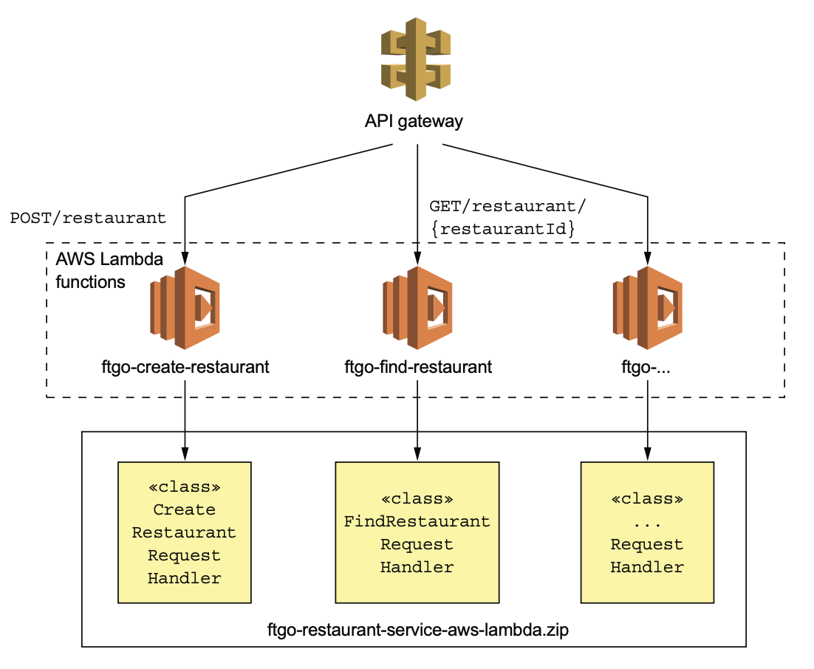
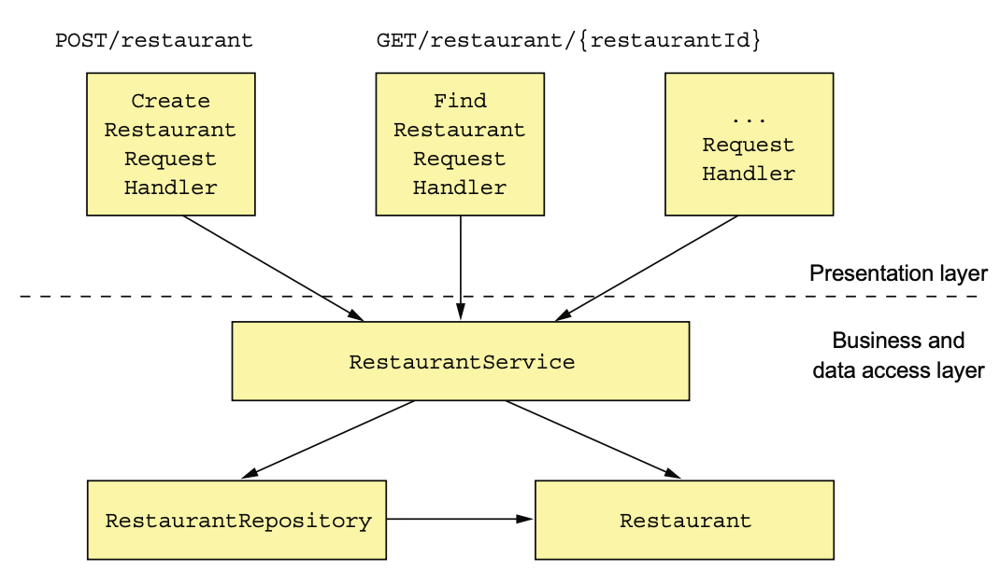
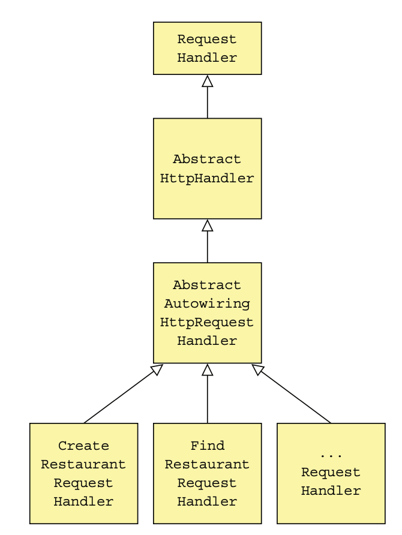

# 12.6.1 음식점 서비스를 AWS Lambda로 설계

서비스 아키텍쳐는 기존과 비슷하다.

Spring MVC Controller 대신 AWS Lambda Request Handler가 있을 뿐이다.



Presentation 계층은 AWS Lambda가 HTTP Request를 처리하기 위해 호출하는 Request Handler로 구성된다.

Business 계층은 기존과 같이 Service, JPA Entity, Repository로 구성된다.



## FindRestaurantRequestHandler 클래스

`GET /restaurant/{restaurantId}` Endpoint를 구현한 이 클래스는 다른 Request Handler와 함께 구조상 가장 자식쪽에 해당한다.

AWS SDK가 RequestHandler 인터페이스가 Root가 될 수 있고, 그 하위 추상 클래스들은 Exception처리나 의존성 주입을 담당한다.



HTTP Request Handler의 Base Abstract Class인 AbstractAutowiringHttpRequestHandler는 HTTP 요청을 처리하기 위한 의존성들을 주입해준다.

FindRestaurantRequestHandler의 `handleHttpRequest()`는 HTTP Request를 나타내는 APIGatewayProxyRequestEvent를 파라미터로 받아 RestaurantService를 호출해준다.

비지니스 로직을 처리한 후 HTTP Response에 해당하는 APIGatewayProxyResponseEvent를 반환한다.

``` java
@RequiredArgsConstructor
public class FindRestaurantRequestHandler
    extends AbstractAutowiringHttpRequestHandler {
    
    private final RestaurantService restaurantService;
    
    @Override
    protected Class<?> getApplicationContextClass() {
        return CreateRestaurantRequestHandler.class; // ApplicationContext로 사용할 Spring Configuration 클래스
    }
    
    @Override
    protected APIGatewayProxyResponseEvent handleHttpRequest(
        APIGatewayProxyRequestEvent request,
        Context context
    ) {
        long restaurantId;
        try {
            restaurantId = Long.parseLong(request.getPathParameters()
                                          .get("restaurantId"));
        } catch (NumberFormatException e) {
            return makeBadRequestResponse(context); // restaurantId가 유효하지 않거나 없으면 400
        }
        
        Optional<Restaurant> possibleRestaurant = restaurantService.findById(restaurantId);
        
        return possibleRestaurant // 음식점 혹은 404를 반환한다.
            .map(this::makeGetRestaurantResponse)
            .orElseGet(() -> makeRestaurantNotFoundResponse(context, restaurantId));
    }
    
    private APIGatewayProxyResponseEvent makeBadRequestResponse(Context context) {
        ...
    }
    
    private APIGatewayProxyResponseEvent makeRestaurantNotFoundResponse(
        Context context,
        long restaurantId
    ) { ... }
    
    private APIGatewayProxyResponseEvent makeGetRestaurantResponse(Restaurant restaurant) { ... }

}
```

코드를 보면 알 수 있다싶이 Servlet과 매우 비슷하다.

HttpServletRequest를 받아 HttpServletResponse를 반환하는 `service()` 대신 APIGatewayProxyRequestEvent를 받아 APIGatewayProxyResponseEvent를 반환하는 `handleHttpRequest()`메소드가 있다.

## AbstractAutowiringHttpRequestHandler 클래스로 의존성 주입

AWS Lambda함수는 Web Application도 아니고 main함수가 있는것도 아니다.

하지만 그렇다고 Spring Boot를 사용하지 못하는건 말이 안된다.

AbstractAutowiringHttpRequestHandler는 Request Handler에 필요한 의존성을 주입하는 클래스이다.

``` java
public abstract class AbstractAutowiringHttpRequestHandler extends AbstractHttpHandler {
    
    private static ConfigurableApplicationContext ctx;
    
    private ReentrantReadWriteLock ctxLock = new ReentrantReadWriteLock();
    
    private boolean autowired = false;
    
    protected synchronized ApplicationContext getAppCtx() {
        ctxLock.writeLock().lock();
        // Spring Boot Application Context는 한 번만 생성된다.
        try {
            if (ctx == null) {
                ctx = SpringApplication.run(getApplicationContextClass());
            }
            return ctx;
        } finally {
            ctxLock.writeLock().unlock();
        }
    }
    
    @Override
    protected void beforeHandling(APIGatewayProxyRequestEvent request, Context context) {
        super.beforeHandling(request, context);
        if (!autowired) { // 최초로 요청을 처리하기 전에 의존성을 주입
            getAppCtx().getAutowireCapableBeanFactory().autowireBean(this);
            autowired = true;
        }
    }
    
    // Application Context를 구성하기 위한 @Configuration 클래스
    protected abstract Class<?> getApplicationContextClass();
}
```

이 클래스는 AbstractHttpHandler의 `beforeHandling()`을 override해서 요청을 처리하기 전 Autowire로 의존성을 주입한다.

## AbstractHttpHandler

음식점 서비스의 Request Handler는 결국 `RequestHandler<APIGatewayProxyRequestEvent, APIGatewayProxyResponseEvent`를 구현한 AbstractHttpHandler를 상속한다.

이 클래스는 주로 예외를 붙잡아 500을 반환해준다.

``` java
public abstract class AbstractHttpHandler implements
    RequestHandler<APIGatewayProxyRequestEvent, APIGatewayProxyResponseEvent> {
    
    private Logger log = LoggerFactory.getLogger(this.getClass());
    
    @Override
    public APIGatewayProxyResponseEvent handleRequest(
        APIGatewayProxyRequestEvent input,
        Context context
    ) {
        log.debug("Got request: {}", input);
        try {
            beforeHandling(input, context);
            return handleHttpRequest(input, context);
        } catch (Exception e) {
            log.error("Error handling request id: {}", context.getAwsRequestId(), e);
            return buildErrorResponse(
                new AwsLambdaError(
                    "Internal Server Error",
                    "500",
                    context.getAwsRequestId(),
                    "Error handling request: " + context.getAwsRequestId() + " " + input.toString()
                )
            );
        }
    }
    
    protected void beforeHandling(APIGatewayProxyRequestEvent request, Context context) {
        // do nothing
    }
    
    protected abstract APIGatewayProxyResponseEvent handleHttpRequest(
        APIGatewayProxyRequestEvent request,
        Context context
    );
}
```

# 12.6.2 ZIP 파일로 서비스 패키징

서비스를 배포하기 위해 ZIP으로 묶어야한다.

Gradle Task를 사용하면 ZIP파일로 Build할 수 있다.

```groovy
task buildZip(type: Zip) {
    from compileJava
    from processResources
    into('lib') {
        from configurations.runtime
    }
}
```

이 Task를 실행하면 Root 디렉토리에 클래스와 리소스, 그리고 lib 폴더에 의존성이 담긴 JAR파일이 나오게된다.

# 12.6.3 Serverless Framework로 Lambda함수 배포

AWS가 제공한 툴로 Lambda 함수를 배포하고 API Gateway를 구성하는건 귀찮다.

다행히도 오픈소스 Serverless 프로젝트가 있다.

람다 함수와 Rest Endpoint가 기술된 serverless.yml 파일만 작성하게 되면 Serverless가 람다 함수를 대신 배포하고, 이 함수들로 요청을 Routing하는 API Gateway를 생성 / 설정한다.

``` yaml
service: ftgo-application-lambda
provider:
  name: aws
  runtime: java8
  timeout: 35
  region: ${env:AWS_REGION}
  stage: dev
  environment:
    SPRING_DATASOURCE_DRIVER_CLASS_NAME: com.mysql.jdbc.Driver
    SPRING_DATASOURCE_URL: ...
    SPRING_DATASOURCE_USERNAME: ...
    SPRING_DATASOURCE_PASSWORD: ...

package:
  artifact: ftgo-restaurant-service-aws-lambda/build/distributions/ftgo-restaurant-service-aws-lambda.zip

functions:
  create-restaurant:
    handler: net.chrisrichardson.ftgo.restaurantservice.lambda.CreateRestaurantRequestHandler
  events:
    - http:
      path: restaurants
      method: post
  find-restaurant:
    handler: net.chrisrichardson.ftgo.restaurantservice.lambda.FindRestaurantRequestHandler
    events:
      - http:
        path: restaurants/{restaurantId}
        method: get
```

이 yml 파일을 읽어 람다 함수를 배포하고 AWS API Gateway를 설정하는 Serverless Deploy 명령어를 실행한다.

곧 API Gateway Endpoint를 통해 바로 서비스에 접근할 수 있을 것이다.

AWS Lambda는 음식점 서비스의 Lambda 함수 Instance를 Load-Balancing에 필요한 만큼 준비해준다.

코드를 변경할 경우, ZIP을 다시 Build해서 Lambda를 Update하고 다시 Serverless 배포를 하면 된다.

