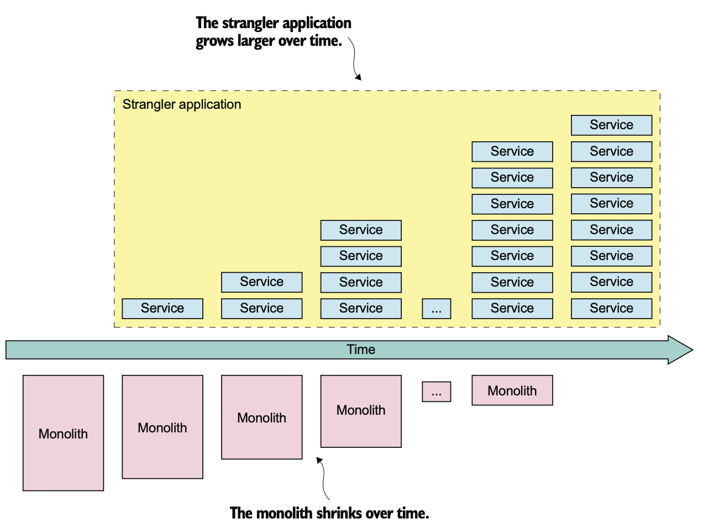

# 13.1.0 개요

우리가 MSA로 리팩토링하는건 어디서부터 도입해야할지 애매하고, 먼 이야기처럼 들릴 수 있다.

하지만 걱정하지 않아도 된다.

Stranger Application 이라는 전략을 사용하면 천천히 하나씩 마이크로서비스로 전환해갈 수 있다.

한 부분씩 마이크로서비스로 전환해가며 기존의 큰 Monolithic Application은 점점 작아지고, 마이크로서비스의 영역은 점점 넓어질 것이다.

 

그럼 우선 왜 마이크로서비스로 리팩토링 해야하는지, 그 이유부터 알아보자.

# 13.1.1 Monolithic을 왜 리팩토링 할까?

MSA는 장점이 많다.

앞에서도 여러번 말했듯이 유지보수성, 테스트성, 배포성이 좋고 개발을 빠르게 할 수 있으며, 오류의 격리도 잘 된다.

기술 스택을 발전하는것도 굉장히 쉽다.

 

하지만 Monolithic Application을 MSA로 리팩토링하는건 굉장히 힘들다.

무엇보다도 새 기능 개발에 들어가야할 인력이 MSA를 구축하는데 소모된다.

 

Monolithic 지옥에 빠졌다면 다음 중 하나의 문제를 겪고있을 것이다.

1. **느린 전달:** Application을 이해하고, 관리하고, 테스트하기가 어려워 개발자의 생산성이 떨어지게된다.

2. **버그가 많은 소프트웨어 Release:** 테스트성의 부족은 Release 시 버그가 많을 수 있다는걸 의미한다.

3. **나쁜 확장성:** Monolithic Application은 리소스 요구 조건이 아예 다른 모듈들을 하나의 Component로 묶어서 조합하기 때문에 확장이 어렵다.

   확장이 불가능하거나, 비용이 굉장히 비싸다. 또한 미래에 있을 고객의 Needs를 지원하기 힘들다.

대부분 느린 전달과 버그가 많은 Release 문제는 개발 프로세스가 낡았기 때문이다.

확장 문제 또한 아키텍쳐를 바꾸지 않고 해결할 수 있고, 테스트만 자동화해도 개발 속도는 월등히 빨라질 것이다.

# 13.1.2 Monolithic 조이기

Application Architecture를 MSA로 전환하는 프로세스는 Application Modernization, 즉 현대화의 일종이다.

Legacy Application을 새로운 기술, 새로운 아키텍쳐가 적용된 Application으로 바꿔가는 과정이다.

MSA로 리팩토링 할 때에도 현대화의 경험이 있다면 활용할 수 있다.

예를 들어 `"완전히 뜯어고치지 말아라"`라는 규칙은 평소 현대화에서 굉장히 중요한 이론이었으며, MSA에도 적용할 수 있다.

MSA를 구축한다고 해서 Monolithic Repository를 버리고 처음부터 다시 개발하는 일은 별로라는 것이다.

수개월, 혹은 수년은 걸려야 기존의 Application을 옮겨야 할텐데 사용자의 요구사항에 맞는 서비스 개발도 병행해야하기 때문에 실패하기 쉽다.

 

다음과 같이 천천히 하나씩 고쳐나가는게 좋다.

마이크로 서비스는 기존의 Application과 함께 동작하며 Microservice Application을 조금씩 조금씩 Build해서 올리는 것이다.

리팩토링은 보통 몇 개월에서 몇 년까지 걸리기도 한다.

Steve Yegge라는 사람의 말에 따르면 아마존닷컴은 Monolithic을 리팩토링하는데 2년이 걸렸다고 한다.

정말 초대형 시스템은 리팩토링이 절대 끝나지 않을수도 있다.

만약 Monolithic이 개발에 방해가 되는게 아니라면 그냥 냅둬도 된다.

## 가치를 빨리, 자주 검증해라

단계적으로 MSA 리팩토링을 진행하면 투자에 따른 보상을 바로바로 얻을 수 있다.

완성 전까지 아무 이득도 없는, 뜯어고치는 방법과는 많이 다른다.

Monolithic을 조금씩 바꿔가며 새로운 기술스택, 빠른 최신 DevOps 스타일로 새로운 서비스를 개발 / 전달하는 것이다.

 

Application에서 가치가 큰 부분부터 마이크로서비스로 변경하는것도 방법이 될 수 있다.

예를 들어 FTGO Application이 경쟁사에 비해 훨씬 앞서는 핵심 부분은 배달 스케쥴링 알고리즘이라고 해보자.

배달 관리는 특히 개발이 꾸준히 일어나기 때문에 배달 관리를 Stand Alone 서비스로 개발하게 되면 배달 관리 팀은 나머지 팀과 독립적으로 작업할 수 있게 된다.

새 버전을 빠르게 배포해서 효용성을 테스트할수도 있을 것이다.

 

가치를 빠르게 검증할수록 경영진은 MSA로의 전환에 노력을 함께 쏟아부을 것이다.

## Monolithic 변경 최소화

Monolithic으로 이미 있는 서비스를 광범위하게 뜯어고치지 말라는건 계속해서 언급된다.

MSA로 전환할 때 Monolithic을 건드리는건 불가피하지만, 많이 건드릴수록 시간도 많이 걸리고, 비용도 비싸고, 위험하다.

 

그래서 변경 범위를 최소화할 수 있는 방법도 있다.

추출된 서비스에 있는 데이터를 Monolith DB에 복제하거나 Monolithic에 주는 영향을 최소화하기 위해 추출 순서를 바꿀수도 있다.

## 기술 배포 인프라에서 아직 모든게 필요하진 않다.

K8S, Lambda, Service Discovery 등의 배포 플랫폼을 비롯한 신기술을 알아봤다.

지금 당장 이런 신기술을 도입하여 Infrastructure를 구축하고 싶을수도 있다.

 

하지만 **Infrastructure의 개발에 드는 선행 투자는 최소화 하는게 좋다.**

필수적인건 배포 자동화 Pipeline일 뿐이다.

서비스가 많지 않은데 정교한 배포 인프라나 관측성 인프라가 필요한가?

처음에는 Service Discovery용 설정 파일을 하드 코딩해도 상관없다.

MSA를 도입하고 실제로 경험하기 전엔 인프라에서 사용할 기술에 대한 결정은 미루는게 좋다.

