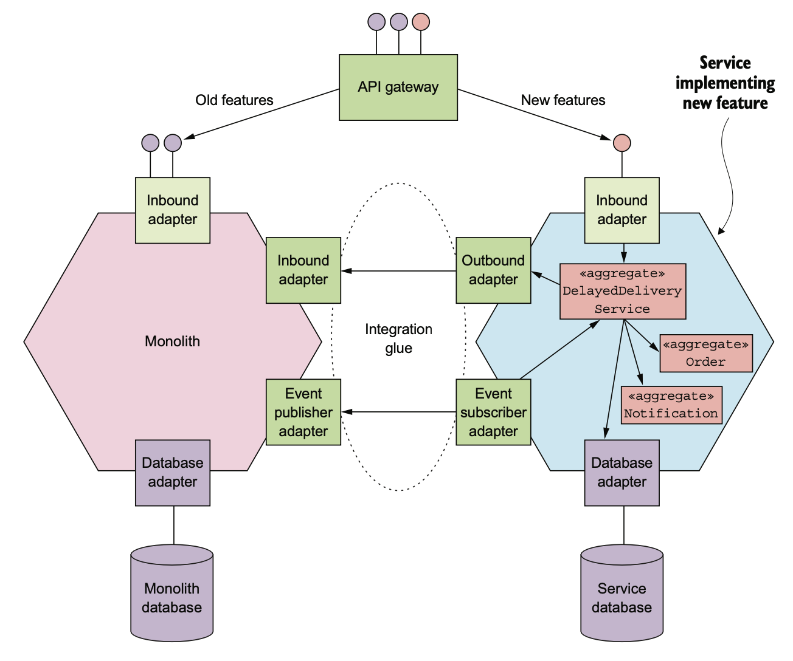
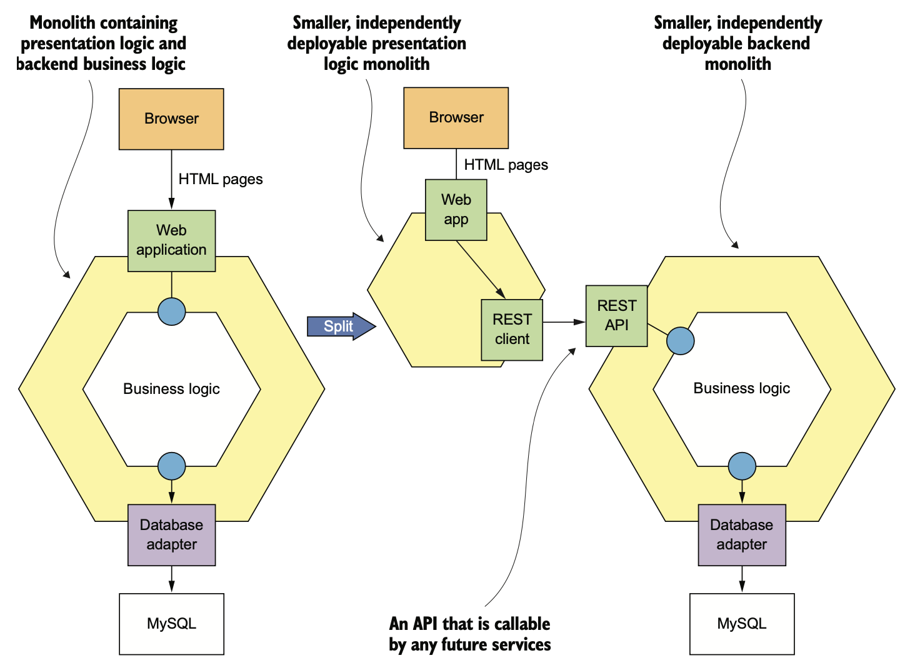
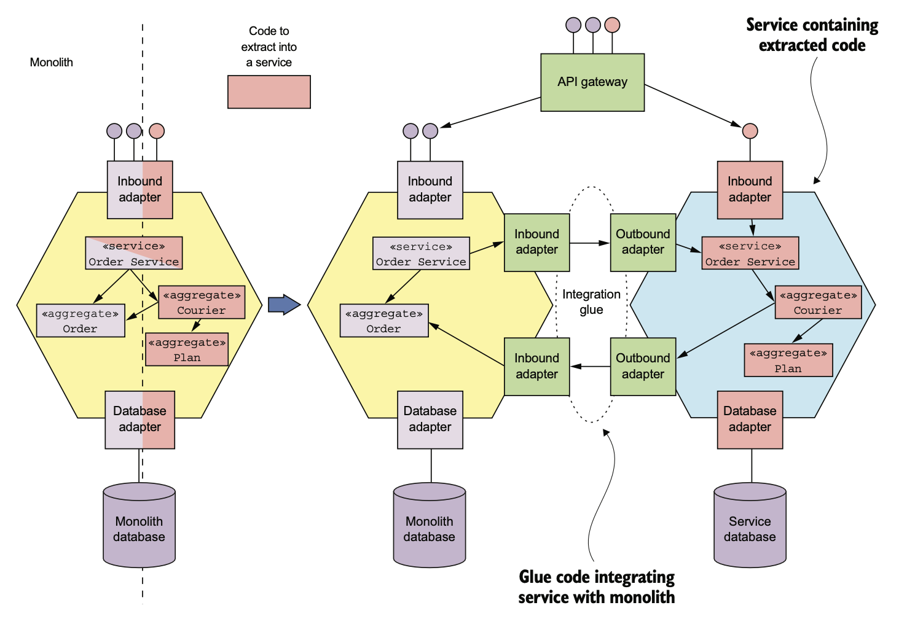
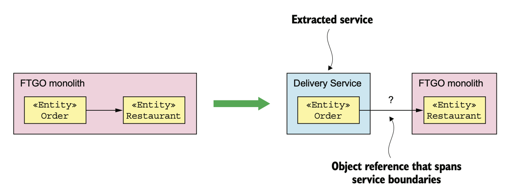
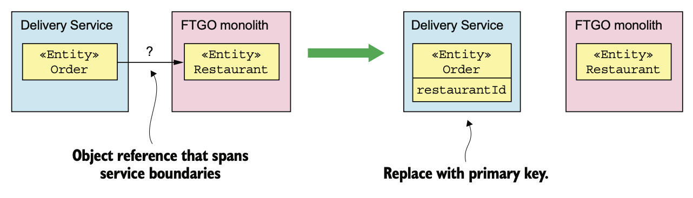
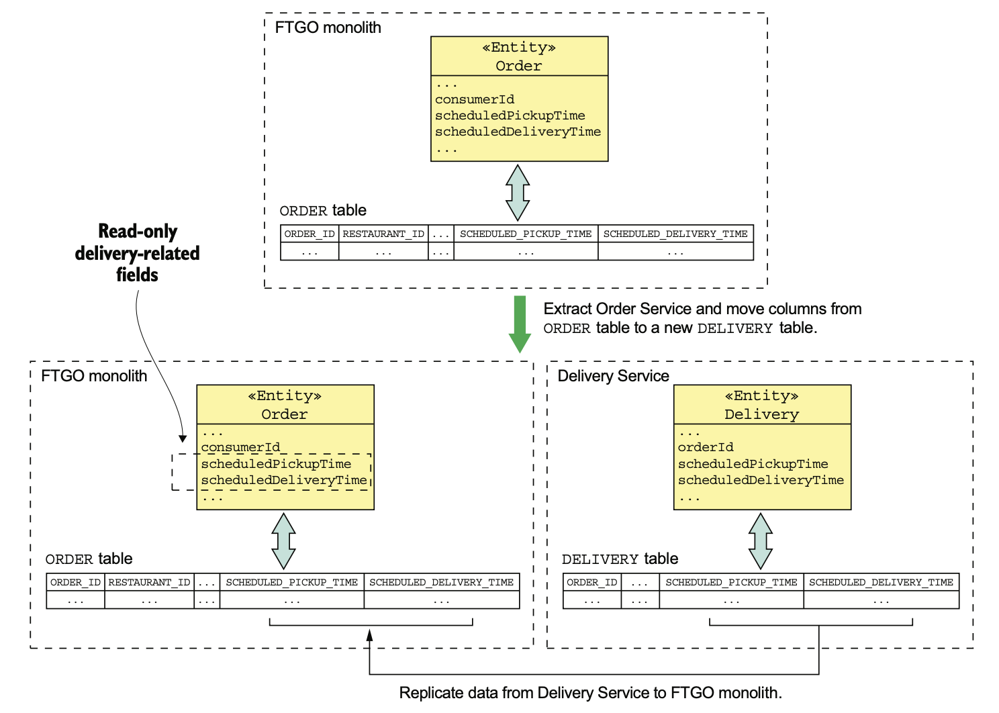

# 13.2.1 새 기능은 서비스로 구현한다.

Monolithic Application이 관리 불가능 수준이라면 Laws of Holes라는 조언이 유용하다.

> "구멍에 빠졌다면 땅은 그만 파라"

이미 거대하고 복잡한 Monolithic Application에 새 기능을 추가하지 말라는 소리다.

기능이 추가될수록 Monolithic Application은 복잡하고 비대해진다.

 

MSA로 전환할 때에는 새 기능을 서비스로 구현하는 작업부터 진행하는게 좋다.

## 새 서비스를 Monolithic Application에 연계

다음 그림은 새 기능을 서비스로 구현한 이후의 Application Architecture이다.

이 아키텍쳐에선 새 서비스와 Monolith 말고도 Application을 통합하기 위한 두 가지 요소가 있다.

- **API Gateway:** 새 기능에 대한 요청은 새로운 마이크로 서비스로, 기존 서비스는 Monolithic Application으로 Routing한다.
- **Integration Glue Code:** Service가 Monolith에 있는 데이터에 접근하고 Monolith에 있는 기능을 호출하기 위해 서비스를 통합해준다.

 

Integration Glue Code는 Stand Alone Component가 아니라 Monolith에 있는 Adapter과 하나 이상의 IPC를 사용하는 서비스이다.

예를 들어 배달 지연 서비스에 대한 Integration Glue Code는 Rest, Domain Event 모두 사용한다.

서비스는 RestAPI를 호출하여 Monolith에 있는 고객 연락처 정보를 가져오고, Monolith는 배달 지연 서비스가 주문 상태를 추적하고 제시간에 배달되지 못할 주문에 응답할 수 있도록 Order Domain Event를 발행한다.

## 새 기능을 서비스로 구현하는 시점

새 기능을 Monolith 대신 Strangler Application에 모두 구현할 수 있으면 좋겠지만, 모든 기능을 새로운 서비스로 구현할 수 있는건 아니다.

마이크로서비스의 본질이 비지니스 로직 위주로 느슨하게 결합된 서비스이기 때문이다.

서비스를 의미 있게 두기엔 너무 작을수도 있고, 기존의 Application과 단단하게 결합된 형태일 때 그럴 수 있다.

이런 기능을 과도하게 서비스로 나누게 되면, 필요 이상의 IPC가 발생하고 이에 따라 성능 이슈가 발생할수도 있다.

또한 데이터 일관성도 문제가 될 수 있다.

 

새 기능을 서비스로 나눌 수 없다면 우선 Monolithic Application에 추가한다.

나중에 관련된 기능들을 모아 하나의 서비스로 추출할 수 있기에 조급할 필요는 없다.

# 13.2.2 Presentation 계층과 Backend의 분리

Presentation 계층을 비지니스 로직과 Data Access 계층에서 분리함으로써 Monolithic Application의 크기를 줄일 수 있다.

Enterprise Application은 보통 다음 세 부분으로 구성된다.

1. **Presentation Layer:** HTTP 요청을 처리하고 Web UI에 전달할 HTML 페이지를 생성하는 Module로, UI가 정교하다면 Presentation Layer가 거의 대부분의 코드를 차지한다.
1. **Business Logic:** Enterprise Application 특정상 복잡한 비지니스 규칙이 구현된 Module로 구성된다.
1. **Data Access Logic:** DB, Message Broker 등 Infrastructure Service에 접근하는 Module들로 구성된다.

보통 이들은 명확하게 구분된다.

Business Layer에는 비지니스 로직을 캡슐화한 Facade들로 구성된 큰 단위의 API가 있다.

이 API가 Monolithic Application을 비교적 작은 두 Application으로 나눌 수 있는 틈이된다.

즉 Presentation Layer가 포함된 Application A와, Business / Data Access Logic이 담긴 Application B로 나누는 것이다.

 

이런식으로 나누면 두 가지 큰 장점이 있다.

- 두 Application을 독립적으로 개발, 배포, 확장할 수 있다.
- 마이크로서비스에서 호출할 수 있는 API가 Expose된다.

하지만 이렇게 해도 둘 중 하나, 혹은 둘 다 Monolithic Application이 될 여지가 있다.

# 13.2.3 기능을 여러 서비스로 추출

새 기능을 서비스로 구현하고, Backend와 Frontend를 구분하는 것은 한계가 있다.

결국 대부분의 Monolith Repository에서 작업하는건 똑같다.

Application Architecture를 확실하게 개선하고 개발 속도를 높이기 위해서는 **Monolith의 비지니스 능력을 하나씩 서비스로 옮기는 분해 작업**을 해야한다.

 

Monolith라는 빵을 수직으로 썰어 보면 추출해야할 기능은 다음 네 가지라고 할 수 있다.

1. API Endpoint가 구현된 Inbound Adapter
2. Domain Logic
3. DB Access Logic 등이 구현된 Outbound Adapter
4. Monolith DB Schema

Monolith에서 코드를 추출하고 Stand Alone 서비스로 옮긴다.

API Gateway는 추출된 서비스라면 호출하는 요청은 그 서비스로, 나머지는 기존의 Monolithic Application으로 Routing해준다.

Integration Glue를 통해 Monolith 서비스가 협동하는 구조이다.

 

서비스를 추출하는건 어렵다.

1. Monolith의 Domain Model을 어떻게 개별적인 Domain Model 2개로 나눌지 결정해야 한다.
2. 객체 Reference같은 Dependency도 모두 쪼개야 한다.
3. DB 리팩토링을 해야한다.
4. 이미 있는 클래스를 분리해야할수도 있다.

 

Monolithic 코드는 지저분해서 서비스 추출이 오래걸린다.

따라서 어떤 서비스를 추출할지는 신중하게 결정해야한다.

아무래도 가장 가치가 높은 Application을 집중적으로 Refactoring하는게 낫다.

서비스를 추출하기 전, 이게 노력한 만큼의 가치가 있는지 스스로 질문을 던져보는게 좋다.

## Domain Model 분리

서비스를 추출하려면 Monolith Domain Model을 서비스로 추출해야한다.

Domain Model을 나누려면 갈아엎듯이 바꿔야한다.

 

서비스와 서비스 그 경계에 있는 객체 Reference가 처리하기 곤란하다.

Monolithic Application에 있는 클래스가 추출된 서비스의 클래스를 참조하거나, 그 반대의 경우도 있을 수 있다.

예를 들어 다음 그림과 같이 Monolith에 남아있는 Restaurant 클래스를 서비스로 추출된 Order 클래스가 참조하는 문제가 발생할 수 있다.

Service Instance는 보통 하나의 프로세스이기 때문에 서비스끼리 객체 Reference를 참조할수는 없다.

이 문제의 해결 방법은 DDD Aggregate 방법으로 생각하는 것이다.

Aggregate에선 다른 Aggregate를 **객체 Reference가 아니라 FK로 가지기 때문**이다.

따라서 다음과 같이 Restaurant 객체를 restaurantId 필드로 바꾸면 된다.

이렇게 객체 Reference를 FK로 바꾸는게 큰 차이는 없지만, 객체 Reference를 사용하는 Client에게는 큰 차이가 될 수 있다.

서비스와 Monolith 사이에 데이터를 복제하면 변경 범위를 줄일 수 있다.

예를 들어 배달 서비스는 Monolith에 있는 Restaurant 클래스와 동일한 Restaurant라는 Facade를 정의하면 된다.

자세한건 나중에 다시 다룰 예정이다.

 

서비스를 추출하는 것은 그냥 클래스를 서비스로 옮기는 것보다 훨씬 많은게 얽히고 섥혀있다.

다른 목적을 가진 클래스 내부 깊숙한 곳의 기능을 추출하는것도 Domain Model을 나눌 때 큰 걸림돌이 된다.

예를 들어 FTGO의 Order 클래스처럼 주문 관리나 배달 관리 등 갖가지 일을 처리하는 God 클래스의 경우에는 더욱 힘들다.

배달 관리 서비스를 추출하고 싶을 때에도 Order 클래스에서 Delivery 클래스를 갈라내야한다.

## DB Refactoring

Domain Model은 단순히 코드만 바꾼다고 되는게 아니다.

Domain Model의 클래스는 대부분 Persistence 특징을 가지기 때문에 Field가 DB Schema와 연결되어있다.

따라서 Monolith에서 서비스를 추출하는 것은 데이터도 함께 옮겨야 하며, 당연히 테이블도 옮겨야한다.

 

예를 들어 배달 관리 서비스를 추출한다면 Order Entity를 추출하고 orders 테이블을 쪼개서 delivery 테이블로 만들어야한다.

> Refactoring Database라는 책에는 DB Schema를 Refactoring하는 전략이 적혀있어서 서비스를 추출할 때 DB를 나누는 작업에서 큰 도움을 받을 수 있다.
>
> Data를 복제해서 DB Client가 새 Schema를 사용하도록 단계별로 Update한다는 발상도 활용하기에 따라 매우 좋은 아이디어이다.
>
> 잘만 활용하면 서비스를 추출할 때 Monolith의 변경을 최소화할 수 있다.

## 변경 범위를 줄이기 위한 데이터 복제

서비스를 추출하기 위해 객체 Reference를 FK로 대체하고 클래스를 분리하는 방식으로 Domain Model을 변경하면 전반적인 곳에 변경을 일으켜 광범위하게 뜯어고칠 수도 있다.

예를 들어 Order Entity에서 Delivery Entity를 추출하는 것 만으로도, Delivery 객체를 참조하는 모든 곳을 뜯어고쳐야한다.

Refactoring Database의 방법을 사용하면 이러한 작업을 미룰 수 있다.

DB Refactoring의 가장 큰 걸림돌은 **전체 DB Client가 새 Schema를 사용하도록 바꾸는 것**이다.

Refactoring Database에서 제시한 방법은 일정 기간동안은 Legacy Schema를 유지하고, 원본 Schema와 신규 Schema를 동기화하는 Trigger를 만드는 것이다.

 

Monolithic Application에서 서비스를 추출할 때에도 이 방법이 좋다.

예를 들어 Delivery Entity를 추출한다고 하면 이동 중에는 Order Entity를 거의 건드리지 않는다.

또한 Delivery 관련 필드는 ReadOnly로 만들고 배달 서비스 데이터는 Monolith에 복제해서 최신 상태를 유지한다.

이젠 그냥 Monolithic Application에서 Delivery 관련 필드를 Update하는 곳만 찾아서 새 배달 서비스를 호출하도록 하면 된다.

배달 서비스의 데이터를 복제하게 되면 Order Entity의 구조를 유지할 수 있기 때문에 당장 할 작업은 굉장히 줄어든다.

Delivery에 관련된 Order Entity의 필드나 orders 테이블 컬럼을 사용하는 곳은 천천히 바꿔나가면 된다.

## 어떤 서비스를 언제 추출할까

Monolith를 분리하는건 시간이 많이 걸리기 때문에 어떤것부터 할지 신중하게 결정해야한다.

일단 추출했을 때 이득이 가장 클만한 서비스를 추출하는게 좋다.

 

마이크로서비스로의 전환은 time-boxed architecutre 정의부터 하는게 좋다.

1~2주정도 시간을 들여 이상적인 architecutre가 뭔지 고민하고, 그에 맞는 서비스를 정의하는 것이다.

이렇게만 해도 목적을 뚜렷하게 할 수 있다.

물론 architecutre는 정답이 있고, 고정된 것이 아니기 때문에 Monolith를 분해하며 경험해가고, architecutre를 조금씩 수정해가면 된다.

 

서비스를 추출할 때의 팁은 다음과 같다.

- Monolith 개발을 멈추고 요구조건이 있을 때마다 서비스를 추출한다.

  Monolith에서 발생한 버그를 잡지도 않고, 새로운 기능을 추가하지도 않는다. 단지 새로운 서비스를 만들 뿐이다.

  어쩔 수 없이 Monolith를 분해하게 되긴 하지만 서비스가 단기적인 니즈에 의해 추출된다는 단점은 있다.

- 좀 더 계획적으로 서비스 추출 시의 기대 효과를 정리하고, Module별로 순위를 메기는 것이다.

서비스를 추출했을 때의 장점은 다음과 같다.

- **개발 가속화:** 일정상 내년까진 개발 분량이 많을 것 같은 파트는 서비스로 바꿈으로써 개발 속도가 빨라질 수 있다.
- **성능, 확장성, 신뢰성:** Application의 성능이나 확장성에 문제가 있다면 서비스로 전환할만한 가치가 있다.
- **다른 서비스가 추출될 수 있도록 함:** 한 서비스를 추출했을 때 다른 서비스를 추출하는게 간단해진다면 추출할만한 가치가 있다.

