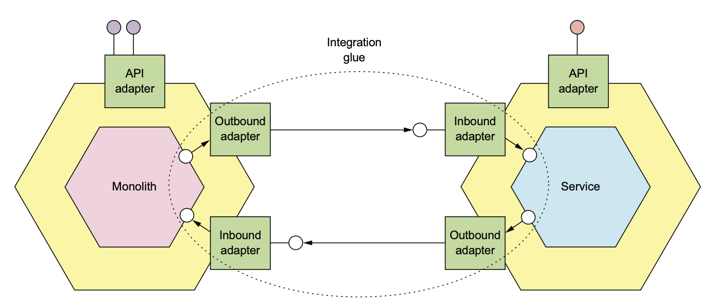
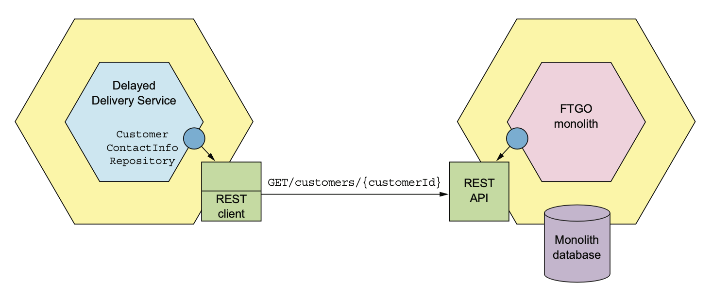
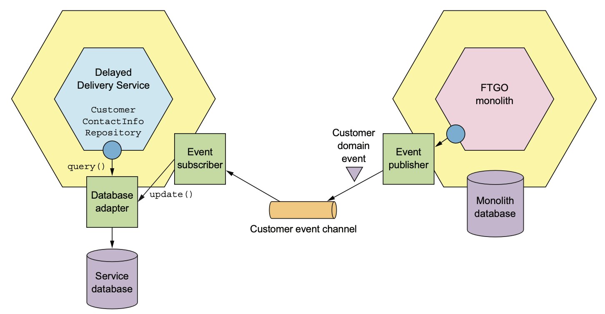
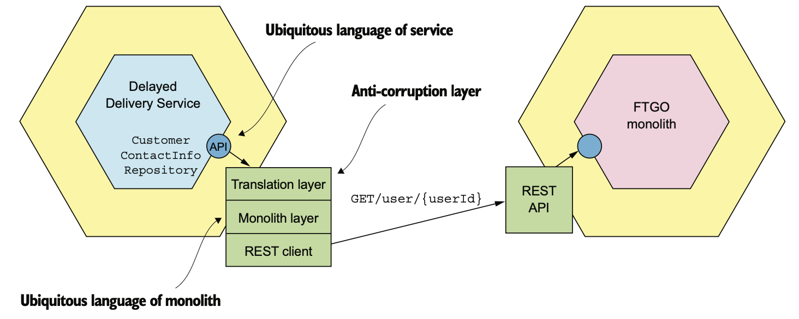
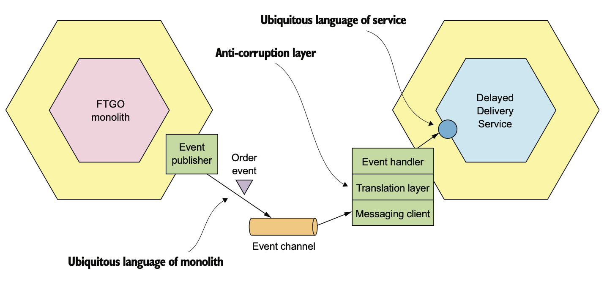
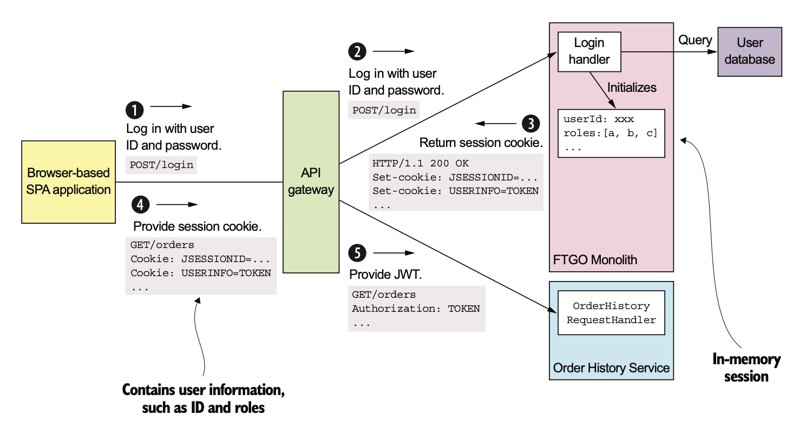

# 13.3.0 서론

Monolithic Application에서 분리된 서비스는 대부분 Monolithic Application과 협력해서 동작한다.

서비스가 Monolithic Application에 접근하거나, 특정 작업을 하기 위해 Monolithic Application을 호출해야할수도 있다.

예를 들어 배달 지연 서비스는 Monolithic Application의 주문 정보, 고객 연락처 정보를 가져와야 한다.

<br>

여기서 중요한건 서비스와 Monolithic Application 사이의 데이터 일관성을 유지하는 것이다.

특히 Monolithic Application에서 서비스를 추출했을 때 ACID 트랜잭션으로 묶여있던 코드도 분리되었는데, 데이터 일관성도 잘 지켜줘야 한다.

<br>

서비스와 Monolithic Application 사이의 Communication은 Integration Glue 코드가 담당한다.

다음 그림은 서비스와 Monolithic Application 사이에서 IPC로 통신하는 Adapter로 구성된 Integration Glue이다.



Monolithic Application과 서비스는 메세징으로 통신할수도 있고 Rest 등 다양하게 사용할 수 있다.

# 13.3.1 Integration Glue 설계

어떤 기능을 새로운 서비스로 구현하거나, Monolith에서 서비스를 추출하는 방법으로 구현한다고 가정해보자.

그 서비스와 Monolith가 Communication할 수 있도록 돕는 Integration Glue도 반드시 개발해줘야 한다.

Integration Glue는 사용하는 IPC마다 다를 수 있다.

## Integration Glue API 설계

Integration Glue를 설계하기 위해선 먼저 도메인 로직에게 어떤 API를 제공할지 결정해야한다.

데이터를 조회하는지, 수정하는지 등 동작에 따라 Interface의 스타일이 바뀐다.

<br>

Monolith에서 고객 연락처를 가져오는 배달 지연 서비스를 예로 들어보자.

이 서비스의 비지니스 로직에선 Integration Glue가 어떤 IPC로 가져오는지 알 필요 없이 제대로 가져오기만 하면 되기 때문에 다음과 같이 캡슐화 하는게 좋다.

``` java
interface CustomerContactInfoRepository {
    CustomerContactInfo findCustomerContactInfo(long customerId)
}
```

이 서비스의 비지니스 로직은 Integration Glue가 데이터를 어떻게 가져오는지는 몰라도, 아무튼 이 인터페이스를 호출하면 값이 나온다.

<br>

이번에는 또 다른 서비스를 예로 들어보자.

Monolith에서 배달 관리를 추출해낸다고 해보자.

Monolith는 배달 서비스를 호출해서 배달을 스케쥴링하거나 취소할 수 있다.

여기서도 IPC 종류를 신경쓸 필요는 없으니 Interface로 캡슐화 한다.

단지, Repository라는 이름은 말이 안되기 때문에 다음과 같이 서비스 Interface를 정의한다.

``` java
interface DeliveryService {
    void scheduleDelivery(...);
    void rescheduleDelivery(...);
    void cancelDelivery(...);
}
```

## Communication 스타일과 IPC 선택

Integration Glue에서는 Communication 스타일이나 IPC를 선택하는게 매우 중요하다.

서비스와 Monolith, 어느쪽이 반대쪽을 조회 / 수정하기 위해 뭐가 필요하느냐따라 달려있다.

<br>

한 쪽이 반대쪽의 데이터를 조회한다면 몇 가지 옵션이 있다.

먼저 Repository 인터페이스를 구현한 Adapter로 Data Provider의 API를 호출하는 것이다.



여기서도 다른 API처럼 RestAPI / gRPC 등으로 Request / Response를 주고받을 것이다.

<br>

여기서 CustomerContactInfoRepository 인터페이스를 호출하여 고객의 연락처를 조회한다.

조회 API로 조회하는건 좋지만 요청의 개수가 늘어남에 따라 비효율적이게 되버린다.

Provider가 대용량의 데이터를 줄 수도 있고, 동기 IPC라는 단점도 있다.

<br>

다음은 CQRS View를 유지시키는 방법이다.

Data Consumer쪽에선 Data Provider가 발행한 Domain Event를 구독해서 이 Replica를 항상 최신 상태로 유지한다.



Replica를 두는건 여러모로 장점이 많다.

1. Data Provider에 계속해서 Query하는 오버헤드가 감소한다.
2. 쿼리 효율을 높일 수 있다.

물론 Replica를 관리하는 복잡성은 어쩔 수 없고, Monolith에 Domain Event를 발행하는 코드가 추가된다는 단점이 있다.

<br>

그렇다면 수정은 어떻게 할까?

데이터를 수정할 때 서비스와 Monolithic Application 둘 다 일관성을 유지해야한다.

Request하는 쪽은 자신의 DB를 이미 수정했거나, 수정해야한다.

어찌됐건 둘 다 Update해줘야 한다.

해결 방법은 Eventuate Tram같은 Framework를 활용해 Transactional Messaging으로 통신하는 것이다.

단순한거라면 Update를 Trigger하는 Event를 발행하거나, 알림을 보내면 되겠지만 복잡하다면 Saga를 활용해야 한다.

## Anti-Corruption Layer 구현

새로운 기능을 새 서비스에서 구현한다고 가정해보자.

Monolithic 코드로 인해 제약받을 일이 없기 때문에 최신 개발 기법을 활용하고, 새로운 Domain Model을 개발할 수 있다.

예를 들어 배달 지연 서비스는 역할이 매우 한정된 Delivery Entity를 가지고있지만, Monolith에는 매우 많은 일을 하는 Order Entity가 있을 수 있다.

두 Domain Model의 성격 자체가 매우 다르기 때문에 서비스와 Monolith가 소통하려면 DDD의 ACL을 구현해야 한다.

<br>

ACL의 목적은 **Legacy Monolithic Application의 Domain Model이 서비스의 Domain Model을 더럽히지 않도록 막는 것**이다.

즉, 서로 다른 두 Domain Model 사이의 변환을 담당한다.

배달 지연 서비스의 CustomerContactInfoRepository 인터페이스에는 CustomerContactInfo를 반환하는 `findCustomerInfo()` 메소드가 정의되어있다.

이 인터페이스를 구현한 구현체는 반드시 배달 지연 서비스의 Ubiquitous Language와 FTGO Ubiquitous Language 사이에 변환을 해줘야한다.



`findCustomerContactInfo()` 구현체는 FTGO Monolith를 호출해서 고객 정보를 조회하고, 그 값을 CustomerContactInfo로 매핑한다.

여기서는 단순하지만 상태 코드 값을 바꾸는 등 로직이 복잡한 경우도 많다.

<br>

Domain Event를 Consume하는 Event Subscriber도 ACL를 갖고있다.

Domain Event는 Domain Model의 일부이기 때문에 Event Handler가 Domain Event를 Subscriber쪽 Domain Event로 바꿔야 한다.

예를 들어 다음 그림에서 Order Domain Event를 발행한다.

이 Event를 구독하는 Event Handler는 배달 서비스에 위치한다.



Event Handler는 Domain Event를 Domain쪽 언어에서 배달 서비스의 언어로 변경해야 한다.

<br>

ACL은 서비스에서만 사용하는게 아니다.

예를 들어 Monolith Application에서 배달 서비스에 메세지를 보내 배달 스케쥴을 잡는다고 해보자.

알림은 DeliveryService라는 인터페이스의 메소드를 통해 전송할 수 있으며, 구현체는 매개변수를 주문 서비스쪽 언어로 변환한다.

## Monolith가 Domain Event를 발행 / 구독하는 방법

Domain Event는 협력을 위한 중요한 장치이다.

새로 개발한 Eventuate Tram 등의 Framework로 Event를 쉽게 Publish / Consume할수도 있고, Event Sourcing을 사용할수도 있다.

그렇지만 Monolith에서 이벤트를 Publish / Consume 하기는 어렵다.

<br>

Monolith에서 Event를 발행하는 방법에는 두 가지가 있다.

1. 서비스가 사용하는 것과 동일한 Event Publishing 메커니즘을 사용하는 방법으로, 특정 Entity를 변경하는 코드를 모두 찾아서 Event 발행 API를 호출하는 방법이다.

   Monolith에선 이렇게 하기 힘들 뿐더러, 저장 Procedure로 비지니스 로직이 구성된 Monolith도 있어서 불가능하다.

2. DB 수준에서 Domain Event 발행하는 방법이다.

   앞에서 봤던 Transaction Log Tailing이나 Polling 등을 사용하면 된다.

   Transaction Log Tailing은 Monolith를 변경하지 않아도 된다는 장점이 있지만, 고수준의 비지니스 Event를 발행하기 힘들다.

<br>

다행히도 서비스가 발행한 Domain Event를 받는건 쉽게 할 수 있다.

Eventuate Tram같은 라이브러리로 Event Handler를 작성하는 것이다.

하지만 Message Broker Client를 지원하지 않는 언어라면 힘들 수 있다.

그럴땐 Helper Application을 만들어 Event를 받고, DB를 따로 수정할 필요가 있다.

# 13.3.2 서비스와 Monolith 사이의 데이터 일관성 유지

데이터 일관성 유지도 해결해야할 문제 중 하나이다.

예를 들어 Monolith에서 주방 서비스를 분리했다고 가정해보자.

Saga로 Ticket과 Order의 일관성을 맞추려면 `createOrder()` 등의 주문 관리 로직을 바꿔야 한다.

하지만 Saga에선 보상 트랜잭션으로 Undo를 수행하는데, Monolith가 이걸 지원하려면 굉장히 어렵다.

예를 들어 주방 서비스가 주문을 거부할 경우 CreateOrderSaga는 해당 주문을 CANCELED 상태로 바꾸는 보상 트랜잭션을 실행해야한다.

또한 Saga의 비 격리 문제 해결책도 찾아야한다.

<br>

다행히도 대부분의 Saga를 구현하는건 쉽다.

특히 피봇 트랜잭션이나 재시도 가능 트랜잭션이면 매우 쉽다.

하지만 보상 트랜잭션은 귀찮고 어렵다.

## Monolith가 보상 트랜잭션을 지원하는건 어렵다.

Monolith에서 주방 서비스를 추출했을 때 보상 트랜잭션에 문제가 있을까

Order Entity를 분리하고 주방 서비스에 Ticket Entity를 만들어야 한다.

하지만 이 방법은 `createOrder()`등 기존의 Monolithic Application에 많은 영향을 끼친다.

우선 Monolith에 구현된 `createOrder()`는 다음과 같은 순서로 구성된 단일 ACID 트랜잭션을 실행한다.

1. 주문 내역 확인
2. 주문 가능한 소비자인지 확인
3. 소비자 신용카드 승인
4. 주문 생성

이 트랜잭션은 다음과 같은 Saga로 대체해야 한다.

1. **Monolith**
   1. 주문을 APPROVAL_PENDING 상태로 생성한다.
   2. 주문 가능한 소비자인지 확인한다.
2. **주방 서비스**
   1. 주문 내역을 확인한다.
   2. Ticket을 CREATE_PENDING 상태로 생성한다.
3. **Monolith**
   1. 소비자 신용카드를 승인한다.
   2. 주문 상태를 APPROVED로 변경한다.
4. **주방 서비스**
   1. Ticket 상태를 AWAITING_ACCEPTANCE 상태로 변경한다.

4장에서 배웠던 CreateOrderSaga와 비슷하게 4개의 Local Transaction으로 Saga를 구성한다.

<br>

첫 번째 트랜잭션을 보상 가능 트랜잭션으로 만들어야 한다.

따라서 Order Entity에 APPROVAL_PENDING 상태를 두어야 한다.

<br>

그런데 이것을 지원하기 위해 고쳐야 하는 Monolith의 코드가 한 두 줄이 아니다.

이 Entity를 사용하는 모든 곳을 뒤져봐야하기에 위험성도 높고 시간도 오래 걸린다.

## Saga를 적용할 때 Monolith가 항상 보상 트랜잭션을 지원할 필요는 없다

Saga는 Domain마다 조금 다르다.

방금처럼 보상 트랜잭션을 구현해야 할수도 있겠지만, 서비스를 추출할 때 보상 트랜잭션을 구현할 필요 없는 트랜잭션을 설계하는것도 좋다.

Monolith에서는 **뒤쪽에 오는 트랜잭션이 실패할 수도 있을 때만 보상 트랜잭션이 실행되지 않아도 된다.**

<br>

예를 들어 주방 서비스 대신 주문 서비스를 추출한다고 가정해보자.

Order Entity를 쪼개서 주문 서비스에 작아진 Order를 생성하도록 리팩토링 해야한다.

`createOrder()` 등 Monolith에서 주문 서비스로 옮겨간 커맨드들이 영향을 받을 것이다.

따라서 다음 순서대로 `createOrder()`가 Saga를 사용하도록 바꿔야한다.

1. **주문 서비스**
   1. 주문을 APPROVAL_PENDING 상태로 생성한다.
2. **Monolith**
   1. 주문 가능한 소비자인지 확인한다.
   2. 주문 내역을 확인하고 Ticket을 생성한다.
   3. 소비자 신용카드를 생성한다.
3. **주문 서비스**
   1. 주문 상태를 APPROVED로 변경한다.

Local Transaction 3개로 이루어진 Saga이다.

<br>

Monolith의 Transaction이 Pivot Transaction이기 때문에, Monolith는 자신의 Local Transaction만 성공하면 롤백할 이유가 없어진다.

## 서비스 추출 순서를 바꾸면 보상 트랜잭션을 Monolith에 구현하지 않아도 된다.

서비스를 추출하는 순서를 잘 조정하면 Monolith에서 보상 트랜잭션을 지원하지 않을 수 있다.

<br>

소비자 서비스를 추출하면 `createOrder()`가 사용하는 Saga는 다음과 같다.

1. **주문 서비스:** 주문을 APPROVAL_PENDING 상태로 생성한다.
2. **소비자 서비스:** 주문 가능한 서비스인지 확인한다.
3. **Monolith:** 주문 내역을 확인하고 Ticket을 생성하며, 소비자 신용카드를 승인한다.
4. **주문 서비스:** 주문을 APPROVED 상태로 변경한다.

여기서도 Monolith가 Pivot Transaction이다.

<br>

다음은 주방 서비스를 추출했을 때  `createOrder()`가 사용할 Saga는 다음과 같다.

1. **주문 서비스:** 주문을 APPROVAL_PENDING 상태로 생성한다.
2. **소비자 서비스:** 주문 가능한 서비스인지 확인한다.
3. **주방 서비스:** 주문 내역을 확인하고 Ticket을 CREATE_PENDING 으로 생성한다.
4. **Monolith:** 소비자 신용카드를 승인한다.
5. **주방 서비스:** Ticket을 APPROVED 상태로 변경한다.
6. **주문 서비스:** 주문을 APPROVED 상태로 변경한다.

여기서도 Monolith가 Pivot Transaction이다.

<br>

회계 서비스까지 추출해보면 `createOrder()`의 Saga는 다음과 같다.

1. **주문 서비스:** 주문을 APPROVAL_PENDING 상태로 생성한다.
2. **소비자 서비스:** 주문 가능한 서비스인지 확인한다.
3. **주방 서비스:** 주문 내역을 확인하고 Ticket을 CREATE_PENDING 으로 생성한다.
4. **회계 서비스:** 소비자 신용카드를 승인한다.
5. **주방 서비스:** Ticket을 APPROVED 상태로 변경한다.
6. **주문 서비스:** 주문을 APPROVED 상태로 변경한다.

# 13.3.3 인증/인가

Monolith의 보안 메커니즘도 변경해야한다.

MSA는 JWT로 Credential을 전달한다.

InMemory Session으로 Credential을 저장하고, Thread Local에 Credential을 넣어 사용하던 Monolithic Application과는 완전히 다른 방법을 사용해야한다.

따라서 Monolithic의 방법과 JWT 방법을 동시에 지원하는게 관건이다.

<br>

Monolith의 LoginHandler는 약간만 수정하면 된다.

LoginHandler가 USERINFO 쿠키를 반환하면, 브라우저는 이후 요청에 이 쿠키를 넣어 요청한다.

API Gateway는 이 쿠키에서 정보를 꺼내어 HTTP에 포함해서 서비스를 호출하고, 서비스는 자신이 필요한 사용자 정보를 쓸 수 있다.



1. Client가 LoginHandler에게 Credential과 함께 요청한다.
2. API Gateway는 이 요청을 Monolithic Application에게 Routing한다.
3. Monolith는 JSESSIONID 세션 쿠키, USERINFO 쿠키가 담긴 Response를 반환한다.
4. Client는 USERINFO 쿠키가 담긴 요청을 보내 서비스를 호출한다.
5. API Gateway는 USERINFO 쿠키를 검증한 후 Authorization 헤더에 넣어 서비스를 호출한다.
6. 서비스는 USERINFO 쿠키를 검증하고 사용자 정보를 추출한다.

## Monolith의 LoginHandler는 USERINFO 쿠키를 설정한다.

LoginHandler는 POST로 전송된 Credential을 처리해서 인증하고, 사용자 정보를 세션에 저장한다.

보통 Spring Security로 구현한다.

원래는 JSESSIONID가 포함된 Response를 주지만, MSA로 전환하기 위해 USERINFO 쿠키까지 줘야한다.

## API Gateway는 USERINFO를 Authorization 헤더에 넣는다.

API Gateway는 요청을 Routing하고, API를 조합하며, Monolith와 서비스에게 요청을 넣어준다.

API Gateway는 USERINFO 쿠키를 검증하고, 이 쿠키를 Authorization 헤더에 넣어 전달한다.

<br>

결국 언젠가 로그인도 서비스로 빠지겠지만, Monolith LoginHandler를 조금만 건드리면 MSA를 지원하도록 바꿀 수 있다.1
