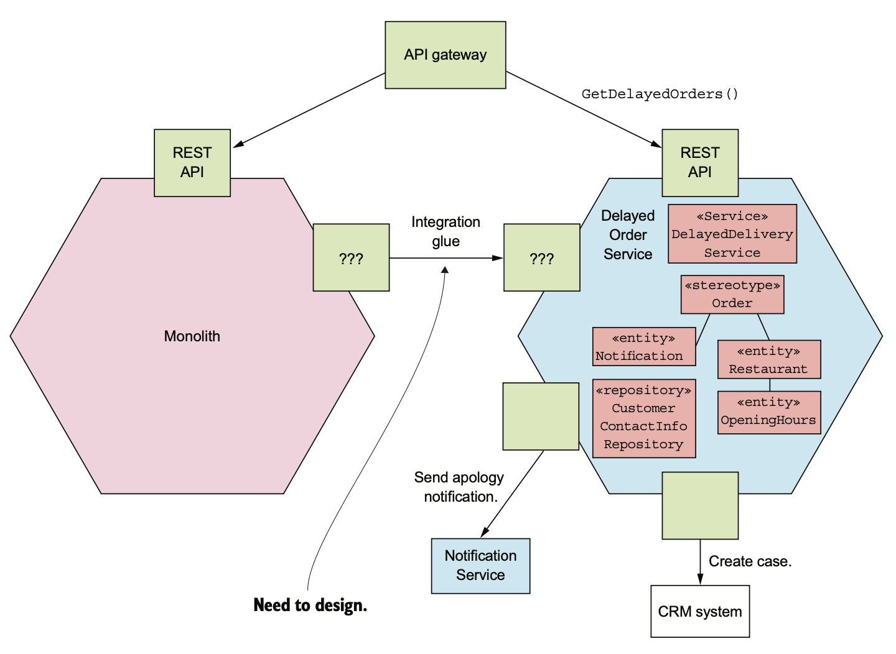
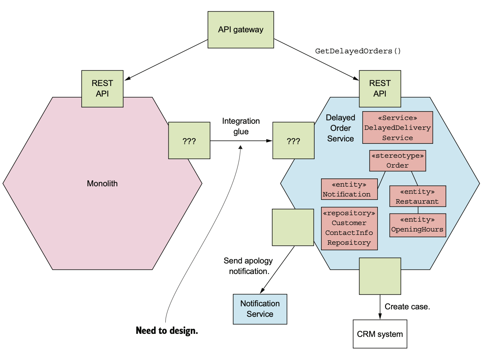

# 13.4.0 서론

현재는 실패한 배달 문제에 대해 제대로 구현하지 않고 있다.

더 정교하게 Scheduler를 구현하고 있지만 언제 끝날지도 모른 채 기다리고있다.

그래서 임시적으로 지연되거나 취소된 주문에 대해 고객의 양해를 구하고, 필요하면 클레임을 걸기 전에 보상책을 제시하도록 했다.

 

우리가 구현해야할 기능은 다음과 같다.

- 주문이 제시간에 배달되지 못했을 때 이걸 고객에게 알린다.
- 주문을 제시간 안에 배달할 수 없을 경우 미리 고객에게 보상책을 제시하도록 한다.
- 아예 배달 자체가 불가능한 경우 이걸 고객에게 알린다.
- 배달 통계를 추적한다.

 

새로운 기능은 별로 어렵지 않다.

주문 상태를 추적하고, 약속한 시간에 배달할 수 없다면 고객이나 서비스 센터에게 이메일 등으로 알려주는 코드만 작성하면 된다.

근데 이걸 어디에 구현해야 할까?

Monolithic Application에 구현하기엔 Monolith가 더 커지고, 애초에 개발이나 테스트도 어렵다.

따라서 새로운 서비스에 이걸 구현하는게 좋다.

# 13.4.1 배달 지연 서비스 설계

다음 그림은 이 서비스를 구현했을 때 Monolith, 배달 지연 서비스, API Gateway로 구성된 Application 아키텍쳐이다.

배달 지연 서비스는 `getDelayedOrders()`라는 Query가 정의된 API를 호출해서 현재 지연중 / 배달 불가 상태인 주문들을 조회한다.

API Gateway는 `getDelayedOrders()`만 서비스로 Routing하고 나머지는 Monolithic Application으로 Routing한다.

배달 지연 서비스는 Integration Glue 코드를 통해 Monolith 데이터에 접근할 수 있다.

 

배달 지연 서비스의 Domain Model은 DelayedOrderNotification, Order, Restaurant같은 다양한 Entity로 구성된다.

핵심적인 로직은 DelayedOrderService 클래스에 구현된다.

일정 시간마다 이 서비스를 호출해서 제시간에 배달되지 못할 것 같은 주문들을 조회한다.

Order와 Restaurant를 조회해보면 알 수 있다.

DelayedOrderNotification는 다시 이걸 고객과 고객 서비스 센터에 알려준다.

배달 지연 서비스에서 Order나 Restaurant Entity를 소유하지는 않는 대신, Monolith에서 데이터를 복제한다.

# 13.4.2 Integration Glue 설계

방금 말했듯이 이 서비스는 Monolith에 있는 데이터를 복제해서 사용한다.

또한 고객에게 알림을 보내기 위해선 전화번호가 필요하기 때문에 배달 지연 서비스가 Monolith 데이터에 접근할 수 있도록 Integration Glue도 필요하다.

다음은 Integration Glue 설계이다.

Monolith에서는 Order, Restaurant Domain Event를 발행하고, 배달 지연 서비스에선 이걸 받아 Entity별 Replica를 Update한다.

또한 제시간에 배달할 수 없을 경우에 고객의 연락처를 조회하는 Rest Endpoint를 호출해서 해당 고객에게 지연됐다는 사실을 알린다.

## CustomerContactInfoRepository로 연락처 조회

서비스에서 데이터를 읽는 방법은 두 가지가 있다.

가장 단순한 방법은 Monolith의 API를 호출하여 데이터를 가져오는 방법이다.

고객 연락처를 조회할 때는 괜찮은 방법이다.

배달 지연 서비스가 고객 연락처를 조회할 일이 그렇게 많지도 않고, 데이터 크기도 작아서 지연 이슈나 성능 이슈가 발생할 일이 딱히 없다.

CustomerContactInfoRepository는 배달 지연 서비스에서 고객의 연락처를 조회하는 인터페이스다.

## 주문 / 음식점 Domain Event의 Publish / Consume

배달 지연 서비스가 주문 상태와 음식점 시간 데이터를 Monolith에서 조회하는건 실용적이지 못하다.

네트워크가 대량의 데이터를 계속 전송해야하기 때문에 비효율적이다.

따라서 조금 복잡하긴 해도 Monolith가 발행한 Event를 구독하고, Order과 Restaurant에 대한 Replica를 유지하는 방법을 사용해야한다.

여기서 Replica라고 해서 모든 컬럼을 복제하는게 아니라, 필요한 컬럼만 가져온다.

 

Monolith에서 Order과 Restaurant에 대한 Event를 발행하는 방법에는 두 가지가 있다.

1. Monolith에서 Order, Restaurant가 등장하는 모든 코드를 찾고, 고수준 Domain Event를 발행하는 방법
2. Transaction Log Tailing을 사용해 변경된 내용을 Event로 발행한다.

여기서는 DB 동기화만 하면 되기 때문에 둘 중 어느 방법이든 상관없다.

 

배달 지연 서비스에는 Monolith에서 발생한 Event를 구독하며 Order, Restaurant Entity를 수정하는 Event Handler를 구현한다.

Replica를 사용하면 배달 지연 서비스가 주문 / 음식점 오픈 시간을 효율적으로 조회할 수 있다.

물론 로직이 복잡해지고, Order나 Restaurant에 대한 Event를 발행해야하기 때문에 복잡성은 감당해야한다.

