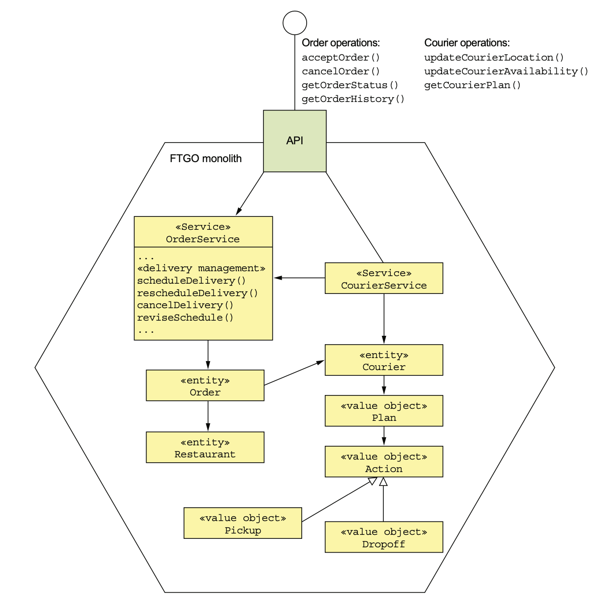
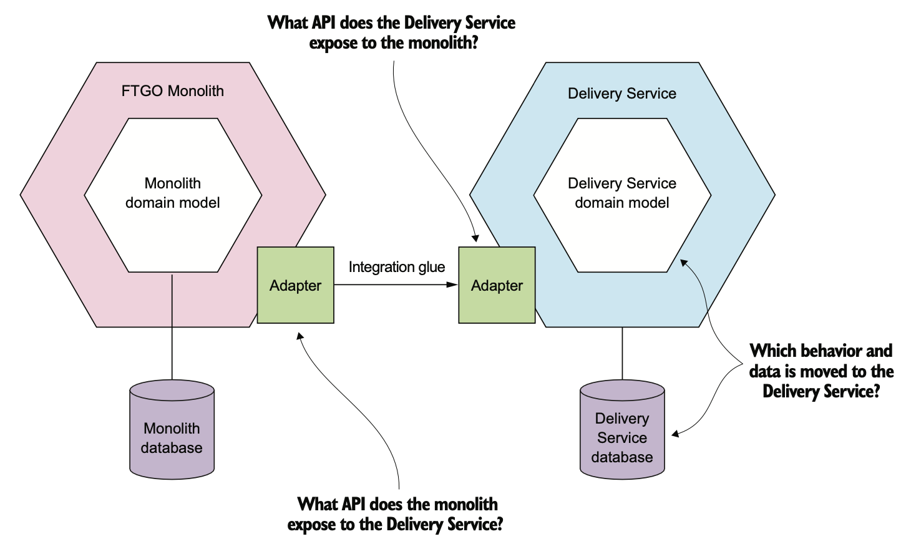
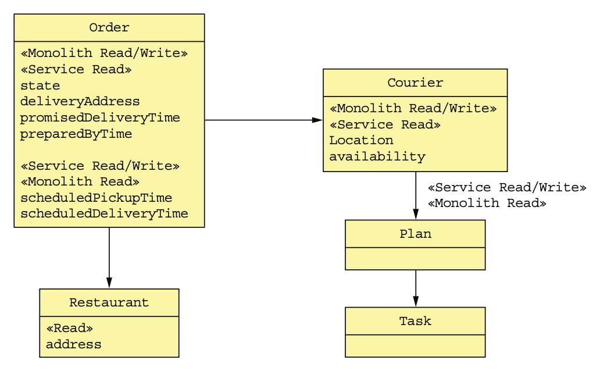
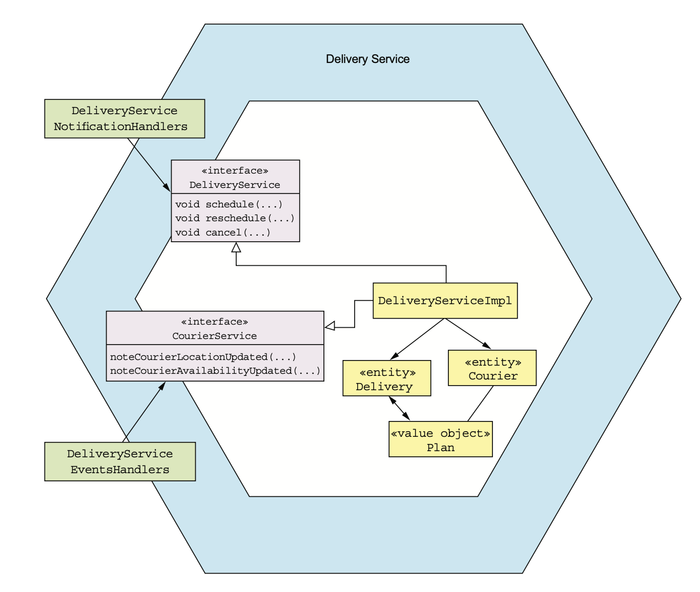
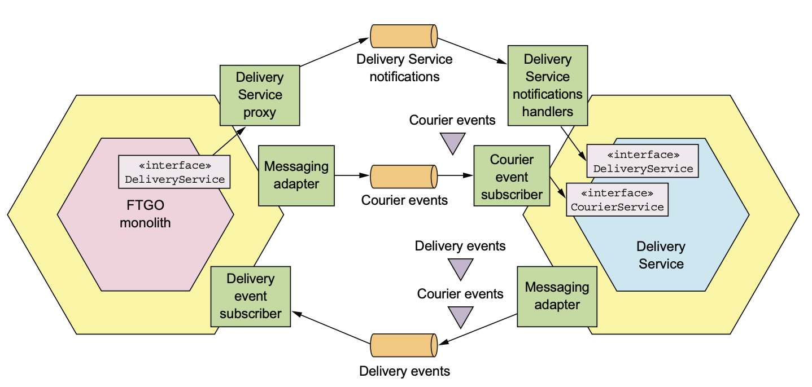
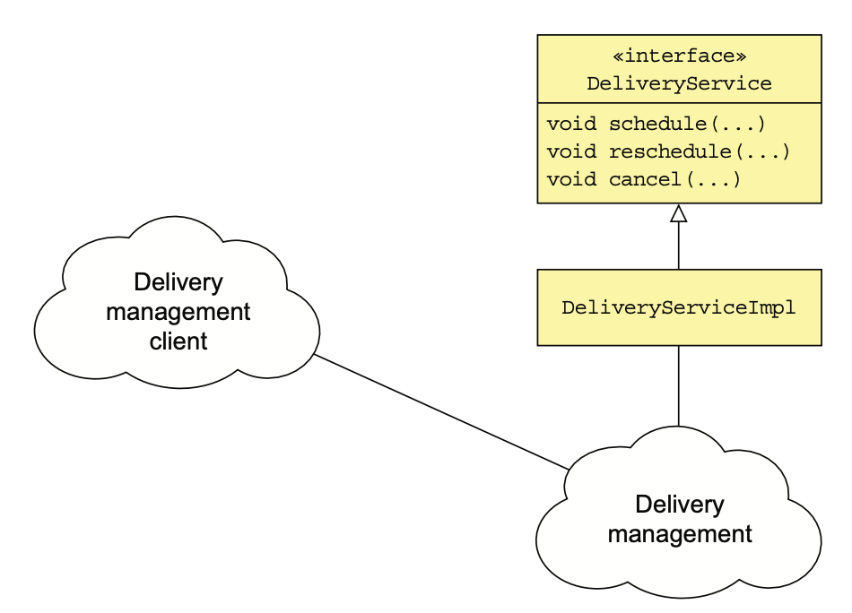
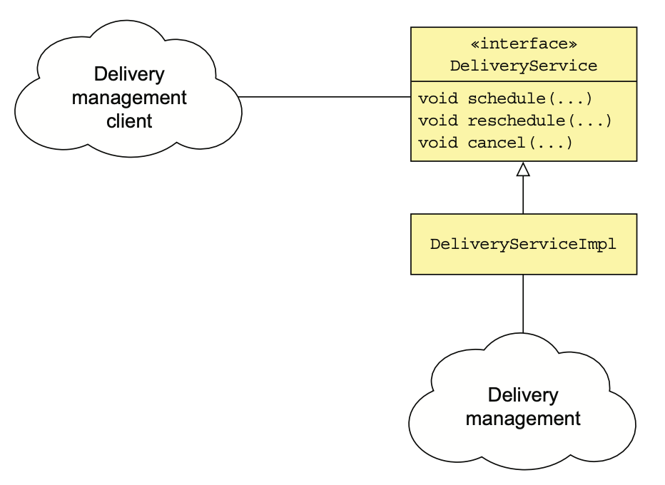
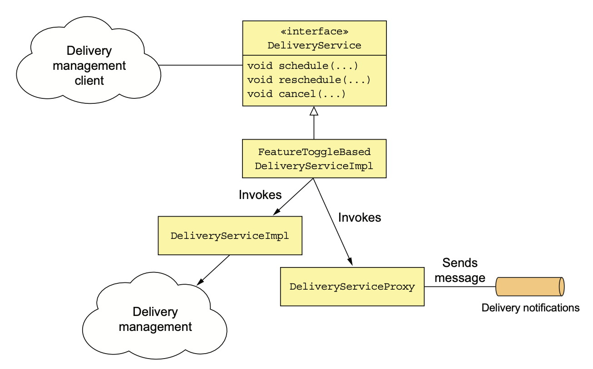

# 13.5.1 현재 배달 관리 기능

배달 관리는 음식점에서 주문을 픽업하여 소비자에게 배달하는 배달원의 스케쥴링을 담당한다.

각 배달원은 배정된 픽업 / 배달 스케쥴에 따라 특정 시간에 음식점에서 주문을 픽업하고, 소비자에게 배달한다.

소비자가 주문, 취소 혹은 변경, 배달원의 위치 등이 바뀔때마다 배달 계획도 바껴야한다.

 

이 Application에서 가장 오래된 서비스 중 하나이기 때문에 배달 관리는 주문 관리의 일부분으로 깊숙하게 박혀있다.

사실상 대부분의 코드가 OrderService 안에 있고, Delivery를 명시적으로 나타낸 곳은 없다.

대부분 Order 엔티티 안에 박혀있다.

 

Monolith에서 배달 관리를 호출할 때 사용하는 Command는 다음과 같다.

- **`acceptOrder()`:**  음식점이 주문을 접수하고 언제까지 준비하겠다고 말한 그 시점에 호출된다.

  배달 관리를 호출해서 배달 Schedule을 잡는다.

- **`cancelOrder()`:** 소비자가 주문을 취소할 때 호출된다. 필요하다면 배달까지 취소한다.

- **`noteCourierLocationUpdated()`:** 배달원의 모바일 앱이 호출하는 Command로, 배달원의 위치를 수정하고 Schedule을 바꾼다.

- **`noteCourierAvailabilityChanged()`:** 배달원의 모바일 앱이 호출하는 Command로, 배달원의 상태를 수정한다.

배달 관리에 필요한 데이터를 조회하는 것 또한 다양하다.

- **`getCourierPlan()`:** 배달원의 모바일 앱이 호출하는 쿼리로, 배달원의 Plan을 반환한다.
- **`getOrderStatus()`:** 배정된 배달원, 도착 예정 시간 등 배달 관련 정보를 조회한다.
- **`getOrderHistory()`:** 여러 `getOrderStatus()`를 가져온다.

 

# 13.5.2 배달 서비스 개요

새로운 배달 서비스에는 배달 스케쥴링, 재 스케쥴링, 배달 취소를 구현할 예정이다.

다음 그림은 배달 서비스를 추출한 후의 Application 아키텍쳐이다.

이 아키텍쳐를 조금 더 구체화 해서 서비스의 Domain Model을 결정하려면 다음 질문에 답해야 한다.

- 어떤 동작과 데이터를 배달 서비스로 옮길까?
- 배달 서비스는 어떤 API를 노출할까?
- Monolith는 배달 서비스에 어떤 API를 노출할까?

# 13.5.3 배달 서비스 Domain Model 설계

배달 관리를 추출하기 위해, 배달 관리 기능이 구현된 클래스를 식별해야한다.

어떤 클래스를 배달 서비스로 옮길지, 혹은 어떤 클래스는 아예 나눠야할수도 있다.

## 배달 서비스에서 사용할 Entity와 필드 식별

배달 서비스를 설계하려면 먼저 배달 서비스에서 필요한 Entity와 필드들이 있는지 식별해야한다.

다음은 배달 서비스에 해당하는 Entity와 필드이다.

배달 스케쥴링 알고리즘에 사용되는 필드들로, Monolith에서 다른 기능들도 이 필드를 사용한다.

배달 스케쥴링 알고리즘에선 음식점, 배달 시간, 배달 주소, 배달원의 위치와 가용성, 계획 등 다양한 속성들을 사용해 배달원의 계획, 주문 픽업 예상 시간, 예정 배달 시간 등을 수정한다.

위 그림에서 볼 수 있다싶이 배달 관리의 필드들은 Monolith에서도 사용된다.

## 배달 서비스로 이전할 데이터 결정

이제 어떤 Entity, 필드들을 서비스 배달 서비스에 필요한지 찾았으니, 어떤걸 배달 서비스로 옮길지 찾아야한다.

이상적인 경우에는 서비스가 접근하는 데이터는 해당 서비스에서만 접근할테니, 그냥 옮기면 된다.

하지만 대부분의 경우에는 우리가 분리할, 즉 배달 서비스의 Entity나 필드들은 Monolith에서도 사용된다.

 

결국 서비스로 데이터를 옮길 때 두 가지 고민을 해야한다.

- Monolith에 남은 데이터에 어떻게 접근할까?
- Monolith는 서비스로 옮겨진 데이터에 어떻게 접근할까?

또한 서비스와 Monolith 사이의 데이터 일관성도 잘 지켜야한다.

 

배달 서비스가 주로 하는건 배달원의 Plan을 변경하고, Order 테이블의 schedulePickupTime과 scheduledDeliveryTime을 수정하는 것이기 때문에 이것들은 배달 서비스에 두는게 좋다.

Courier 테이블의 location, availability도 배달 서비스로 옮길 수 있겠지만, 가급적 변경을 줄이는게 좋으니 일단 Monolith에 냅둔다.

## 배달 서비스 도메인 로직 설계

다음 그림은 배달 서비스의 Domain Model 설계이다.

이 서비스의 핵심은 Delivery나 Courier같은 Domain 클래스이다.

DeliveryServiceImpl은 배달 관리 비지니스 로직의 Entry Point이다.

이 클래스는 DeliveryServiceEventHandler나 DeliveryServiceNotificationHandlers에 의해 호출되는 DeliveryService, CourierService 인터페이스를 구현한 클래스이다.

 

배달 관리에 대한 비지니스 로직은 대부분 Monolith에서 복사해온 것이다.

가령 Monolith의 Order Entity를 이름만 Delivery로 바꿔서 배달 서비스로 옮기고, 필요 없는것들을 지우는 방식이다.

배달 서비스의 로직을 개발하려면 Monolith의 복잡한 코드를 풀어 헤치고 의존성들을 쪼개야 하는데, 여기서 많은 시간이 소모될 가능성이 높다.

> 정적 타입 언어라면 컴파일러가 많이 도와줄 수 있다.

배달 서비스는 Stand Alone 서비스가 아니다.

따라서 이제 배달 서비스와 Monolith가 Communication할 수 있도록 Integration Glue를 설계한다.

# 13.5.4 배달 서비스의 Integration Glue 설계

Monolith와 배달 서비스가 Communication하기 위해 Integration Glue 코드가 필요하다.

다음 그림은 배달 서비스의 Integration Glue로, 배달 서비스에는 배달 관리 API가 있다.

Monolith에서는 Courier Domain Event를 발행하고, 배달 서비스는 Delivery, Courier Domain Event를 발행한다.

## 배달 서비스 API 설계

배달 서비스는 Monolith가 배달 스케쥴을 잡고, 변경하고, 취소하는 API를 제공해야 한다.

이런 경우에는 느슨한 결합을 위해 비동기 메세징을 사용하는게 좋다.

Monolith에서 발행한 Domain Event를 배달 서비스가 구독하는 방법도 있다.

이벤트 타입에 따라 Delivery를 생성하고, 변경하고, 취소하는 것이다.

 

Monolith에서 명시적으로 주문 서비스를 호출할 필요는 없어 결합도가 낮아지지만, Domain Event에 의존하게 되어 각 Order Event가 Delivery에게 어떤 영향을 끼치는지 알아야한다.

따라서 Monolith가 명시적으로 Delivery를 건드릴 수 있도록 Notification 기반 API를 구현하는게 좋다.

배달 서비스의 API에선 Message Notification 채널과 ScheduleDelivery, ReviseDelivery, CancelDelivery 세 가지 메세지 타입으로 구성된다.

Notification 메세지에는 배달 서비스에서 필요한 Order 정보가 담겨있다.

예를 들어 ScheduleDelivery Notification 메세지에는 픽업 시간 / 위치, 배달 시간 / 위치 정보가 담겨있다.

이 방법의 장점은 배달 서비스에서 주문이 어떻게 되어가는지 알 필요가 없다는 것이다.

## 배달 서비스가 Monolith의 데이터에 접근하는 방법

배달 서비스는 Monolith에 있는 배달원의 위치나 Availability를 가져와야한다.

이런 데이터가 많을수도 있기 때문에 매번 Monolith에서 가져오는건 비효율적이다.

따라서 배달 서비스가 Monolith의 데이터를 복제해갈 수 있도록 Courier Domain Event인 CourierLocationUpdated, CourierAvailabilityUpdated를 발행하는게 좋다.

배달 서비스에선 CourierEventSubscriber가 Domain Event를 구독하여 Courier을 수정하고, 필요하다면 배달 재스케쥴링도 Scheduling한다.

## Monolith가 배달 서비스의 데이터에 접근하는 방법

Monolith에서 배달 서비스로 옮겨간 데이터를 읽어야 한다.

Monolith에서 서비스에 Query할수도 있겠지만, Monolith를 많이 수정해야한다.

따라서 한동안 그대로 냅두고, 서비스에서 DB를 복제해오는게 좋다.

가장 쉬운건 배달 서비스가 Courier, Delivery Domain Event를 발행하는 것이다.

배달 서비스가 배달원의 Plan을 수정할 때에는 CourierPlanUpdated처럼 상황에 맞는 이벤트를 발행하고, 이 Domain Event를 Consume해서 Monolith의 DB를 수정하는게 좋다.

# 13.5.5 배달 서비스와 통신하도록 Monolith 변경

## DeliveryService 인터페이스 정의

먼저 배달 관리 코드를 앞에서 본 Messaging API에 해당하는 인터페이스로 캡슐화한다.

여기에는 배달 스케쥴을 잡고, 변경하고, 취소하는 메소드가 있다.

이 인터페이스는 나중에 배달 서비스에 메세지를 전송하는 Proxy로 구현하겠지만, 일단 배달을 관리하는 코드를 호출하도록 냅둔다.

DeliveryService는 IPC로 구현하기 좋은 거대한 인터페이스이다.

앞에서 말했던 `schedule()`, `reschedule()`, `cancel()` 메소드가 정의되어있다.

## DeliveryService 인터페이스를 호출하도록 리팩토링

배달 관리를 호출하는 코드들을 찾아 DeliveryService 인터페이스를 사용하도록 변경해야한다.

> 가장 오래걸리고, 어려운 작업일 것이다.

Java같은 정적 타입 언어로 개발되었다면 IDE의 도움을 받아 Dependency를 쉽게 찾을 수 있다.

그렇지 않다면 테스트코드로 변경할 코드를 커버해야한다.

## DeliveryService 인터페이스 구현

마지막으로 DeliveryServiceImpl클래스를 배달 서비스에 Notification을 보내는 Proxy로 바꿔야한다.

하지만 원래 코드를 아예 폐기하는게 아니라, Monolith가 기존 구현체와 새로 만드는 Proxy 구현체를 동적으로 바꿀 수 있도록 한다.

DeliveryService 인터페이스는 기존 구현체를 호출할지, 배달 서비스를 호출할지 동적으로 결정하는 동적 Feature Toggle을 사용한 클래스로 바꿔준다.

이렇게 구현하면 배달 서비스를 오픈해도 부담이 적다.

배달 서비스를 배포하고 계속해서 테스트 해보다가, 문제가 없으면 DeliveryServiceProxy에게 Traffic을 점점 넘겨주면 된다.

