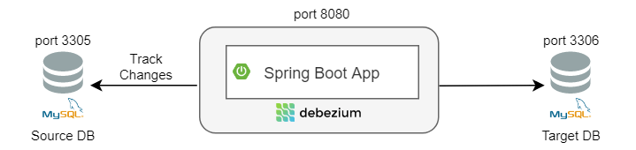

## 소개

대규모 데이터를 Batch로 싱크 맞추는건 다음과 같은 문제가 있었다.

- 데이터 싱크가 바로 맞춰지지 않는다.
- DB 싱크를 맞추는데 Resource 소모가 많다.
- 특정 주기에만 데이터 복제가 일어난다.

이에 비해 Change Data Capture를 사용하면 다음과 같은 장점이 있다.

- Source DB의 변경사항을 계속해서 Tracking한다.
- Target DB에 즉시 반영된다.
- Stream을 통해 즉시 변경되는 것을 보장한다.

CDC는 실시간으로 싱크를 맞출 수 있고, 비용도 절감할 수 있다.

 

Debezium이란 Kafka의 Top Level에서 구축된 DB의 Row Level 변경사항을 Capture해주는, 즉 CDC(Change Data Capture) 서비스이다.

Debezium의 주 목적은 Transaction Log에 기록된 모든 Low Level 변경사항을 가져오는 것이다.

MySQL, PostgreSQL, MongoDB등 여러 종류의 DB를 지원하는 Connector를 제공한다.

각각의 Connector들은 Kafka같은 Streaming Service에 변경사항을 발행할 수 있다.

게다가 Debezium의 Recoring은 Application이 꺼져도 계속되기 때문에 Application을 재시작했을 때, 다시 이걸 처리할 수 있다.

## Kafka Connect란

Kafka Connect란 **Apache Kafka와 외부 Application 사이의 Realtime Data 공유를 가능케 해주는 분산 플랫폼**이다.

Kafka Ecosystem에서 문제가 발생하더라도 Realtime Message를 항상 사용할 수 있는 신뢰성, 그리고 확장성이 뛰어난 서비스이다.

게다가 다양한 S3, Kinesis, Cassandra 등 다양한 외부 서비스와 연결할 수 있는 JDBC Connector들로 구성된다.

## Kafka Connect vs Debezium

그렇다면 Kafka Connect와 Debezium이 같은게 아닌가? 라는 생각을 할수도 있다.

하지만 다음과 같은 차이점들이 있다.

### Architecture

#### Debezium

Debezium은 세 개의 Component가 중심이 되어 구성되어 있다.

외부 Database, Debezium, 그리고 이벤트를 받을 Downstream의 Application이 있다.

Capture된 데이터는 실시간으로 Kafka Server에 있는 Kafka Topic에 저장된다.

Kafka Topic에서 Capture된 Update는 Consumer가 순서대로 동작할 수 있도록 완벽하게 순차적으로 구성된 Commit Log의 형태로 저장된다.

따라서 Kafka Topic의 Update된 Record 정보는 JDBC나 Elastic Search같은 Sink Connector로 외부 / Downstream에서 가져간다.

#### Kafka Connect

Kafka Connect는 세 개의 Component로 구성된다.

중심의 Kafka Connect Cluster, 외부 Source Database, sink될 외부 Database가 있다.

위 그림에서 볼 수 있다싶이 Kafka Connect는 두 개의 다음 두 개의 Connector를 가진다.

- **Source Connector:** 외부 Source Database로부터 메세지를 fetch해온다.
- **Sink Connector:** 외부 / Downstream에게 메세지를 전달한다.

### 확장성

사실상 거의 동일하다고 봐도 된다.

추가로 분산 시스템이기 때문에 적절하게 부하 분산이 이루어진다.

굳이 따지자면 Kafka Connect는 JDBC Source와 Sink Connector로 End-To-End Communication을 지원하기 때문에 확장성이 조금 더 높다고 할 수 있다.

### 사용

Kafka Connect는 다양한 Application과 Communication하기 위해 다양한 JDBC Connector들로 이루어진 반면에, Debezium은 다양한 CDC Connector들을 가지고 있다.

하지만 Debezium의 CDC Connector들은 외부 Datasource의 변경을 Capture하는 Source Connector로써만 사용될 수 있다.

 

Kafka Connect에서 JDBC Source Connector는 실시간 메세지를 가져오거나, 읽을 수 있다.

JDBC Sink Connector는 여러 Distributed Consumer들에게 메세지를 분배해준다.

 

JDBC Connector는 Delete된 Record를 발행하지 않지만, CDC Connector는 발행한다.

그리고 JDBC Connector는 특정 간격으로 DB에 쿼리하지만, CDC Connector는 DB에서 발생하는 변경 사항을 즉시 기록 / 전송한다.

## Architecture

경우에 따라 다르겠지만, 보통 Kafka Connect를 사용한다.

Kafka Connect는 Kafka Broker와 별도로 동작하는 개별적인 서비스이다.

Apache Kafka나 다른 시스템에 데이터를 전달해줄 수 있다.

먼저 왼쪽의 MySQL은 복제하고 싶은 데이터가 있는 Source Database이고, 오른쪽은 Target DataBase이다.

Kafka Connect는 Transaction Log를 파싱 및 번역해서 Kafka Topic에 발행한다.

Kafka는 받은 메세지를 해당 System에 발행함을 보장하기 위해 Message Broker처럼 동작한다.

마지막으로 Kafka를 Polling하고, 이를 Target Database에 복제하는 Kafka Connector가 있다.

