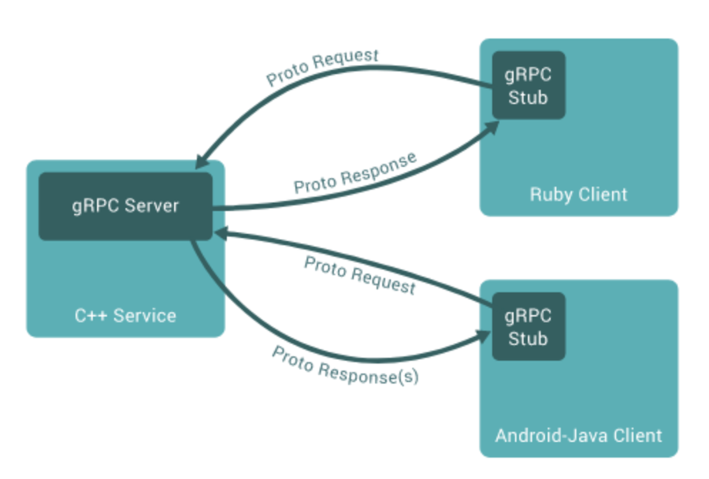

# RPC

## RPC란?

> RPC(Remote Procedure call)이란, 별도의 원격 제어를 위한 코딩 없이 다른 주소 공간에서 리모트의 함수나 프로시저를 실행 할 수 있게 해주는 프로세스간 통신입니다. 즉, 위치에 상관없이 RPC를 통해 개발자는 위치에 상관없이 원하는 함수를 사용할 수 있습니다.

RPC란 Remote Procedure Call의 약자로, 말 그대로 **원격에서 Procedure를 호출해주는 미들웨어**를 의미한다.

즉 RPC는 Inter-Process Communication의 일종으로, IPC 중 원격에서의 Procedure 호출 또는 함수를 호출하는데 같은 프로세스의 메소드를 호출하는 것 처럼 사용하도록 돕는것을 의미한다.

분산 컴퓨팅 환경에서 좀 더 쉽게 다른 서비스에 요청을 보내기 위해 고안되었다.

> IPC는 **프로세스 사이의 통신**을 가능하게 하는 기술이다.
>
> 공유 메모리를 통해서 자원을 공유하거나, 세마포어를 두거나, MQ, RPC 등이 있다.

## RPC의 동작 순서

여기서 Client는 Caller, Server는 Callee 라고도 부른다.

 

1. Interface Definition Language로 호출에 대한 인터페이스를 정의한다.

   > Server Stub = Skeleton

2. Client가 다른곳의 함수를 호출한다.

3. Client Stub의 함수의 매개변수들을 변환한다.

4. Client의 RPC Runtime이 다른곳으로 요청(Call Packet)을 보낸다.

   > RPC Runtime이 Client와 Server를 이어줘서 에러, 요청, 응답을 처리하는 역할을 한다.

5. Server의 RPC Runtime이 Call Packet을 받는다.

6. Skeleton이 요청의 파라미터를 변환해 준다.

7. 실제 함수가 호출된다.

8. 함수의 반환값이 Skeleton에 의해 다시 변환된다.

9. Server의 RPC Runtime에 의해 Result Packet이 반환된다.

10. Client의 RPC Runtime이 Packet을 받고, Blocking이 풀리게 된다.

11. Client Stub은 다시 Packet을 변환해 준다.

12. Client에게 결과값이 반환된다.

 

IDL은 정의된 인터페이스를 따라 Stub을 정의하는 언어이다.

Client와 Server가 같은 언어를 사용한다는 보장이 없기 때문에 인터페이스만 정의해 두고, 언어에 맞게 변형시켜야 한다.

 

서버와 클라이언트가 다른 프로세스이기 때문에 반드시 매개변수를 변환해 주어야 한다.

A 서버의 주소값과 B 서버의 주소값이 다르기 때문에 문제가 발생할 수 있기 때문이다.

따라서 Client의 Stub은 **파라미터를 변환(Marshalling)**을 해주고, 서버에서 **반환된 값을 다시 변환**하는 역할을 맡는다.

Server Stub(Skeleton)에서는 **클라이언트의 파라미터를 역변환(Unmarshalling)**하고, 함수의 실행 결과 반환을 담당한다.

 

Packet들은 XDR 필터를 거쳐 **Encoding**되어서 전송된다.

 

## gRPC

### gRPC란

gRPC란 **구글에서 개발한 RPC**로, 기본적으로 RPC와 비슷하지만 **HTTP/2 기반**으로 양방향 스트리밍을 지원하고 메세지의 성능이 좋다.

 

### 특징

#### 다양한 언어를 지원한다.

gRPC는 Protocol Buffer를 사용하는데 Protocol Buffer의 IDL만 정의해 두면, 여러 언어로 알아서 변환된다.

여기서 Protocol Buffer는 **구조화된 데이터를 직렬화 하는 방식**이다.

직렬화 방법을 정의해 두면, 컴파일 되어 각각 언어마다 나오게 되는데, 해당 코드들로 직렬화/역직렬화를 할 수 있는 것이다.

 

Protocol Buffer는 **높은 압축률**과 **빠른 압축 속도**를 보장하기 때문에 네트워크 트래픽을 줄일 수 있고, 성능을 높일 수 있다.

또한 데이터가 바이너리로 되어있기 때문에 변환 작업이 필요 없다.

 

#### 양방향 스트리밍

HTTP/2 기반으로 통신하기 때문에 서버와 클라이언트가 동시에 메세지를 주고받을 수 있다.

 

### gRPC가 MSA에서 적합한 이유

비지니스 로직에만 집중할 수 있도록 도와줘서 빠른 서비스 개발을 가능하게 한다.

또한 간단한 설치 후 빠른 배포를 가능하도록 해주고, 수많은 서비스간의 API 호출로 인한 성능 저하를 개선해 준다.

 

IDL의 활용으로 다양한 기술 스택으로 인한 중복 발생의 단점을 보완해 주고, Protocol Buffer의 메세지 압축 기술은 네트워크 트래픽을 획기적으로 줄일 수 있다.

 

# RMI

**java에서 Remote Procedure를 호출**해준다.

